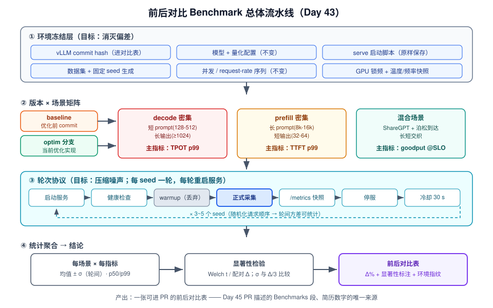
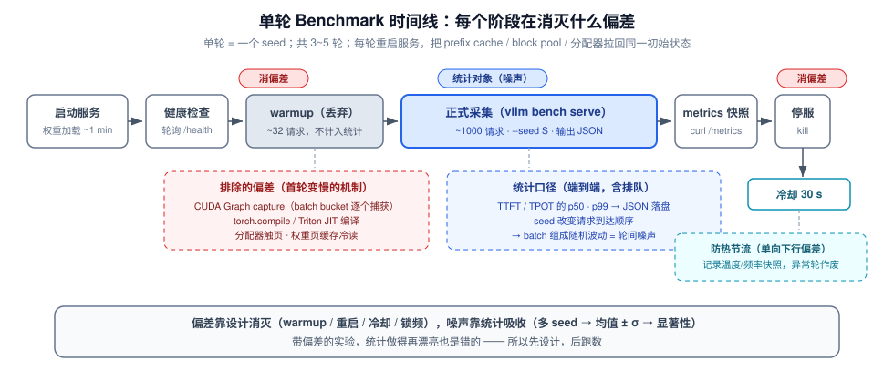
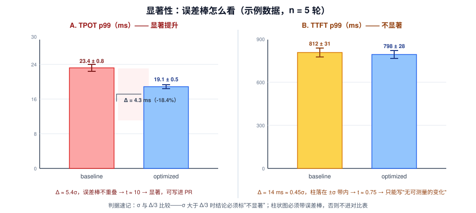

# Day 43：优化迭代与验证（一）——完整 Benchmark 前后对比

> **系列进度**：第 7 周 · Day 43 / 56 · 项目 A（vllm-ascend / vLLM 源码贡献）收尾阶段
> **前置**：Day 37 基线数据 → Day 38-39 瓶颈分析报告 → Day 41-42 两轮优化实现
> **今日定位**：Day 43-45「优化迭代 + 验证」的第一天。代码已经写完，今天只回答一个问题——**这个优化到底有没有用、有多大用、在什么场景下有用**。产出是一张带误差与显著性标注的前后对比表：它是 Day 45 PR 的核心证据，也是简历上那行数字的唯一出处。

性能优化圈有一句老话：**没有 benchmark 的优化等于没有优化**。而 benchmark 最大的坑不是"跑不出来"，而是**跑出来了却不可信**——面试官一句"你这个提升是不是抖动？"就能让六周的工作失去说服力。今天我们把"证明优化有效"这件事本身工程化。

---

## 一、今日学习目标

1. **区分偏差与噪声**：理解系统性偏差（bias）与随机噪声（noise）以不同方式毁掉对比实验，各自的对策完全不同
2. **掌握可复现 benchmark 的控制变量设计**：冻结清单、随机化对象、轮次协议（warmup / 冷却 / 重启）
3. **掌握统计口径**：均值 ± σ、p50/p99、Welch t 检验与配对设计，能当场手算"这个提升是否显著"
4. **搭好一条命令跑完的 benchmark harness**：`run_suite.sh` + `aggregate.py`——Day 46 的四组消融实验将**直接复用**这套流水线
5. **产出**：项目 A 前后性能对比表（含环境指纹、均值 ± σ、提升百分比、显著性标注）

---

## 二、核心概念

### 2.1 偏差 vs 噪声：今天最重要的一个区分

把每次测量写成：

$$X = \mu + \underbrace{b}_{\text{偏差（系统项）}} + \underbrace{\varepsilon}_{\text{噪声（随机项）}}$$

| | 噪声（noise） | 偏差（bias） |
|---|---|---|
| 行为 | 轮与轮之间随机波动 | 所有轮**朝同一方向**倾斜 |
| 多轮取均值 | $\varepsilon$ 以 $1/\sqrt{n}$ 收缩，**可消** | $b$ 原样保留，**轮数越多越"稳定地错"** |
| 典型例子 | 请求到达顺序不同 → batch 组成不同 | baseline 跑在冷机上午、optim 跑在热机下午；warmup 不足导致前几轮系统性偏慢 |
| 对策 | 多轮 + 报方差 + 显著性检验 | **实验设计**：冻结环境、warmup、锁频、baseline/optim 交替跑 |

> **记住这个优先级**：先消灭偏差（设计问题），再压缩噪声（统计问题）。一个带偏差的实验，统计做得再漂亮也是错的。

### 2.2 可复现性的三个层次

面试官评估你的数据时，实际在问三层问题：

1. **统计复现**：同机同配置重跑，数字是否落在 ±σ 内？→ 靠轮次协议与统计口径
2. **环境复现**：换台机器按你的记录能否重建相同条件？→ 靠环境指纹（commit hash、启动命令、锁频状态、驱动版本）
3. **流程复现**：陌生人按你仓库里的 README 能否一条命令跑出来？→ 靠 harness 进版本控制

今天的目标是三层全部达成。**对比表上没有环境说明的数字，等于没有数字。**

### 2.3 统计口径：报什么数字

| 口径 | 用途 | 备注 |
|---|---|---|
| 均值 ± 标准差（轮间，n=3~5） | 提升百分比的计算基础 | σ 是"轮间波动"，不是单轮内请求间波动 |
| p50 / p99 分位数 | TPOT、TTFT 的**主口径** | 回顾 Day 5：尾延迟才是用户感知；chunked prefill 的收益主要在 p99 |
| goodput（SLO 达标吞吐） | 混合场景的终极指标 | 回顾 Day 5：如 TPOT p99 < 200 ms 约束下的有效吞吐 |
| Welch t 统计量 | 显著性 | 粗判据：$\Delta < 3\times$ SEM 或 $\sigma > \Delta/3$ → 结论必须写"不显著" |

> **坑位提示**：只报均值不报分位数，会得出"chunked prefill 没提升"的错误结论——它的收益集中在尾延迟（Day 11、Day 13 已经见过）。

### 2.4 场景矩阵：三个场景，三个主指标

回顾 Day 1 的第一性原理：prefill 计算密集（compute-bound），decode 访存密集（memory-bound）。你的优化（下文统称"优化 X"，典型代表是 paged attention decode kernel 或量化 GEMM tiling）大概率只作用于其中一边，所以**必须在三个场景里分别测量**，防止"只在对己有利的场景测"：

| 场景 | 负载形状 | 主指标 | 机制依据 |
|---|---|---|---|
| decode 密集 | 短 prompt（128-512）+ 长输出（≥1024） | **TPOT p99** | decode 访存 bound → 优化 kernel 访存效率直接体现在 TPOT |
| prefill 密集 | 长 prompt（8k-16k）+ 短输出（32-64） | **TTFT p99** | prefill 计算 bound → 访存类优化对 TTFT 通常无感甚至劣化 |
| 混合 | ShareGPT / sonnet + 泊松到达 | **goodput @ SLO** | 生产真实形态；检验两类负载互相干扰下的净效果 |

第三列的"机制预期"在跑之前就要写下来（存 `predictions.md`，Day 46 会正式用这个方法）——**预测错的地方就是你理解不到位的地方**。

---

## 三、原理深入讲解

先看全景图，再逐层拆解：



整个流水线分四层：**环境冻结层**（决定有没有偏差）→ **版本 × 场景矩阵**（baseline commit 与 optim 分支各跑一遍三场景）→ **轮次协议**（决定噪声有多大）→ **统计聚合层**（决定结论可不可信）。

### 3.1 测量噪声与偏差的分层模型

一次 `vllm bench serve` 的结果里，混进了哪些无关变量？按层拆：

| 层 | 来源 | 数量级 | 性质 | 对策 |
|---|---|---|---|---|
| 硬件层 | GPU boost 时钟随温度/功耗漂移 | 内核时间 ±3~10% | **偏差**（热机后单向下行） | 锁频 `-lgc` + 轮间冷却 |
| 硬件层 | 热节流（sustained load 降频） | 10-20% | 偏差 | 冷却 30 s，监控温度 |
| 系统层 | OS 调度、NUMA、页缓存冷热 | ms 级 | 混合 | warmup、固定绑核（可选） |
| 引擎层 | batch 组成随请求到达顺序变化 | 每步 5-15% | **噪声** | 多轮不同 seed 取均值 |
| 引擎层 | prefix cache 命中状态跨轮累积 | 首轮 TTFT 明显偏高 | **偏差** | 每轮重启服务复位 |
| 引擎层 | CUDA Graph / torch.compile 首次编译 | 首个请求慢数倍 | 偏差 | warmup（回顾 Day 18） |
| 测量层 | client 定时器精度、网络抖动 | TTFT 上 1-5 ms | 噪声 | 同机 localhost、统一工具 |

两个关键结论：

1. **引擎层的"batch 组成噪声"消不掉但可控**：不同 seed 改变请求到达顺序 → 每轮的 running batch 演化路径不同 → TPOT 波动。这是我们要"随机化 + 多轮"的对象（Day 10 调度器决定了这是真随机，不是测量误差）。
2. **硬件层的漂移必须靠设计消除**：均值救不了单向下行的频率漂移。这就是锁频和冷却存在的理由。

### 3.2 轮次协议：warmup、重启、冷却

单轮的完整时间线如下：



**warmup 排除清单**（每一项都对应一个"首轮变慢"的机制，回顾 Day 18 CUDA Graph）：

- CUDA Graph capture（decode 路径按 batch bucket 逐个捕获）
- torch.compile / Triton JIT 编译（V1 默认开启 compilation，回顾 Day 18 的 `-O` 级别）
- 显存分配器池化扩容、KV block pool 首次触页
- 模型权重页缓存（page cache）冷读
- **prefix cache 冷启动**（首轮无命中，后续轮如果复用服务会累积命中 → TTFT 系统性走低）

**三个设计决策及其理由**：

| 决策 | 理由 | 代价 |
|---|---|---|
| warmup 请求**不计入**统计 | 它们测量的是"冷启动"，不是稳态服务 | 多花 1-2 分钟 |
| 每轮（每个 seed）**重启服务** | 把 prefix cache、block pool、分配器拉回同一初始状态——消的是**偏差** | 每轮多 ~1 分钟启动 |
| 轮间**冷却 30 s** | 防 GPU 温度累积 → 热节流单向下行 | 总时长 × 1.2 |

> **思考题**：如果 5 轮共用一个服务实例，第 5 轮的 TTFT 会比第 1 轮低还是高？——通常更低（prefix cache 命中累积、页缓存变热），而且这是**偏差不是噪声**：你会"稳定地"高估优化效果。

### 3.3 锁频：把硬件从变量变成常量

GPU 默认动态调频，boost 时钟取决于温度与功耗余量——**同样的代码，冷机与热机可差 5-10%**。对比实验前：

```bash
# 锁定 SM 时钟到固定值（示例：A100 锁 1410 MHz；具体值用 nvidia-smi -q -d CLOCK 查询后选）
nvidia-smi -lgc 1410,1410
# 验证：确认 Current 时钟 == 固定值、无 throttling reasons
nvidia-smi -q -d CLOCK,PERFORMANCE
# 实验结束恢复
nvidia-smi -rgc
```

- 把锁频前后 `nvidia-smi -q -d CLOCK` 输出存进 `results/<tag>/env.txt`（环境指纹的一部分）
- **昇腾侧**：不同代 Atlas 硬件的调频控制命令差异较大，至少做到：每轮开始前用 `npu-smi info` 记录频率/温度快照，发现降频或温度异常该轮作废重跑——宁可废轮，不可脏数据

### 3.4 场景设计的第一性原理：你的优化动了哪个 bound？

Day 38-39 的瓶颈分析报告里，你套用过 roofline 方法（Day 3）判断目标 kernel 是访存还是计算 bound。**同一个判断决定了今天三场景的预期**：

- 优化 X 若提高 **decode kernel 的访存效率**（如更优的 KV gather tiling）→ decode 密集场景 TPOT 应显著下降；prefill 密集场景 TTFT 预期持平（不经过该路径或非瓶颈）
- 优化 X 若是**量化 GEMM tiling** → W4A8/FP8 权重路径上 decode 与 prefill 的 GEMM 都变快，但 prefill 本身计算 bound、kernel 占比低，TTFT 收益应小于 TPOT 收益

把这些预期写成**可证伪的预测**，跑完对照。某场景无提升甚至劣化时：**如实记录 + 给出机制解释**——"我的优化在什么条件下失效"本身就是面试高分素材（Day 49 的弹药卡会用到）。

### 3.5 显著性初判：Δ 与 σ 的关系

先给直觉版判据（严格版见第四节）：

- **提升量 Δ 至少要数倍于轮间噪声 σ**，结论才站得住
- 工程粗判据（本周 README 同款）：**若 σ > Δ/3，此格结论必须标"不显著"**，不得写百分比
- 例：TPOT p99 从 23.4 ± 0.8 ms 降到 19.1 ± 0.5 ms（n=5）→ Δ = 4.3，σ ≈ 0.8，Δ/σ ≈ 5.4 → 显著
- 反例：TTFT p99 从 812 ± 31 ms 到 798 ± 28 ms → Δ = 14，σ ≈ 31 → **σ > Δ/3，不显著**，只能写"无可测量的变化"

---

## 四、数学推导：从数字到结论

### 4.1 记号与基本量

设某场景跑了 $n$ 轮（= $n$ 个 seed），每轮得到该轮 1000 个请求聚合出的一个指标值（如 TPOT p99）。记：

$$\bar{x} = \frac{1}{n}\sum_{i=1}^{n} x_i, \qquad s^2 = \frac{1}{n-1}\sum_{i=1}^{n}(x_i - \bar{x})^2$$

$$\Delta = \bar{x}_{opt} - \bar{x}_{base}, \qquad \text{Improvement} = -\frac{\Delta}{\bar{x}_{base}} \times 100\% \;(\text{越小越好的指标})$$

注意区分两个"方差"：**轮间方差 s²**（我们报的 σ）与单轮内请求间方差（不直接进对比表，但决定 p99 的估计质量，见 4.3）。

### 4.2 显著性：Welch t 检验

baseline 与 optim 两组轮数可以不同、方差可以不齐，用 Welch t：

$$t = \frac{\bar{x}_{opt} - \bar{x}_{base}}{\sqrt{s_{opt}^2/n_{opt} + s_{base}^2/n_{base}}}, \qquad df = \frac{\left(\frac{s_{opt}^2}{n_{opt}} + \frac{s_{base}^2}{n_{base}}\right)^2}{\frac{(s_{opt}^2/n_{opt})^2}{n_{opt}-1} + \frac{(s_{base}^2/n_{base})^2}{n_{base}-1}}$$

工程粗判据：$|t| > 2$ 即认为显著（$n \ge 5$ 时 $t_{0.975}$ 在 2.1~2.8 之间，用 2 做快速门槛足够）。

**手算示例**（示例数据，即上图）：

- TPOT p99：$\Delta = 19.1 - 23.4 = -4.3$；$\sqrt{0.5^2/5 + 0.8^2/5} = \sqrt{0.178} \approx 0.42$；$t \approx -4.3/0.42 \approx \mathbf{-10.2}$ → **显著**
- TTFT p99：$\Delta = 798 - 812 = -14$；$\sqrt{31^2/5 + 28^2/5} \approx \sqrt{349} \approx 18.7$；$t \approx -14/18.7 \approx \mathbf{-0.75}$ → **不显著**



### 4.3 需要几轮？把"3~5 轮"变成公式

两样本、双侧 $\alpha = 0.05$、功效 80%（$z_{\alpha/2} = 1.96,\ z_\beta = 0.84$）时，**每组**所需轮数：

$$n_{\text{arm}} \approx 2\,(z_{\alpha/2} + z_\beta)^2 \left(\frac{\sigma}{\Delta}\right)^2 \approx 15.7 \left(\frac{\sigma}{\Delta}\right)^2$$

| $\sigma/\Delta$ | 每组所需轮数 | 含义 |
|---|---|---|
| 2.0 | ~63 | 效应完全淹没在噪声里，别测了 |
| 1.0 | ~16 | 代价比收益大，放弃或先降噪声 |
| 0.5 | ~4 | "3~5 轮"协议正好覆盖 |
| 0.25 | ~1 | 3 轮绰绰有余 |

> **关键结论**：**"3~5 轮"隐含前提是 $\sigma \le \Delta/2$**。所以正确流程是：先跑 2 轮 pilot 估出 σ → 用公式判断需要几轮 → 要么加轮数，要么承认"这个效应在此噪声水平下测不出来"。上面 TTFT 的例子：$\sigma/\Delta \approx 2.2$ → 需要 ~77 轮，实践上等于"无可测量的变化"。

**p99 的另一个样本量问题**：分位数本身也是估计量。$n$ 个请求的 p99 只由最慢的 $n(1-p)$ 个次序统计量支撑——1000 个请求的 p99 由最慢 ~10 个请求决定（够用但粗糙）；**100 个请求的 p99 = 最慢 1 个请求，基本是纯噪声**。所以每轮 `--num-prompts` 至少 1000，这是 p99 可信的下限。

### 4.4 相对提升的误差传播（delta method）

提升百分比本身也有误差。令 $R = \bar{x}_{opt}/\bar{x}_{base}$，两组独立时：

$$\frac{\mathrm{SE}(R)}{R} \approx \sqrt{\frac{cv_{opt}^2}{n_{opt}} + \frac{cv_{base}^2}{n_{base}}}, \qquad cv = \frac{s}{\bar{x}}$$

代入 TPOT 例子（$cv_{opt} = 0.5/19.1 \approx 2.6\%$，$cv_{base} = 0.8/23.4 \approx 3.4\%$，$n=5$）：

$$R = 0.816 \pm 0.816 \times 1.9\% \;\Rightarrow\; \text{Improvement} = 18.4\% \pm 1.6\%$$

面试时能说出"提升 18.4%，95% 置信下大约在 16.8%~20.0% 之间"，立刻和只报一个裸数字的人拉开差距。

### 4.5 配对设计：同样的轮数，更强的检验

如果 baseline 与 optim 的第 $i$ 轮在**相同条件**下相邻跑完（同 seed、同时间段），环境漂移（温度、页缓存状态）对两者**同向**作用，取差值 $d_i = x_i^{opt} - x_i^{base}$ 可以把共同漂移扣掉：

$$t_{pair} = \frac{\bar{d}}{s_d / \sqrt{n}}, \qquad \mathrm{Var}(d) = \sigma_{opt}^2 + \sigma_{base}^2 - 2\rho\,\sigma_{opt}\sigma_{base}$$

轮间相关 $\rho > 0$ 时配对方差严格小于独立两样本。**实操结论：按 ABAB 交替跑（b₁ o₁ b₂ o₂ …），不要先跑完 5 轮 baseline 再跑 5 轮 optim**——把"上午冷机 vs 下午热机"这种时间漂移变成配对内的共同项。代价：切换分支 10 次而不是 2 次，脚本能自动化的就不是事。

---

## 五、关键代码：一条命令跑完的 benchmark harness

### 5.1 目录结构（全部进版本控制——这本身就是"可复现"的证据）

```text
project-a/
├── benchmark/
│   ├── serve.sh              # 服务端启动参数（三个场景共用，原样可 diff）
│   ├── run_suite.sh          # 一条命令：bash run_suite.sh baseline|optim
│   ├── aggregate.py          # 汇总 JSON → 前后对比表（markdown）
│   └── results/
│       ├── baseline/         # {case}_{seed}.json + _metrics.txt + env.txt
│       └── optim/
```

### 5.2 run_suite.sh（核心脚本）

```bash
#!/usr/bin/env bash
# 用法: bash run_suite.sh baseline|optim
set -euo pipefail

TAG=${1:?usage: run_suite.sh baseline|optim}
MODEL=${MODEL:-/models/Qwen3-8B}
PORT=${PORT:-8100}
SEEDS=(1 2 3 4 5)
OUT=benchmark/results/${TAG}
mkdir -p "${OUT}"

# ---- 0. 环境指纹：对比表的一部分，别人问环境时直接甩出来 ----
git rev-parse HEAD                    >  "${OUT}/env.txt"
git diff --stat                       >> "${OUT}/env.txt"   # optim 相对 baseline 的改动面
nvidia-smi --query-gpu=name,driver_version --format=csv >> "${OUT}/env.txt"
vllm --version                        >> "${OUT}/env.txt"

# ---- 1. 锁频（A100 示例值；用 nvidia-smi -q -d CLOCK 查后自选）----
nvidia-smi -lgc 1410,1410 || true

# 每场景的正式采集请求量（p99 至少由 ~10 个最慢请求支撑 → ≥1000；
# prefill 8k×200 已是 1.6M 输入 token，单轮足够长）
declare -A NPROMPTS=( [decode_dense]=1000 [prefill_dense]=200 [mixed]=1000 )
declare -A WARMUP_N=(  [decode_dense]=32   [prefill_dense]=8   [mixed]=32   )

bench() {  # bench <case> <seed> <num_prompts> <out_json|->
  local case=$1 seed=$2 n=$3 out=$4
  local args=(--backend vllm --model "${MODEL}" --port "${PORT}"
              --seed "${seed}" --num-prompts "${n}")
  case "${case}" in
    decode_dense)  args+=(--dataset-name random --random-input-len 256
                          --random-output-len 1024 --request-rate 4) ;;
    prefill_dense) args+=(--dataset-name random --random-input-len 8192
                          --random-output-len 48 --request-rate 1) ;;
    mixed)         args+=(--dataset-name sharegpt --request-rate 8) ;;
  esac
  [[ "${out}" != "-" ]] && args+=(--output-json "${out}")
  vllm bench serve "${args[@]}"
}

for SEED in "${SEEDS[@]}"; do
  for CASE in decode_dense prefill_dense mixed; do
    echo "=== [${TAG}] case=${CASE} seed=${SEED} ==="

    # 2. 每轮重启服务：复位 prefix cache / block pool / 分配器（消偏差）
    bash benchmark/serve.sh "${PORT}" &
    SERVE_PID=$!
    for _ in $(seq 120); do                       # 健康检查，最多 2 min
      curl -sf "localhost:${PORT}/health" >/dev/null && break
      sleep 1
    done

    # 3. warmup（丢弃）：触发 CUDA Graph capture / torch.compile / 冷页缓存
    bench "${CASE}" "${SEED}" "${WARMUP_N[$CASE]}"  "-"

    # 4. 正式采集
    bench "${CASE}" "${SEED}" "${NPROMPTS[$CASE]}" "${OUT}/${CASE}_${SEED}.json"

    # 5. 服务端指标快照（引擎内部视角，用于交叉验证与解释异常轮）
    curl -s "localhost:${PORT}/metrics" > "${OUT}/${CASE}_${SEED}_metrics.txt"

    # 6. 停服 + 冷却 30 s（防热节流）
    kill "${SERVE_PID}"; wait "${SERVE_PID}" 2>/dev/null || true
    sleep 30
  done
done
nvidia-smi -rgc || true
```

`serve.sh` 固定服务端参数（三个场景**共用同一配置**，只变客户端负载，保证场景间可比）：

```bash
#!/usr/bin/env bash
exec vllm serve "${MODEL:-/models/Qwen3-8B}" \
  --port "${1:-8100}" \
  --max-model-len 16384 \
  --max-num-seqs 256 \
  --enable-prefix-caching
```

> **版本坑位提示**：`vllm bench serve` 是统一后的 CLI（旧版是仓库顶层的 `python benchmarks/bench_serve.py`）。参数名随版本有差异：结果落盘在较新版本是 `--output-json`，旧版是 `--save-result`；分位数可由 `--metric-percentiles` 指定。**跑之前先 `vllm bench serve --help` 核对一遍**，把实际用的参数原样写进 `env.txt`。

### 5.3 aggregate.py（汇总与对比表生成）

```python
#!/usr/bin/env python3
"""汇总 results/{baseline,optim}/ 的 bench JSON，输出前后对比表（markdown）。"""
import json, math, statistics as st
from pathlib import Path

CASES = ["decode_dense", "prefill_dense", "mixed"]
SEEDS = [1, 2, 3, 4, 5]
# 场景 -> 主指标（JSON 字段名以你版本的 bench 输出为准，先 cat 一个 JSON 确认）
METRICS = {
    "decode_dense":  "p99_tpot_ms",     # 越小越好
    "prefill_dense": "p99_ttft_ms",     # 越小越好
    "mixed":         "output_throughput",  # goodput 口径见下
}
LOWER_IS_BETTER = {"p99_tpot_ms": True, "p99_ttft_ms": True,
                   "output_throughput": False}

def load(tag, case):
    vals = []
    for s in SEEDS:
        d = json.loads(Path(f"benchmark/results/{tag}/{case}_{s}.json").read_text())
        vals.append(d[METRICS[case]])
    return vals

def welch_t(base, opt):
    mb, mo = st.mean(base), st.mean(opt)
    vb, vo = st.variance(base), st.variance(opt)
    nb, no = len(base), len(opt)
    se = math.sqrt(vb / nb + vo / no)
    return (mo - mb) / se if se else float("inf")

print("| 场景 | 主指标 | baseline | optimized | 变化（含显著性） |")
print("|---|---|---|---|---|")
for case in CASES:
    base, opt = load("baseline", case), load("optim", case)
    mb, mo = st.mean(base), st.mean(opt)
    delta = (mo - mb) / mb * 100
    t = welch_t(base, opt)
    sig = "显著" if abs(t) > 2 else "不显著"
    sign = "-" if LOWER_IS_BETTER[METRICS[case]] else "+"
    print(f"| {case} | {METRICS[case]} "
          f"| {mb:.1f} ± {st.stdev(base):.1f} "
          f"| {mo:.1f} ± {st.stdev(opt):.1f} "
          f"| {sign}{abs(delta):.1f}% (t={t:.2f}, {sig}) |")
```

**goodput 口径**：较新版本的 `vllm bench serve` 支持直接指定 SLO（`--goodput`，格式以 `--help` 为准）；版本不支持时在 `aggregate.py` 里自算——**口径必须自己定义清楚并写进报告**，例如"TPOT p99 < 200 ms 的轮视为达标，goodput = 达标轮的 output_throughput 均值"，或基于逐请求数据统计达标 token 数 / 总时长。混用口径是对比实验的大忌。

### 5.4 三个场景的对照产出（示例格式）

| 场景 | 主指标 | baseline | optimized | 变化（含显著性） |
|---|---|---|---|---|
| decode_dense | TPOT p99 (ms) | 23.4 ± 0.8 | 19.1 ± 0.5 | **-18.4%（t≈10.2，显著）** |
| prefill_dense | TTFT p99 (ms) | 812 ± 31 | 798 ± 28 | -1.7%（t≈0.75，**不显著**） |
| mixed | goodput (tok/s @SLO) | 1240 ± 35 | 1490 ± 41 | +20.2%（显著） |

环境说明（表脚注）：A100-80G ×1，driver 535.183，vLLM `<commit>`，`--max-num-seqs 256 --enable-prefix-caching`，锁频 1410 MHz，n=5 seeds。

这张表就是 Day 45 PR 的 "Benchmarks" 段、Day 49 弹药卡、以及简历 bullet 的**唯一数据来源**。

---

## 六、与 vLLM V1 的实际联系

### 6.1 `vllm bench serve` 的内部链路（client 侧）

```text
vllm bench serve（CLI）
  └─ vllm/entrypoints/cli/benchmark.py      # 子命令分发：serve / latency / throughput
      └─ vllm/benchmarks/serve.py           # 主流程：构造负载 → 异步发请求 → 逐请求计时
          ├─ vllm/benchmarks/datasets.py    # random / sharegpt / sonnet 负载采样（seed 固定可复现）
          └─ vllm/benchmarks/lib/           # 各 backend 的请求函数；TTFT = 首 token 时刻 - 发送时刻
```

要点：

- **TTFT/TPOT 是 client 端计时的端到端口径**（含排队与网络），不是引擎内部口径
- 数据集采样由 `--seed` 控制——这是"随机化的量"的落点：同 seed 重放得到同序列，不同 seed 得到不同到达顺序
- 汇总输出（mean/p50/p99 × ttft/itl/tpot/e2el、`request_throughput`、`output_throughput`）写入 JSON，即 `aggregate.py` 的输入

> **版本提示**：以上目录结构对应较新的 vLLM（统一 `vllm bench` CLI 之后）；老版本对应仓库顶层 `benchmarks/bench_serve.py`。模块名可能随版本微调，以你安装版本的 `pip show -f vllm | grep benchmarks` / `--help` 实测为准。

### 6.2 服务端 `/metrics`：V1 引擎的内部视角

回顾 Day 8 的 V1 进程结构，指标链路是**跨进程**的：

```text
EngineCore 进程（vllm/v1/engine/core.py）
  └─ 每个 step 从 Scheduler 收集统计，按 stats_interval_s 周期打包
     └─ 经 IPC 随 EngineCoreOutputs 发往前端进程
         └─ 前端 OutputProcessor 交给 StatLoggerManager
             └─ PrometheusStatLogger（vllm/v1/engine/metrics.py）→ 暴露在 /metrics
```

今天用得上的关键指标（**名字以 `curl /metrics` 实测为准**，随版本演进）：

| 指标 | 用途 |
|---|---|
| `vllm:num_requests_running` / `vllm:num_requests_waiting` | 看拥塞：waiting 堆积 → TTFT 飙高的机制解释 |
| `vllm:gpu_prefix_cache_hits` / `queries` | 验证每轮重启后 cache 从零累积（没有跨轮污染） |
| `vllm:time_to_first_token_seconds`（histogram） | 与 client 侧 TTFT 交叉验证 |
| `vllm:time_per_output_token_seconds`（histogram） | 同上，TPOT 口径 |
| `vllm:gpu_cache_usage_perc` | KV 占用，解释 decode 后期的 batch 收缩 |

**用法**：每轮落一份 `_metrics.txt` 快照。它不是对比表的数据源（口径以 client 端为准），而是**解释异常轮**的证据——例如某轮 TPOT p99 突然翻倍，翻快照发现 waiting 尖峰 + cache 命中异常，就能把"坏轮"归因到引擎事件而不是你的优化。这正是 Day 51 性能诊断树的预演。

### 6.3 为什么 TTFT/TPOT 以 client 侧为准，还要留服务端指标？

两边口径对得上 → 数据可信；对不上 → **先查测量链路再下结论**。典型分歧源：服务端 histogram 的 bucket 粒度、采样周期（`stats_interval_s`）、网络与 client 事件循环延迟。交叉验证是零成本的 sanity check，Day 47-48 跑消融时你会天天用它。

### 6.4 vllm-ascend 场景的差异点

- **benchmark 工具链完全相同**：`vllm bench serve` 打的是 HTTP 接口，与后端硬件无关
- **锁频与监控换成 `npu-smi`**（见 3.3），环境指纹里记 vllm-ascend 与 vLLM **两个仓**的 commit——这是 NPU 生态特有的版本耦合点，PR 描述里必须写清
- profile 证据链（Day 38-39 的瓶颈报告）用昇腾工具产出，但**结论的表达方式（bound 判定、roofline）与 GPU 完全同构**——这正是你"跨平台方法论"叙事的一部分

---

## 七、动手实验步骤（约 2.5 小时）

### Step 0：前置检查（10 min）

- [ ] Day 42 的优化分支干净、可运行、相关单测通过
- [ ] 给基线打标签：`git tag bench-baseline <baseline-commit>`（Day 37 记录的那个 commit）
- [ ] 磁盘余量：15 轮 × (bench JSON + metrics 快照) ≈ 几十 MB，无压力但别忘归档

### Step 1：搭 harness 并跑通一格（30 min）

1. 建 `benchmark/` 目录，放入 5.2 / 5.3 的三个脚本，`chmod +x`
2. `vllm bench serve --help` 核对参数名（重点：结果落盘参数），实际用的参数抄进 `env.txt`
3. **只用 seed=1 跑通 decode_dense 一格**：确认脚本全链路（启动 → 健康检查 → warmup → 采集 → 快照 → 停服 → 冷却）不报错
4. `cat` 一个结果 JSON，核对字段名与 `aggregate.py` 里 `METRICS` 的映射——**字段名对不上是第一天的头号故障**

### Step 2：pilot 估 σ（15 min）

用 seed=1、2 跑两轮 decode_dense，粗算轮间 σ，代入 4.3 的公式：

- $\sigma \le \Delta/2$ → 5 轮协议成立，进 Step 3
- $\sigma > \Delta/2$ → 先排查噪声源（锁频生效了吗？温度正常吗？），或诚实承认"该效应在此环境下测不出"——**这不是失败，是结论**

### Step 3：跑全矩阵（60~80 min，挂机）

```bash
git checkout bench-baseline && bash benchmark/run_suite.sh baseline
git checkout optim-branch    && bash benchmark/run_suite.sh optim
```

- 期间人不要走远：瞄 `nvidia-smi` 温度与 Grafana 面板（Day 6 搭的），记录任何异常
- 追求更严：给 `run_suite.sh` 加单 seed 入参，按 4.5 的 ABAB 交替执行——切分支 10 次的代价换来配对检验的威力

### Step 4：汇总出表（20 min）

```bash
python benchmark/aggregate.py > benchmark/comparison.md
```

自检三问：每个格都有 ±σ？不显著的格标了"不显著"？表脚注贴了环境指纹？

### Step 5：写机制解释（15 min）

对照跑前写下的机制预期，每个场景一段话：

- 显著提升的格：**为什么会快**——联系 Day 38-39 的 bound 分析（如"decode 路径 KV gather 的有效带宽从 X% 提到 Y%"）
- 不显著/劣化的格：**为什么无效**——同样一句话机制（如"该路径在 prefill 中非瓶颈，kernel 占比 <3%"）

### 晚间检查点

- [ ] 对比表完成，含环境说明（卡型号、驱动、vLLM commit、启动参数、锁频状态）
- [ ] 能脱口回答："这个提升的置信度如何？"（n、σ、Δ、t 四个数）
- [ ] 无提升/劣化的场景已如实记录并有机制解释——**这本身就是面试的好素材**
- [ ] 原始 JSON 与 metrics 快照全部归档（Day 45 进 PR，Day 47-48 还要复用这套 harness）

### 常见故障排查

| 现象 | 原因 | 处置 |
|---|---|---|
| JSON 里找不到 `p99_tpot_ms` | 字段名随版本变化 | cat 实际 JSON，改 `METRICS` 映射 |
| 健康检查超时 | 端口占用 / 上一轮进程残留 | `pkill -f "vllm serve"` 后重跑该轮 |
| 某轮指标突然翻倍 | 引擎事件（拥塞/抢占）或降频 | 查该轮 `_metrics.txt` 与温度快照，作废重跑该 seed |
| optim 分支起不来 | 环境与代码不匹配 | 先修环境再测——**带着已知问题测出的数据全部作废** |

---

## 八、面试高频问题

**Q1：你的优化提升了 18%，怎么证明不是抖动？**

> 参考要点：四层递进——①环境冻结（commit / 模型 / 启动脚本 / 数据集 seed / 锁频，全进版本控制）；②轮次协议（warmup 排除冷启动偏差、每轮重启复位 cache 状态、轮间冷却防热节流）；③统计（n=5 seeds，σ=0.8 ms 远小于 Δ=4.3 ms，Welch t≈10，提升 18.4% ± 1.6%）；④交叉验证（服务端 /metrics 与 client 端口径一致）。收尾："如果 σ 接近 Δ，我会加轮数或直接放弃这个结论，而不是硬报百分比。"

**Q2：为什么 TPOT 主要看 p99 而不是均值？**

> 参考要点：decode 单步时延由 batch 组成决定——chunked prefill 混排、新请求加入、抢占恢复都会造成尖刺；均值掩盖尖刺，而尖刺才是用户感知（卡顿）与 SLO 违约的来源。举例：chunked prefill 的收益主要就在 TPOT p99 而非均值（Day 11/13 的实验已见过）。

**Q3：warmup 到底在排除什么？不 warmup 会怎样？**

> 参考要点：CUDA Graph 逐 bucket capture、torch.compile/Triton JIT 编译、分配器触页、权重页缓存冷读、prefix cache 冷启动。不 warmup → 前几轮系统性偏慢——是**偏差不是噪声**，多轮取均值消不掉，只会得到"稳定偏高"的错误基线。

**Q4：baseline 上午跑、optim 下午跑，有什么风险？怎么救？**

> 参考要点：环境漂移（温度→频率、页缓存状态）单向作用产生偏差。对策：锁频；ABAB 交替执行 + 配对差值检验（把时间漂移变成配对内共同项）；每轮记录温度/频率快照，异常轮作废。

**Q5：某个场景劣化了 1.7%，PR 里怎么写？**

> 参考要点：先检验显著性——本例 t≈0.75，不显著，写"无可测量的变化"；若统计上确实劣化，写清机制与失效边界（什么负载下不建议启用），必要时加开关或回退该路径。"知道优化何时失效"比"声称全面变快"可信得多。

**Q6：每轮重启服务，不是浪费时间吗？**

> 参考要点：消的是偏差——prefix cache 跨轮累积命中、block pool 状态都会让后续轮系统性偏快，不重启会得到"稳定地错"的数据。每轮 ~1 分钟的代价买的是结论有效性；省这 1 分钟省掉的是整个实验的意义。

---

## 九、今日总结

- 性能对比的敌人有两个：**偏差**（靠实验设计消灭：冻结、warmup、重启、冷却、锁频）和**噪声**（靠统计吸收：多 seed、均值 ± σ、显著性检验）——先消偏差，再压噪声
- **统计口径**：TPOT/TTFT 看 p99（单轮 ≥1000 请求才有意义）；提升必须带 ±σ 与 t 值；σ > Δ/3 的格只能写"不显著"
- **轮数公式**：$n \approx 15.7(\sigma/\Delta)^2$——"3~5 轮"隐含 σ ≤ Δ/2，先用 pilot 验证再跑全量
- **三场景矩阵**：decode 密集 / prefill 密集 / 混合（goodput），跑前写机制预测，跑后逐格解释——包括不显著的格
- 今天的 `run_suite.sh` + `aggregate.py` 不是一次性脚本：**Day 46-48 的四组消融实验直接复用这套流水线**，这是本周投入产出比最高的一次工程化
- 交叉验证思维：client 端（bench JSON）与 server 端（/metrics）两套口径互查，异常轮要能归因

## 十、今日自测题

1. 某指标 σ = 1.2 ms、Δ = 3 ms（两组各 5 轮）。需要几轮才够？当前 5 轮下 t 约是多少，显著吗？
2. 列出 warmup 排除的 5 项机制，并说明它们为什么是偏差而不是噪声。
3. 为什么 100 个请求测出的 p99 不可信？多少请求起测？
4. "先跑完 5 轮 baseline 再跑 5 轮 optim"和"ABAB 交替"相比，统计上差在哪里？
5. 你的对比表必须冻结哪些环境量？（至少 6 项）
6. 判断题："我跑了 30 轮把 σ 压得很小，结论一定可靠。"——哪里错了？

<details>
<summary>参考答案（先自答再展开）</summary>

1. $\sigma/\Delta = 0.4$ → $n \approx 15.7 \times 0.16 \approx 2.5$，3 轮即够，5 轮有余；$t \approx 3/\sqrt{2 \times 1.2^2/5} \approx 3/0.76 \approx 3.9$，显著。
2. CUDA Graph capture、torch.compile/JIT、分配器触页、权重页缓存冷读、prefix cache 冷启动——它们让前几轮**单向**偏慢，方向固定、不随轮数平均掉，属于系统项 $b$。
3. n=100 时 p99 = 最慢的 1 个请求，纯噪声；≥1000 时由最慢 ~10 个请求支撑，勉强可用。
4. 交替跑让两版本第 i 轮处于相近的环境（温度/页缓存），环境漂移进入配对差值的共同项被扣除：$\mathrm{Var}(d) = \sigma_o^2 + \sigma_b^2 - 2\rho\sigma_o\sigma_b$，ρ>0 时检验功效更高；顺序跑则时间漂移完整留在组间差异里。
5. vLLM commit（+vllm-ascend commit）、模型与量化配置、serve 启动参数、数据集与 seed、并发/request-rate 序列、GPU 锁频状态与温度快照（+驱动版本）。
6. 错。轮数只压缩随机项 $\varepsilon$；若存在未控偏差 $b$（如没锁频、没重启服务），30 轮只是把 $\mu + b$ 测得更精确——**精确地错**。先消偏差，再压噪声。

</details>

## 十一、今日产出物

- [ ] `benchmark/` harness（`serve.sh` + `run_suite.sh` + `aggregate.py`）进版本控制
- [ ] `results/baseline/` 与 `results/optim/` 原始 JSON + `/metrics` 快照归档
- [ ] **前后性能对比表**：均值 ± σ、Δ%、显著性、环境指纹脚注——Day 45 PR 的 Benchmarks 段
- [ ] 每个场景一段机制解释（含"不显著"场景的失效边界分析）
- [ ] 打卡一句话（今天的收获 / 卡住的地方）

> **明日预告（Day 44）**：边界 case 与精度验证——"性能变快"只完成了一半，"正确性没坏"才是能提交的 PR。把昇腾时代处理 M≤256、窄 N、尾块的边界思维迁移过来，再做数值对拍（logits 余弦相似度 / top-1 一致率 / 固定 seed greedy diff）。


