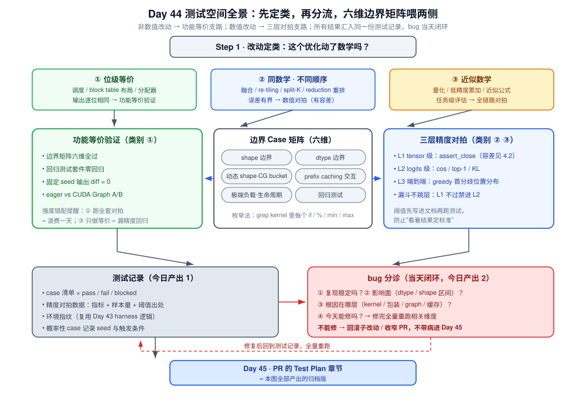
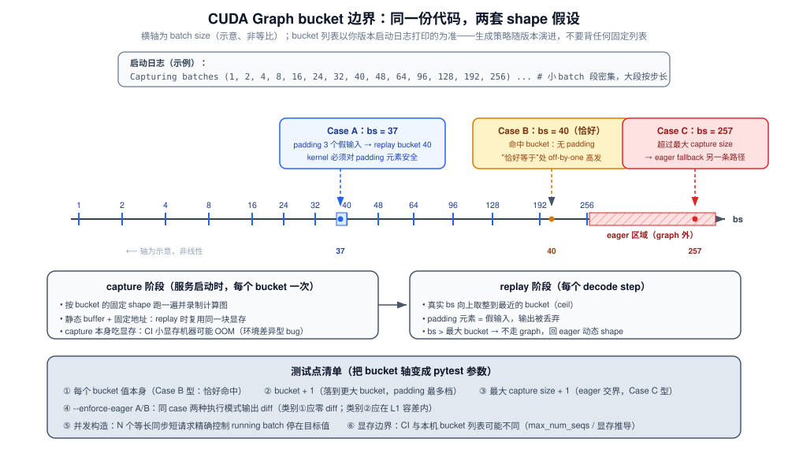
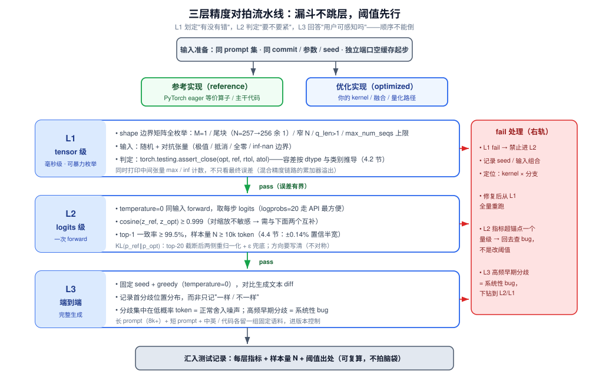

# Day 44：优化迭代与验证（二）——边界 Case 与精度验证

> **系列进度**：第 7 周 · Day 44 / 56 · 项目 A（vllm-ascend / vLLM 源码贡献）收尾阶段
> **前置**：Day 43 已产出带误差与显著性标注的前后对比表 → 本日输入还包括 Day 41-42 的优化实现
> **今日定位**：Day 43 回答了"快了多少"，今天回答"**算得对不对**"。性能数据只有建立在正确性之上才有意义——一个算错但更快的 kernel，在 reviewer 眼里是负资产。今天的产出（测试记录 + 精度对拍数据）将原样成为 Day 45 PR 的 **Test Plan** 章节。

性能优化圈还有第二句老话：**一个只测过"平均 batch"的优化等于没测过**。你在昇腾做 WeightQuantBatchMatmulV2 时就知道：kernel 不死在典型 shape 上，死在 M=1、N=257、尾块不整除这些"难命中区域"。今天把这套边界思维系统化地迁移到项目 A，并补上 GPU 推理栈特有的两类边界（CUDA Graph bucket、prefix caching 交互），再加上数值改动的三层精度对拍。

---

## 一、今日学习目标

1. **给改动定类**：判断自己的优化属于"位级等价 / 同数学不同顺序 / 近似数学"三类中的哪一类，据此确定验证强度——强度错配是白费功夫的主要来源
2. **构建边界 case 矩阵**：从代码分支的"大小关系"出发枚举 shape / dtype / 动态 shape / 缓存交互 / 极端负载 / 回归测试六个维度
3. **理解 GPU 栈特有的边界**：CUDA Graph capture bucket 边界与 padded replay、spec decode 导致的 q_len>1 decode、prefix caching 与 KV 路径改动的交互
4. **掌握数值误差的量化语言**：舍入模型、reduction 顺序误差界、量化扰动传播、top-1 一致率所需的样本量——能用公式回答"多大的差异算不可接受"
5. **搭建三层精度对拍**：tensor 级（kernel 进出）→ logits 级（cosine / top-1 / KL）→ 端到端（固定 seed greedy diff），并复用 Day 43 的 harness 风格
6. **产出**：测试记录（case 清单 × pass/fail + 精度对拍数据）+ bug 清单（带分诊）；若有 bug，**当天修完再进 Day 45**

---

## 二、核心概念

### 2.1 第一个问题：你的优化动了数学吗？

所有性能改动按"对数值结果的影响"分为三类，验证强度依次升级：

| 类别 | 典型改动 | 输出关系 | 验证强度 | 验证手段 |
|---|---|---|---|---|
| ① 位级等价 | 调度顺序、block table 数据结构、CPU 侧元数据布局、分配器策略 | 输出**逐位相同** | 功能等价 | 回归测试 + 固定 seed 输出 diff（应零 diff） |
| ② 同数学不同顺序 | kernel 融合、re-tiling、reduction 顺序变化、GEMM 切分方式、split-K | 输出满足浮点舍入误差界 | 数值对拍（有界） | tensor 级 assert_close + logits 级指标 |
| ③ 近似数学 | 量化（FP8/INT8/W4A16）、低精度累加、去 softmax 中的 max 项等近似 | 输出有**任务可接受**的偏差 | 任务级评估 | 全链路对拍 + 下游指标（困惑度 / 抽检生成质量） |

> **强度错配的两种浪费**：给纯调度改动跑全套精度对拍（浪费一天）；给量化改动只做功能等价测试（漏掉精度回归，review 阶段被打回）。先花 10 分钟定类，再决定测什么。

**注意**：类别 ② 最容易被人轻视。"只是换了个累加顺序"在 BF16 + 长 reduction 下足以翻转低概率 token 的 top-1——数学上等价，浮点上不等价（第四节给出误差界公式）。

### 2.2 边界思维：从昇腾算子测试空间迁移

你在昇腾的经验：**kernel 的正确性风险集中在"代码里 if 分支所依赖的大小关系"的取值组合上**。把一个 GEMM 类 kernel 的分支维度列出来：

- `M`（行数 / batch 维）：`M == 1`（单 token decode）、`M` 落在某个小 batch 区间（走单核/小 tile 路径）、`M` 超过阈值（走切分路径）
- `N`（列数）：窄 N（tile 装不满）、尾块（`N % tile_n != 0`）
- `K`（reduction 维）：非对齐（`K % align != 0`）、跨多个 block 的累加链
- dtype：BF16 / FP16 / INT8 / FP8 各是一条独立的编译与数值路径

GPU 推理栈在此之上**追加三类**昇腾上不典型（或不完全相同）的边界：

1. **CUDA Graph bucket 边界**：同一个数学操作，在 graph 内以 padding 后的 shape 静态执行，在 graph 外以真实 shape 动态执行——同一段 kernel 代码跑在两套 shape 假设下（Day 18 讲过 capture/replay 机制，今天从**测试**视角重新审视）
2. **q_len > 1 的 decode**：投机解码开启时，decode 阶段的 query 长度是 `1 + num_speculative_tokens` 而非 1（Day 25-26）——任何"假设 decode 时 q_len==1"写死的 kernel 会在此处悄悄算错或崩溃
3. **调度器与 KV 管理的交互边界**：preemption 重算、prefix caching 跨请求复用、请求 abort——这些生命周期事件会把 KV / batch 拉进你没想到的中间状态（Day 11-12、Day 16）

### 2.3 差分测试（Differential Testing）：今天的核心方法

**定义**：同一份输入喂给参考实现（reference）与优化实现（optimized），逐层比较输出。参考实现取"已知正确"的最简版本——PyTorch eager 原算子、vLLM 主干代码、或数学等价的朴素实现。

三层漏斗，**从便宜到昂贵、从敏感到不敏感**：

| 层级 | 比较对象 | 灵敏度 | 成本 | 定位能力 |
|---|---|---|---|---|
| L1 tensor 级 | 单 kernel 输入输出张量 | 极高（一个元素错就能抓到） | 极低（毫秒级，可暴力枚举 shape） | 直接定位到 kernel 与输入组合 |
| L2 logits 级 | 每层 / 最终 hidden states / logits | 高（误差在层间放大或衰减，可量化） | 中（跑一次 forward） | 定位到层，需再下钻 |
| L3 token / 文本级 | 生成 token 序列 | 低（top-1 翻转大多不改变文本语义） | 高（完整生成） | 只能回答"用户可感知吗" |

> **不要跳层**：只做 L3 会把 kernel bug 淹没在采样随机性里；只做 L1 会高估严重性（tensor 级 1e-3 的偏差经过 32 层可能被完全冲掉）。正确的顺序是 L1 划定"有没有错"，L2/L3 判定"要不要紧"。

### 2.4 验收标准先行

**容差必须在跑测试之前写进文档**，否则你会不自觉地"看着结果定标准"。例如（示例格式，数值以你的改动定类为准）：

```
L1: torch.testing.assert_close(opt, ref, rtol=2e-2, atol=2e-3)   # BF16 同序改动
L2: cosine(z_ref, z_opt) >= 0.999;  top-1 一致率 >= 99.5%;  KL <= 0.02 nats
L3: 固定 seed greedy，前 256 token 内首分歧位置 >= 95 分位（即 ≥95% 请求无分歧）
```

FP8 量化的 top-1 一致率参考线 **≥99.5%** 来自社区大量实践的经验值（Day 23 也用过这个数）——**以具体模型与任务的 baseline 为准**：先测"主干 vs 主干自己换个 seed"的自然波动率，优化实现的退化不应显著高于该自然波动。

### 2.5 今日全景图



上图是今天的作战地图：**先定类（改没动数学）→ 分流**：非数值改动走功能等价支路（边界矩阵 + 回归 + 零 diff）；数值改动叠加三层对拍。所有结果汇入同一份**测试记录**，bug 进**分诊清单**，当天修复当天复测。

---

## 三、原理深入讲解

### 3.1 边界 case 矩阵：六个维度逐一拆解

#### 维度 1：shape 边界

以项目 A 的典型对象（paged attention decode kernel 或量化 GEMM）为例，把 V1 引擎的真实 shape 来源列出来：

| V1 中的真实来源 | 取值范围 / 边界点 | 对应 kernel 维度 | 为什么危险 |
|---|---|---|---|
| decode step 的 batch | `1` ~ `max_num_seqs`（V1 默认值随版本与显存变化，启动日志会打印，以日志为准） | M | M=1 走最稀疏路径（单行 GEMV / 单 query attention）；M=max 走最满 tile 路径；两者 bug 模式完全不同 |
| 单 token 的 token budget 剩余 | chunked prefill 尾块（Day 11）：`max_num_batched_tokens - Σ已排入` 可能只剩 1~几十 | M（混合 batch 中 prefill 部分的尾 token 数） | 尾块导致 q_len 极小且不规则 |
| KV block 数 | `ceil(seq_len / block_size)`；尾 block 只有 `seq_len % 16` 个有效 token | attention 的 K/V 逻辑长度 | 尾 block 是"部分块"，mask 处理错了不会崩、只会**悄悄算错** |
| 窄 N | `N < tile_n` 或 `N % tile_n != 0`（如 N=257 对齐到 256 余 1） | N | 尾列 mask / 越界写 |
| spec decode 开启 | q_len = `1 + num_speculative_tokens` | attention 的 query 长度 | 打破"decode 时 q_len==1"的隐含假设 |

**动手枚举法**（比背清单更重要）：打开你的 kernel 与它的 Python 包装，`grep` 所有 `if` / `//` / `%` / `min` / `max`，每一处都是一个分支点；测试 shape 至少覆盖每个分支点两侧。这就是"**测试空间 = 分支条件的取值组合**"的可操作版本。

#### 维度 2：dtype 边界

- 数值改动必须在 **BF16 / FP16** 两种主精度下各过一遍：两者尾数位数不同（BF16 8 位、FP16 11 位尾数有效位），overflow 行为不同（FP16 上界 65504，softmax 前的 logits 或 LoRA 缩放可能溢出而 BF16 不会）
- 涉及量化的改动：**INT8 与 FP8 是不同的编译路径与不同的数值行为**（对称/非对称、per-tensor/per-channel scale 的广播位置），别只测你常用的那个
- 混合精度链路：weight 是 FP8 而 accumulate 是 FP32 时，**累加器的溢出与精度**要单独验（对拍时同时打印中间张量的 max/inf 计数，不只看最终误差）

#### 维度 3：动态 shape——CUDA Graph bucket 边界

Day 18 讲过 V1 中 CUDA Graph 的 capture 与 replay；今天的视角是**bucket 切换点是最危险的测试盲区**。细节见 3.3 与第三张图。

#### 维度 4：prefix caching 交互

改动若触碰 KV 读写路径（新 block 布局、新 dtype、新 gather kernel），必须 `enable_prefix_caching` 开 / 关各测一遍：

- **开**：跨请求复用 block（Day 16 的 hash 机制）。风险点：你的新 kernel 写入 KV 的布局若与复用路径读取时的假设不一致，**错误只在"第二个请求命中缓存"时出现**——首请求全对，命中率越高错得越多
- **关**：无复用，纯分配/释放路径。风险点：free 后重分配的 block 内容残留（脏数据被读走）

一个高频翻车现场：本地测试用 2 个请求、缓存命中率低，bug 不触发；reviewer 跑高重复前缀负载，命中率 90%+，输出直接乱码。**prefix caching 维度的测试负载必须刻意构造高命中**。

#### 维度 5：极端负载与生命周期边界

| Case | 构造方法 | 考验什么 |
|---|---|---|
| max-length 长输出 | `max_tokens = max_model_len - len(prompt)` | KV 写满最后一个尾 block、循环边界 |
| 立刻 abort | 发请求后毫秒级取消 | 半成品 KV 的释放、引用计数归零、block 回池 |
| 空 prompt / 极短 prompt | `prompt=""` 或单字符 | tokenizer 输出为空或 1 token 时的下界（空 prompt 在部分版本会被直接拒绝，属**预期行为**，记录版本行为即可） |
| preemption | 并发压到 KV 不足（Day 12-13 的手法） | recompute 路径下 KV 重写、block 重分配与你的改动交互 |
| 混合长短短发 | ShareGPT + 泊松到达 | 你的 kernel 在 batch 组成剧变下的鲁棒性 |

abort 的调用链（V1）：client 断开 / 主动取消 → entrypoints 层触发（HTTP 侧的具体触发方式随版本有差异）→ `AsyncLLM.abort_request` → `EngineCore` 转给 `Scheduler`，请求出 running 队列、KV block 归还 free 队列。**这条链与 KV 路径改动正交，但它们共享 block 生命周期状态机**——所以必须一起测。

#### 维度 6：回归测试

- vLLM 主仓：`pytest tests/v1/ -k "与你改动相关的关键词"`（如 `tests/v1/core/` 调度与 KV、`tests/v1/worker/` 执行层、`tests/v1/engine/` 引擎层）；kernel 层改动加跑 `tests/kernels/` 下相关文件
- vllm-ascend：跑仓库自带测试套件（路径以你克隆的版本为准，通常在 `vllm_ascend/tests/`），**环境受限时优先跑与改动模块直接相关的子集**，CI 全量交给 Day 45 提 PR 后的服务器
- 语义化提醒：测试目录结构在 vLLM 里演进较快（V0 移除过程中有大量迁移），**以你版本的 `tests/` 实际结构为准**，别按任何教程（包括本篇）记忆路径

### 3.2 CUDA Graph bucket 边界深挖



V1 中 decode step 的 batch size 每步都变，而 graph 只能按固定 shape capture，于是**离散化为一组 bucket**（capture sizes）。机制要点（Day 18 的复习 + 测试视角新增）：

1. **capture sizes 的生成**：由配置（`--cudagraph-capture-sizes` 与 `max_num_seqs` 等）推导——小 batch 段密集（甚至逐个 capture），大 batch 段按步长递增；具体策略在 `vllm/config.py` 的 CUDAGraph 配置与 `vllm/v1/worker/gpu_model_runner.py` 的 capture 逻辑中实现（bucket 生成函数历史上叫 `get_batch_size_buckets` / `capture_bs` 相关命名，**随版本变化，读你自己的版本**）。启动日志会打印实际 capture 的 size 列表——**拿日志里的真实列表设计测试点**，不要猜
2. **padded replay**：真实 batch=37 时，若 bucket 有 40，就 padding 到 40 replay；padding 的 token 是假输入，输出被丢弃。**你的 kernel 必须对 padding 元素安全**（读越界 / NaN 传播 / 写穿都可能在这里发生）
3. **两类关键边界点**（对应图中标出的）：
   - `bs == 某个 bucket 值`（恰好命中，无 padding——最容易在"恰好等于"处出现的 off-by-one）
   - `bs == bucket + 1`（落到下一个更大的 bucket，padding 最多的一档）
   - `bs > 最大 capture size`（fallback 到 eager 执行——**同一段逻辑走两套执行路径**，eager 对 graph 的差异就是 bug 温床）
4. **测试手法**：
   - `--enforce-eager` A/B：同一组 case 分别在 eager 与 graph 模式跑，输出 diff 应为零（类别 ① 改动）或在容差内（类别 ②）
   - 构造并发使 running batch 恰好停在 bucket 值附近：用同步短请求控制 batch 精确值（发 N 个相同 ISL/OSL 的请求，freeze 并发）
   - 显存边界：capture 本身吃显存，CI 机器显存小时 capture 可能 OOM——这属于**环境差异型 bug**，记录进分诊清单而不是硬扛

### 3.3 数值精度对拍流水线



流水线分三级漏斗（L1 → L2 → L3），每级有明确准入/准出标准：

**L1（tensor 级）**：随机 + 对抗张量，shape 全枚举边界矩阵。参考实现取 PyTorch eager 等价算子。判定用 `torch.testing.assert_close`，容差按 dtype 与类别 ②/③ 定（第四节推导）。**此层不过，禁止进入 L2**——层间误差放大会让上层定位变成玄学。

**L2（logits 级）**：固定一批 prompt（覆盖长/短/中英/代码），对参考实现与优化实现各跑一次 forward（`temperature=0` 的同输入），取每步 logits 计算三个指标：

- **cosine 相似度**：对 softmax 前的 logits 向量算，捕捉方向性偏差；但它对均匀缩放不敏感，需与下面两个互补
- **top-1 一致率**：两实现 argmax 相同的比例——**最接近"用户感知"的廉价代理**
- **KL 散度**：$D_{KL}(p_{ref} \| p_{opt})$，用 top-k（如 k=20）截断后重归一化的分布算（API 里 `logprobs=20` 直接给出），截断必须两侧一致且加 ε 兜底防 log(0)

**L3（端到端）**：固定 seed + `temperature=0` greedy，对比生成文本。记录**首分歧位置分布**（第几个 token 开始不同）而非只记"一样/不一样"——分歧位置的分布形状是面试时最好的谈资：分歧集中在低概率 token 上 = 正常舍入噪声；高频早期分歧 = 有系统性 bug。

**工程要点**：参考实现与优化实现的**推理路径其余部分必须完全一致**（同 commit、同启动参数、同 seed、prefix caching 同状态——最干净的做法是两个独立端口各自从空缓存起步，且都不命中缓存）。Day 43 的 `run_suite.sh` 环境指纹逻辑在这里**直接复用**，只是把"性能采集"换成"输出采集"。

### 3.4 bug 分诊：发现问题的处理协议

测试发现问题不是坏事，**没有处理协议的发现才是**。当天分诊四问：

1. **复现稳定吗？**（必现 / 概率性——概率性 case 记录 seed 与触发条件，标注"疑似 race"）
2. **影响面？**（哪个 dtype / 哪个 shape 区间 / 是否影响默认配置）
3. **根因在哪一层？**（kernel 本体 / Python 包装的 shape 推导 / graph padding 语义 / 缓存交互）
4. **今天能修吗？**——能修：修完**全量重跑**相关维度（不是只重跑失败 case）；不能修：回滚该子改动或收窄 PR 范围，**绝不带着已知问题进 Day 45**

---

## 四、数学推导：多大的差异算"错"

### 4.1 舍入模型与各 dtype 的单位舍入误差

浮点基本模型（round-to-nearest）：

$$fl(x \ op\ y) = (x\ op\ y)(1+\delta), \quad |\delta| \le u, \quad u = 2^{-(m+1)}$$

其中 $m$ 是尾数有效位数（不含隐含位）。注意 FP8 E4M3 的 $m=3$，$u=2^{-4}=6.25\%$——**它的一步舍入误差就接近 BF16 一步的 16 倍**，这就是量化改动（类别 ③）必须用任务级指标而非 tensor 级紧容差的原因。

| dtype | 尾数位 $m$ | $u$ | 一步相对舍入误差上界 |
|---|---|---|---|
| FP32 | 23 | $2^{-24}$ ≈ 6e-8 | 6e-8 |
| BF16 | 7 | $2^{-8}$ ≈ 3.9e-3 | 0.39% |
| FP16 | 10 | $2^{-11}$ ≈ 4.9e-4 | 0.049% |
| FP8 E4M3 | 3 | $2^{-4}$ | 6.25% |

### 4.2 Reduction 顺序为什么改变结果（类别 ② 的误差界）

对 $n$ 个数顺序求和，经典误差界（Higham）：

$$\left| fl\Big(\sum_{i=1}^{n} x_i\Big) - \sum_{i=1}^{n} x_i \right| \le \gamma_n \sum_{i=1}^{n}|x_i|, \qquad \gamma_n = \frac{nu}{1-nu}$$

关键点：界是相对 $\sum|x_i|$（绝对值和）而非 $|\sum x_i|$ 的——**有抵消（cancellation）时相对误差可以任意大**。树形归约（tiling / split-K 的本质）把深度从 $n$ 降到 $\log_2 n$：

$$\gamma_n^{seq} \approx nu \quad \xrightarrow{\text{tree}} \quad \approx \lceil\log_2 n\rceil \, u$$

**量级感**（K=4096 的 GEMM reduction，BF16，FP32 累加器）：累加器是 FP32，则 $u=6\times10^{-8}$，顺序求和界 $4096u \approx 2.4\times10^{-4}$（相对 $\sum|x|$）——**同一数学、两种累加顺序（split-K 切分点不同）之间 1e-4 量级的差异是预期的**，你的 L1 容差要据此设定，而不是拍一个 1e-6。

### 4.3 量化扰动的传播（类别 ③ 的界）

设权重扰动 $W = \hat{W} + E$（$\hat W$ 为量化后权重），输出扰动：

$$\|\Delta y\| = \|E x\| \le \|E\|_2 \|x\|_2$$

量化误差 $E$ 的元素在 $[-\Delta/2, \Delta/2]$ 内近似均匀分布（$\Delta$ 为量化步长），故 $\mathbb{E}\|E\|_F^2 = \frac{\Delta^2}{12} \cdot mn$。用信噪比的语言：每 $\log_2$ 位尾数约 **6.02 dB**，FP8 E4M3 相对 BF16 少 4 位尾数 ≈ 少约 24 dB 信噪比。工程结论：**per-channel / per-block scale 的意义就是把 $\Delta$ 自适应地压到各通道动态范围内**，这就是为什么 Day 22 讲的 granularity 直接决定 4.4 节里你能承诺的指标线。

### 4.4 top-1 一致率的样本量：99.5% 需要多少 token 才敢报

把"两实现 top-1 是否一致"看作伯努利试验，测得 $\hat p$ 的 95% 置信区间半宽（Wald）：

$$\epsilon = 1.96\sqrt{\frac{\hat p(1-\hat p)}{N}} \;\;\Rightarrow\;\; N \ge \frac{1.96^2\, \hat p (1-\hat p)}{\epsilon^2}$$

代入两个实用例子：

- **N = 10,000 token、真实 p=0.995**：$\epsilon = 1.96\sqrt{0.995 \times 0.005 / 10^4} \approx 0.14\%$ → 你可以报"99.5% ± 0.14%"
- **要区分 99.5% 与 99.0%（ε=0.5%）**：$N \ge \frac{3.84 \times 0.004975}{(0.005)^2} \approx 765$ token

所以"对拍 1 万 token 报 top-1 一致率"是有统计含义的最低配置；只对拍两三百 token 得出的 99.x% 在置信区间意义上**分不清 99.5% 和 98.5%**。

### 4.5 KL 散度的读法

$$D_{KL}(p_{ref} \| p_{opt}) = \sum_{v} p_{ref}(v) \log \frac{p_{ref}(v)}{p_{opt}(v) + \epsilon}$$

- **不对称**：$D_{KL}(p\|q) \neq D_{KL}(q\|p)$，报告时写清方向（通常参考分布在左，衡量"优化分布漏掉了参考的哪些概率质量"）
- **截断重归一化**：用 top-20 logprobs 对拍时，两侧都要 softmax 重归一化并加 $\epsilon$（如 1e-9）防 log(0)
- **量级锚点**（经验数量级，随模型/任务浮动，仅作 sanity check）：同序改动的舍入噪声通常 1e-4~1e-3 nats/token；FP8 权重量化常见 1e-2~1e-1 nats/token。**超出锚点一个量级 = 回去查 bug，而不是改阈值**

---

## 五、关键代码：把测试空间变成可重跑的脚本

### 5.1 目录结构（延续 Day 43 的项目布局，全部进版本控制）

```
proj-a/
├── run_suite.sh              # Day 43：性能采集
├── aggregate.py              # Day 43：性能汇总
├── diff_serve.py             # 今日新增：L2/L3 两端口对拍
├── fixed_prompts.jsonl       # 对拍固定语料（长/短/中英/代码各留一组）
├── test_plan.md              # 今日新增：定类结论 + 阈值 + case 清单（PR Test Plan 的底稿）
└── tests_proj/
    ├── test_kernel_boundaries.py   # L1：shape × dtype 参数化对拍
    └── test_adversarial.py         # L1：对抗输入（极值/抵消/全零）
```

### 5.2 L1：参数化边界测试（pytest）

```python
# tests_proj/test_kernel_boundaries.py
# 以"量化 GEMM"类改动为例；导入与签名以你的项目为准
import pytest
import torch

# from my_opt import fused_quant_matmul   # 你的实现

# 容差表写在这里 = 阈值先行；数值依据见 4.2 节（BF16 输入 + FP32 累加的顺序差 ~1e-4 量级）
DTYPES = [
    (torch.bfloat16, 2e-2, 2e-3),   # (dtype, rtol, atol)
    (torch.float16,  1e-3, 1e-3),
]

# 每行注释 = 这个 shape 对应 V1 里的哪个真实来源（见 3.1 维度 1 的表）
SHAPES = [
    (1,    256,  4096),   # M=1：单 token decode，最稀疏路径
    (1,    257,  4096),   # N=257：尾块余 1，mask/越界写高发
    (2,     64,  4096),   # 窄 N：tile 装不满
    (37,   256,  4096),   # bucket 40 - 3：padding replay 的真实 shape
    (40,   256,  4096),   # 恰好命中 bucket：off-by-one 高发
    (256,  256,  4096),   # 常见 bucket 值
    (1024, 256,  4096),   # max_num_seqs 量级（默认值随版本，以启动日志为准）
    (8,    512, 11008),   # K 非对齐（LLM FFN 维度量级）
]

def ref_impl(a, b, scale):
    # 参考实现 = 数学等价的 PyTorch eager 组合（"已知正确"的朴素写法）
    return (a.float() @ (b.float() * scale)).to(a.dtype)

@pytest.mark.parametrize("M,N,K", SHAPES,
                         ids=[f"M{m}_N{n}_K{k}" for m, n, k in SHAPES])
@pytest.mark.parametrize("dtype,rtol,atol", DTYPES, ids=["bf16", "fp16"])
def test_boundary(M, N, K, dtype, rtol, atol):
    torch.manual_seed(0)
    a = torch.randn(M, K, device="cuda", dtype=dtype)
    b = torch.randn(K, N, device="cuda", dtype=dtype)
    scale = torch.tensor(0.03, device="cuda")

    out_opt = fused_quant_matmul(a, b, scale)
    out_ref = ref_impl(a, b, scale)

    torch.testing.assert_close(out_opt, out_ref, rtol=rtol, atol=atol)
    assert not torch.isnan(out_opt).any() and not torch.isinf(out_opt).any()
```

```python
# tests_proj/test_adversarial.py
import torch

def test_cancellation_and_extremes():
    """抵消（相对误差最坏场景）+ 极值：比随机高斯更接近真实 bug 模式"""
    torch.manual_seed(0)
    K = 4096
    cases = {
        "cancel":  torch.randn(8, K, device="cuda", dtype=torch.bfloat16),       # 符号对半 → 求和抵消
        "extreme": torch.randn(8, K, device="cuda", dtype=torch.bfloat16) * 1e3, # 大动态范围
        "tiny":    torch.randn(8, K, device="cuda", dtype=torch.bfloat16) * 1e-3,# 接近下溢
        "zeros":   torch.zeros(8, K, device="cuda", dtype=torch.bfloat16),       # 全零
    }
    for name, a in cases.items():
        b = torch.randn(K, 256, device="cuda", dtype=torch.bfloat16)
        out = fused_quant_matmul(a, b, torch.tensor(0.03, device="cuda"))
        assert torch.isfinite(out).all(), f"{name}: 出现非有限值"
```

> **为什么"全零/极值"这类输入重要**：随机高斯输入下 99% 的 bug 藏在 mask 与尾块逻辑里不会触发；而全零会暴露未初始化的累加器、极值会暴露 FP16 上溢与 scale 计算的除零。这是把 4.1 节的误差模型"用输入主动踩"。

### 5.3 L2/L3：两端口服务级对拍（复用 Day 43 的启动框架）

前置：用 Day 43 的启动脚本分别起 baseline commit 与 optim commit 两个端口（`--port 8000/8001`），**参数除端口外逐字相同**，各自从空缓存起步。

```python
#!/usr/bin/env python3
# diff_serve.py —— L2（logits 级）+ L3（greedy diff）
# 用法: python diff_serve.py --ref http://127.0.0.1:8000 \
#                             --opt http://127.0.0.1:8001 --prompts fixed_prompts.jsonl
import argparse, json, math, urllib.request

def completions(ep, prompt, max_tokens=64):
    body = {"model": "default", "prompt": prompt, "temperature": 0.0,
            "seed": 42, "max_tokens": max_tokens, "logprobs": 20}
    req = urllib.request.Request(f"{ep}/v1/completions",
                                 data=json.dumps(body).encode(),
                                 headers={"Content-Type": "application/json"})
    with urllib.request.urlopen(req, timeout=600) as r:
        d = json.loads(r.read())
    ch = d["choices"][0]
    # 每步: {token_str: prob}（top-20 截断分布；两侧 API 行为一致才可比）
    steps = [{t: math.exp(lp) for t, lp in step.items()}
             for step in ch["logprobs"]["top_logprobs"]]
    return ch["text"], steps

def l2_metrics(ref_steps, opt_steps):
    agree = n = 0
    kl_sum = cos_num = cos_dr = 0.0
    for rs, os_ in zip(ref_steps, opt_steps):
        rt, ot = max(rs, key=rs.get), max(os_, key=os_.get)
        agree += (rt == ot); n += 1
        # KL：截断后两侧各自重归一化 + eps 兜底（方向: ref || opt）
        zr, zo = sum(rs.values()), sum(os_.values())
        for t, p_raw in rs.items():
            p = p_raw / zr
            q = os_.get(t, 0.0) / zo + 1e-9
            kl_sum += p * math.log(p / q)
        # cosine：union top-k 概率向量（严格版需 logits 原值，走离线 forward）
        union = set(rs) | set(os_)
        vr = [rs.get(t, 0.0) for t in union]; vo = [os_.get(t, 0.0) for t in union]
        cos_num += sum(x * y for x, y in zip(vr, vo))
        cos_dr += math.sqrt(sum(x * x for x in vr) * sum(y * y for y in vo))
    return {"top1_rate": agree / max(n, 1), "kl_per_tok": kl_sum / max(n, 1),
            "cosine": cos_num / max(cos_dr, 1e-12), "n_tok": n}

def main():
    ap = argparse.ArgumentParser()
    ap.add_argument("--ref", required=True); ap.add_argument("--opt", required=True)
    ap.add_argument("--prompts", default="fixed_prompts.jsonl")
    args = ap.parse_args()

    prompts = [json.loads(l)["prompt"] for l in open(args.prompts)]
    all_ref, all_opt = [], []
    first_div = []
    for p in prompts:
        t_ref, s_ref = completions(args.ref, p)
        t_opt, s_opt = completions(args.opt, p)
        m = l2_metrics(s_ref, s_opt)
        all_ref.append(s_ref); all_opt.append(s_opt)
        # L3：greedy 文本首分歧位置（无分歧记为 max_tokens）
        pos = next((i for i, (a, b) in enumerate(zip(t_ref, t_opt)) if a != b),
                   min(len(t_ref), len(t_opt), 64))
        first_div.append(pos)
        print(f"top1={m['top1_rate']:.4f} kl={m['kl_per_tok']:.5f} "
              f"cos={m['cosine']:.6f} first_div={pos}")

    flat_r = [s for steps in all_ref for s in steps]
    flat_o = [s for steps in all_opt for s in steps]
    total = l2_metrics(flat_r, flat_o)
    print("\n== TOTAL ==")
    print(f"top-1 一致率 = {total['top1_rate']:.4f}  (N = {total['n_tok']} tokens)")
    print(f"KL(ref||opt) = {total['kl_per_tok']:.5f} nats/token")
    print(f"cosine       = {total['cosine']:.6f}")
    print(f"L3 首分歧位置: {[p for p in first_div]}")
    # 阈值判定（与 test_plan.md 中先写好的标准一致）
    ok = (total['top1_rate'] >= 0.995 and total['kl_per_tok'] <= 0.02
          and total['cosine'] >= 0.999)
    print(f"验收: {'PASS' if ok else 'FAIL'}  ← 阈值见 test_plan.md，勿事后调整")

if __name__ == "__main__":
    main()
```

实现说明（版本敏感处）：

- `logprobs` / `top_logprobs` 的字段层级在 OpenAI 兼容 API 的 vLLM 实现中随版本有微调，**先发一条请求 `cat` 出原始 JSON 再写解析**（Day 43 同款忠告：先看真实输出再写聚合）
- 严格的 logits cosine 需要张量原值：离线 `LLM` + `ask_for_logprobs` 的 forward 路径，或对拍单层 forward；对拍脚本里用 top-20 概率向量做 union 对齐是**廉价近似**，报告时注明口径
- **prefix caching 必须同状态**：两个端口都从空缓存起步、对拍期间不重复发送同前缀请求，否则一侧命中缓存一侧不命中，测的是缓存而不是你的改动

### 5.4 测试记录模板（`test_plan.md` 的产出形态）

```markdown
## Test Record — Day 44（项目 A：<改动名>）
环境指纹: <commit ref> / <commit opt> · <GPU/驱动> · vLLM <版本> · 完整启动命令见 run_suite.sh

### 定类
类别 ②（同数学不同顺序：reduction 重排 + 融合）→ 走功能等价 + 三层对拍

### 边界矩阵（L1 + 极端负载）
| 维度 | case | 结果 | 备注 |
|---|---|---|---|
| shape | M=1 / N=257 / 窄N / bucket40-3 / 恰好40 / max_num_seqs | PASS ×6 | rtol 2e-2 / atol 2e-3 |
| dtype | bf16 / fp16 | PASS / PASS | |
| 动态 shape | --enforce-eager A/B（bucket 值 ±1，max+1） | PASS | diff 全零 |
| prefix caching | off / on(高命中负载) | PASS / FAIL | on 高命中时 top1=0.71 → bug#2 |
| 极端负载 | max-len / abort / 空 prompt / preemption | PASS / PASS / 预期拒绝 / PASS | |
| 回归 | pytest tests/v1/ -k <关键词> | PASS（0 failed） | |

### 精度对拍（L2/L3）
top-1 = 99.87%（N=12,480 tok）· KL = 0.0031 nats/tok · cosine = 0.9998
L3 首分歧：18/20 条请求无分歧，2 条分歧位置 = 152 / 203（低概率 token）

### bug 清单
| # | 现象 | 影响面 | 根因层 | 状态 |
|---|---|---|---|---|
| 1 | ... | ... | ... | 已修复，全量重跑通过 |
| 2 | prefix caching 高命中时输出乱码 | 默认配置 | kernel 读旧布局 | 已修复（bump block hash）|
```

---

## 六、与 vLLM V1 的实际联系

### 6.1 你的测试点在源码里的"出处"

边界 case 不是凭空想象的，每个都能在 V1 源码里找到产生它的机制：

| 边界 case | 源码出处（模块级，具体行号随版本） | 机制回顾 |
|---|---|---|
| M=1 ~ max_num_seqs | `vllm/v1/core/scheduler.py`：`Scheduler.schedule()` 对 running/waiting 的预算裁剪 | Day 10-11：token budget 与 seq 数上限共同决定每步 batch |
| 尾块 / 混合 batch 的不规则 M | 同上 + chunked prefill 的切块逻辑 | Day 11：`max_num_batched_tokens` 减去已排入后的剩余就是尾块 |
| CUDA Graph bucket | `vllm/config.py`（CUDAGraph 配置，`--cudagraph-capture-sizes`）+ `vllm/v1/worker/gpu_model_runner.py` 的 capture/replay | Day 18；bucket 生成策略随版本演进，以启动日志为准 |
| padding 后的 M | `vllm/v1/worker/gpu_model_runner.py`：replay 前把 batch pad 到 bucket | padding 元素是假输入，kernel 必须安全 |
| q_len > 1 的 decode | `vllm/v1/spec_decode/`：draft tokens 拼进 decode step | Day 25：q_len = 1 + num_speculative_tokens |
| prefix caching 交互 | `vllm/v1/core/kv_cache_utils.py`（block hash）+ `kv_cache_manager.py` | Day 16：hash = 父前缀 + token ids + ... |
| abort / 生命周期 | `AsyncLLM.abort_request` → `EngineCore` → `Scheduler` 移除 + block 归还 free 队列 | HTTP 侧触发方式随版本有差异 |

**把这张表读反**：当你不知道该测什么时，沿着"哪些源码路径会构造出我的 kernel 的输入"倒推——调度器、graph padding、spec decode、缓存管理，每个机制贡献一类 shape。

### 6.2 学 vLLM 自己怎么测（借仓库的测试手法）

- **kernel 层**（`tests/kernels/`，目录结构以你版本为准）：vLLM 测自定义 kernel 的标准手法就是本篇 L1——**eager PyTorch 参考实现 + `torch.testing.assert_close` + 参数化 shape**。读两三个你改动相邻的测试文件，直接抄它的参数化与容差风格，reviewer 看到熟悉的测试模式会显著降低 review 摩擦
- **引擎层**（`tests/v1/`）：core / engine / worker 分层，大量用轻量 mock（如假 model runner）把 GPU 依赖隔离掉——**调度与 KV 改动的功能等价测试**可以照这个模式写进你的 PR
- **接口契约**：Day 17 整理过的 attention backend 接口清单，天然就是"新后端必须全过"的 case 列表——每个接口方法一个最小 case，防止"只实现了 happy path"
- **vllm-ascend**：跑仓库自带测试套件中与你改动模块直接相关的子集（环境受限时）；全量交给 PR 后的 CI

### 6.3 版本敏感性清单（写进 PR 的"在哪个版本验证过"）

以下内容随版本变化较快，**PR 里注明验证版本，教程里的描述都只是方法论**：

1. CUDA Graph bucket 生成策略（小段密集/大段步长的具体参数）
2. `max_num_seqs` 等默认值（由显存与配置推导，启动日志可查）
3. 空 prompt 的处理（部分版本直接报错——属预期行为而非 bug）
4. abort 的 HTTP 触发面（client 断连的语义在各 entrypoints 中的实现细节）
5. `logprobs` 返回的 JSON 结构

---

## 七、动手实验步骤（约 2.5~3 小时）

> 输入：Day 41-42 的优化实现 + Day 43 的 benchmark 环境。输出：`test_plan.md`（含测试记录与 bug 清单）。

### Step 0：定类 + 阈值先行（15 min）

1. 打开你的 diff（`git diff main...HEAD --stat`），把每处改动映射到 ①/②/③ 类别
2. 在 `test_plan.md` 写下：定类结论、L1 容差（引用 4.2 节推导）、L2/L3 阈值、case 清单骨架
3. **此刻不跑任何测试**——先有标准，后有数据

### Step 1：L1 边界矩阵 + 对抗输入（45 min）

1. 把 5.2 的 pytest 模板适配到你的 kernel：先跑通一个 shape，再放开参数化
2. `pytest tests_proj/ -v` 全绿后，**故意改坏一处 mask 重跑**（变异测试的简化版：确认你的测试真的能抓 bug——一个抓不到 bug 的测试套件比没有更糟，它制造虚假信心）
3. 记录每档 dtype 的实测最大相对误差（不只是 pass/fail，这个数字 Day 45 写 PR 有用）

### Step 2：极端负载与生命周期（30 min）

用脚本依次构造（对照 3.1 维度 5 的表）：

```bash
# max-length：输出顶满 max_model_len（构造 KV 写满尾 block）
# abort：发 20 个长输出请求，100ms 后批量取消，观察 /metrics 的 block 计数回落
# 空 prompt：curl 一条空字符串，记录行为（预期拒绝 or 正常处理，与版本对照）
# preemption：Day 12-13 的手法——并发压到 KV 不足，观察 recompute 后输出正确性
# prefix caching on：高重复前缀（同 system prompt × 50 请求），命中率 >80% 后检查输出
```

每项在 `test_plan.md` 记一行：现象 / 是否符合预期 / 依据。

### Step 3：回归测试（30 min）

```bash
# vLLM 主仓（关键词换成你改动涉及的模块）
pytest tests/v1/core/ -x -q -k "prefix or scheduler or kv"
pytest tests/v1/worker/ -x -q
pytest tests/kernels/ -x -q -k "<你的 kernel 相邻的关键词>"
# vllm-ascend：跑你改动模块对应的子集（路径以你克隆版本为准）
```

记录：套件名 / 用例数 / 通过数 / 跳过原因（环境缺依赖的 skip 单独列出，Day 45 要在 PR 里说明）。

### Step 4：L2/L3 对拍（45 min）

1. 用 Day 43 的启动脚本起两个端口（baseline commit / optim commit），参数除端口逐字相同
2. `python diff_serve.py --ref ... --opt ... --prompts fixed_prompts.jsonl`
3. 检查 N：总 token 数 ≥ 10k（4.4 节的置信区间要求）；不够就加 prompt 或加 `max_tokens`
4. 把 TOTAL 三指标 + L3 首分歧位置抄进 `test_plan.md`

### Step 5：汇总 + bug 分诊（20 min）

1. 补全 5.4 模板的全部表格
2. 对每个 bug 过 3.4 节四问；当天修复的**全量重跑相关维度**（不是只重跑失败 case）
3. 若有修不完的：回滚该子改动或收窄 PR 范围，并在文档里写明"已知问题与计划"

### 晚间检查点

- [ ] 定类结论与验证强度匹配（没有白费功或漏测）
- [ ] L1 全绿，且做过一次"故意改坏"的自检
- [ ] prefix caching 开/关、eager/graph、全部 dtype 各有记录
- [ ] 对拍样本量 N ≥ 10k，阈值在跑测试前就已写下
- [ ] bug 清单零"未分诊"项；已知问题零"带病进 Day 45"
- [ ] `test_plan.md` 可以直接粘进 Day 45 的 PR 描述

### 常见故障排查

| 症状 | 可能原因 | 定位手段 |
|---|---|---|
| eager 全对，graph 模式偶发错 | padding 元素进入 kernel 未被 mask / capture 时绑定了动态值 | `--enforce-eager` A/B 收窄；bucket±1 单测 |
| 只在 bf16 翻车 | fp16 容差给到了 bf16 上 / 累加器精度不足 | 逐 dtype 跑 L1 看实测误差量级 |
| prefix caching on 时乱码 | 新旧 KV 布局混用 / hash 未包含布局标识 | 关缓存复测对照；检查 block hash 组成 |
| 概率性 fail（同 seed 不可复现） | 竞态（stream 同步缺失）/ 未初始化内存 | 记录触发条件；`compute-sanitizer`（GPU）/ 昇腾对应内存检测工具 |
| CI 挂而本地过 | CI 机器 bucket 列表不同（显存推导差异）/ 小显存 capture OOM | 拿 CI 的启动日志对照 bucket 列表 |

---

## 八、面试高频问题

**Q1：你做了一个 kernel 融合/量化优化，怎么验证它没有算错？**

> 答：先定类——位级等价 / 同数学不同顺序 / 近似数学，验证强度随类别升级。然后三层漏斗：L1 tensor 级用 eager 参考实现 + assert_close，暴力枚举边界 shape（M=1、尾块、窄 N、bucket±1）；L2 logits 级对拍 cosine / top-1 一致率 / KL，样本量按置信区间算（99.5% 至少 1 万 token）；L3 固定 seed greedy 看首分歧位置分布。不跳层：L1 划定"有没有错"，L3 回答"用户可感知吗"。（可以补充：我还做过变异自检——故意改坏 mask 确认测试真能抓 bug。）

**Q2：只是换了 reduction 顺序，数学上等价，为什么会变结果？差多少？**

> 答：浮点舍入不结合。顺序求和误差界 $\gamma_n \approx nu$（相对绝对值和），树形归约降到 $\log_2 n \cdot u$。BF16 输入 FP32 累加、K=4096 时不同切分顺序之间 1e-4 量级差异是预期的；但有 cancellation 时相对误差可以放大很多——所以 L1 容差要对着误差界设，而不是拍 1e-6。

**Q3：你报 top-1 一致率 99.5%，怎么让人信这个数字？**

> 答：给样本量和置信区间。伯努利 Wald 区间：N=10k、p=0.995 时半宽 ±0.14%；只测两三百 token 的话，99.5% 和 98.5% 在统计上分不开。另外阈值是**跑测试之前**写下的，参考线（如 FP8 ≥99.5%）要对照"主干自身的自然波动"校准，而不是事后看结果定标准。

**Q4：kernel 在 eager 下全对，开了 CUDA Graph 偶发算错，你会怀疑什么？**

> 答：三类：① padding 元素进入了 kernel 且没被安全处理（replay 时 batch 被 pad 到 bucket，假输入的读越界/NaN 传播）；② capture 时把动态值（shape、指针、host 侧变量）烧进了图；③ 静态 buffer 地址假设被别处打破。定位手法：`--enforce-eager` A/B 收窄到 graph 语义，再按 bucket 值 / bucket+1 / 最大值+1 单测，启动日志里拿真实 bucket 列表。

**Q5：给你一个 M×N×K 的 kernel，说出你必须测的 shape。**

> 答：M=1（最稀疏路径）、M 到 max_num_seqs 量级（最满 tile）、N 或 K 的尾块（对齐余量，如 N=257 对 256）、窄 N（tile 装不满）、K 非对齐；推理栈特有的：CUDA Graph bucket±1、spec decode 开启后的 q_len=1+k、chunked prefill 尾 token。方法论是"测试空间 = 代码分支依赖的大小关系的取值组合"——grep kernel 里每个 if / % / min / max。

**Q6：精度退化到什么程度可以接受？**

> 答：分层回答：tensor 级看误差界（对 dtype 推导）；logits 级看 top-1/KL 是否显著超出"同实现换 seed"的自然波动；最终看任务级指标（困惑度 / 下游抽检）和业务 SLO。量化类改动的参考线 top-1 ≥99.5% 是社区经验值，**必须以具体模型任务的 baseline 校准**。原则：退化可接受的前提是可度量、可复现、有机制解释（比如误差集中在低概率 token）。

**Q7：PR 提交前一天发现边界 case 挂了，怎么办？**

> 答：四问分诊：复现稳定吗、影响面多大、根因在哪层、今天能修吗。能修就修完全量重跑相关维度；修不动就回滚该子改动或收窄 PR 范围（拆成两个 PR）。底线是**不带已知问题提 PR**——reviewer 自己踩到已知 bug 会严重损害整个 PR 的可信度。

---

## 九、今日总结

- **先定类再测试**：位级等价 / 同数学不同顺序 / 近似数学三类别对应三档验证强度，强度错配是浪费或漏测
- **边界空间 = 分支条件的取值组合**：昇腾算子的 M=1 / 尾块 / 窄 N 思维直接迁移，GPU 栈追加 CUDA Graph bucket、q_len>1（spec decode）、prefix caching 交互三类
- **三层对拍漏斗不跳层**：L1 tensor（assert_close + 对抗输入）→ L2 logits（cos / top-1 / KL，样本量按置信区间）→ L3 greedy 首分歧分布
- **数值误差有公式可依**：$\gamma_n$ 界决定 L1 容差；FP8 的 $u=6.25\%$ 决定了量化改动必须用任务级指标
- **阈值先行 + bug 当天闭环**：容差写进文档再跑测试；分诊四问；修完全量重跑；不带病进 Day 45
- 今天的 `test_plan.md` 就是明天 PR 的 **Test Plan** 章节——Day 43 的对比表 + 今天的测试记录，构成 PR 的全部证据链

---

## 十、今日自测题

1. 你的改动是"把 split-K 的切分点从 4 改到 8"，属于哪个类别？L1 容差该按什么依据设？
2. 服务日志显示 capture 了 `[1,2,4,8,16,24,32,40,...,256]`。列出你必须构造的至少 5 个 batch size 测试点，并说明每个考验什么。
3. 对拍测得 top-1 一致率 99.7%（N=300 token）。这个数字能区分 99.5% 和 99.9% 吗？需要多少样本？
4. prefix caching 关闭时全对、开启且命中率 85% 时部分请求乱码。给出你的排查路线（提示：block hash 与新旧布局）。
5. 投机解码开启后你的 decode attention kernel 输出错了。最可能违反了哪个隐含假设？

<details>
<summary>参考答案（先自己答再看）</summary>

1. 类别 ②（同数学不同顺序）。容差依据 4.2 节：累加器 FP32、K 维长度下顺序差的理论量级（$u$ 为 FP32 的 $6\times10^{-8}$，深度差 $\log_2 8 - \log_2 4$ 级别，实测通常远小于界），设 rtol/atol 留出该量级余量而非拍 1e-6。
2. 至少：`1`（最稀疏）、`40`（恰好命中 bucket，off-by-one）、`41`（落到下一 bucket，padding 最多档）、`256`（最大 capture，满 tile）、`257`（超界 → eager fallback，另一条执行路径）；再加 `--enforce-eager` 的 A/B 对照。
3. 不能。N=300、p≈0.997 时 Wald 半宽 $1.96\sqrt{0.997\times0.003/300}\approx 0.62\%$，置信区间横跨 99.1%~100.3%。区分 99.5% vs 99.9%（ε=0.2%）约需 $N \ge 3.84\times0.005/0.0004 \approx 48$……注意此处 p(1-p) 取 0.995×0.005≈0.005，得 N≥48 是"区分两个已知比例"的样本量；而**估计**单个比例到 ±0.2% 需要 N≈9,600。答出"半宽与 $\sqrt{N}$ 反比、需近万 token"即算对。
4. ① 复现：固定 seed + 固定命中序列；② 对照：关缓存复跑同请求应恢复 → 锁定缓存路径；③ 机制：block hash 复用了旧请求写入的 KV，而你的改动改了写入布局 → 新代码读到旧布局数据；④ 修复方向：让布局/版本进入 hash 组成（或升级时失效缓存），高命中负载复测。
5. "decode 时 q_len==1"。投机解码下 query 长度 = 1 + num_speculative_tokens，kernel 若按单 query 写死（如把 q 维当作不存在、K/V 偏移按单 token 计算）就会算错或越界。
</details>

---

## 十一、今日产出物

| 产出物 | 验收标准 |
|---|---|
| `test_plan.md`：定类 + 阈值 + case 清单 | 阈值在测试前写下、每项有出处（公式 / 版本日志） |
| 测试记录（边界矩阵 × pass/fail） | 六维度全覆盖，含 prefix caching 开/关、eager/graph、全 dtype |
| 精度对拍数据 | top-1（含 N）/ KL / cosine / L3 首分歧分布；N ≥ 10k token |
| `tests_proj/` 测试脚本 | 可重跑（一条命令）；做过"故意改坏"自检 |
| bug 清单 | 每项过四问分诊；已修复项全量重跑；无"带病进 Day 45"项 |

> **明日预告（Day 45）**：把 Day 43 的对比表与今天的测试记录组装成 PR——Why / What / Benchmarks / Test Plan 四段式描述、pre-commit 与 commit history 整理、提交后 CI 红了当天修、review 意见 24 小时内响应。PR 不合并也值：review 是免费的专家反馈。
