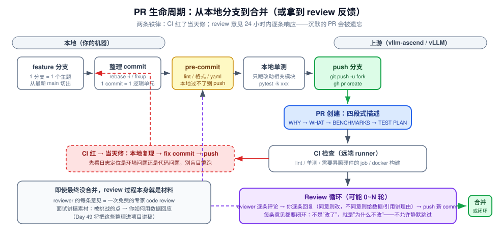
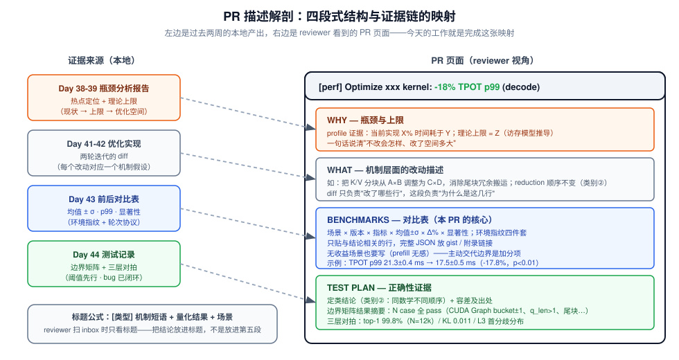
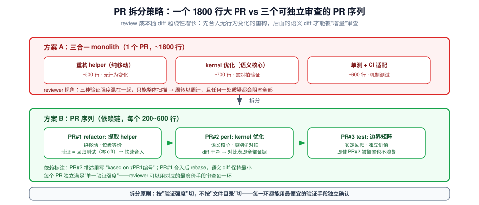

# Day 45：优化迭代与验证（三）——整理为 PR 提交

> **系列进度**：第 7 周 · Day 45 / 56 · 项目 A（vllm-ascend / vLLM 源码贡献）收官日
> **前置**：Day 43 前后对比表（含误差与显著性）→ Day 44 边界测试记录 + 精度对拍数据（已确认"不带病"）
> **今日定位**：Day 43 回答了"快了多少"，Day 44 回答了"算得对不对"，今天回答"**能不能让陌生人在 10 分钟内相信这件事**"。载体就是 Pull Request——它是代码、数据、测试记录三件套的包装工程。产出：**PR + 前后性能数据对比表**，这是 README 第 7 周给项目 A 定义的最终交付物。

项目 A 到今天为止，技术工作其实已经结束。今天的全部内容是**沟通工程**：把六周的工作压缩进一个几百行的 diff、一段几百字的描述、几张数据表，然后交给一群不认识你、没有义务帮你、每周要看几十个 PR 的 maintainer。开源圈有一句比 Day 43 那句更狠的话：**reviewer 花在你 PR 上的每一分钟，都是从他自己项目里挤出来的**。你今天做的所有事，本质都是在降低 reviewer 理解你改动的成本——这个视角一旦建立，下面每一条规则都不再是"规矩"，而是必然推论。

---

## 一、今日学习目标

1. **建立"PR = 证据链载体"的模型**：代码（What）、动机与机制（Why）、性能数据（Benchmarks）、正确性数据（Test Plan）四位一体，缺一角 reviewer 就要靠猜
2. **掌握 PR 大小的经济学**：为什么 200~400 行 diff 是甜点区；大 PR 如何用"拆分序列"降维
3. **把 commit history 整理成叙事**：interactive rebase / fixup / squash 的操作与取舍，commit message 的规范写法
4. **走完上游提交的机械流程**：fork → branch → pre-commit → DCO sign-off → push → `gh pr create` → CI → review 循环
5. **掌握 review 应对的礼仪与策略**：逐条闭环、分歧处理、"意见-回复-新 commit"的追踪结构
6. **产出**：提交到 vllm-ascend（或 vLLM 主仓）的 PR + PR 描述中的前后性能数据对比表；即使未合并，形成一份可复述的 review 应对记录（Day 49 讲稿素材）

---

## 二、核心概念

### 2.1 PR 不是"提交代码"，是"提交证据链"

回顾这两天做的事：Day 43 产出了一张带环境指纹、误差棒、显著性标注的对比表；Day 44 产出了六维边界 case 矩阵和三层精度对拍数据。这些如果只躺在你的本地目录里，对上游仓库的价值是零。PR 的本质是**把证据链和代码 diff 绑定成一个原子单元**提交审查：

| 证据 | 来源 | 在 PR 中的位置 |
|---|---|---|
| 为什么改（瓶颈 + 理论上限） | Day 38-39 瓶颈分析报告 | 描述 WHY 段 |
| 改了什么（机制） | Day 41-42 优化实现 | diff 本身 + WHAT 段 |
| 快了多少（可信） | Day 43 对比表 | 描述 BENCHMARKS 段 |
| 算得对不对 | Day 44 测试记录 | 描述 TEST PLAN 段 |

> **检验标准**：reviewer 只看 PR 页面（不看你的本地文件、不问你本人），能否在 10 分钟内完成三件事——看懂改动、相信数据、确认正确性。任何需要"私聊补充"的信息都算证据链断裂。

### 2.2 PR 大小的经济学：review 精力是稀缺资源

review 不是免费的，而且** review 成本随 diff 大小超线性增长**。原因很机械：

- 行数翻倍 → 阅读时间至少翻倍（线性项）
- 改动涉及的模块数增加 → reviewer 需要**在脑中加载的上下文**按模块数组合增长（超线性项）
- diff 超过一屏 → 阅读策略从"逐行验证"退化为"抽样扫描"（质量塌陷项）

社区大量贡献数据反复指向同一个经验区间：**~200 行级 diff 的 review 深度和周转速度远好于 ~2000 行级**。这不是教条，而是上面三个机制的结果。由此推出今天的两条实操纪律：

1. **一个 PR 一个主题**：kernel 优化、配套的单测、CI 适配可以是三个 PR 的序列，而不是一个三合一的大 PR
2. **机械改动与语义改动分离**：格式化/重命名产生的"噪声 diff"会把真正的语义变化淹没——这正是 pre-commit 钩子存在的意义（保证你 push 的东西至少不撞格式规则）

> **与昇腾经验的对接**：你在公司内部提 MR 时大概也有体感——评审人看到 3000 行 diff 时的第一反应是"先放一放"。内部 MR 的评审人有绩效约束会回来看，开源 reviewer 没有。所以开源场景对 PR 尺寸的惩罚更陡。

### 2.3 commit history 是给 reviewer 讲的第二遍故事

PR 描述讲一遍（静态、俯视），commit history 再讲一遍（动态、时间顺序）。reviewer 里有一派专门按 commit 逐个看，因为**好的 commit 序列能让每一步都小到"显然正确"**：

| commit 序列风格 | reviewer 体验 |
|---|---|
| `fix`、`update`、`final`、`really final` × 17 个 | 完全无法增量审查，只能整体看 diff（等于退化成一个大 commit） |
| ① 重构出可复用 helper（无行为变化）→ ② 核心优化 → ③ 配套单测 | 每个 commit 独立可验证：① 是纯移动，② 可以单独对拍，③ 锁住回归 |

操作上，本地开发期的脏历史在 push 前用 `git rebase -i` / `git commit --fixup` + `--autosquash` 整理。**注意纪律**：整理只发生在 push 之前的私有分支上；PR 建立后，新增改动建议用独立 commit 追加（`fix: address review comment about xxx`），让 reviewer 能增量 diff——除非 maintainer 明确要求 squash。

### 2.4 review 是免费的专家反馈：换一个心态

README 里那句话值得原样抄一遍：**"即使不合并，review 过程本身就是材料"**。给推理系统写 kernel 的 maintainer，在外面的咨询价格是每小时几百美元起。你的 PR 哪怕收到一句"这里为什么不按 flash-decoding 的做法切 K 维？"，都是一次定向的免费教学。由此推出应对 review 的心态基调：

- **默认 reviewer 是对的，但用数据说话**：他质疑你的 benchmark，你补环境指纹和轮次协议（Day 43 的产出正好用上）；他质疑精度，你补对拍数据（Day 44 的产出正好用上）
- **不同意时，回复结构 = 复述对方观点 + 你的证据 + 你的结论**，而不是 "I think this is fine"
- **每条意见必须闭环**：要么改（附 commit 链接），要么给出不改的理由。静默跳过是开源协作里最伤信任的行为

### 2.5 今日全景图



整个流程分本地与上游两段：本地的每一步（单分支、整理 commit、pre-commit、本地单测）都在**降低远端循环的次数**；远端的两个循环——CI 红修循环、review 迭代循环——的**目标周转时间分别是"当天"和"24 小时"**。记住这条时间线，第五节的实验步骤就按它展开。

---

## 三、原理深入讲解

### 3.1 上游与下游：你的 PR 落在哪

先搞清楚仓库关系（以写本文时（2025 年）的生态为准，具体以各仓库 README 为准）：

- **vLLM 主仓**（`vllm-project/vllm`）：核心引擎，V1 架构所在地（Day 8-21 读过的所有源码）
- **vllm-ascend**（`vllm-project/vllm-ascend`）：vLLM 的**硬件后端插件仓**——platform 层、Ascend attention backend、NPU 算子接入。它作为下游仓库跟踪 vLLM 的发布节奏
- 项目 A 的候选改动（paged attention kernel 优化、量化 GEMM tiling、MLA 后端、调度器改进）大概率落在 vllm-ascend；**纯调度器类改动如果对所有硬件通用，才考虑直接提主仓**

这个区分决定 PR 的受众：vllm-ascend 的 reviewer 默认懂昇腾、懂 CANN、懂你的 tiling 语言；主仓 reviewer 不一定。**写给懂行的人，术语可以省；写给通用社区，机制要展开讲**——这是 PR 描述语气校准的第一步。

### 3.2 提交前检查的"三角验证"

Day 43 的对比表 + Day 44 的测试记录 + 今天的 PR，三角缺一不可，但还有一个容易忽略的第四角：**改动与环境指纹的一致性**。PR 里声明的 benchmark 数据，必须注明：

```
- 基线 commit: <main 分支具体 hash>；优化 commit: <本 PR 分支 hash>
- 硬件: Atlas 800T A2 × N / 镜像: <cann/torch 版本>；vllm-ascend: <版本>
- 负载: vllm bench serve --dataset sonnet-4k --request-rate 4 ...（完整命令）
- 轮次: 3 seeds × 1000 requests，报均值 ± σ 与 p99
```

这四行是 Day 43 环境指纹的浓缩版。缺了它，reviewer 的第一反应（也应该如此）就是**不可复现 = 不可信**。对照表模板（第五节给全文）里的每一列都能追溯到 Day 43 的某个协议决定，这正是三天工作闭环的地方。

### 3.3 CI 矩阵：你的 PR 会触发什么

以 vllm-ascend 为例（不同时期 job 组成会变，以仓库 `.github/workflows/` 为准，提交前先看一眼），典型 CI 包含：

| CI 层 | 内容 | 你最可能挂的地方 |
|---|---|---|
| lint | 代码风格、yaml 语法、import 排序 | `pre-commit run --all-files` 本地没跑 |
| 单测（CPU mock） | 部分 ut 可在 x86 上模拟 | mock 的 shape 假设与你的改动冲突 |
| 硬件 job | 真机跑 ut / 冒烟 serving | 真 NPU 才暴露的精度/越界问题（Day 44 的边界 case 若有遗漏会在这里现形） |
| docker 构建 | 镜像可构建 | 依赖版本写死导致构建环境解析失败 |

**纪律**：CI 红了当天处理。先判断红的是哪一类：环境抖动（重跑能过）vs 真失败（本地复现修掉）。判断依据是**读日志**，不是重跑三遍碰运气。

### 3.4 review 轮次的周期模型

一次 review 往返的时延可以写成：

$$T_{\text{round}} = T_{\text{queue}} + T_{\text{read}} + T_{\text{write}} + T_{\text{your\ response}}$$

其中你能控制的只有最后一项。维持 $T_{\text{your\ response}} \le 24\text{h}$ 有两个作用：其一，reviewer 上下文还热着，他复核你的修复时不用重读整个 PR；其二，PR 在 maintainer 心理队列里保持"活跃"状态——**开源仓库的 WIP PR 死亡率与响应时延正相关**。反过来，你不需要 5 分钟内回复，深度思考后的回复（带数据）比秒回"will fix"更受欢迎。


---

## 四、关键操作：从本地分支到 PR 页面

### 4.1 PR 描述：四段式模板



上面这张图是今天的核心操作视图：**左边你都有，右边是今天要写的**。可直接套用的模板（以 vllm-ascend 为例，若仓库有自己的 PR 模板则以模板为主、把下面四段填进对应位置）：

```markdown
## WHY（瓶颈与上限）
- profile 显示 decode step 的 X% 时间在 xxx kernel（nsys/msprof 火焰图，完整报告见 <链接>）
- 现状每次迭代搬运 N bytes，理论下限 M bytes（按 Day 1/Day 3 的访存模型推导），
  优化空间 ≈ (N-M)/N
- 该 kernel 在 decode 密集负载（占生产流量 ~xx%）为主热点

## WHAT（改动机制）
- <改动 1>：一句话机制 + 为什么它能逼近上限（联系 WHY 的数字）
- <改动 2>：同上
- 明确说明改动类别：本 PR 属"同数学不同顺序"（Day 44 的定类），预期输出差异在
  浮点舍入误差界内

## BENCHMARKS（前后对比）
- 环境：Atlas 800T A2 ×1 · CANN x.y · vllm-ascend <commit hash>（base: main@<hash>）
- 协议：3 seeds × 1000 req，每轮重启服务，warmup 丢弃，均值 ± σ
- 负载：vllm bench serve --dataset sonnet-4k --request-rate 4（完整命令见附录）

| 场景 | 指标 | baseline | optimized | Δ | 显著性 |
|---|---|---|---|---|---|
| decode 密集 | TPOT p99 (ms) | 21.3 ± 0.4 | 17.5 ± 0.5 | **-17.8%** | p < 0.01 |
| prefill 密集 | TTFT p99 (ms) | 342 ± 9 | 341 ± 11 | -0.3%（不显著） | n.s. |
| 混合 | goodput @ TPOT<200ms | 38 ± 1 | 44 ± 2 | +15.8% | p < 0.05 |

（数字为示例格式，以你的实测为准；prefill 无感符合访存类优化的机制预期）

## TEST PLAN（正确性）
- 定类：类别②（同数学不同顺序）→ L1 容差按 FP32 累加误差界 + 余量设定
- 边界 case：CUDA Graph bucket ±1 / 最大+1 · q_len=1+k（spec decode）· N/K 尾块 ·
  prefix caching 开/关 —— 62 case 全 pass（清单见 tests/）
- 三层对拍：top-1 一致率 99.8%（N=12k tokens）· KL 0.011 · 固定 seed greedy 首分歧
  分布 ≥ 95 分位无分歧
- 回归：CI 全绿（含 <真机 job 名>）
```

> **两个高频加分动作**：① **主动写"无收益场景"**——reviewer 最警惕只挑好看的数据；② 把完整 benchmark JSON、profile 截图放到 gist 或 PR comment 附录，主描述只留结论表——**密度是对 reviewer 注意力的尊重**。

### 4.2 git 工作流：命令级序列

```bash
# 0. 同步上游（永远从最新 main 切分支，减少后面 rebase 冲突）
git fetch upstream
git checkout -b perf/optimize-xxx-kernel upstream/main

# ...开发与提交（Day 41-42 已完成）...

# 1. 私有分支整理历史（只对未 push 的 commit 做）
git add -p                          # 按语义块暂存，而不是 git add -A
git commit -m "perf(xxx): split K dim to fit L2 tile"

# 2. 本地过 pre-commit（CI lint 的镜像，本地不过别 push）
pip install pre-commit && pre-commit run --all-files
# 常见钩子：ruff / black / isort / clang-format / trailing-whitespace / check-yaml

# 3. 本地跑相关单测（别等 CI 才发现）
pytest tests/ -k "xxx" -x

# 4. DCO sign-off（vllm-project 系仓库要求每个 commit 带 Signed-off-by）
git commit --amend -s   # 或提交时就用 git commit -s

# 5. push 到你的 fork，创建 PR
git push -u origin perf/optimize-xxx-kernel
gh pr create --repo vllm-project/vllm-ascend \
  --title "perf: optimize xxx kernel for decode (-18% TPOT p99)" \
  --body-file pr_description.md --base main
```

**commit message 规范**（conventional commits 风格，vLLM 系仓库普遍适用）：

```
<type>(<scope>): <一句话机制描述，祈使语气，<=72 字符>

<可选正文：为什么这么改，数字证据，与替代方案的比较>
<footer: Signed-off-by: Your Name <email>>
```

`type` 常用 `perf`（性能）、`fix`、`feat`、`refactor`、`test`、`docs`。**标题里放机制与量化结果，不放"优化了代码"这种空话**——这与 PR 标题公式一致：`[perf] 机制短语 + 量化结果 + 场景`。

### 4.3 review 应对的操作模式

收到 review 意见后，对每条意见形成三元组闭环：

```
意见 #N（reviewer 原文）
├── 同意 → 新 commit "fix: address review comment about <主题>" + 回复
│          "Done in <commit-hash>，补充验证：<跑了什么>"
└── 不同意 → 回复结构：
           ① 复述："如果理解正确，您担心的是 <X>"
           ② 证据："实测/引用显示 <数据/文档链接>"
           ③ 结论："因此我倾向保持现状，如果您仍认为 <X>，我可以 <折中方案>"
```

注意 ③ 永远给 maintainer 留台阶——**技术分歧的裁判权在上游 maintainer**，你的任务是保证裁判拿到完整证据，而不是赢下辩论。Day 43-44 的产出在这里逐条变现：质疑数据 → 贴环境指纹与显著性；质疑正确性 → 贴对拍与边界矩阵。


---

## 五、动手实验步骤

> **总时长约 3 小时**。前提：Day 44 结束时已确认无"带病"项；如果昨天有未闭环 bug，先回去修完再开始今天。

### 步骤 1：Go / No-Go 自检（15 min）

逐项打勾，任何一项不过就停在这里处理：

- [ ] diff 只包含**一个主题**（多主题 → 按下图拆分）
- [ ] `git diff upstream/main --stat` 总行数在甜点区（200~600 行；超出则考虑拆分）
- [ ] 无格式化噪声 diff（`pre-commit run --all-files` 干净）
- [ ] 每个 commit 都是可独立描述的逻辑单元（`git log --oneline` 自查）
- [ ] Day 43 对比表与当前分支代码**对应**（数据是不是最新 commit 跑的？改过代码必须重跑）
- [ ] Day 44 测试记录同样与最新代码对应
- [ ] 所有 commit 有 `Signed-off-by`



如果 diff 超标，按上图方案 B 拆：**按验证强度切分**（位级等价的重构 / 语义核心 / 测试），而不是按文件目录切分。PR#2 的描述里用 "based on #<编号>" 标注依赖。

### 步骤 2：整理历史 + 本地三关（45 min）

```bash
git rebase -i upstream/main        # squash/fixup 掉开发期碎 commit
pre-commit run --all-files         # 第一关：格式
pytest tests/ -k "<你的模块>" -x    # 第二关：相关单测
python -m pytest tests_proj/ -q    # 第三关：Day 44 的边界矩阵脚本
```

第三关是昨天测试记录的可重跑版本——**push 前最后一道本地防线**，确保 PR 建立后 CI 挂掉的概率尽可能低。

### 步骤 3：写四段式描述（30 min）

按 4.1 模板写 `pr_description.md`。写作时的自查问题：

1. 标题里有没有量化结果？
2. WHY 段不看代码能否看懂瓶颈？
3. BENCHMARKS 表是否含环境指纹四件套（base hash / 硬件镜像 / 完整命令 / 轮次协议）？
4. 无收益场景是否主动交代？
5. TEST PLAN 是否写明定类结论与容差出处？

### 步骤 4：创建 PR 并盯完 CI（30 min + 观察期）

```bash
git push -u origin perf/optimize-xxx-kernel
gh pr create --repo vllm-project/vllm-ascend --title "..." --body-file pr_description.md
gh pr checks --watch    # 盯 CI
```

CI 全绿则进入步骤 5；红了则：**读日志 → 判断环境抖动 vs 真失败 → 本地复现真失败 → fix commit → push**。当天闭环。

### 步骤 5：主动触发 review + 归档（30 min）

- 在 PR 里 @ 对应模块的 maintainer（从该目录近期 commit 的作者里找，或问社区频道）
- 在项目本地 README 归档：PR 链接、对比表快照、环境指纹——**面试时能直接打开**
- 建一个 `review_log.md`：记录每条 review 意见与你的回应——Day 49 讲稿的原始素材

### 步骤 6：模拟"reviewer 视角"自审（15 min）

换位检查：只看 PR 页面，10 分钟能否看懂？描述里有没有只有你自己懂的缩写？表格数字有没有没解释的口径（σ 是什么轮间的？p 是怎么算的？）？——发现一处就修一处。

---

## 六、面试高频问题

**Q1：为什么强调 PR 要小？大 PR 一次提完不是效率更高吗？**

> 答：review 成本随 diff 大小超线性：行数是线性项，跨模块上下文加载是超线性项，超过一屏后阅读退化成抽样是质量塌陷项。小 PR 周转快、每步可独立验证、被 block 时损失面小。工程上按"验证强度"拆序列：先合纯重构（位级等价，回归测试即可），再上语义核心（带对拍数据），最后测试 PR 锁回归——每一环用最便宜的验证手段审查。

**Q2：reviewer 质疑你的 benchmark 数据不可信，你怎么回应？**

> 答：不辩解，补证据链：环境指纹（base/optim 的 commit hash、硬件与镜像、完整 bench 命令）、轮次协议（warmup、重启、seed 数）、统计口径（均值 ± σ、p99、显著性检验）。如果对方指出协议缺陷（比如没控制某变量），正确动作是**补测**而不是解释——我在 Day 43 就把协议文档化了，所以这个回应成本很低。这也是为什么 benchmark 协议要前置到设计阶段。

**Q3：你不同意某条 review 意见，怎么处理？**

> 答：三段式回复：复述对方观点确认没理解偏 → 给出我的证据（数据/源码引用/文档）→ 给结论并留折中方案。技术分歧的裁判权在 maintainer，我的任务是让裁判拿到完整证据。举实例：reviewer 建议用方案 A，我实测 A 在我的场景慢 x%，贴数据后他认可了方案 B——分歧用实验闭环，不用立场闭环。

**Q4：PR 最后没被合并，这段经历对面试有价值吗？**

> 答：有，且可以正面讲。review 过程是免费专家反馈：maintainer 对我 kernel 切分方式的一条质疑，直接暴露了我对某硬件 cache 层级的理解偏差，我据此补了实验。面试时这段的讲法是"我向上游提交了 X，收到了 Y 挑战，我用 Z 数据回应/修正"——展示的是开源协作成熟度和被挑战后的迭代能力，比"一提就合"更能证明真实性。

**Q5：commit message 和 PR 描述分别承担什么？**

> 答：PR 描述是静态俯视图（Why/What/Benchmarks/Test Plan 四段），commit history 是时间顺序的第二遍叙事。好的 commit 序列让每步小到"显然正确"：纯重构 commit 可以被位级等价验证直接放行，语义 commit 单独对拍。标题公式 `[perf] 机制短语 + 量化结果 + 场景`——reviewer 扫 inbox 只看标题。

**Q6：DCO 的 `Signed-off-by` 是什么？和 CLA 有什么区别？**

> 答：DCO（Developer Certificate of Origin）是 commit 级声明："我有权提交这段代码并以该许可证贡献"，用 `git commit -s` 在 footer 加 `Signed-off-by: Name <email>`。CLA 是项目级法律协议，签一次覆盖全部贡献。vllm-project 系仓库要求 DCO，CI 会检查每个 commit 是否带 sign-off，漏了直接红。这是机械流程，但漏了会浪费一轮 CI 周期。

**Q7：CI 红了但本地是绿的，你的排查顺序？**

> 答：先读日志分类：① 环境差异（CI 镜像的依赖版本、真机 job 的硬件行为与本地不同）；② 抖动（超时类 flaky test，看历史成功率）；③ 竞态（本地单线程过、CI 并发挂——比如测试间共享了状态）。在 PR comment 贴日志分析结论再行动：抖动可申请重跑，真失败本地构造同环境复现修复。**禁止不读日志盲 push 重跑三连**——那是在浪费 CI 资源和 reviewer 耐心。

**Q8：你的 PR 里哪一部分最重要？**

> 答：BENCHMARKS 表，因为它同时约束了其他三部分：WHY 段的优化空间推导要与它量级一致；diff 应该恰好服务于表中的 Δ%；TEST PLAN 保证表中的性能不是用精度换的。如果只能说一句话，就是"TPOT p99 从 X±σ 到 Y±σ，显著性 p<0.01，prefill 场景无感（符合机制预期）"——这句里有效应量、误差、显著性、边界，是完整故事。

---

## 七、今日总结

- **PR = 证据链载体**：Why（瓶颈与上限）+ What（机制）+ Benchmarks（Day 43 对比表）+ Test Plan（Day 44 记录）四位一体，标准是"reviewer 10 分钟内独立看懂并相信"
- **大小经济学**：review 成本超线性，一个 PR 一个主题；超标按**验证强度**拆序列（重构 → 语义 → 测试），不按目录拆
- **commit history 是第二遍叙事**：push 前用 rebase/fixup 整理，1 commit = 1 逻辑单元；PR 后新增改动用独立 commit 便于增量审查
- **机械流程零失误**：pre-commit 本地过、`-s` 签 DCO、本地先跑相关单测——这些不是技术问题，但每一项失误都烧掉一轮 CI 周期
- **两条时间线**：CI 红当天修（先读日志再动手）；review 意见 24h 内逐条闭环（同意即改，不同意给数据）
- **不合并也有价值**：review 是免费专家反馈，`review_log.md` 直接变成 Day 49 项目讲稿的"被挑战与回应"素材
- 项目 A 至此收官：选题（Day 36）→ 基线（Day 37）→ 定位（Day 38-39）→ 实现（Day 41-42）→ 验证（Day 43-44）→ 上游提交（今天），**全链路可复述、全数据可追溯**

---

## 八、今日自测题

1. 你的 diff 是 1500 行：700 行 kernel 语义改动 + 500 行纯重构 helper 提取 + 300 行测试。给出拆分方案、每个 PR 的验证手段和依赖标注方式。
2. PR 标题 `perf: improve performance` 有什么问题？写出你的版本（含公式）。
3. maintainer 说："你这个 -18% 是不是就在挑对你有利的场景？"——写出你的完整回复（结构 + 内容要点）。
4. 为什么 push 之后不建议再 rebase 整理历史？什么时候例外（提示：与 maintainer 的交互）？
5. 列出你 push 前的"三关"，以及每一关分别在拦截什么类别的 CI 失败。

<details>
<summary>参考答案（先自己答再看）</summary>

1. 三个 PR 序列：PR#1 refactor（500 行，位级等价，验证 = 回归测试 + 固定 seed 零 diff，可快速合入）→ PR#2 perf（700 行，语义核心，验证 = Day 43 对比表 + Day 44 类别②对拍，描述注明 based on #PR#1）→ PR#3 test（300 行，边界矩阵，独立价值，即使 PR#2 搁置也不浪费）。按验证强度切，每环用最便宜的验证手段。
2. 无机制、无量化、无场景。改写：`perf(xxx): eliminate tail-block redundant copy in decode kernel (-18% TPOT p99 on sonnet-4k)`——类型 + 机制短语 + 量化结果 + 场景。
3. 结构：① 承认关切合理（场景选择偏差是 benchmark 常见问题）；② 交代场景矩阵覆盖（decode 密集 / prefill 密集 / 混合三场景，机制预期是访存类优化只在 decode 生效）；③ 主动给出 prefill 不显著的数据行与机制解释；④ 提供完整协议与环境指纹供复现，欢迎指定任何场景补测。核心：用矩阵设计与机制预期回应"挑数据"质疑，而不是辩护。
4. push 后 rebase 改写历史会使远端与本地分叉，force push 会**作废已有 review 的 line comment 锚点**（行号对不上），打乱增量审查。例外：maintainer 明确要求 squash-and-merge 前的整理，或 PR 仍无人 review。
5. 第一关 pre-commit：拦格式/lint/yaml 类失败（CI 最便宜的 job）；第二关模块相关单测：拦代码逻辑回归（CPU 可跑部分）；第三关本地边界矩阵脚本：拦真机 job 才会暴露的 shape/精度问题——把最贵的失败类别在本地提前拦截。
</details>

---

## 九、今日产出物

| 产出物 | 验收标准 |
|---|---|
| **已提交的 PR**（vllm-ascend / vLLM 主仓） | 四段式描述完整；CI 状态已处理；@ 了对应 maintainer |
| **PR 内的前后性能数据对比表** | 环境指纹四件套 + 均值±σ + p99 + 显著性 + 无收益场景行 |
| 整理后的 commit 序列 | 每条可独立描述；全部带 Signed-off-by |
| `review_log.md` | 每条意见 + 回应（或回应计划）；Day 49 讲稿素材 |
| 项目 README 归档 | PR 链接 + 对比表快照 + 环境指纹，面试可直接打开 |
| 拆分方案（若 diff 超标） | 按 PR#1/2/3 序列提交并标注依赖 |

> **明日预告（Day 46）**：项目 C 启动——实验设计。四组消融（chunked prefill × prompt 长度 / prefix caching 命中率梯度 / 投机解码接受率-收益曲线 / 量化吞吐-精度权衡）的假设、变量与指标矩阵，压测脚本与 Prometheus + Grafana 采集。好消息：**Day 43 的 benchmark harness 将被整套复用**——你今天已经把"消融实验"最难的那部分（可信的测量协议）做完了。
