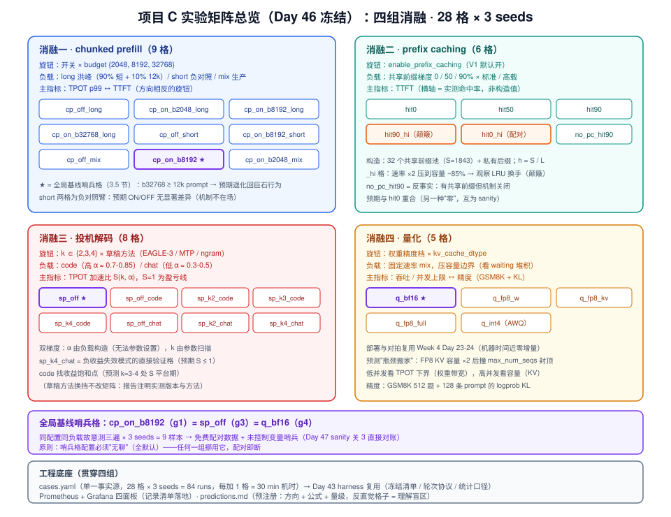
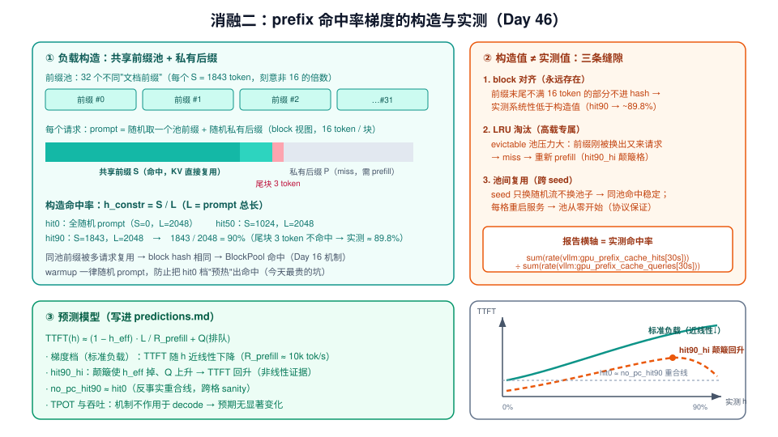
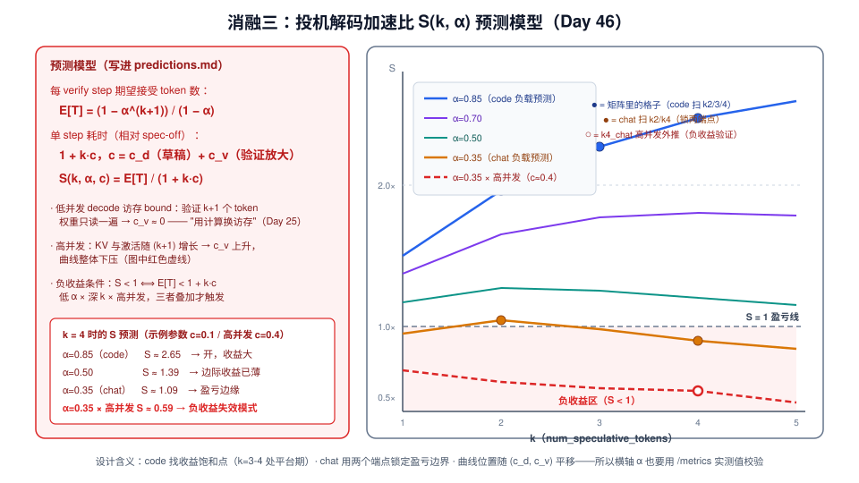
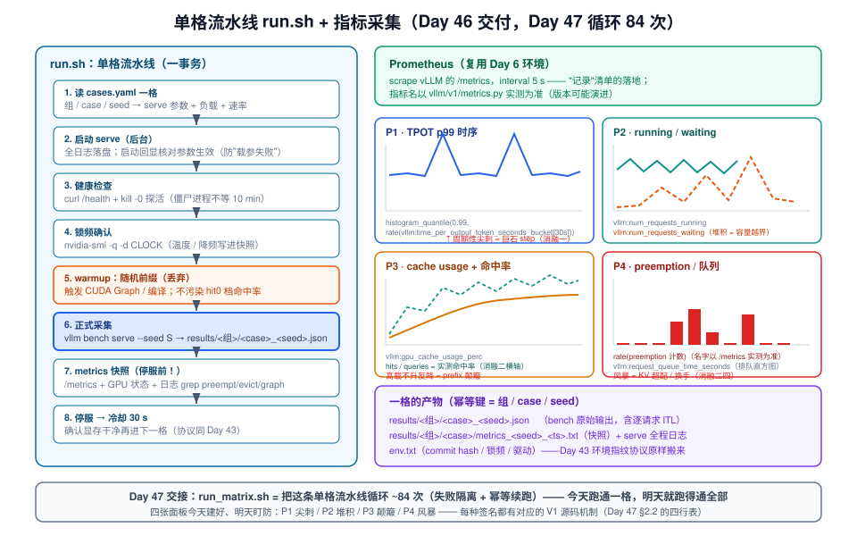

# Day 46：项目 C 启动——四组消融的实验设计

> **系列进度**：第 7 周 · Day 46 / 56 · 项目 C（vLLM 性能消融实验）启动日
> **前置**：项目 A 已收官（Day 43 对比表 → Day 44 边界与对拍 → Day 45 PR）；Day 43 的 benchmark harness（冻结清单、轮次协议、统计口径）与 Day 44 的精度对拍方法今天**整套复用**；四组机制的原理分别来自 Day 11-13（chunked prefill）、Day 16（prefix caching）、Day 25-26（投机解码）、Day 22-24（量化）
> **今日定位**：项目 C 唯一的"纯设计日"，今天一行正式数据都不采。只交付三样东西：**`cases.yaml`（四组消融全矩阵，28 格）、`predictions.md`（每个机制的预测模型）、跑通一格的 `run.sh` + Prometheus/Grafana 看板**。明天（Day 47）起矩阵冻结——只准执行，不准改设计。所有设计的自由度，今天午夜之后全部作废。

项目 A 回答的是"**我的优化有没有用**"，项目 C 回答的是一组更通用的问题："**这些耳熟能详的机制——chunked prefill、prefix caching、投机解码、量化——分别什么时候有用、为什么有用、代价是什么、什么时候会失效**"。这正是 README 第 7 周给 Day 46 定义的题目：四组消融，①chunked prefill 开关 × prompt 长度分布，②prefix caching 命中率梯度，③投机解码接受率-收益曲线，④量化吞吐-精度权衡。

为什么"设计"配得上完整的一天？Day 43 已经给过答案的一半：**偏差是设计问题，噪声才是统计问题**。实验的可信度在按下回车之前就已经被设计决定了——负载构造错了，跑得再多也是系统性错误；少控制一个变量，84 个 run 全部作废。还有另一半原因更隐蔽：**如果先看数据再定假设，你就在做事后选择**（先射箭后画靶）。科学方法里对付它的手段叫预注册（pre-registration）——今天写下的 `predictions.md` 就是实验的预注册文档：跑之前把每个机制的预期方向、量级和公式白纸黑字写死，跑完对照。Day 43 结尾埋的那句话今天兑现：**预测错的地方，就是你理解不到位的地方**——反直觉的格子不是实验失败，是全项目最值钱的产出。

面试场景里这一天的价值最直接。专家岗区分度最高的问题不是"chunked prefill 是什么"，而是"**如果给你一台机器两天时间，你怎么量化这个机制的收益边界**"。能回答它的人，手里必须真的设计过一次。

---

## 一、今日学习目标

1. **把"消融实验"当成受控反事实来设计**：区分普通 benchmark（回答"多快"）与消融实验（回答"何时有效、为何有效、代价与失效边界"），掌握"开关 × 负载"的核心句式
2. **掌握四组消融的统一设计语法**：机制 → 旋钮 → 负载 → 主指标，能把任何一个推理系统机制翻译成这个四件套
3. **学会预测先行**：为四组机制各写一个可证伪的预测模型（公式 + 方向 + 量级），落成 `predictions.md`
4. **设计出可执行的实验矩阵**：`cases.yaml` 定义 28 格（9 + 6 + 8 + 5），理解每个格子的存在理由、全局基线"哨兵格"的配对逻辑、以及"每加一格 ≈ 30 分钟机器时间"的设计经济学
5. **搭好指标采集**：Prometheus 抓取 + Grafana 四面板（TPOT/ITL 时序、running/waiting、cache usage 与命中率、preemption/队列），跑通一格的完整流水线并 dry-run 全矩阵参数
6. **产出**：`project-c/` 目录（cases.yaml、traffic_gen.py、run.sh、warmup.py、监控配置）+ `predictions.md`——Day 47 直接在此基础上批量执行

---

## 二、核心概念

### 2.1 消融实验 = 受控的反事实

普通 benchmark 与消融实验的差别，用一张表说清：

| | 普通 benchmark（Day 6、Day 43 的场景矩阵） | 消融实验（项目 C） |
|---|---|---|
| 回答的问题 | 这个配置/版本多快？ | 这个**机制**何时有效、为何有效、代价与失效边界？ |
| 自变量 | 版本（baseline vs optim） | 机制的旋钮（开关、档位）× 负载形状 |
| 因变量 | TPOT / TTFT / 吞吐 | 同上，但重点是**随旋钮变化的曲线形状** |
| 结论形态 | "快了 x%" | "收益在区间 [a,b] 内单调，超过 b 失效；代价是指标 Y 恶化" |
| 面试讲法 | 我做了个优化 | 我能告诉你什么时候**不要**开这个功能 |

反事实（counterfactual）是关键词：消融一格的含义是"**如果关掉这个机制，其他一切不变，指标会怎样**"。这要求格子之间**只差旋钮本身**——serve 参数、负载、协议、seed 策略全部对齐。"其他一切不变"不是口号，是 2.4 节的三张清单。

### 2.2 统一语法：机制 → 旋钮 → 负载 → 主指标

四组消融共用一套语法。设计任何一组消融，先把这张四件套填出来：

| 组 | 机制（回顾） | 旋钮（serve 参数） | 负载（构造的形状） | 主指标 |
|---|---|---|---|---|
| **消融一** chunked prefill | 长 prompt 的 prefill 会独占 step，把同 step 的 decode 整体推迟（Day 11） | `enable_chunked_prefill` 开关 × `max_num_batched_tokens`（budget） | 长 prompt 洪峰混入短 prompt decode 流 | **TPOT p99**（尾延迟）↔ TTFT（代价） |
| **消融二** prefix caching | 共享前缀的 KV block 可跨请求复用，命中部分跳过 prefill（Day 16） | `enable_prefix_caching` 开关（V1 默认开） | 共享前缀占比构造出 0%→90% 梯度 | **TTFT**（首 token 直接少算） |
| **消融三** 投机解码 | 草稿批量猜 k 个、目标模型一次验证，用计算换访存（Day 25） | `num_speculative_tokens`（k）× 草稿方法 | 代码补全（高接受率）vs 开放对话（低接受率） | **TPOT / 每 token 成本** |
| **消融四** 量化 | 权重/KV 字节变小：decode 访存下界下降、KV 容量上升（Day 2、22-23） | 权重精度档 × `kv_cache_dtype` | 固定速率的混合负载，压容量边界 | **吞吐 / 并发上限** ↔ 精度 |

注意每一组都刻意配了**两个方向相反的指标**。Day 1 的第一性原理在这里反复兑现：没有免费的旋钮，只有可调的权衡——chunked prefill 拿 TTFT 换 TPOT 尾延迟，投机解码拿计算换时延但在低接受率下倒贴，量化拿精度换容量与带宽。只报单侧指标的消融报告，等于给机制做广告。

### 2.3 预测先行：`predictions.md` 是实验的预注册

Day 43 的场景矩阵里你已经小规模用过"跑之前写机制预期"。今天把它升级为整个项目的纪律：

1. **跑之前**，为每格/每条曲线写三行：预期**方向**（↑/↓/不变）、**公式**（为什么）、**量级**（大概多少）
2. **跑完之后**，逐条标注 ✔（符合）/ ✘（反直觉），**反直觉的格子列出归因**："我的模型缺了什么"
3. 报告（Day 48）里保留这张对照表——它证明你的结论不是事后编的故事

预测模型的数学在第四节展开。这里先记住它的作用机制：**预测把你的隐式理解显式化，实验来裁决它**。没有预测的实验只能产生数据，有预测的实验才产生知识。

### 2.4 变量三清单：冻结 / 操纵 / 记录

"其他一切不变"要落成三张清单，写进 `cases.yaml` 顶部注释，跑实验期间任何人（包括未来的你）不得增删：

| 清单 | 内容（本项目） | 违反后果 |
|---|---|---|
| **冻结**（不许变） | vLLM 版本（commit hash）、模型 checkpoint、GPU 锁频状态、`max_num_seqs` 等未列入旋钮的全部 serve 参数、bench 工具与协议（Day 43：warmup 丢弃 / 轮间冷却 30 s / 每 seed 重启服务）、机器独占（无其他进程） | 引入未控制变量 → 跨格比较失去意义 |
| **操纵**（实验变量） | 每组的旋钮（见 2.2）× 负载文件 × seed（1/2/3，控制请求序列随机性） | 多操纵一个 → 因果链断裂，无法归因 |
| **记录**（被动观测） | 环境指纹、`/metrics` 快照、引擎日志、GPU 温度与频率、实测命中率/接受率 | 没记录 → 异常无法分诊（Day 47 的盯防建立在它之上） |

> **坑位提示（今天最贵的一个）**：warmup 请求必须用**随机 prompt**。如果 warmup 用了共享前缀的请求，消融二的 0% 命中率档会被"预热"出命中——梯度从第一格就是错的，而且这种错误在聚合数据里完全看不出来，只有对着 `/metrics` 里的 `vllm:gpu_prefix_cache_hits` 才能发现。`warmup.py` 从第一天就要带 `--random-prefix`。

### 2.5 构造值 vs 实测值：横轴必须用实测

四组消融里有两个"看起来是自变量、其实应作因变量校验"的量：**prefix 命中率**与**投机解码接受率**。你构造的是负载形状（共享前缀占比、负载类型），但报告横轴必须用 `/metrics` 实测值：

- 构造命中率 90%，实测可能是 82%——block 对齐取整（16 token 一块，前缀末尾不满一块的部分不命中）+ 高负载下的 LRU 淘汰都会吃掉命中率
- 代码负载"理论接受率 0.8"，实测 `vllm:spec_decode_acceptance_rate`（沿用 Day 25 §4.4 的指标表）可能是 0.68——n-gram 命中依赖具体语料

Day 48 写报告时这条会再次出现（"实测命中率 = 消融二的横轴（不是构造值！）"）。设计阶段的任务：**每个梯度档位跑完都能从 metrics 里算出实测值**，构造值只用于分组标签。这也是为什么 2.4 的"记录"清单里 metrics 快照是必选项。

### 2.6 全矩阵总览



**读图**：四个颜色区块是四组消融，每组标注了旋钮、负载与格子数；底部横条是三份贯穿全局的工程底座——`cases.yaml`（单一事实源）、Day 43 harness（协议复用）、Prometheus/Grafana（记录清单的落地）。注意中间的**全局基线"哨兵格"**：`cp_on_b8192`（消融一）、`sp_off`（消融三）、`q_bf16`（消融四）是三个**配置与负载完全相同**的格子，故意重复三次——它们是检查未控制变量的免费哨兵（3.5 节展开）。

---

## 三、原理深入：四组消融逐组设计

### 3.1 消融一：chunked prefill 开关 × budget × prompt 长度分布

**机制回顾**（Day 11）：V1 调度器把 prefill 和 decode 混排在同一个 step。chunked prefill 开启时，长 prompt 按 `max_num_batched_tokens`（budget）切块，每 step 只进一块；关闭时（或 budget ≥ prompt 长度时），一个 12k prompt 整块进 step——所有 running 请求的 decode 集体停摆一个"巨石 step"。

**负载构造**是这组的灵魂，三种 prompt 长度分布：

- `long`（长 prompt 洪峰）：90% 短 prompt（256 token 输入 / 1024 输出）构成背景 decode 流 + 10% 长 prompt（12k 输入 / 64 输出）以泊松到达混入——长 prompt 平均每 ~2.5 s 落进来一个，制造周期性干扰
- `short`（负对照）：纯短 prompt 流。"巨石"根本不存在（prompt < budget），开关理应无差异——**没有这一行，"chunked prefill 有收益"就是过度概括**（Day 48 报告里它就是"负载依赖"结论的证据行）
- `mix`（生产参照）：sonnet/ShareGPT 式混合长度，报生产形态下的净收益

**9 格**：

| 格子 | serve 侧 | 负载 | 存在理由 |
|---|---|---|---|
| `cp_off_long` | 关 chunk（budget ≥ 16k） | long | 巨石 step 的直接观测——TPOT p99 预计秒级 |
| `cp_on_b2048_long` | budget=2048 | long | budget 紧档：尾延迟最好、TTFT 最差 |
| `cp_on_b8192_long` | budget=8192（默认） | long | budget 扫描中点 |
| `cp_on_b32768_long` | budget=32768 | long | budget ≥ prompt 长度 → chunking 无从发力，**预期退化回巨石行为**（最有教学价值的一格） |
| `cp_off_short` | 关 chunk | short | 负对照臂 A |
| `cp_on_b8192_short` | budget=8192 | short | 负对照臂 B（与 A 配对：预期无显著差异） |
| `cp_off_mix` | 关 chunk | mix | 生产形态 OFF 臂 |
| `cp_on_b8192` | budget=8192 | mix | **全局基线哨兵格**（默认配置 + mix，见 3.5） |
| `cp_on_b2048_mix` | budget=2048 | mix | budget 收紧在真实负载上的旋钮效应 |

> **版本注意**：V1 的 chunked prefill 默认开启，且新版本有逐步收紧关闭开关的趋势。若你的版本不支持关闭（或要求 budget ≥ `max_model_len`），用 `budget=32768 ≥ 12k prompt` 作为功能等价的"巨石档"——这正好就是 `cp_on_b32768_long` 这格的语义。启动后必须在日志里回显确认参数生效（Day 47 的 dry-run 会统一检查）。

主图（Day 48 将画）四个点就来自前四格：x 轴 budget（OFF 作为参考点），左 y 轴 TPOT p99、右 y 轴 TTFT p50——两条曲线方向相反，是全报告最"性能工程"的一张图。

### 3.2 消融二：prefix caching 命中率梯度

**机制回顾**（Day 16）：请求进来时 `KVCacheManager.get_computed_blocks()` 对 prompt 逐 block 算 hash 查 `BlockPool`，命中部分的 KV 直接复用、prefill 从未命中处开始算。收益集中在 TTFT（少算 prefill），decode 不受益。

**命中率梯度的构造方法**（核心代码在 5.3）：



**读图**：左侧是共享前缀池——32 个不同的"文档前缀"（各 1843 token，故意取非 16 的倍数，让 block 对齐效应可见），每个请求的 prompt = 从池里随机取一个前缀 + 私有随机后缀。构造命中率 h 由前缀占比决定：$h_{constr} = S / L$。右侧是构造值与实测值的三条缝隙：block 对齐（前缀末尾不满 16 token 的部分不命中）、LRU 淘汰（高负载下前缀池换手）、跨 seed 的池子重复使用。**报告横轴用实测**（2.5 的纪律）。

**6 格**：

| 格子 | 构造命中率 | 负载强度 | 存在理由 |
|---|---|---|---|
| `hit0` | 0%（全随机 prompt） | 标准 | 梯度零点：无缓存收益的 TTFT 基线 |
| `hit50` | 50%（S=1024 / L=2048） | 标准 | 梯度中点 |
| `hit90` | 90%（S=1843 / L=2048） | 标准 | 梯度高点 |
| `hit90_hi` | 90% | 高（速率 ×2，压到容量 ~85%） | **颠簸观察格**：evictable 池 LRU 压力大，预期实测命中率掉、TTFT 回升——"收益与命中率非线性"的直接证据 |
| `hit0_hi` | 0% | 高（同上） | 配对对照：区分"高负载本身慢"与"缓存换手额外慢" |
| `no_pc_hit90` | 90% 构造，`--no-enable-prefix-caching` | 标准 | **反事实对照**：同样的 90% 前缀负载，如果没有这个机制会怎样——它应与 `hit0` 几乎重合（防"梯度其实是负载差异"的质疑） |

> **提示**：`hit0` 与 `no_pc_hit90` 是两种不同的"零"：前者物理上没有共享前缀（缓存开着也无事可做），后者有共享前缀但机制关闭。两者 TTFT 若不重合，说明有未控制变量——又一道免费的 sanity 关。

### 3.3 消融三：投机解码接受率-收益曲线

**机制回顾**（Day 25）：draft 猜 k 个 token，target 一次 forward 验证 k+1 个，接受多少留多少。低 batch decode 是访存 bound，验证 k+1 个 token 的访存与 1 个几乎相同（权重只读一遍）——"用计算换访存"。收益由接受率 α 和 k 共同决定。

**双梯度设计**：

- **α 梯度来自负载**（无法用参数设置，只能靠语料构造）：
  - `code`（代码补全负载）：高度重复的语法结构、标识符复用 → 高接受率（预测 α ≈ 0.7-0.85）
  - `chat`（开放对话负载）：自然语言多样性高 → 低接受率（预测 α ≈ 0.3-0.5）
- **k 梯度来自参数**：`num_speculative_tokens` ∈ {2, 3, 4}（code 全扫，chat 扫 {2, 4}）

**8 格**：

| 格子 | 配置 | 负载 | 存在理由 |
|---|---|---|---|
| `sp_off` | spec 关闭 | mix | **全局基线哨兵格**（= `cp_on_b8192` = `q_bf16`，见 3.5） |
| `sp_off_code` | spec 关闭 | code | code 负载的零点（加速比分母） |
| `sp_k2_code` / `sp_k3_code` / `sp_k4_code` | k=2/3/4 | code | 高 α 下的 k 扫描：找收益饱和点 |
| `sp_off_chat` | spec 关闭 | chat | chat 负载的零点 |
| `sp_k2_chat` / `sp_k4_chat` | k=2/4 | chat | 低 α 下的 k 扫描：**k4 预期逼近甚至跌破 1.0——负收益失效模式的直接验证**（Day 26 见过，今天给它定量） |

> **版本注意**：草稿方法按可得性选：首选 EAGLE-3（需对应模型的 draft checkpoint）；拿不到就换 MTP（模型自带）或 **ngram（零额外权重，`{"method": "ngram"}`）**。设计上抽象为 `(method, k)`，换方法不换矩阵；报告必须注明实测版本与方法。加速比上限还受并发放大效应影响（4.3 的模型里体现为 $c_v$ 随 batch 增大），这就是为什么 chat 的 k4 格预期是负收益。

### 3.4 消融四：量化吞吐-精度权衡

**机制回顾**（Day 2 + Day 22-23）：decode 理论时延下界 ≈ 模型参数字节数 / HBM 带宽——权重字节减半，下界减半；KV 每 token 字节减半，同样 KV 池容量翻倍、并发上限翻倍。代价在精度。四联指标：**TPOT / 吞吐 / 显存与并发上限 / 精度**。

**5 格**（直接复用 Week 4 Day 23-24 的部署与对拍脚本，机器时间几乎零增量）：

| 格子 | 权重 | KV cache | 存在理由 |
|---|---|---|---|
| `q_bf16` | BF16 | BF16 | **全局基线哨兵格** + 容量基准线 |
| `q_fp8_w` | FP8（W8A8，Day 24 的 checkpoint） | BF16 | 单独看"权重减半"：低并发 TPOT、TTFT |
| `q_fp8_kv` | BF16 | FP8（`--kv-cache-dtype fp8_e4m3`） | 单独看"KV 减半"：并发上限、高并发 TPOT |
| `q_fp8_full` | FP8 | FP8 | 两者叠加 |
| `q_int4` | INT4（AWQ/GPTQ W4A16） | BF16 | 激进档：最快，但预期精度掉得最多 |

**容量观测方法**（Day 47 将用它盯 waiting 深度）：固定 request rate 的 mix 负载，看哪一档最先出现 `num_requests_waiting` 单调爬升——堆积起点右移多少，就是该档位买来的容量。注意一个可预测的"瓶颈搬家"：FP8 KV 让容量 ×2 之后，**并发上限可能撞上 `max_num_seqs` 的默认值**（256）而封顶——Day 48 报告要讲的就是这条。

**精度协议**（Day 44 的三层对拍降级为两件）：① 任务指标：GSM8K few-shot（512 题，报 accuracy ± 抽样误差）；② 分布指标：固定 128 条 prompt 的输出 logprob 与 BF16 基线的 KL 散度。两件都落在每格的 eval 结果里，与性能数字同表呈现。

### 3.5 全局基线哨兵格：一个故意重复三次的格子

`cp_on_b8192`（消融一）、`sp_off`（消融三）、`q_bf16`（消融四）三个格子，**serve 配置、负载文件、速率、seed 策略完全相同**（chunk on + budget 8192 + prefix on + spec off + BF16 + mix 负载）。三个组各自"拥有"一格的原因：

1. **免费配对数据**：同一物理配置测三遍 × 3 seeds = 9 个样本。Day 47 的 sanity 关 3（跨格一致性）直接拿它们对账——TPOT 应落在彼此 ±σ 内。**不一致比性能差更严重**：它意味着存在未控制变量（温度？缓存残留？某个脚本悄悄改了参数？），全矩阵的可信度都要重新审
2. **叙事锚点**：四组消融各自有不同的负载，报告需要一个所有组都测过的"共同原点"，让跨组结论可以挂在同一个数字上
3. **成本可控**：多花 2 格 × 3 seeds × ~10.5 min ≈ 1 小时机时，买全矩阵的置信度审计——设计经济学上极其划算

> **原则**：哨兵格的配置必须"无聊"——全默认、无任何旋钮。任何一组把它挪用作别的用途（比如顺手改个参数），配对就断了。

---

## 四、数学推导：写进 predictions.md 的四个预测模型

本节所有数字按 **Qwen3-8B @ A100-80G** 的量级自洽构造（有效 prefill 吞吐 ~10k tok/s、HBM ~2 TB/s、KV 池 ~60 GB），作为**预测量级**使用——它们不是实验结果，是用来被实验裁决的假设。跑出来对不上，先怀疑模型，再怀疑机器，最后怀疑自己。

### 4.1 消融一：巨石 step 与 budget 的两难

**TPOT 尖刺上界**（核心公式，Day 11 的定量版）：

$$T_{spike} = \frac{\min(L_{peak},\ B)}{R_{prefill}}$$

长 prompt 落进 step 的那一刻，同 step 所有 decode 请求的该次迭代被推迟 $T_{spike}$：

| 档位 | 计算 | $T_{spike}$ | TPOT p99 预测量级 |
|---|---|---|---|
| OFF（budget ≥ 12k） | 12288 / 10000 | **≈ 1.2 s** | 秒级尖刺，直方图双峰 |
| ON, B=2048 | 2048 / 10000 | **≈ 0.21 s** | ~200-300 ms |
| ON, B=8192 | 8192 / 10000 | **≈ 0.82 s** | ~500-800 ms |
| ON, B=32768 | min(12288, 32768) = 整块 | **≈ 1.2 s（退化回 OFF）** | ≈ OFF |

第四行是整组最有教学价值的预测：**budget 超过典型 prompt 长度后，chunking 无从发力**——切刀还在，但再没有东西需要切。它把"chunked prefill 的收益条件"从一句口号变成一个可测的分界点。

**TTFT 代价**（为什么是旋钮而不是免费午餐）：一个 12k prompt 在 B=2048 下要切成 6 个 chunk、分散进 6 个 step。计算量守恒（还是要算 12k token），但每个 step 还要携带 decode token、付出调度与 kernel 启动开销，有效 prefill 吞吐下降：

$$R_{eff}(B) \approx R_{prefill} \cdot \frac{B}{B + d} \cdot \eta_{sched}(B), \quad TTFT(B) \approx \frac{L}{R_{eff}(B)} + Q$$

其中 $d$ 是每 step 的 decode token 数（≈ running batch 大小），$\eta_{sched}$ 是每 step 固定开销与 kernel 效率因子，$B$ 越小它越差。预测量级：TTFT p50 从 OFF 的 ~1.4 s 恶化到 b2048 的 **~2.5-3 s**，b8192 ~2 s，b32768 回落至 ~1.5 s——**与 TPOT 曲线方向相反**。同一个 $T_{spike}$ 数字，同时进入两个指标且方向相反，这就是"旋钮"的物理含义。

**predictions.md 预测行（消融一）**：

| 曲线 | 预测 |
|---|---|
| TPOT p99 vs budget（long 负载） | U 型：b2048 最低，b32768 回到 OFF 水平；short 负载 ON/OFF 无差异 |
| TTFT p50 vs budget | 单调上升（B 越小越慢）；OFF 反而最快 |
| mix 负载 | 介于两者之间，ON/OFF 差距小于 long 负载 |

### 4.2 消融二：命中率、TTFT 与换手条件

**实测命中率上界**（block 对齐）：block 大小 $b=16$，前缀 $S$ token 中能命中的部分是整块数：

$$h_{meas} \le \frac{\lfloor S/b \rfloor \cdot b}{L}$$

hit90 档：$\lfloor 1843/16 \rfloor \times 16 = 1840$，$1840/2048 = 89.8\%$——**构造 90%，实测上界 89.8%**，剩下看淘汰。这条公式让"实测 < 构造"从经验变成算术。

**TTFT 模型**：命中部分跳过 prefill 但 KV 已就位（Day 16 的 `get_computed_blocks` 语义）：

$$TTFT(h) \approx (1-h)\cdot\frac{L}{R_{prefill}} + Q(h)$$

预测：hit0 → hit90，prefill 计算量线性降 10 倍，但 TTFT 里有排队项与固定开销，实测降幅预计 **5-8 倍而非 10 倍**；TPOT 与吞吐无显著变化（机制不作用于 decode）。

**换手（颠簸）条件**：前缀工作集与 running 请求的 KV 占用之和逼近池容量时，LRU 开始换手：

$$WS(M) + KV_{running}(n) \to C_{pool}: \quad WS = M \cdot S \cdot s_{tok}$$

32 个池 × 1843 token × 144 KiB/token ≈ **8.2 GB**，对 60 GB 池余量很大——**在你的具体配置上 hit90_hi 可能不出现颠簸**。这不是设计失败，predictions.md 里把两种结局都写上：若不颠簸，结论是"该配置下 prefix caching 无淘汰压力"（本身是有价值的容量结论）；若要逼出颠簸，把池数 M 加到 200+（WS ~52 GB）或换小显存卡。**条件性预测写清楚触发条件，才是合格的预注册。**

### 4.3 消融三：加速比曲面与负收益区

Day 25 的收益公式，今天展开成可扫描的模型。每 verify step 期望接受的 token 数（几何级数，接受率 α）：

$$E[T] = \frac{1-\alpha^{k+1}}{1-\alpha}$$

单 step 相对成本：草稿 $k$ 次（成本 $c_d$/次）+ 验证放大（$(k+1)$ 个 token 进 target，成本 $c_v$/token）：

$$\boxed{S(k,\alpha,c) = \frac{(1-\alpha^{k+1})/(1-\alpha)}{1+k\,(c_d+c_v)}}$$



**读图**：四条实线是 c=0.1（低/中并发）时 α 从 0.85 到 0.35 的曲线族，红色虚线是高并发（c≈0.4）下 chat 曲线的下压形态；S=1 盈亏线以下涂红。低并发时 $c_v \approx 0$（decode 访存 bound，验证 k+1 个 token 权重只读一遍——Day 25"用计算换访存"的数学表达）；高并发时 KV 与激活随 token 数增长，$c_v$ 上升，整族曲线下压。**负收益条件 $S<1 \iff E[T] < 1+k\,c$，由低 α × 深 k × 高并发三者叠加触发**——单一因素都不够，这解释了为什么 Day 26 的失效模式只在特定负载出现。

关键量级（k=4，c=0.1）：α=0.85 → S≈2.65（code，值得开）；α=0.50 → S≈1.39（边际已薄）；α=0.35 → S≈1.09（盈亏边缘）；α=0.35 × 高并发 c=0.4 → **S≈0.59（负收益）**。矩阵里 `sp_k4_chat` 就是奔着验证最后一行去的。

> **注意**：α 本身也是实测值（`/metrics` 的 spec decode 接受率指标，沿用 Day 25 §4.4 的表）。若 code 负载实测 α 只有 0.6，整条曲线上移的幅度要重算——所以报告里 S 曲线的横轴坐标用实测 α 标注。

### 4.4 消融四：容量、带宽与瓶颈搬家

**KV 容量模型**（Day 2 公式的直接应用，数字与 Day 47 §4 对齐）：Qwen3-8B（36 层、8 KV 头、head_dim 128）BF16 下 $s_{tok} = 2\times36\times8\times128\times2\,B = 144\,\text{KiB/token}$。A100-80G：权重 ~16 GB，KV 池 ~60 GB → 容量 ≈ 43.5 万 token；mix 负载每请求 $L_p+L_o \approx 2304$ → 并发上限：

$$n^* = \frac{C_{pool}}{s_{tok}\,(L_p+L_o)} \approx 189 < \text{max\_num\_seqs}=256$$

**并发上限由 KV 容量而非 `max_num_seqs` 决定**。FP8 KV：$s_{tok}$ 减半 → $n^* \approx 378$，**但会被 `max_num_seqs=256` 封顶**——预测"瓶颈搬家"：容量收益兑现到 256 为止，waiting 堆积起点右移但移到 256 处停住。想兑现全部容量收益，需要同步上调 `max_num_seqs`（那是矩阵外的后续实验，报告里作为建议提出）。

**decode 带宽下界**（Day 2）：TPOT 下界 = 权重字节 / HBM 带宽：

| 档位 | 权重字节 | TPOT 下界 | 低并发 TPOT 预测（下界 × 2-3 的开销系数） |
|---|---|---|---|
| BF16 | ~16 GB | 8.0 ms | ~16-25 ms |
| FP8 权重 | ~8 GB | 4.0 ms | ~12-18 ms（**预测 -20%~-30%**） |
| INT4 | ~4.5 GB | ~2.3 ms | 最快，但精度代价最大 |

高并发时 KV 读流量占比上升，权重量化的收益被稀释、KV 量化的收益上升——这就是 `q_fp8_w` 与 `q_fp8_kv` 必须分开设格的原因：**它们作用于不同的瓶颈**。精度预测：FP8（权重或 KV）GSM8K 变化 ≤ 1 pt、KL 散度小；INT4 掉 1-3 pt（对拍协议见 3.4）。

### 4.5 predictions.md 的落地格式

```markdown
## 消融一 · chunked prefill
| 曲线/格子 | 指标 | 预期 | 量级（依据） | 依据日 |
|---|---|---|---|---|
| cp_off_long | TPOT p99 | 秒级尖刺 | T=L/R≈1.2s（§4.1） | Day 11 |
| cp_on_b32768_long | TPOT p99 | ≈ OFF | B≥L → 退化（§4.1） | Day 11 |
| cp_off/on_short | TPOT p99 | 无显著差异 | 机制不在场（负对照） | Day 13 |
...
## 消融二 · prefix caching
| hit90 | TTFT | ↓ 5-8 倍 | (1-h)L/R + Q（§4.2） | Day 16 |
| hit90_hi | 实测命中率 | 条件性下降 | WS+KV_run→C_pool（§4.2，两种结局都写） | Day 16 |
...
（消融三、四同理；Day 47 跑完在右侧加"实测 / ✔✘ / 归因"三列）
```

---

## 五、关键代码：从 cases.yaml 到单格流水线

先看今天全部交付物的关系图：



**读图**：左侧是 `run.sh` 的八步单格流水线（一事务），右侧是 Prometheus 抓取 + Grafana 四面板（"记录"清单的落地）与每格产物。今天的目标是**把这条流水线跑通一格**——Day 47 的 `run_matrix.sh` 只是把左半边循环 ~84 次并加上失败隔离与幂等续跑。

### 5.1 目录结构（全部进版本控制）

```text
project-c/
├── cases.yaml              # 单一事实源：28 格全矩阵（今天的主角）
├── traffic_gen.py          # 负载构造（输出形状完全由 seed 决定）
├── traffic/                # 生成的数据集（g1_long.jsonl / g2_hit90.jsonl / ...）
├── run.sh                  # 单格流水线（今天跑通一格）
├── warmup.py               # 随机前缀 warmup（--random-prefix 是硬要求）
├── dryrun.sh               # 全矩阵参数校验（只启动不压测）
├── monitor/
│   ├── prometheus.yml      # 抓取 vLLM /metrics
│   └── dashboards/         # Grafana 四面板
├── predictions.md          # 预注册（第四节模型）
└── results/                # 明天才开始填充
```

### 5.2 cases.yaml：28 格全矩阵

```yaml
common:
  model: /models/Qwen3-8B
  port: 8100
  seeds: [1, 2, 3]                 # 关键格 Day 48 可补到 5
  protocol:                        # Day 43 协议原样冻结
    warmup_requests: 8             # 随机前缀，丢弃
    cooldown_s: 30
    restart_per_seed: true         # 复位 prefix cache / block pool
    snapshot_metrics: true

groups:
  g1_chunked:                      # 9 格
    serve_extra: "--max-num-seqs 256"
    cells:
      - {name: cp_off_long,       serve: "--no-enable-chunked-prefill --max-num-batched-tokens 32768", bench: "--dataset-name sharegpt --dataset-path traffic/g1_long.jsonl --request-rate 4 --num-prompts 900"}
      - {name: cp_on_b2048_long,  serve: "--max-num-batched-tokens 2048",  bench: "traffic/g1_long.jsonl @4 900"}
      - {name: cp_on_b8192_long,  serve: "--max-num-batched-tokens 8192",  bench: "traffic/g1_long.jsonl @4 900"}
      - {name: cp_on_b32768_long, serve: "--max-num-batched-tokens 32768", bench: "traffic/g1_long.jsonl @4 900"}
      - {name: cp_off_short,      serve: "--no-enable-chunked-prefill --max-num-batched-tokens 32768", bench: "traffic/g1_short.jsonl @4 900"}
      - {name: cp_on_b8192_short, serve: "--max-num-batched-tokens 8192",  bench: "traffic/g1_short.jsonl @4 900"}
      - {name: cp_off_mix,        serve: "--no-enable-chunked-prefill --max-num-batched-tokens 32768", bench: "traffic/g4_mix.jsonl @8 900"}
      - {name: cp_on_b8192,       serve: "--max-num-batched-tokens 8192",  bench: "traffic/g4_mix.jsonl @8 900"}   # 哨兵格
      - {name: cp_on_b2048_mix,   serve: "--max-num-batched-tokens 2048",  bench: "traffic/g4_mix.jsonl @8 900"}

  g2_prefix:                       # 6 格（全部同负载形状，只变前缀构成）
    cells:
      - {name: hit0,       bench: "traffic/g2_hit0.jsonl  @6 800"}
      - {name: hit50,      bench: "traffic/g2_hit50.jsonl @6 800"}
      - {name: hit90,      bench: "traffic/g2_hit90.jsonl @6 800"}
      - {name: hit90_hi,   bench: "traffic/g2_hit90.jsonl @12 800"}       # 高载：速率 ×2
      - {name: hit0_hi,    bench: "traffic/g2_hit0.jsonl  @12 800"}
      - {name: no_pc_hit90, serve: "--no-enable-prefix-caching", bench: "traffic/g2_hit90.jsonl @6 800"}

  g3_spec:                         # 8 格（speculative-config 的 JSON 随版本，dryrun 校验）
    cells:
      - {name: sp_off,      bench: "traffic/g4_mix.jsonl @8 900"}          # 哨兵格
      - {name: sp_off_code, bench: "traffic/g3_code.jsonl @6 800"}
      - {name: sp_k2_code,  serve: "--speculative-config {\"method\":\"ngram\",\"num_speculative_tokens\":2}", bench: "traffic/g3_code.jsonl @6 800"}
      - {name: sp_k3_code,  serve: "...num_speculative_tokens\":3 ...",   bench: "traffic/g3_code.jsonl @6 800"}
      - {name: sp_k4_code,  serve: "...num_speculative_tokens\":4 ...",   bench: "traffic/g3_code.jsonl @6 800"}
      - {name: sp_off_chat, bench: "traffic/g3_chat.jsonl @6 800"}
      - {name: sp_k2_chat,  serve: "...k=2 ...", bench: "traffic/g3_chat.jsonl @6 800"}
      - {name: sp_k4_chat,  serve: "...k=4 ...", bench: "traffic/g3_chat.jsonl @6 800"}

  g4_quant:                        # 5 格（部署复用 Week 4；模型路径不同故写全）
    cells:
      - {name: q_bf16,     model: /models/Qwen3-8B,                bench: "traffic/g4_mix.jsonl @8 900"}   # 哨兵格
      - {name: q_fp8_w,    model: /models/Qwen3-8B-FP8,            bench: "traffic/g4_mix.jsonl @8 900"}
      - {name: q_fp8_kv,   model: /models/Qwen3-8B, serve: "--kv-cache-dtype fp8_e4m3", bench: "traffic/g4_mix.jsonl @8 900"}
      - {name: q_fp8_full, model: /models/Qwen3-8B-FP8, serve: "--kv-cache-dtype fp8_e4m3", bench: "traffic/g4_mix.jsonl @8 900"}
      - {name: q_int4,     model: /models/Qwen3-8B-AWQ,            bench: "traffic/g4_mix.jsonl @8 900"}
```

> **两个版本注意**：① `--no-enable-chunked-prefill` 在 V1 要求 budget ≥ `max_model_len`（不切块则整 prompt 必须装得进一个 step），所以 OFF 格配 32768；若你的版本干脆移除了关闭开关，用 `cp_on_b32768_long` 的语义替代并在报告注明。② `speculative-config` 的字段名与支持的方法矩阵（ngram / EAGLE-3 / MTP）随版本演进较快，**以 dryrun 实测为准**——这正是 5.5 存在的理由。

### 5.3 traffic_gen.py：负载构造（核心 ~50 行）

```python
#!/usr/bin/env python3
"""负载构造：输出 ShareGPT 格式 JSONL。形状 100% 由 seed 决定（可复现）。"""
import json, random, sys

BLOCK = 16

def rand_tokens(rng, n):                      # 伪 token id 流（0..150000）
    return [rng.randrange(150000) for _ in range(n)]

def gen_prefix_pools(rng, n_pools=32, S=1843):
    return [rand_tokens(rng, S) for _ in range(n_pools)]

def gen_g2(rng, h, n=800, L=2048, n_pools=32):
    """命中率梯度：S = h*L（向下对齐 block），prompt = 池前缀 + 私有后缀"""
    pools = gen_prefix_pools(rng, n_pools)
    S = (int(h * L) // BLOCK) * BLOCK
    for i in range(n):
        prefix = pools[rng.randrange(n_pools)] if S else []
        yield {"conversations": [
            {"from": "human", "value": fake_text(prefix + rand_tokens(rng, L - S))}],
            "output_len": 256}

def gen_g1_long(rng, n=900):
    """长 prompt 洪峰：90% 短(256→1024) + 10% 长(12288→64)，顺序随机"""
    reqs = ([{"prompt_len": 256,  "output_len": 1024}] * int(n * 0.9)
          + [{"prompt_len": 12288, "output_len": 64}]  * int(n * 0.1))[:n]
    rng.shuffle(reqs)
    for r in reqs:
        yield {"conversations": [
            {"from": "human", "value": fake_text(rand_tokens(rng, r["prompt_len"]))}],
            "output_len": r["output_len"]}

def gen_g3(rng, kind, n=800):
    """α 梯度：code = 高重复模板；chat = 开放多样语料（按 seed 采样本地语料，
    无语料时用模板合成：code 重复结构/标识符，chat 主题词驱动）"""
    ...
```

两个设计细节：① `S` 向下对齐 block（§4.2 的 $h_{meas}$ 公式），使构造值与实测上界的差只剩淘汰一项；② 池前缀**跨 seed 复用同一个池**（seed 只换采样次序），而"每格重启服务"保证池从零预热——梯度干净。

> **版本注意**：`vllm bench serve` 的数据集能力（dataset-name / dataset-path / 输出长度控制）随版本演进，本文按"sharegpt + 自定义 dataset-path"写。若你的版本不支持或输出长度不受控，写一个 ~80 行的 aiohttp 薄客户端顶上（泊松到达、逐请求记录 TTFT/ITL）——**协议不变，工具可换**；bench 输出的字段名同样以实测版本为准（Day 47 的 sanity 脚本已做此提示）。

### 5.4 run.sh：单格流水线（今天必须跑通一格）

```bash
#!/usr/bin/env bash
# 用法: bash run.sh <group> <case> <seed>   例: bash run.sh g1_chunked cp_on_b8192 1
set -euo pipefail
G=$1; C=$2; SEED=$3
PORT=8100; OUT=results/$G
mkdir -p "$OUT"
CELL=$(python3 pick_cell.py "$G" "$C")        # 读 cases.yaml → serve 参数 / bench 参数 / 模型路径

# 1-2. 启动 serve（参数原样回显进日志，事后可核对）
vllm serve "$CELL_MODEL" --port $PORT $CELL_SERVE > serve_${G}_${C}.log 2>&1 &
SERVE_PID=$!
# 3. 健康检查：探端口 + 探进程（僵尸不等）
for i in $(seq 1 120); do
  curl -sf "http://127.0.0.1:$PORT/health" >/dev/null && break
  kill -0 "$SERVE_PID" 2>/dev/null || { echo "serve died"; exit 1; }
  sleep 5
done
# 4. 锁频确认
nvidia-smi -q -d CLOCK | grep -A2 "Clocks$" >> "$OUT/env.txt" || true
# 5. warmup：随机前缀（丢弃）—— 防污染 hit0 档
python3 warmup.py --port $PORT --n 8 --random-prefix
# 6. 正式采集
vllm bench serve --url "http://127.0.0.1:$PORT" --seed "$SEED" $CELL_BENCH \
      --output-json "$OUT/${C}_${SEED}.json"
# 7. 快照（停服前！）
{ curl -s "http://127.0.0.1:$PORT/metrics"; nvidia-smi --query-gpu=clocks.sm,temperature.gpu,memory.used --format=csv;
  grep -iE "preempt|evict|recompute|cuda graph" serve_${G}_${C}.log | tail -30; } > "$OUT/metrics_${C}_${SEED}.txt"
# 8. 停服 → 冷却
kill "$SERVE_PID"; sleep 10; kill -9 "$SERVE_PID" 2>/dev/null || true; sleep 30
```

骨架刻意与 Day 43 的 `run_suite.sh` 同构（协议零漂移），Day 47 的 `run_matrix.sh` 将把它产品化（`manifest.tsv` 展开、失败标记、幂等跳过）。

### 5.5 dryrun.sh：全矩阵参数校验

对 28 格各做一次"只启动、健康检查后立即停服"：任何一格参数名不被当前版本支持，会在这里暴露（启动即退出），而不是烧掉明晚的机时。顺带把每格启动日志里的**参数回显**抓出来存 `dryrun_report.txt`——"我以为我设了 budget"和"日志里回显 budget=2048"是两回事。

### 5.6 监控：prometheus.yml + Grafana 四面板

```yaml
# monitor/prometheus.yml（复用 Day 6 的 Prometheus，加一个 scrape job）
scrape_configs:
  - job_name: vllm-ablation
    scrape_interval: 5s
    static_configs:
      - targets: ["localhost:8100"]   # vLLM API server 的 /metrics
```

四面板的查询（面板编号对应流水线图右侧；**指标名以你的版本 `/metrics` 实测输出为准**，V1 指标定义于 `vllm/v1/metrics.py`）：

| 面板 | PromQL 要点 | 盯什么（对应 Day 47 的四类异常签名） |
|---|---|---|
| P1 TPOT p99 时序 | `histogram_quantile(0.99, sum by (le)(rate(vllm:time_per_output_token_seconds_bucket[30s])))` | 周期性尖刺 = 巨石 step（消融一 OFF/b32768 格） |
| P2 running/waiting | `vllm:num_requests_running` / `vllm:num_requests_waiting` | waiting 单调爬升 = 容量越界（消融四档位对比） |
| P3 cache 与命中率 | `vllm:gpu_cache_usage_perc` + `sum(rate(vllm:gpu_prefix_cache_hits[30s])) / sum(rate(vllm:gpu_prefix_cache_queries[30s]))` | 高载下命中率不升反降 = prefix 颠簸（hit90_hi） |
| P4 preemption/队列 | preemption 计数的 `rate()` + `vllm:request_queue_time_seconds` 直方图 | 风暴 = KV 超配 / 抢占回滚（消融二四高载格） |

> **提示**：`/metrics` 若未暴露，检查 API server 启动日志的 route 列表（个别版本需要显式开启 metrics）。P1 依赖的 TTFT/TPOT 直方图是**逐请求**上报的，Grafana 的 30 s 窗口分位数只是粗粒度趋势——精确 p99 以 bench JSON 里逐请求 ITL 数组为准（Day 43 的口径），面板用于**盯现场**而非出报告数字。

---

## 六、与 vLLM V1 的实际联系

四组消融的每个旋钮，都能落到 V1 源码的一个明确位置。这张表是 Day 47 盯曲线、Day 48 写"机制解释"段时的源码锚点清单：

| 旋钮（serve 参数） | 配置落点 | 运行时生效位置（调用链） | 可观测指标 |
|---|---|---|---|
| `enable_chunked_prefill` / `max_num_batched_tokens` | `SchedulerConfig.chunked_prefill_enabled` / `.max_num_batched_tokens` | `vllm/v1/core/scheduler.py` 的 `Scheduler.schedule()`：处理 waiting 队列时按 budget 截断 prefill 并切 chunk，决定单 step 内 prefill/decode 混排 | step 组成、TPOT 尖刺（bench 逐请求 ITL） |
| `enable_prefix_caching`（V1 默认开） | `CacheConfig.enable_prefix_caching` | `vllm/v1/core/kv_cache_manager.py` 的 `get_computed_blocks()` → `kv_cache_utils.py` 的 `BlockPool` 逐 block hash 查找 + LRU `touch()`；命中部分跳过 prefill、KV 就位 | `vllm:gpu_prefix_cache_hits/queries`、TTFT |
| `speculative-config`（method / num_speculative_tokens） | Scheduler 与 worker 的 spec 配置 | `vllm/v1/spec_decode/`：调度侧按 k 排 draft token，`SpecDecodeWorker`（ngram / EAGLE）出草稿、target 一次验证、按接受长度回滚多余 KV | 接受率指标族（Day 25 §4.4 的表）、TPOT |
| `quantization` / `kv_cache_dtype` | 量化配置 / `CacheConfig.kv_cache_dtype` | `ModelRunner` 加载量化权重（Day 24 的 compressed-tensors 路径）；attention backend 按 dtype 读写 FP8 KV（Day 23） | 显存占用、`gpu_cache_usage_perc`、TPOT、对拍精度 |

把四条链串起来，就是 Day 21 画过的 V1 数据流在"旋钮视角"下的重放：**请求 → `Processor` → `Scheduler.schedule()`（消融一的旋钮在这生效）→ `KVCacheManager` 分配/查 hash（消融二的旋钮）→ `ModelRunner` 执行（消融三的验证步、消融四的量化 kernel 都在这）→ 指标上报（`vllm/v1/metrics.py`）**。消融实验的"机制解释"之所以能闭合到源码，是因为每个旋钮本来就长在链路的某一环上——设计四组消融的过程，就是把这条链路重新走一遍的过程。

> **版本声明**：以上模块/类/函数名按撰写时的 V1 主线描述，`v1/spec_decode` 的目录组织与 `speculative-config` 字段演进较快。以你 checkout 的 commit 为准，dryrun + 启动日志回显是最终裁判——这也是为什么环境指纹（commit hash）是对比表的一部分（Day 43 的纪律）。

---

## 七、动手实验步骤（约 3 小时）

### 上午：矩阵与负载（约 1.5 小时）

1. **建目录骨架**（5 min）：按 5.1 建好 `project-c/`，`git init` 并首 commit——从今天起每个文件的每次修改都可追溯。
2. **写 cases.yaml**（20 min）：按 5.2 全 28 格写完。写完自查三件事：哨兵格三处配置逐字符一致；`g2` 六格的 bench 参数只差数据集/速率；`g4` 的量化档模型路径存在。
3. **写 traffic_gen.py 并生成全部负载**（40 min）：按 5.3 实现 g1/g2/g3/g4 四类，`--seed 42` 生成。校验两条：同一 seed 重跑输出逐字节一致（可复现）；`g2_hit90.jsonl` 抽 10 条 prompt，前 1840 token 相同且属于同一池（构造正确）。
4. **命中率构造 spot check**（20 min）：起一个服务，先 `warmup.py --random-prefix`，再打 50 条 `hit90` 请求，然后 `curl /metrics` 算 `hits/queries`——应 ≈ 89-90%（block 对齐上界）；换 `hit0` 数据集重试（**重启服务**），hits 必须为 0。**这一步不过关，消融二整组作废**。

### 下午：流水线与监控（约 1.5 小时）

5. **跑通一格**（30 min）：`bash run.sh g1_chunked cp_on_b8192 1`。验收：`results/g1_chunked/cp_on_b8192_1.json` 存在且含逐请求 ITL；`metrics_cp_on_b8192_1.txt` 非空；serve 日志里 budget 回显 8192；停服后显存回落干净。
6. **dryrun 全矩阵**（30 min）：`bash dryrun.sh` 扫 28 格，产出 `dryrun_report.txt`。任何一格启动失败 → 当场修 cases.yaml（今天是最后一天允许改矩阵）。
7. **监控四面板**（20 min）：启动 Prometheus + Grafana（Day 6 环境），导入四面板，用第 5 步那一格重跑半分钟负载，确认 P1-P4 都有曲线。顺手把 `predictions.md` 的四组预测行按 4.5 的格式写完。

### 晚间：冻结与交接（约 10 min）

时间预算对账，确认明天怎么排：每 run ≈ 10.5 min（加载 2.5 + 健康与 warmup 1 + bench 6 + 快照/停服/冷却 1），28 格 × 3 seeds = 84 runs ≈ **14.7 h**——一天跑不完且要留补跑余量。排程建议（Day 47 会展开）：白天盯跑异常丰富的消融一、二，夜里挂机械的消融四（复用 Week 4 部署），消融三夹在中间。

**就寝前三项检查点（Day 47 的全部前置）**：

- [ ] `cases.yaml` 全矩阵 28 格，dryrun 全绿
- [ ] `run.sh` 跑通一格，产物三件套齐（JSON + 快照 + 日志）
- [ ] `predictions.md` 写完（方向 + 公式 + 量级 + 依据日）
- [ ] Grafana 四面板打开有数据（P1-P4）

---

## 八、面试高频问题

**Q1：消融实验和普通 benchmark 有什么区别？你怎么设计一组消融？**

> 答：benchmark 回答"这个配置多快"，消融回答"这个机制何时有效、为何有效、代价与失效边界"。设计上我把任何机制翻译成四件套：机制 → 旋钮 → 负载 → 主指标，格子之间只差旋钮本身，并且刻意配两个方向相反的指标（如 chunked prefill 的 TPOT p99 与 TTFT）防止只报单侧。以 chunked prefill 为例：开关 × budget 扫描 × 三种 prompt 长度分布（含一个"机制不在场"的短 prompt 负对照），9 格 × 3 seeds，预测先行。关键是负对照和反事实格——没有它们，"有收益"就是过度概括。

**Q2：为什么坚持"预测先行"？先看数据再总结不行吗？**

> 答：先看数据再定假设等于事后选择——人脑会自动为已见的模式编故事，且无法证伪。预注册把预期（方向、公式、量级）在跑之前写死，跑完逐条对照：符合的证明理解到位，不符合的暴露模型缺口，**反直觉的格子是最值钱的产出**。它同时防另一个工程陷阱：跑完发现"梯度不对"时，如果没有事先声明构造方法，你无法区分是机制如此还是负载构造失败。

**Q3：prefix 命中率梯度怎么构造？构造值和实测值差在哪？**

> 答：构造上用共享前缀池：N 个"文档前缀"，每个请求随机取一个池前缀 + 私有随机后缀，构造命中率 = S/L。差在三处：block 对齐（前缀末尾不满 16 token 的部分不进 hash，构造 90% 实测上界 89.8%）、LRU 淘汰（高载下前缀换手）、以及任何用共享前缀做 warmup 的操作污染。所以报告横轴必须用 `/metrics` 的 hits/queries 实测值，warmup 一律随机 prompt，0% 档跑完要验证 hits=0。

**Q4：投机解码什么时候负收益？给出定量条件。**

> 答：加速比 S = E[T]/(1+k·c)，其中 E[T]=(1-α^{k+1})/(1-α)，c = 草稿成本 + 验证放大。负收益条件 S<1 即 E[T] < 1+k·c，需要低接受率 × 深 k × 高并发三者叠加：α=0.35、k=4、高并发 c≈0.4 时 S≈0.59。单看任何一个因素都不致命——低并发时 c_v≈0（访存 bound，验证 k+1 个 token 权重只读一遍），高 α 时 E[T] 增长快于成本。所以我的实验设计里专门有低 α 负载 × k=4 的格子去验证这条边界。

**Q5：你的矩阵里为什么有三个配置完全一样的格子？**

> 答：全局基线哨兵格——同配置同负载故意测三遍 × 3 seeds。作用有两个：一是免费配对数据，三个组的基线 TPOT 应落在彼此 ±σ 内，不一致说明存在未控制变量（这比性能问题严重，全矩阵可信度都要重审）；二是跨组叙事的共同原点。成本约 1 小时机时，买全矩阵的置信度审计。原则是哨兵格配置必须"无聊"，任何一组挪用它配对就断。

**Q6：28 格 × 3 seeds 约 15 小时跑不完，砍什么？**

> 答：优先级是"砍格不砍 seeds"——n=3 是统计口径的下限，砍成 n=2 会毁掉所有误差棒；砍格按信息量：单调或 U 型关系保端点砍中间（budget 档 2048/8192/32768 砍成 2048/32768 + 机制插值）、消融四复用 Week 4 已有数据。降级路径也预先写好：EAGLE-3 权重拿不到就换 ngram/MTP，设计抽象为 (method, k) 不换矩阵——**降级预案写在设计阶段，而不是半夜现场发挥**。

---

## 九、今日总结

- **消融 = 受控反事实**：格子之间只差旋钮，"其他一切不变"落成冻结/操纵/记录三清单；普通 benchmark 报"多快"，消融报"何时有效、为何、代价与失效边界"
- **统一语法四件套**：机制 → 旋钮 → 负载 → 主指标（且配反向指标）；四组消融 = 把 V1 数据流按旋钮视角重走一遍，每个旋钮都长在链路某一环上
- **预测先行**：`predictions.md` 是预注册——方向 + 公式 + 量级；条件性预测写清触发条件（如 hit90_hi 颠簸依赖工作集与池容量的对比）；反直觉格子 = 理解盲区清单
- **矩阵设计**：28 格（9+6+8+5）× 3 seeds ≈ 84 runs ≈ 14.7 h；每格存在都有理由（负对照、反事实、颠簸观察、退化点）；哨兵格三处重复 = 免费配对 + 未控制变量哨兵
- **四个预测模型**：$T_{spike}=\min(L,B)/R$（b32768 退化回巨石）；$h_{meas}\le\lfloor S/16\rfloor\cdot16/L$（实测<构造是算术）；$S(k,\alpha,c)$（负收益 = 低 α×深 k×高并发）；$n^*=C_{pool}/(s_{tok}\cdot L_{req})$（FP8 KV 容量×2 被 max_num_seqs 封顶）
- **工程底座**：`cases.yaml` 单一事实源；`run.sh` 八步单格流水线（warmup 随机前缀是今天最贵的坑）；dryrun 先扫全矩阵防"载参失败烧整晚"；Prometheus/Grafana 四面板对应四类异常签名
- **明日交接**：Day 47 只做三件事——把矩阵跑完、把异常抓住、可疑点当天重跑；今天结束后的规矩：**矩阵冻结，只准执行不准改**

---

## 十、今日自测题

1. 手算：12k 长 prompt、有效 prefill 吞吐 10k tok/s，budget=2048/8192/32768 下单 step 最长 decode 停摆各是多少？哪个档位在"TPOT p99"与"TTFT"两个指标上方向相反？
2. hit90 档：S=1843、L=2048、block=16，实测命中率的 block 对齐上界是多少？若实测只有 71%，列出两个候选原因和各自的确证方法。
3. α=0.6、k=3、c=0.15：计算 S。若并发升高使 c→0.35，S 变成多少？这对应矩阵里哪个格子的什么风险？
4. BF16 下 n*≈189、max_num_seqs=256：FP8 KV 后并发上限是多少？要兑现全部容量收益还需要动什么参数？这会引入什么新风险？
5. `hit0` 与 `no_pc_hit90` 是两种不同的"零"。各自的含义是什么？若两者 TTFT 不重合，最可能说明什么？
6. warmup 误用了共享前缀请求，会污染哪个格子？如何在事后从 metrics 发现？为什么"每格重启服务"救不了它？

<details>
<summary>参考答案（先自己答再看）</summary>

1. 0.21 s / 0.82 s / 1.2 s（min(12288,32768)=12288，整块 = 退化回 OFF）。方向相反：budget 从 32768 收紧到 2048，TPOT p99 改善（停摆变短）、TTFT 恶化（12k 要切 6 块、有效 prefill 吞吐下降、排队变长）——同一个 $T_{spike}$ 数字同时进入两个指标。
2. 上界 = ⌊1843/16⌋×16/2048 = 1840/2048 ≈ 89.8%。71% 与 89.8% 差 19 pt：① LRU 淘汰（前缀换手）——看 `gpu_cache_usage_perc` 是否贴近 1、日志 evict 行；② 负载构造失败（池采样不均、部分请求拿到冷池）——离线统计各池被引用次数与请求到达间隔。先查梯度构造，再怀疑机制（Day 47 关 1 的顺序）。
3. E[T]=(1-0.6⁴)/0.4=(1-0.1296)/0.4=2.18；c=0.15 → S=2.18/1.45≈1.50；c=0.35 → S=2.18/2.05≈1.06。对应 `sp_k2_chat`/`sp_k4_chat` 的风险：负载实测 α 可能低于预测、且实验并发若高于预期，S 跌破 1 —— 负收益不是开关性质，是三个因素连乘的连续量，所以横轴 α 与并发都要实测记录。
4. n* ≈ 378，但被 max_num_seqs=256 封顶（瓶颈从 KV 容量搬家到调度上限）。需同步上调 max_num_seqs；新风险：更大 running batch 推高 TPOT（batch 增大→逐步转向计算 bound）、调度开销与抢占概率上升——"解一个瓶颈会露出下一个"，收益要对新配置整体重测。
5. hit0 = 物理上无共享前缀（缓存开着无事可做）；no_pc_hit90 = 有共享前缀但机制关闭（反事实）。两者不重合说明存在未控制变量（负载形状、速率、seed 策略有差）——比性能差更严重，需当天查明，因为它们本应是同一条基线。
6. 污染 hit0（及所有低档位）：warmup 把共享前缀写进 BlockPool，正式请求会命中。事后看该格 `vllm:gpu_prefix_cache_hits > 0` 即暴露。"每格重启服务"清的是上一格的缓存，救不了本格 warmup 写入的污染——warmup 内容本身必须随机，这是协议问题不是环境问题。
</details>

---

## 十一、今日产出物

| 产出物 | 验收标准 |
|---|---|
| **`project-c/cases.yaml`** | 28 格全矩阵；dryrun 全绿；哨兵格三处逐字符一致 |
| **`project-c/traffic_gen.py` + `traffic/`** | 同 seed 逐字节可复现；hit90 spot check ≈ 89-90%，hit0 实测 hits=0 |
| **`project-c/run.sh`（跑通一格）** | 产物三件套齐：bench JSON（含逐请求 ITL）+ metrics 快照 + serve 日志（参数回显核对） |
| **`monitor/`（Prometheus + Grafana 四面板）** | P1-P4 有数据；指标名与版本实测核对过 |
| **`predictions.md`** | 四组预测行完整（方向 + 公式 + 量级 + 依据日）；条件性预测写明触发条件 |
| **时间预算表** | 84 runs ≈ 14.7 h 的分组排程（白天盯跑 / 夜里挂机），降级预案写好 |

> **明日预告（Day 47）**：项目 C（二）——批量执行与异常盯防。把今天跑通一格的流水线升级为 `run_matrix.sh`（失败隔离 + 幂等续跑），盯着今天建好的四张面板识别四类异常签名（TPOT 尖刺 / preemption 风暴 / prefix 颠簸 / waiting 堆积），异常现场快照落 `anomaly_log.md`、可疑点当天重跑。记住今天的规矩：**从明天零点起，矩阵冻结，只准执行不准改**——所有设计的自由度，已经在今天的 28 格里用完了。
