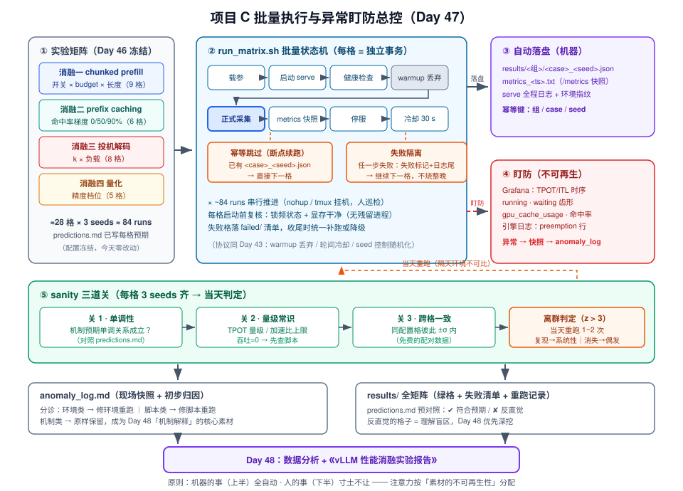
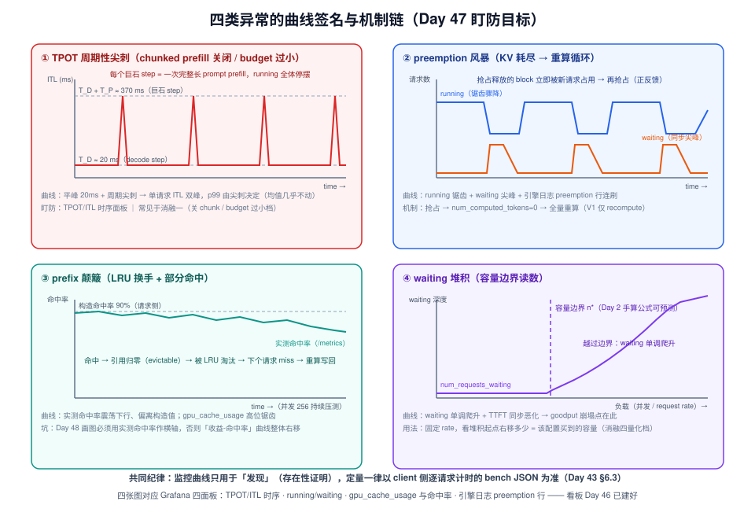
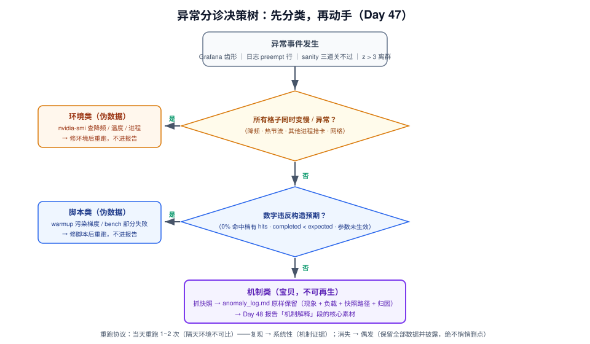

# Day 47：项目 C（二）——批量执行与异常盯防

> **系列进度**：第 7 周 · Day 47 / 56 · 项目 C（vLLM 性能消融实验）执行阶段
> **前置**：Day 46 已交付 `cases.yaml` 全矩阵、`predictions.md` 机制预测、跑通一格的 `run.sh`（底层复用 Day 43 的 benchmark harness 与统计协议）
> **今日定位**：Day 47-48「跑实验 + 出报告」的第一天。实验设计已经冻结，今天不新增任何变量，只做三件事：**把矩阵跑完、把异常抓住、把可疑点当天重跑**。明天报告的深度上限，在今天结束时就已经定死了——数据不全、异常没抓到现场，写作技巧救不回来。

「跑实验」三个字最大的误解是"按下回车等结果"。大规模受控实验里，最值钱的产出从来不是那几百个结果 JSON——数字只能告诉你**是什么**，而实验过程中你亲眼看到的异常现象才能告诉你**为什么**。回忆 Day 13：当时你用长 prompt 洪峰逼出 chunked prefill 的行为，用高并发挤爆 KV 逼出 preemption——那些"现象 → 源码机制 → 指标表现"的三段对照，比任何均值对比表都更能证明你理解系统。今天就是把那次两小时的即兴观察，升级为**覆盖四组消融、全程有据可查的系统化盯防**。

面试场景下差别更明显。同样是讲 prefix caching 消融，一种说法是"命中率 90% 时 TTFT 降了 60%"；另一种说法是"命中率拉到 90% 时我观察到 `num_requests_waiting` 出现锯齿，翻快照发现共享前缀池在 LRU 里高频换手，说明收益开始被淘汰开销吃掉"——后一句话同时包含指标、机制和数据路径，面试官立刻知道你真的跑过、真的看懂了。

所以今天的角色要从**实验设计者**切换成两顶帽子：**SRE 值班员**（盯监控、抓现场、快速分诊）和**实验记录员**（每个异常落一份可追溯的证据）。机器负责跑，你负责看懂。

---

## 一、今日学习目标

1. **把单格流水线升级为批量执行器**：`run_matrix.sh` 读 `cases.yaml` 展开全矩阵 × 3 seeds，具备失败隔离（一格挂掉不烧掉整晚）与幂等续跑（已完成的格子自动跳过）
2. **学会"盯"**：掌握四类高价值异常的曲线特征——TPOT 周期性尖刺、preemption 风暴、prefix 颠簸、waiting 堆积——以及每一类对应的 V1 源码机制
3. **掌握快照取证**：异常发生时刻该抓什么（`/metrics` 快照 + 引擎日志尾 + 当时负载描述），如何落成结构化的 `anomaly_log.md`
4. **建立每格三道 sanity 关**：单调性 / 量级常识 / 跨格一致性，外加异常点的离群判定与**当天重跑**协议
5. **学会时间预算与降级**：估算矩阵总时长决定"白天盯跑 / 夜里挂机"的分组；环境受限时按"砍格不砍 seeds"的优先级收缩矩阵
6. **产出**：`results/` 全矩阵原始数据（JSON + metrics 快照）、`anomaly_log.md`、重跑记录、`predictions.md` 的预对照标注

---

## 二、核心概念

### 2.1 批量执行 = 状态机 + 失败隔离 + 幂等

Day 46 晚间你已经跑通了**一格**的完整流水线（启动 → 健康检查 → warmup → 采集 → 快照 → 停服 → 冷却）。今天要把它复制 ~84 次（约 28 格 × 3 seeds），工程性质就变了：**单格跑通是正确性问题，批量跑通是可靠性问题**。三个性质缺一不可：

| 性质 | 含义 | 没有它会怎样 |
|---|---|---|
| **状态机** | 每格按固定步骤推进，每步有明确的成功判据 | "启动了但没起来"和"起来了但 bench 失败"混在一起，事后无法分诊 |
| **失败隔离** | 一格任何步骤失败 → 落盘失败标记（含日志尾）→ **继续下一格** | 夜里第 5 格 OOM，后面 40 格全部白等；早上看到的是一屏寂寞 |
| **幂等续跑** | `results/` 下已有 `<case>_<seed>.json` → 直接跳过 | 中断后重跑会把已有数据覆盖或重复计时，破坏 3 seeds 的统计口径 |

> **提示**：幂等键 = `组名/case 名/seed` 三元组。检查用 `test -f`，因为 bench 中途崩溃通常**不会**留下完整 JSON——不完整的文件要在启动前清理，否则会被误判为"已完成"。

### 2.2 盯什么：四类高价值异常信号

"人不要离开"不是让你盯着滚动的日志发呆，而是盯**四张 Grafana 面板**（Day 46 已建好），识别四类签名。每类都对应你前六周学过的机制——今天它们从"课本知识"变成"实时演出"：

| 异常 | 曲线 / 日志特征 | 源码机制（回顾） | 常见于哪组消融 | 报告价值 |
|---|---|---|---|---|
| **① TPOT 周期性尖刺** | TPOT p99 时序出现规律性跳变，间隔约等于长 prompt 的到达周期；单请求 ITL 直方图呈双峰 | chunked prefill 关闭时，一个 8k~16k prompt 的 prefill 独占整个 step，所有 running 请求的 decode 集体停摆一个巨石 step（Day 11） | 消融一（关 chunk / budget 过小） | 直接可视化"chunked prefill 收益在尾延迟"——均值几乎看不见，p99 一目了然 |
| **② preemption 风暴** | `num_requests_running` 锯齿状骤降骤升、`num_requests_waiting` 尖峰、日志出现 preemption 行 | KV block 耗尽 → scheduler 抢占 running 尾部请求 → 该请求 `num_computed_tokens` 清零回 waiting → 全量重算（Day 12） | 消融二（prefix 关、cache 换手） / 消融四（BF16 大 KV） | 解释"并发上限由 KV 容量而非 `max_num_seqs` 决定"，是容量规划题的活教材 |
| **③ prefix 颠簸** | `vllm:gpu_prefix_cache_hits/queries` 计算出的命中率在高负载下不升反降、高频抖动 | `BlockPool` 的 evictable 池 LRU 淘汰压力大：共享前缀刚被换出又被请求 → miss → 重新 prefill（Day 16） | 消融二（高并发 × 高命中率档） | "命中率与收益非线性"的最直接证据，也是命中率梯度实验里最容易被忽略的坑 |
| **④ waiting 堆积** | `num_requests_waiting` 单调爬升不回落，TTFT 同步恶化 | token budget 被 running 请求吃满 / KV 无力接纳新请求 → 新请求在 waiting 里积压（Day 10） | 所有组的负载上限附近 | 标定每格配置的实际容量边界——goodput 崩塌点的横坐标 |

> **为什么"值钱"**：矩阵数据回答"开关 A 使指标 X 变化多少"，异常现场回答"这个变化是**通过哪条链路**发生的"。Day 48 写报告时，每节固定的四段里"机制解释"一段，素材全部来自今天抓到的现场。

### 2.3 报告素材的三层结构

把 Day 48 要写的报告素材分层，今天是三层的中枢：

1. **矩阵数据（面）**：`results/` 里的全部 JSON——回答"多大幅度的变化"，靠 runner 自动产出
2. **机制解释（线）**：把变化关联回源码调用链——靠你事后对着 Day 46 的 `predictions.md` 做对照
3. **异常现场（点）**：今天实时抓到的快照与时序——**只有今天能拿到，明天机器关了就没了**

第三层是单向门：矩阵数据可以明天重跑，异常现场不能延时补拍。这就是"人不要离开"的经济学解释——你的注意力应该按**素材的不可再生性**分配，而不是按步骤的复杂度分配。

### 2.4 sanity check：每格跑完的三道关

每格跑完（3 seeds 齐了）立刻过三道关，**异常点当天重跑**——隔天重跑意味着环境已经变了（温度、缓存状态、甚至你改过的脚本），重跑结果和原始数据不可比，成本高得多：

| 关 | 检查内容 | 例子 |
|---|---|---|
| **关 1：单调性** | 机制预期的单调关系是否成立（`predictions.md` 里写的） | TTFT 应随 prefix 命中率档位（0% → 50% → 90%）单调下降；不单调 → 先怀疑梯度构造失败，再怀疑机制 |
| **关 2：量级常识** | 数字是否在物理常识范围内 | decode TPOT 几十 ms 量级（Day 2 的时延下界公式）；投机解码加速比不可能超过 $1+k$ ... 想都别想；吞吐 = 0 或 TPOT = 800 ms → 脚本 bug 或环境事故 |
| **关 3：跨格一致性** | 配置相同的格子之间应一致 | 消融三/四里的 BF16 基线格与消融一的"开 chunk + 默认 budget"格若配置相同，TPOT 应落在彼此 ±σ 内——这是**免费的配对数据**，不一致说明有未控制的变量 |

三道关都过的格子进"绿色清单"；任何一道不过 → 进离群判定（第四节 4.3），判定为可疑 → **当天补跑**。

### 2.5 今日全景图



整张图的骨架：**左**边是 Day 46 冻结的实验矩阵；**中**间是批量执行状态机，两个橙色的旁路（失败隔离、幂等跳过）保证夜里挂机安全；**右上**是自动落盘的数据流；**右下**是你今天的注意力所在——Grafana 盯防与 anomaly log；**底部**是每格跑完后的 sanity 三道关与重跑循环。记住一个原则：**上半部分（机器的事）尽量自动化，下半部分（人的事）寸土不让**。

---

## 三、原理深入讲解

### 3.1 状态机的故障模式：每一步会怎么死

Day 46 你跑通一格时，每一步都"正常发生"了；批量跑 84 次后，**每一步都必然以某种方式失败过**。提前知道死法，才能写出正确的检测与处置：

| 步骤 | 主要故障 | 检测信号 | 处置 |
|---|---|---|---|
| 载参 | `cases.yaml` 参数名不被当前版本支持 | serve 启动即退出 | 第一格前先 dry-run 一遍全矩阵参数（只启动不压测） |
| 启动 | OOM（量化档 KV 配置过大）、端口残留占用 | 健康检查超时 + 进程退出 | 健康超时 ≥ 10 min（首次加载权重慢）；失败标记 → 跳格 |
| 健康检查 | 误判（服务将起未起） | 探测间隔 5 s × 上限 120 次 | 实际就绪耗时记入 env 指纹（也是"环境指纹"的一部分） |
| warmup | **污染 prefix 命中率梯度**：warmup 请求若用共享前缀，会把 0% 档"预热"出命中 | 0% 档的 metrics 里 prefix hits > 0 | warmup 一律用随机 prompt；这是消融二最容易踩的坑 |
| 正式采集 | client 崩溃 / 部分请求失败 | bench JSON 里 completed < expected | failed > 0 → 该轮标记 tainted → 重跑 |
| metrics 快照 | 抓太晚（停服后 `/metrics` 已不可达） | curl 失败 | 快照必须在**停服之前**（脚本顺序问题，一次配对终身受用） |
| 停服 | 进程残留 → 下一格端口冲突 + 显存残留 | 启动前 `nvidia-smi` 检查 | 优雅停 + 10 s 后强杀 + 启动前显存 < 2 GB 双保险 |
| 冷却 | 热节流累积 | `nvidia-smi` 温度/频率 | 30 s 起步；连续量化大 KV 格子后加长 |

> **一个反直觉的经验**：批量实验里"卡死"的概率远大于"崩溃"。崩溃会被健康检查抓到；卡死（进程活着、永远不 ready）才烧机器时间——所以健康检查循环里要同时探测**进程还活着**和**端口 ready** 两个条件。

### 3.2 四类异常的机制深挖



#### ① TPOT 周期性尖刺：巨石 step 的排队论

chunked prefill 关闭时，一个 8k~16k token 的 prompt **独占整个 engine step**。设该 step 耗时 $T_P$（数百 ms 量级），正常 decode step 耗时 $T_D$（数十 ms），长 prompt 平均每 $K$ 个 decode step 到达一次，则受影响请求的 ITL 分布是**双峰**的：大多在 $T_D$ 附近，被巨石 step 挡住的那些跳到 $T_D + T_P$。p99 完全由巨石峰决定，均值几乎不动——这正是"只看均值会得出 chunked prefill 无收益的错误结论"（Day 11、Day 13 反复见过）的数学根源。

开启 chunked prefill 后，`max_num_batched_tokens = B` 把巨石切成每步 ≤ B 的碎块，ITL 上界变为：

$$\text{ITL}_{max} \approx \underbrace{B \cdot t_{prefill/tok}}_{\text{本步被切的 prefill}} + \underbrace{T_D}_{\text{本步 decode}}$$

$B$ 越小 ITL 上界越紧（TPOT p99 越好），但 prefill 总步数变多、调度开销与 TTFT 恶化——Day 46 消融一要画的就是这条 trade-off 曲线。

#### ② preemption 风暴：重算的正反馈

V1 的抢占调用链（模块/函数名以你版本源码为准）：

```text
vllm/v1/core/scheduler.py
  Scheduler.schedule()
    └─ _schedule_running()
         ├─ 逐 running 请求向 KVCacheManager 申请新 block（decode 每 token 一块）
         ├─ 申请失败（free + evictable 都不够）
         │    └─ 抢占 running 尾部请求（牺牲最近加入/优先级最低者）
         │         ├─ 释放其全部 KV block
         │         ├─ num_computed_tokens 清零（V1 只走 recompute 路径）
         │         └─ 请求回 waiting 队首，等待全量重新 prefill
         └─ 抢占释放的 block 立即被本轮 prefill/其他请求占用
```

**风暴的正反馈**在最后一行：抢占释放的 block 被新请求立刻吃掉，KV 依然紧张 → 再抢占。于是 `num_requests_running` 呈锯齿、waiting 尖峰、日志里 preemption 行连续刷屏。曲线形态见 4.2 的稳态模型——它有一个容量悬崖，悬崖位置可以用 Day 2 的手算公式预测。

> **版本提示**：swap 抢占（KV 换出到 CPU）是 V0 时代的机制，V1 未实现（只保留 recompute）。如果你 grep 到 `PreemptionMode` 相关代码，以你安装版本的源码为准。识别信号在两个版本下一致：running 骤降 + waiting 尖峰。

#### ③ prefix 颠簸：LRU 换手

V1 的 block 池（`vllm/v1/core/kv_cache_manager.py` 的 `BlockPool`）里每个 block 有三种状态：**allocated**（被运行中请求引用）/ **evictable**（cached 但引用数为 0，可被淘汰）/ **free**。命中的 block 被 `touch()` 移到 LRU 尾部；新分配需要 block 时从 LRU 头部 evict。

颠簸 = **命中 → 引用归零（evictable）→ 被淘汰 → 下个请求 miss → 重新 prefill 写回**的循环。它有两个隐蔽后果：

1. **实测命中率 ≠ 构造命中率**：你构造了 90% 命中率梯度，高并发档实际可能只有 60%——Day 48 画图必须用 `/metrics` 实测值作横轴，否则"收益-命中率"曲线整体右移、结论失真
2. **部分命中**：block 对齐（默认 16 token/block）使非整数倍的前缀只能命中整数块部分（Day 16 讲过）——2k 前缀实际命中 $\lfloor 2048/16 \rfloor \times 16$，其余仍要算

#### ④ waiting 堆积：容量边界的读数

请求进不来只有两个闸门：token budget（`max_num_batched_tokens`）被占满，或 KV 无力接纳。waiting 深度单调爬升 + TTFT 同步恶化 = 当前配置在该负载下的**实际容量已被越过**。消融四的"量化档位 → 并发上限变化"就用它测：固定 request rate，看哪档先堆积——堆积起点右移多少，就是该档位买来的容量。

### 3.3 异常分诊三分法：环境 / 脚本 / 机制



抓到异常后的第一件事不是重跑，是**分诊**——三类异常的去向完全不同：

| 类别 | 判据（例） | 去向 |
|---|---|---|
| **环境类** | 所有格子同时变慢；`nvidia-smi` 显示降频/高温/有别的进程；网络抖动 | 修环境 → **重跑**，不进报告 |
| **脚本类** | 0% 命中率档 metrics 有 hits；bench completed < expected；参数没生效（启动日志回显） | 修脚本 → **重跑**，不进报告 |
| **机制类** | 单格出现、可复现、与该格配置有因果解释 | 抓快照 → **原样保留** → Day 48 报告的"机制解释"素材 |

> **原则**：只有机制类异常才配进报告——环境和脚本问题产生的数字是**伪数据**，混进去会污染整组结论。但反过来，被你确认为机制类的异常一个都别放过：它们是矩阵数字之间的"因果胶水"。

### 3.4 时间预算与降级：把"跑不完"变成设计决策

用 4.1 的公式估算总时长后，大概率结论是"一天跑不完全矩阵"。收缩顺序不是随意的：

1. **组间排程**：白天跑**需要盯的组**（消融一、二——异常信号最丰富），夜里挂**机械组**（消融四——量化档位对比，曲线行为可预期）
2. **格间收缩**：保端点砍中间——单调或 U 型关系用三个点就能讲清故事（如 budget 档 2048 / 8192 / 32768 砍成 2048 / 32768 + 机制解释插值）
3. **永不砍 seeds**：3 seeds → 2 seeds 是统计效力的悬崖（$\sigma_{\bar{x}} = \sigma/\sqrt{n}$，n=2 时置信区间宽度只比 n=1 缩 29%），且 Day 43 4.3 的轮数公式就是按 3 起步设计的
4. **环境降级**：EAGLE-3 权重拿不到 → 换 MTP 或 ngram 草稿 → 或退化为"开关 × 负载"两维（README 兜底方案）——消融三的核心论点（接受率决定收益）在两维下依然成立
5. 消融四直接复用 Week 4 Day 23-24 的部署与脚本，机器时间几乎为零增量

---

## 四、数学推导：从排程到判定

### 4.1 矩阵总时长：先算再跑

单格（单 seed 一轮）时长：

$$T_{run} = T_{load} + T_{ready} + T_{warm} + T_{bench} + T_{snap} + T_{stop} + T_{cool}$$

$T_{bench}$ 主导，用 Day 1 的量纲粗估（串行下界，并发下用聚合吞吐修正）：

$$T_{bench} \approx \frac{N_{req} \cdot L_p}{\Pi_p} + \frac{N_{req} \cdot L_o}{\Pi_d}$$

**数值例子**（消融一，Qwen3-8B / A100 量级）：9 格 × 3 seeds = 27 runs；每 run = 启动加载 2.5 min + 健康与 warmup 1 min + bench 6 min + 快照/停服/冷却 1 min ≈ **10.5 min** → 消融一 ≈ 4.7 h。全矩阵 84 runs ≈ **14.7 h**——一天跑不完，且要留失败补跑余量：

$$T_{plan} = T_{total} \cdot (1 + \rho_{fail}) + T_{human}$$

取 $\rho_{fail} = 20\%$（首日经验值），总机时 ≈ 17.6 h → **白天 + 夜里两班制**。这个数字必须今天上午就算出来，它决定你敢不敢"先把全矩阵挂上再睡"。

### 4.2 preemption 的重算放大与容量悬崖

设请求 prompt 长 $L_p$、被抢占时已生成 $g$ 个 token，则一次抢占作废的计算量为 $c = L_p + g$。若平均每请求被抢占 $\bar{v}$ 次，prefill 总计算量放大 $(1 + \bar{v})$ 倍，有效吞吐：

$$\Pi_{eff} = \frac{\Pi_{nominal}}{1 + \bar{v}}$$

$\bar{v} = 0.5$ 就已经损失 33% 吞吐；$\bar{v} \geq 1$ 时系统一半以上算力在重算。而 $\bar{v}$ 随负载不是线性增长，是**悬崖**：用 Day 2 的手算公式先算容量点——

$$n^* = \left\lfloor \frac{C_{KV}}{(L_p + L_o) \cdot s_{tok}} \right\rfloor$$

以 Qwen3-8B BF16 为例（36 层、8 KV 头、head_dim 128）：$s_{tok} = 2 \times 36 \times 8 \times 128 \times 2\,\text{B} = 144\,\text{KiB/token}$。A100-80G 上权重占 ~16 GB，KV 池约 60 GB → 容量 ≈ 43.5 万 token → 若每请求 $L_p + L_o = 2304$，则 $n^* \approx 189 < \text{max\_num\_seqs}=256$。**并发上限由 KV 容量而非 `max_num_seqs` 决定**——这就是消融四里"FP8/INT4 KV 量化买容量"的基准线：KV 每 token 字节减半，$n^*$ 翻倍。

负载低于 $n^*$ 时 $\bar{v} \approx 0$；刚越过 $n^*$，抢占-占用-再抢占的正反馈启动，$\bar{v}$ 迅速超过 1 → goodput 崩塌。**消融实验的价值**：把这条悬崖在不同配置下的位置实测出来，而不是只知道它存在。

### 4.3 离群判定与当天重跑协议

n = 3 时普通 z 分数不可用（σ 由含离群点的样本估计，严重有偏），用 **leave-one-out**：

$$z_i = \frac{x_i - \bar{x}_{(-i)}}{s_{(-i)}}, \qquad s_{(-i)} = \frac{|x_j - x_k|}{\sqrt{2}} \;(\text{两点样本标准差})$$

$|z_i| > 3$ 判可疑 → **当天补跑 2 次**：

- 补跑值落回其余点区间 → **偶发**：5 个点全保留，报告可取中位数并披露
- 补跑值复现离群 → **系统性**：这不是坏数据，是**机制证据**——去 anomaly_log 找当时的快照，八成对应一次未记录的引擎事件

> **数据伦理**：任何剔除必须写明标准并披露剔除数量。"悄悄删掉不喜欢的数据点"是实验报告的第一大忌——Day 48 的报告里要有一句"我们按 |z|>3 且复现标准剔除了 N 个点"，这句话本身就是可信度。

### 4.4 采样粒度 vs 测量口径：监控只用于发现，不用于定量

服务端 stats 是**周期性聚合**（V1 按 `stats_interval_s` 级别周期从 EngineCore 打包，默认秒级、随版本与配置变化）——Grafana 曲线是采样后的：持续短于采样间隔的毛刺会被平滑掉。而 client 侧 `vllm bench serve` 是**逐请求计时**，p99 不受服务端采样周期影响。由此三条推论：

1. "Grafana 曲线很平" **不能**推出"没有毛刺"（可能是采样平滑了）
2. "Grafana 有齿形" **一定能**推出"有事件"（存在性证明成立）
3. 所以定量一律用 client 侧 JSON，服务端快照只做**归因**——这正是 Day 43 6.3"两边都存、交叉验证"的原因，今天它从建议变成纪律

---

## 五、关键代码：批量执行器 + 快照 + 三道关

### 5.1 目录结构（在 Day 46 的 `ablation/` 上增量）

```text
ablation/
├── cases.yaml            # Day 46 交付：全矩阵定义（今天零改动）
├── expand_cases.py       # cases.yaml → manifest.tsv（一行一个 run）
├── run_matrix.sh         # 批量执行器（今天的主角）
├── snapshot.sh           # /metrics + 环境快照（停服前调用）
├── sanity_check.py       # 三道关 + 离群判定
├── warmup.py             # 随机前缀小负载（防梯度污染）
├── predictions.md        # Day 46 交付：每格机制预测
└── results/
    ├── g1_chunked/cp_off_long/seed1.json
    ├── g1_chunked/cp_off_long/metrics_seed1_1423.txt
    └── failed/           # 失败清单 + 日志尾
```

### 5.2 expand_cases.py：矩阵展开

```python
#!/usr/bin/env python3
"""cases.yaml -> manifest.tsv：每行 = 组 / case / seed / serve 参数 / bench 参数"""
import yaml

CASES = yaml.safe_load(open("cases.yaml"))
GLOBAL = CASES.pop("global")           # 模型、seeds、共享 bench 参数

with open("manifest.tsv", "w") as f:
    for group, cases in CASES.items():
        for case, cfg in cases.items():
            for seed in GLOBAL["seeds"]:               # [1, 2, 3]
                f.write("\t".join([
                    group, case, str(seed),
                    " ".join(cfg["serve_args"]),       # 该格专属 serve 参数
                    " ".join(cfg["bench_args"]),       # 该格专属 bench 参数
                ]) + "\n")
print(sum(1 for _ in open("manifest.tsv")), "runs -> manifest.tsv")
```

### 5.3 run_matrix.sh：批量执行器

```bash
#!/usr/bin/env bash
# 批量执行器：幂等续跑 + 失败隔离；用法: nohup bash run_matrix.sh &
set -u
PORT=8199; MODEL="Qwen/Qwen3-8B"; LOG=results
mkdir -p "$LOG/failed"

python3 expand_cases.py

while IFS=$'\t' read -r group case seed serve_args bench_args; do
  tag="${group}/${case}/seed${seed}"
  out="$LOG/${group}/${case}/seed${seed}.json"
  slog="$LOG/serve_${group}_${case}_${seed}.log"
  mkdir -p "$(dirname "$out")"

  # ---- 幂等：已有「完整」结果则跳过（半截 JSON 不算数）----
  if [[ -f "$out" ]] && jq -e '.metrics.request_throughput' "$out" >/dev/null 2>&1; then
    echo "[skip] $tag"; continue
  fi
  echo "=== [run] $tag  $(date +%T) ==="

  # ---- 启动 ----
  vllm serve "$MODEL" $serve_args --port "$PORT" >"$slog" 2>&1 &
  serve_pid=$!

  # ---- 健康检查：ready 或进程死亡，二者先到者赢（防“卡死烧整晚”）----
  ready=0
  for i in $(seq 1 120); do            # 5s x 120 = 10 min 上限
    curl -sf "http://127.0.0.1:$PORT/health" >/dev/null && { ready=1; break; }
    kill -0 "$serve_pid" 2>/dev/null || break
    sleep 5
  done
  if [[ $ready -ne 1 ]]; then
    echo "[FAIL:serve] $tag" | tee -a "$LOG/failed/list.txt"
    { echo "--- $tag ---"; tail -30 "$slog"; } >> "$LOG/failed/serve.log"
    kill -9 "$serve_pid" 2>/dev/null; sleep 30; continue
  fi

  # ---- warmup：随机前缀（防止污染 prefix 命中率梯度）----
  python3 warmup.py --port "$PORT" --n 8 --random-prefix

  # ---- 正式采集 ----
  if ! vllm bench serve --url "http://127.0.0.1:$PORT" --seed "$seed" \
        $bench_args --output-json "$out"; then
    echo "[FAIL:bench] $tag" | tee -a "$LOG/failed/list.txt"
  fi

  # ---- 快照：必须停服之前 ----
  bash snapshot.sh "$tag" "$PORT" "$LOG/${group}/${case}" "$seed" "$slog"

  # ---- 停服：优雅 -> 强杀 -> 确认显存干净 ----
  kill "$serve_pid" 2>/dev/null; sleep 10; kill -9 "$serve_pid" 2>/dev/null
  for i in $(seq 1 12); do
    used=$(nvidia-smi --query-gpu=memory.used --format=csv,noheader,nounits \
           | head -1 | tr -d ' ')
    [[ "$used" -lt 2000 ]] && break
    sleep 5
  done
  sleep 30                             # 轮间冷却（协议同 Day 43）
done < manifest.tsv
echo "=== 结束：$(find "$LOG" -name 'seed*.json' | wc -l) 个结果文件 ==="
```

> **为什么 `kill -0` 那行不能省**：健康检查循环里若只探测端口，一个启动即崩溃的进程会让循环傻等 10 分钟 × 84 runs = 半夜的机器全在等尸体。`kill -0` 探测进程存活，死了立刻走失败隔离。

### 5.4 snapshot.sh：现场取证

```bash
#!/usr/bin/env bash
# 用法: snapshot.sh <tag> <port> <outdir> <seed> <serve_log>
tag=$1; port=$2; outdir=$3; seed=$4; slog=$5; ts=$(date +%H%M%S)
f="$outdir/metrics_seed${seed}_${ts}.txt"
{
  echo "# $tag  $(date -Is)"
  curl -s "http://127.0.0.1:$port/metrics"
  echo "# --- GPU 状态（降频/热节流的证据）---"
  nvidia-smi --query-gpu=clocks.sm,temperature.gpu,memory.used,power.draw \
             --format=csv
  echo "# --- 引擎关键事件（preemption / eviction / graph capture）---"
  grep -iE "preempt|evict|recompute|cuda graph" "$slog" | tail -50
} > "$f"
echo "snapshot -> $f"
```

### 5.5 sanity_check.py：三道关 + 离群判定

```python
#!/usr/bin/env python3
"""读 results/ 全部 JSON：量级常识 / 单调性 / 离群（leave-one-out z）"""
import json, math, glob
import collections as C

def load():
    rows = []
    for f in glob.glob("results/*/*/seed*.json"):
        g, case, seed = f.split("/")[1:4]
        m = json.load(open(f))["metrics"]     # 字段名以你的 bench 版本实测为准
        rows.append(dict(group=g, case=case, seed=int(seed[4:]),
                         tpot_p99=m["tpot_p99_ms"], ttft_p99=m["ttft_p99_ms"],
                         thr=m["request_throughput"]))
    return rows

mean = lambda xs: sum(xs) / len(xs)
def sd(xs):
    m = mean(xs)
    return math.sqrt(sum((x - m) ** 2 for x in xs) / (len(xs) - 1)) if len(xs) > 1 else 0.0

agg = C.defaultdict(list)
for r in load():
    agg[(r["group"], r["case"])].append(r)

print("== 关 2：量级常识（阈值按模型/硬件校准，此为 Qwen3-8B/A100 示例）==")
for (g, c), rs in sorted(agg.items()):
    for r in rs:
        if not (5 < r["tpot_p99"] < 300): print(f"  [!] {g}/{c}/s{r['seed']} tpot_p99={r['tpot_p99']:.0f}")
        if not (10 < r["ttft_p99"] < 60000): print(f"  [!] {g}/{c}/s{r['seed']} ttft_p99={r['ttft_p99']:.0f}")

print("== 关 1：单调性（case 顺序与方向按 Day 46 设计声明）==")
RULES = {"g2_prefix": [(["hit0", "hit50", "hit90"], "ttft_p99", "down")]}
for g, rules in RULES.items():
    for order, key, d in rules:
        vals = [mean([r[key] for r in agg[(g, c)]]) for c in order if (g, c) in agg]
        ok = all((a >= b) if d == "down" else (a <= b)
                 for a, b in zip(vals, vals[1:]))
        print(f"  {g}.{key}: {[round(v, 1) for v in vals]} -> "
              f"{'OK' if ok else '!! 不单调：先查梯度构造，再怀疑机制'}")

print("== 离群判定（|z|>3 -> 当天重跑 2 次复现判定）==")
for (g, c), rs in sorted(agg.items()):
    for k in ("tpot_p99", "ttft_p99", "thr"):
        xs = [r[k] for r in rs]
        if len(xs) < 3: continue
        for i, x in enumerate(xs):
            rest = xs[:i] + xs[i + 1:]
            m, s = mean(rest), sd(rest)
            if s > 0 and abs((x - m) / s) > 3:
                print(f"  [?] {g}/{c}/s{rs[i]['seed']} {k}={x:.1f}"
                      f"（其余 {m:.1f}±{s:.1f}）")
```

**关 3（跨格一致性）**的手工做法：把多组中配置相同的基线格（如消融一的 `cp_on_b8192` 与消融三的 spec-off 基线，bench 负载相同）的 TPOT 并排列出，彼此应落在 ±σ 内——不一致说明存在未控制变量，**这比对不齐更严重，必须当天查明**。

### 5.6 anomaly_log.md：异常记录格式

每条异常一条记录，字段固定，Day 48 写报告时按图索骥：

```markdown
## [14:23] g2_prefix / hit90 / seed2 — 疑似 prefix 颠簸（机制类）
- 现象：Grafana 命中率从 ~88% 震荡回落至 ~61%；gpu_cache_usage 高位锯齿
- 当时负载：并发 256，运行第 4 分钟；waiting 无堆积，无 preemption 行
- 快照：results/g2_prefix/hit90/metrics_seed2_1423.txt
- 初步归因：共享前缀池 LRU 换手（BlockPool evictable 高换手）
- 处置：保留数据；Day 48 用实测命中率作横轴重新对齐
```

---

## 六、与 vLLM V1 的实际联系

### 6.1 指标链路：你盯的曲线从哪来

回顾 Day 43 §6.2 的跨进程链路（模块名随版本有拆分调整——较新版本 metrics 相关代码集中在 `vllm/v1/metrics/` 下，以你安装版本的源码为准）：

```text
EngineCore 进程（vllm/v1/engine/core.py）
  └─ 每个 step 从 Scheduler 收集统计，按固定周期（秒级，stats_interval_s）打包
     └─ 经 IPC 随 EngineCoreOutputs 发往前端进程
         └─ OutputProcessor（vllm/v1/engine/output_processor.py）→ StatLoggerManager
             └─ PrometheusStatLogger → 暴露在 /metrics → Prometheus 抓取 → Grafana
```

今天真正用得上的指标（**名字以 `curl /metrics` 实测为准**，先跑一遍再写进看板查询）：

| 指标 | 今天怎么用 |
|---|---|
| `vllm:num_requests_running` / `vllm:num_requests_waiting` | 异常 ② 锯齿读数、异常 ④ 堆积读数 |
| `vllm:gpu_cache_usage`（部分版本带 `_perc` 后缀） | KV 占用高位震荡 → 异常 ③ 颠簸的旁证 |
| `vllm:gpu_prefix_cache_hits` / `vllm:gpu_prefix_cache_queries` | **实测命中率 = 消融二的横轴**（不是构造值！） |
| `vllm:spec_decode_acceptance_rate` 等（沿用 Day 25 §4.4 的表） | 消融三验证接受率梯度构造成功 |
| preemption 计数 | 若你的版本未暴露对应指标，用日志 grep + running/waiting 齿形推断 |

一条命令把今天要的指标全部确认一遍：

```bash
curl -s http://127.0.0.1:8199/metrics | grep -E "^(vllm:num_requests|vllm:gpu_prefix|vllm:gpu_cache|vllm:spec_decode|vllm:preempt)"
```

### 6.2 抢占的证据在哪：从指标到日志

3.2 ② 给了 scheduler 的调用链，运行时的**直接证据在引擎日志里**：

```bash
grep -iE "preempt|recompute" results/serve_*.log | sort | uniq -c | sort -rn
```

日志措辞随版本变化（如 "Preempted request ..."），但语义稳定：**每次抢占都对应一次 `num_computed_tokens` 清零的全量重算**。把日志行的时间戳与 Grafana 上 running 骤降的时刻对齐——这个"日志行 ↔ 曲线齿形"的对齐动作，就是 Day 48 报告里"机制解释"段落的标准写法（指标表现 → 源码机制 → 日志证据三环闭合）。

### 6.3 前缀命中的落点：调度时的 `get_computed_blocks`

请求被调度时，`KVCacheManager.get_computed_blocks()` 对 prompt 逐 block 计算 hash、查缓存、`touch()` 更新 LRU，返回已命中的 block 列表——这决定了本次 prefill **从第几个 token 开始算**（命中部分跳过计算但 KV 已就位）。你观察到的"实测命中率低于构造值"，机制就发生在这条链路的 evictable 池换手里；而"部分命中"来自 block 对齐取整。消融二的所有现象最终都能落到这条链路的某一步——这就是"盯着曲线时脑中要有源码"的含义。

### 6.4 client 侧：TPOT 尖刺的定量来源

监控曲线被采样周期平滑（4.4），而 `vllm bench serve` 的 ITL 是**逐请求、逐 token 计时**（Day 43 §6.1 的链路），落盘 JSON 里的 ITL 分位数是尖刺的唯一可信定量来源。两套口径的价值分工：**Grafana 发现、日志归因、JSON 定量**。

### 6.5 vllm-ascend 场景的差异点

- HTTP 接口与 `/metrics` 完全一致，`run_matrix.sh` / `snapshot.sh` 零改动
- `nvidia-smi` 换 `npu-smi`（频率/温度/显存查询），健康检查逻辑不变
- env 指纹记 **vllm-ascend + vLLM 两个仓**的 commit（Day 43 §6.4 的版本耦合点）

---

## 七、动手实验步骤（约 3 小时 + 机时）

### Step 0：前置检查（10 min）

- [ ] Day 46 晚间三项检查点已完成：`cases.yaml` 全矩阵、一格流水线跑通、`predictions.md` 写好
- [ ] 锁频脚本执行，`nvidia-smi -q -d CLOCK` 确认无降频
- [ ] Grafana 四面板打开：TPOT/ITL 时序、running/waiting、gpu_cache_usage 与命中率、preemption/queue
- [ ] 磁盘余量确认（84 runs × JSON+快照+日志 ≈ 数百 MB）

### Step 1：全矩阵 dry-run（20 min）

- 只启动不压测：把 `manifest.tsv` 里出现过的**每一组不同 serve 参数**各启动一次，确认当前 vLLM 版本全部接受（参数名不被支持 = 夜里整批挂掉的头号原因）
- `cat manifest.tsv` 人工扫一遍：每组 case 数、seeds、参数拼写

### Step 2：首批三格全程人工盯（40 min）

- 跑每组第一格 × seed1（消融一关 chunk、消融二 0% 档、消融三 spec-off 基线）
- **眼睛在 Grafana，手放在 snapshot 上**：每格至少主动抓一次快照；出现齿形立刻按 5.6 格式记 anomaly_log
- 这一步的隐性产出：你在练习"看见现象 → 说出机制"的反射（对着 3.2 的四类签名表练）

### Step 3：挂白天批次 + 巡检（20 min + 每半小时 2 min）

```bash
nohup bash run_matrix.sh > run_day.log 2>&1 &     # 或 tmux，防 SSH 断连杀全家
```

巡检清单（每次 2 分钟，闹钟每 30 分钟）：

- [ ] `tail run_day.log`：manifest 在推进，无连续 FAIL
- [ ] `nvidia-smi`：频率锁定、温度 < 80°C、无陌生进程
- [ ] Grafana 四面板：新齿形都记进 anomaly_log 了吗
- [ ] 最新格结果文件完整（`jq` 能解析）
- [ ] 磁盘增速正常

### Step 4：滚动 sanity + 当天重跑（穿插进行，40 min）

- 每跑完一组（该组全部格子 3 seeds 齐）立刻 `python3 sanity_check.py`
- 离群点（|z|>3）**当场**补跑 2 次，按 4.3 协议分流：偶发保留 / 系统性归因
- 跨格一致性手工核对：把各组中配置相同的基线格 TPOT 并排看

### Step 5：傍晚"预测 vs 实际"预对照（30 min）

- 对着 `predictions.md` 逐格打 ✔（符合预期）/ ✘（反直觉）
- ✘ 的格子排序：**反直觉 = 理解盲区**，Day 48 优先深挖的就是它们
- 提前看一眼明天的报告结构（README Day 48 模板），确认数据字段都够画图——发现缺维度今晚还来得及补

### Step 6：夜批挂机 + 归档（20 min）

- 夜里跑机械组（消融四：复用 Week 4 部署，曲线行为可预期，异常概率低）
- `git add results/ anomaly_log.md rerun.md && git commit`——原始数据进版本控制，这是 Day 48 报告可信度的地基

---

## 八、面试高频问题

**Q1：大规模 benchmark 为什么强调"人不要离开"？全自动化不是更高效吗？**

> 答：自动化负责**可复现性**（矩阵、协议、落盘），但有两类信息只有人在场才能拿到：一是转瞬即逝的异常现场——服务端指标按秒级周期聚合，短毛刺被采样平滑后**不可恢复**；二是计划外现象的即时归因——当时的负载形态、与哪个配置的关联，事后只能靠快照猜。正确分工是：机器的事全自动，人的注意力按**素材的不可再生性**分配。

**Q2：描述一次 preemption 风暴的现象、机制和解法。**

> 答：现象：`num_requests_running` 锯齿骤降 + waiting 同步尖峰 + 日志 preemption 行连刷。机制：KV block 不足 → scheduler 抢占 running 尾部请求 → `num_computed_tokens` 清零回 waiting → 全量重算，且抢占释放的 block 立即被新请求占用形成正反馈；有效吞吐 ≈ 名义吞吐 / (1 + 平均抢占次数)。解法：降并发或 `max_num_seqs`、开 KV 量化扩容量（$n^* = C_{KV}/((L_p+L_o)\,s_{tok})$ 翻倍）；这在 Day 51 诊断树里就是"preemption 增长 → KV 超配"那条枝。

**Q3：prefix caching 的收益为什么和命中率不成线性？你的实验怎么处理？**

> 答：三个机制：① block 对齐（16 token/block）导致部分命中；② 高并发下 LRU 换手使实测命中率低于构造值（颠簸）；③ 命中省的是 prefill 计算与 KV 写入，主要改善 TTFT，对 TPOT 几乎无感。处理：横轴一律用 `/metrics` 实测命中率（hits/queries），报告里专门讨论构造值 vs 实测值的偏差及原因——这个偏差本身就是"容量与管理开销"的一课。

**Q4：实验里发现一个离群数据点，你会删掉它吗？**

> 答：不会直接删。流程：leave-one-out z 判定（|z|>3，n=3 时普通 z 有偏）→ 当天重跑 2 次（隔天环境不可比）→ 复现则系统性：查快照归因，它很可能是机制证据；不复现则偶发：保留全部点，报告中位数并披露。任何剔除必须写明标准和数量——"悄悄删数据"是实验报告第一大忌，也是 review 一眼能看穿的地方。

**Q5：矩阵跑不完时，为什么"砍格子"优先于"砍重复次数"？**

> 答：砍格子砍的是信息冗余维度：单调或 U 型关系用三个点就能讲清故事，中间档可以由机制解释插值补足。砍 seeds 砍的是统计效力：$\sigma_{\bar{x}} = \sigma/\sqrt{n}$，n 从 3 降到 2 置信区间只多缩 29%（相比 n=1），而且方差是所有显著性结论（Day 43 的 Welch t、Δ vs σ/3 判据）的地基。先牺牲可推理补充的，不牺牲不可恢复的。

**Q6：Grafana 上 TPOT 曲线很平，能说明没有毛刺吗？**

> 答：不能。服务端 stats 按秒级周期聚合，短于采样间隔的尖刺会被平滑掉；client 侧 bench 是逐请求计时，p99 不受采样影响。所以纪律是：**监控只用于发现（存在性证明），定量一律用 client 侧 JSON**——两边数据都存，交叉验证（Day 43 §6.3 的口径分歧检查今天每天都在做）。

**Q7：矩阵估算要 15 小时，但你只有一天，怎么排？**

> 答：先按"异常丰富度"分组：需要盯的组（chunked prefill、prefix——异常信号最多）白天人肉盯跑；机械组（量化档位）夜里挂机。预算加 20% 失败率；环境受限的组降级为"开关 × 负载"两维（保核心论点）；格间收缩保端点砍中间，seeds 一个不砍。本质是把有限的注意力与机时做联合调度——机时便宜，注意力贵。

---

## 九、今日总结

- **批量执行三性质**：状态机（每步有成功判据）、失败隔离（一格失败不烧整晚）、幂等续跑（`组/case/seed` 为幂等键，半截 JSON 不算数）
- **健康检查双探测**：端口 ready + 进程存活同时探测——卡死比崩溃更烧机器时间
- **四类异常签名**：TPOT 周期尖刺（巨石 step）｜preemption 风暴（重算正反馈）｜prefix 颠簸（LRU 换手）｜waiting 堆积（容量边界）——每类都能落到一条 V1 源码链路上
- **分诊三分法**：环境类/脚本类是伪数据（修完重跑，不进报告）；机制类是宝贝（抓快照原样保留，Day 48 机制解释的弹药）
- **口径纪律**：Grafana 发现、日志归因、bench JSON 定量；实测命中率 ≠ 构造命中率，横轴用前者
- **重跑协议**：离群 |z|>3 当天重跑 2 次——复现是机制证据，消失是偶发噪声；数据只披露、不悄悄删
- **收缩优先级**：组间按异常丰富度排班（白天盯跑/夜里挂机）；砍格保端点；**永不砍 seeds**
- 今天的角色是值班员 + 记录员：**数字说明"是什么"，异常现场说明"为什么"**——后者明天就补不回来了

---

## 十、今日自测题

1. 健康检查循环为什么必须同时探测"端口 ready"和"进程存活"？只探测端口，最坏会发生什么？
2. 0% 命中率档的 metrics 里发现 `gpu_prefix_cache_hits > 0`，给出两个可能原因和对应修复。
3. 手算：Qwen3-8B BF16（36 层 / 8 KV 头 / head_dim 128），A100-80G 划 60 GB 给 KV 池，每请求 2048 prompt + 256 输出。并发上限是多少？KV cache 换 FP8 后上限变成多少？什么条件下会触发 preemption 风暴？
4. 某格 TPOT p99 三个 seed 测得 21.2 / 20.8 / 38.5 ms，写出完整处置流程。
5. 为什么 `snapshot.sh` 必须在停服之前调用？停服之后还能拿到什么、拿不到什么？

<details>
<summary>参考答案（先自己答再看）</summary>

1. 进程死亡后端口永远不 ready，只探测端口会傻等满 10 分钟超时；84 runs 里每次启动失败都浪费 10 min，一夜机时全在等尸体。`kill -0 $pid` 探测进程存活，死了立即退出走失败隔离——崩溃可控，**卡死才最贵**。
2. ① warmup 请求用了共享/相同前缀，把缓存"预热"出命中 → warmup 改用随机前缀（`warmup.py --random-prefix`）；② 上一 seed 轮的服务没停干净或幂等跳过误判，跨轮残留缓存 → 确认每轮重启服务、停服后显存检查 < 2 GB 再进下一格。（第三种低概率：hash 碰撞，量级上可排除。）修复后该格重跑。
3. $s_{tok} = 2 \times 36 \times 8 \times 128 \times 2\,\text{B} = 144\,\text{KiB/token}$；容量 $= 60\,\text{GiB} / 144\,\text{KiB} \approx 43.5$ 万 token；$n^* = \lfloor 435000 / 2304 \rfloor \approx 189$（低于 `max_num_seqs=256`，说明上限由 KV 决定）。FP8 KV 使 $s_{tok}$ 减半 → $n^* \approx 379$，但被 `max_num_seqs=256` 封顶（此时瓶颈转移，量化收益体现在 KV 余量而非并发）。负载越过 $n^*$（free + evictable 不足以推进 decode 分配）时触发抢占-重算-再抢占循环。
4. leave-one-out：剔除 38.5 后另两点 21.2/20.8 → $\bar{x}=21.0$，$s = |21.2-20.8|/\sqrt{2} \approx 0.28$，$z = (38.5-21.0)/0.28 \approx 62$，严重离群 → 当天重跑 2 次：复现 → 系统性，查 anomaly_log 与快照找机制（大概率 preemption 或热节流事件）；不复现 → 偶发，5 个点全保留，报告中位数并披露。任何情况下不直接删除。
5. 停服后 `/metrics` endpoint 随进程消失，实时值（gauge/counter/histogram）一个都抓不到；能拿到的只剩 serve 日志文件和已落盘的 JSON。所以顺序必须是：bench 结束 → snapshot → 停服。这也是"快照是停服前最后一步"写进状态机的原因。
</details>

---

## 十一、今日产出物

| 产出物 | 验收标准 |
|---|---|
| **`results/` 全矩阵原始数据** | ~84 个 bench JSON + 每轮 metrics 快照 + env 指纹；`failed/` 有失败清单与日志尾 |
| **`anomaly_log.md`** | 每条含：时间戳 / 格子标识 / 现象 / 当时负载 / 快照路径 / 分诊结论 / 处置；机制类单独标记 |
| **重跑记录（`rerun.md`）** | 每个离群点：z 值 → 重跑结果 → 分流去向（偶发保留 / 系统性归因） |
| **`predictions.md` 预对照标注** | 每格 ✔/✘ 已标；✘（反直觉）格子排好 Day 48 深挖优先级 |
| **sanity 三道关输出** | 量级 / 单调性 / 跨格一致性的检查记录，异常项均有处置 |
| **原始数据已 commit** | results/ + 日志进版本控制——Day 48 报告里每个数字都可追溯 |

> **明日预告（Day 48）**：数据分析 + 写报告。把今天的原始数据聚合出图（误差棒、每图一句话结论），按四段式结构（设计 → 图表 → 机制解释 → 实践建议）组织四组消融，附上"预测 vs 实际"对照表与跨组"负载-配置决策表"，产出《vLLM 性能消融实验报告》——求职作品集的核心件。今天抓到的每一个机制类异常现场，都将在"机制解释"段落里兑现价值。
