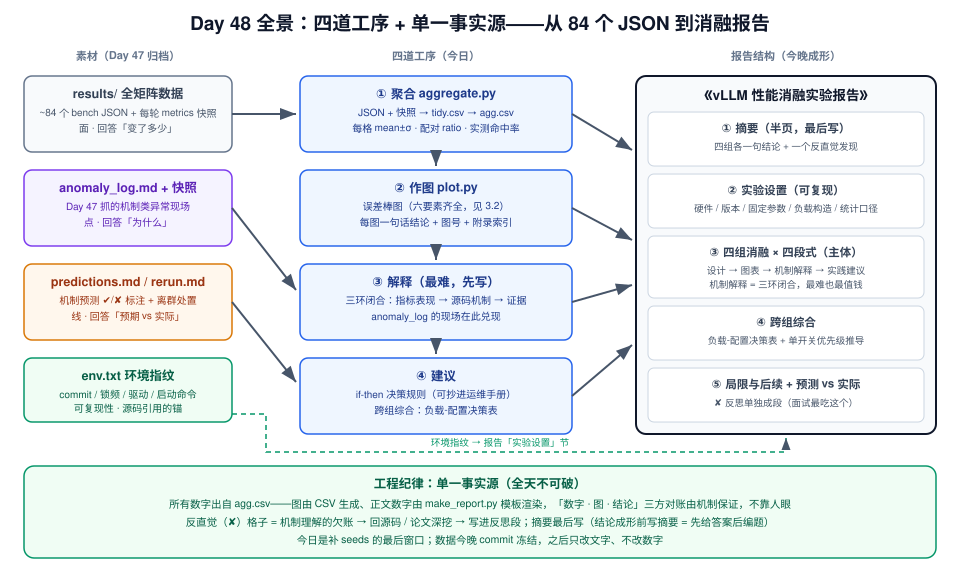
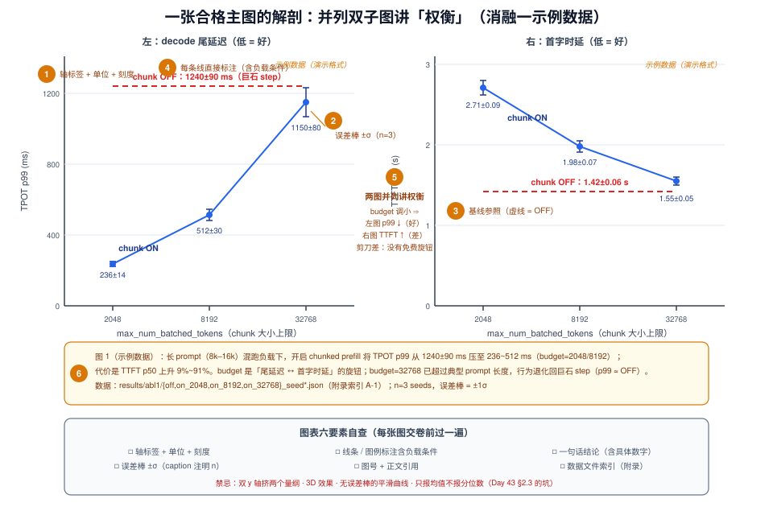
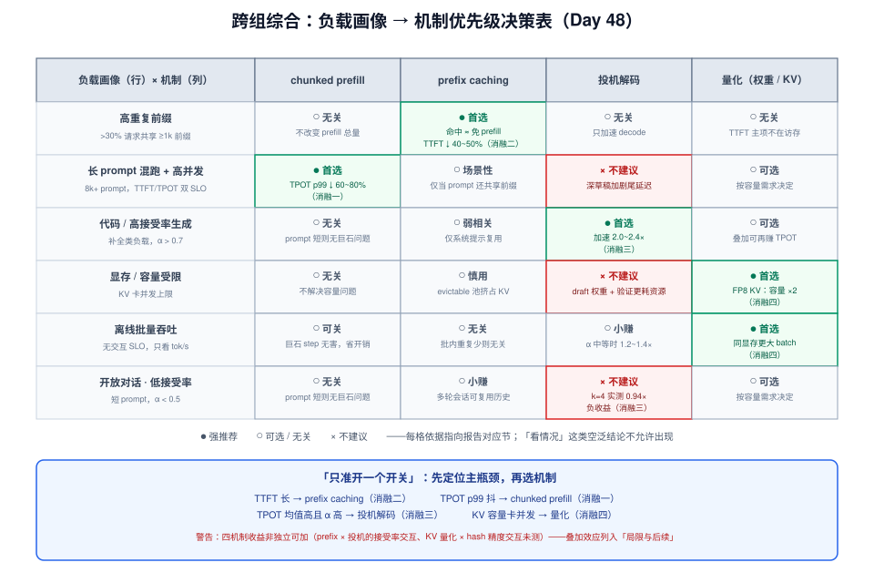

# Day 48：项目 C（三）——数据分析与《vLLM 性能消融实验报告》

> **系列进度**：第 7 周 · Day 48 / 56 · 项目 C（vLLM 性能消融实验）收官日
> **前置**：Day 46 冻结的 `cases.yaml`（四组消融矩阵）与 `predictions.md`（机制预测）；Day 47 交付的 `results/` 全矩阵原始数据（约 28 格 × 3 seeds ≈ 84 runs）、`anomaly_log.md`（异常现场已分诊）、`rerun.md`（离群点已处置）、预对照表（✔/✘ 已标注）
> **今日定位**：Day 47-48「跑实验 + 出报告」的第二天，也是项目 C 的收官日。机器的活昨天干完了，今天只做一件事：**把 84 个 JSON 组织成一份让没跑过实验的人也能看懂因果的报告**——README 里所说的"求职作品集核心件"，今晚必须成形。

实验报告最常见的失败模式，是把结果表原样粘进 Markdown：28 行配置 × 6 列指标排开，结尾一句"chunked prefill 提升了系统性能"。这不是报告，是**配置扫描的打印件**。读者面对一堆没有因果结构的数字，只会得出一个结论：跑是跑了，没看懂。本周 README"常见坑"第 3 条（"消融实验跑成配置扫描"）说的就是这个。

一份合格的消融报告，每一节都在回答四个问题：**变了多少（图表）、为什么变（机制）、什么时候不变甚至变坏（边界）、那我该怎么配（建议）**。这四问恰好构成 README 为 Day 48 规定的四段式。数字自己不会说话——让数字说话的，是你围绕数字搭起的因果链；而因果链里"为什么"一段的素材，全部来自昨天抓的机制类异常现场（Day 47 §2.3 的"面 / 点 / 线"三层素材今天各就各位）。它和 Day 45 的 PR 描述也不同：PR 面向 reviewer，只需把**一个优化点**讲深；报告面向更广的读者，要把**四个机制的收益边界**讲全。

今天的角色从昨天的"值班员 + 记录员"切换成**分析师 + 作者**。上午做数据（聚合 → 作图 → 对账），下午做写作（四段式 × 4 组 + 跨组综合）。全程贯彻一条工程原则：**单一事实源**——所有数字出自聚合 CSV，图从 CSV 生成，正文数字由模板渲染，用机制而不是人眼保证"文、图、数"一致。

---

## 一、今日学习目标

1. **搭好数据分析流水线**：`aggregate.py`（JSON → `tidy.csv` → `agg.csv`，每格 mean ± σ 与配对 ratio）+ `plot.py`（误差棒图）+ `make_report.py`（模板渲染数字），贯彻"单一事实源"
2. **掌握聚合统计口径**：样本标准差与 SEM、配对 ratio 优先于独立传播、倍率指标用几何平均、p99 结论的保守性判据与补 seeds 的决策
3. **掌握图表规范**：六要素清单、图型选择（折线 / 柱状 / 散点 + 理论线 / 并列双子图）、每图一句话结论
4. **写出四段式章节**：设计 → 图表 → 机制解释 → 实践建议；机制解释做到"指标表现 → 源码机制 → 证据"三环闭合
5. **完成跨组综合**：负载-配置决策表、"只准开一个开关"的优先级推导、预测 vs 实际对照与反直觉反思
6. **产出**：《vLLM 性能消融实验报告》初稿（摘要 / 实验设置 / 四组消融 / 决策表 / 局限 / 预测对照），并通过"数字-图-结论"三方对账

---

## 二、核心概念

### 2.1 报告的三类读者，三种验收标准

| 读者 | 阅读方式 | 验收标准 |
|---|---|---|
| **面试官**（3 分钟） | 摘要 → 决策表 → 挑一张图看 | 3 分钟后能向别人复述你的核心结论和一个反直觉发现 |
| **资深工程师**（30 分钟，想复现或挑刺） | 实验设置 + 附录数据索引 + 统计口径 | 按 Day 43 的三层复现标准能重建条件；每个数字可追溯到 `results/` 里的 JSON |
| **面试前夜的你** | 只扫图 + 每图一句话结论 | 不读正文也能把四组结论讲满 5 分钟 |

> **设计原则**：为 3 分钟读者组织结构，为 30 分钟读者提供证据。Day 49 写"面试弹药卡"、Day 52 过问题清单时，今天的报告就是直接素材库——它的分层结构就是那时候的提词器。

### 2.2 四道工序与"单一事实源"

| 工序 | 输入 | 输出 | 验收 |
|---|---|---|---|
| ① 聚合 | `results/` JSON + metrics 快照 | `tidy.csv`（每 run 一行）→ `agg.csv`（每格 mean ± σ、配对 ratio） | 行数 = 实际 runs 数；每格 count = 3 |
| ② 作图 | `agg.csv` | `charts/*.png` | 图表六要素齐全（见 3.2）；每图一句话结论 |
| ③ 解释 | 图 + `predictions.md` + `anomaly_log` + V1 源码 | 每节"机制解释"段 | 三环闭合（见 2.4） |
| ④ 建议 | 以上全部 | if-then 决策规则 + 跨组决策表 | 规则可被运维直接执行 |

**反模式**：跳过 ①，从 JSON 里手抄数字进 Markdown。手抄一次就可能错一位小数；改一版图后正文忘了同步——"文、图、数对不上"是 review 时一票否决的硬伤，而且是**系统性风险**：你不会知道哪个数字错了。正确做法：CSV 是唯一数字来源，正文用 `make_report.py` 从 CSV 渲染（第四节给代码）。

### 2.3 聚合口径：把 Day 43 的统计协议落到格子级

| 量 | 口径 | 理由 |
|---|---|---|
| 每格中心值 | 均值 ± 样本标准差 $s$（除以 $n-1$） | Day 43 §2.3；$n=3$ 时除以 $n$ 会把 $\sigma$ 低估约 18% |
| 提升幅度 | **配对 ratio** $r_i = x_i / b_i$（同 seed 的处理格 ÷ 基线格），报 $\bar r \pm s_r$ | 同 seed 共享请求序列 → 两臂相关 → 配对消掉共同波动 |
| 倍率均值 | 几何平均 $G = (\prod_i r_i)^{1/n}$，附 $[\min, \max]$ 区间 | 算术平均系统性高估倍率（AM ≥ GM） |
| p99 | per-seed p99 的 mean ± σ，**$n=3$ 时结论保守化**（见 3.1） | p99 是次序统计量，方差远大于均值类指标 |
| 命中率 | per-seed 用计数器相减：$\Delta\text{hits}/\Delta\text{queries}$（warmup 后快照为基点） | 命中率是窗口计数比值，不是 per-request 指标；Day 47 已定横轴用它 |
| 显著性 | $\Delta < 3\times\mathrm{SEM}$ → 写"不显著" | Day 43 的 Welch 粗判据，沿用 |

$$s = \sqrt{\frac{\sum_{i=1}^{n}(x_i - \bar x)^2}{n-1}}, \qquad \mathrm{SEM} = \frac{s}{\sqrt n}$$

配对为什么有效，看 ratio 相对误差的传播公式：

$$\frac{\sigma_r}{r} \approx \sqrt{\Big(\frac{\sigma_x}{x}\Big)^2 + \Big(\frac{\sigma_b}{b}\Big)^2 - 2\rho\,\frac{\sigma_x}{x}\cdot\frac{\sigma_b}{b}} \;\;\xrightarrow{\;\rho \to 1\;}\;\; \Big|\frac{\sigma_x}{x} - \frac{\sigma_b}{b}\Big|$$

同 seed 配对时两臂高度相关（$\rho \to 1$）：请求到达次序、batch 组成这些公共噪声在除法中相消。这是**免费收紧置信区间的手段**，前提是聚合脚本按 seed 对齐（第四节 `aggregate.py` 里的 `merge(on="seed")`）。

### 2.4 机制解释的三环闭合

四段式里最难写、也最值钱的是"机制解释"。标准写法是三环闭合，把这个句式背下来：

> **指标表现**（图 N：X 从 $a$ 变到 $b$）→ **源码机制**（位于 `模块/类/函数`，一句话讲清因果链）→ **证据**（`anomaly_log` #k 的快照 / 引擎日志行 / 内部计数器读数）。

示例（消融一，可直接当模板抄）：

> 图 1 中，长 prompt 负载关闭 chunked prefill 后 TPOT p99 从 512 升至 1240 ms。**机制**：V1 调度器（`vllm/v1/core/scheduler.py` 的 `Scheduler.schedule()`）在 chunked prefill 关闭时，一个 8k~16k token 的 prompt 整块进入当前 step、吃满 token budget，同 step 内所有 decode 请求的迭代被整体推迟一个"巨石 step"。**证据**：Day 47 `anomaly_log` #2——该时段单请求 ITL 直方图呈双峰，慢峰间隔与 Grafana 上单 step 时长吻合；引擎日志可见连续多个 step 只含 1 个 prefill 请求。

三环缺一环的典型病症：只有指标没有机制（数字搬运工）；只有机制没有证据（背书的——无法证明你真跑过）；只有证据没有指标（游记）。Day 47 说"机制类异常是宝贝"，今天就是它们兑现的地方。

> **注意**：函数名与行为随 vLLM 版本演进，报告引用源码时以实验设置里记录的 commit hash 为准——这是 Day 43 环境指纹的第二个用处（第一个是复现）。

### 2.5 今日全景图



**读图**：左侧是昨天归档的三层素材（数字面 / 异常点 / 预测线）加环境指纹；中间是今天上午的四道工序——聚合、作图、解释、建议；右侧是报告的五段结构，注意**摘要最后写**（四组结论没落定之前，摘要只能靠猜）。底部横幅是全天的工程纪律：单一事实源 + 三方对账 + 数据今晚冻结。流程里唯一的"回环"是反直觉格子：✘ 越多，今天回源码深挖的价值越大——它们既是报告的记忆点，也是你机制理解的欠账清单。

---

## 三、原理深入讲解

### 3.1 聚合阶段的三个统计决策

**决策一：ratio 用配对还是独立。** 2.3 的公式已给出方向，这里说清配对的前提：Day 46 的设计里 seed 同时控制请求序列与采样，处理格与基线格用同一 seed 时，请求到达次序相同 → batch 组成的随机性相同 → 两臂强相关，配对有效。两种情况会破坏配对：① Day 47 的 rerun 若换了 seed；② 个别格子 seeds 本来就不齐。聚合脚本要显式检测配对完整度（`merge` 后行数不足 → 该格退回独立传播并在 `agg.csv` 里打 `paired=False` 标记），报告脚注披露——**口径的例外必须可见**。

**决策二：倍率用几何平均。** 例：三个 seed 的加速比 1.30 / 1.42 / 0.92，算术平均 $= 1.213$，几何平均 $= (1.30 \times 1.42 \times 0.92)^{1/3} \approx 1.193$。差距看似不到 2%，但个别 seed 偏低时 AM 会被向上拉（离群值对 AM 的影响不对称）。报告纪律：**倍率类结论一律 GM + 区间 $[\min, \max]$，均值类结论 mean ± σ**。

**决策三：p99 的保守性。** p99 是次序统计量：`num_prompts = 1000` 时它由最慢的 ~10 个请求决定，本身就高方差；再叠加 seeds 间波动，$n=3$ 的 $\sigma_{p99}$ 常达到均值的 10%~20%。判据：

$$\Delta_{p99} < 2\times\mathrm{SEM}_{p99} \;\Rightarrow\; \text{结论降级为「方向性改善」，不报百分比}$$

处于关键结论路径上的格子（如消融一主图的四个点），今天补 2 个 seeds（$n = 3 \to 5$，SEM 收缩 $\sqrt{3/5} \approx 22\%$）——**今天是最后窗口**：数据今晚 commit 冻结，之后只改文字、不改数字。

> **提示**：命中率的聚合是例外——它是计数器比值（2.3 表），不是 per-request 分位数，跨 seed 直接 mean ± σ；但必须用快照差分（$\Delta$hits / $\Delta$queries），不能拿 warmup 前的累计值。

### 3.2 图表规范：一张合格主图的解剖



**读图**：这是消融一的主图（示例数据）。左图 TPOT p99、右图 TTFT p50，共享 x 轴（budget）：budget 调小，左图曲线下降（尾延迟变好）、右图曲线上升（首字变慢）——两条曲线方向相反，这就是 chunked prefill 的核心权衡。并列双子图让读者**自己看出**"没有免费的旋钮，只有可调的权衡"，比任何文字都更有说服力。图中 ①~⑥ 标出合格图表的六个要素，最容易被忽略的是 **② 误差棒** 和 **⑥ 图下的一句话结论**——缺了这两样，图只是装饰。

图型选择表：

| 要呈现的关系 | 图型 | 本报告中的例子 |
|---|---|---|
| 指标随连续自变量的趋势 | 折线 + 误差棒 | TPOT p99 / TTFT vs budget |
| 离散档位对比 | 柱状 + 误差棒 | 消融四：四档量化的 TPOT |
| 实测 vs 理论 | 散点 + 理论曲线 | 消融三：加速比 vs k 叠 Day 25 公式 |
| 两个指标此消彼长 | **并列双子图** | 消融一主图（上图） |
| 分布形态 | 直方图 / CCDF（放附录） | ITL 双峰、接受长度分布 |

**为什么权衡不用双 y 轴**：双 y 轴把两个量纲的曲线塞进同一坐标系，读者会不自觉地对齐两条曲线的斜率，得出未经证实的相关结论。并列双子图各自量纲、共享 x 轴，是讲"此消彼长"的标准做法。

### 3.3 四组消融的写作要点：主图、机制、建议句式

> ⚠️ **本小节所有数字均为示例数据**——按 Qwen3-8B @ A100-80G 的量级自洽构造（例如 chunk step 时延 ≈ budget ÷ 有效 prefill 吞吐 ~10k tok/s），仅用于演示写作格式。你的报告必须全部换成自己 `results/` 聚合出的数字：照抄示例数字进报告，等于自毁作品集。

#### 消融一：chunked prefill 开关 × budget × prompt 长度

**主图**：并列双子图（3.2 解剖图）——左 TPOT p99 vs budget（长 prompt ON/OFF 两条线），右 TTFT p50 vs budget。

**示例结果表**（长 prompt 8k–16k，并发 64，输出 256 tok）：

| 配置 | TPOT p50 (ms) | TPOT p99 (ms) | TTFT p50 (s) | 输出吞吐 (tok/s) |
|---|---|---|---|---|
| chunk OFF | 41±3 | 1240±90 | 1.42±0.06 | 1520±40 |
| ON，budget=2048 | 26.8±0.9 | 236±14 | 2.71±0.09 | 1610±40 |
| ON，budget=8192（默认档） | 29.5±1.0 | 512±30 | 1.98±0.07 | 1650±35 |
| ON，budget=32768 | 38±2 | 1150±80 | 1.55±0.05 | 1580±30 |
| 短 prompt（128–512）ON vs OFF | 24.9 / 25.1 | 27.4±1.9 / 28.1±2.0（不显著） | ≈0.18（无差异） | ≈2980（无差异） |

**机制解释要点**（三环闭合的完整示范见 2.4），本组要写出三条因果链：

1. **巨石 step**（OFF）：整段 prompt 独占 step → 全体 decode 停摆 ~1.2 s（12k token ÷ 10k tok/s）→ p99 由"恰好与 prefill 同 step 的 decode 请求"决定 → 这解释了 p50 与 p99 的巨大差距（41 vs 1240）。
2. **budget 旋钮**：budget 2048 → 8192 → 32768，单 step 最长 prefill 停摆 ≈ 0.21 / 0.82 / 3.3 s。超过典型 prompt 长度后（32768 档）chunking 无从发力，行为退化回巨石 step（p99 1150 ≈ OFF 的 1240）→ p99 单调回升；同时 prefill 出队更快 → TTFT 单调下降。**两条曲线方向相反，是全报告最"性能工程"的一张图。**
3. **负载依赖**：短 prompt 负载下 ON/OFF 无显著差异——机制是"巨石"本身不存在（prompt < budget）。没有这一行，"chunked prefill 有收益"就是过度概括。

**实践建议句式**：长 prompt 混跑场景默认开启（V1 默认即开）；budget 初值取「TPOT p99 SLO 能容忍的单 step 停摆 × prefill 吞吐」与「典型 prompt 长度」的较小者，再按本实验曲线微调；纯离线批处理（无交互 SLO）可关闭换吞吐。

#### 消融二：prefix caching 命中率梯度

**主图**：TTFT p50/p99 vs **实测命中率**（散点 + 理论线 $\Delta\mathrm{TTFT}_{p50} \approx h \cdot L_{prefix} / R_{prefill}$），TPOT 一条平坦线作对照；构造值画小叉、实测值画圆点，两者的差距本身是一张"缓存管理开销"图。

**示例结果表**（2k 共享前缀 + 0.5k 独有，输出 256，并发 64）：

| 构造命中率 | 实测命中率 | TTFT p50 (ms) | TTFT p99 (ms) | TPOT p50 (ms) |
|---|---|---|---|---|
| OFF | 0% | 312±10 | 640±25 | 24.2±0.8 |
| 50% | 47%±2 | 205±8 | 402±18 | 24.0±0.7 |
| 90% | 82%±3 | 152±6 | 335±15 | 24.3±0.9 |

**机制解释要点**：

1. **命中 ≈ 免 prefill**：命中 2k 前缀省掉 2k token 的 prefill 计算与 KV 写入 → TTFT 按 $h \times 0.2\,\mathrm{s}$ 近线性下降（0.2 s = 2k ÷ 10k tok/s）；p50 与理论线吻合（152 ≈ 312 − 0.82 × 200）。
2. **收益只进 TTFT、不进 TPOT**：decode 每 step 仍要读全部 KV → TPOT 三档无显著差异。这条**负结果**很有信息量——它把 prefix caching 从"万能加速"修正为"TTFT 优化器"。
3. **实测 < 构造**：90% 档实测只有 82%——Day 47 抓到的 LRU 换手（`BlockPool` evictable 池高频淘汰再回填）；p99 改善比例（−48%）低于 p50（−51%）也是同一机制在尾部的放大。

**实践建议句式**：前缀重复度（可命中 token 占比）> 30% 就值得开——开关近乎免费（hash / 引用计数开销在本实验量级 < 2%）；高并发下若实测命中率明显低于构造预期，优先扩 KV 池或降并发，而不是关开关。

#### 消融三：投机解码接受率-收益曲线

**主图**：加速比 vs `num_speculative_tokens`（k），代码 / 对话两条负载曲线 + Day 25 理论曲线叠加：

$$E[L] = \frac{1-\alpha^{k+1}}{1-\alpha}, \qquad S(k) = \frac{E[L]}{1 + k\,\delta}$$

（α = 实测接受率，取自 `/metrics` 的 acceptance 指标；δ = 每 draft token 相对开销，用 k=1 的实测点反解。）

**示例结果表**（加速比 = 基线 TPOT ÷ 投机 TPOT，同 seed 配对；δ=0.06）：

| k | 理论 S（α=0.78） | 代码负载实测（并发 32） | 理论 S（α=0.52） | 对话负载实测（并发 32） | 对话负载实测（并发 64） |
|---|---|---|---|---|---|
| 1 | 1.68 | 1.58±0.06 | 1.43 | 1.34±0.05 | 1.21±0.05 |
| 2 | 2.13 | 1.98±0.07 | 1.60 | 1.47±0.06 | 1.25±0.06 |
| 3 | 2.43 | 2.21±0.08 | 1.64 | 1.42±0.07 | 1.08±0.06 |
| 4 | 2.61 | 2.35±0.09 | 1.62 | 1.28±0.06 | **0.94±0.05（负收益）** |

**机制解释要点**：

1. **代码负载贴着理论线**（偏差 6%~10%）：α 高时 $E[L]$ 主导，draft 与验证开销可用单一 δ 拟合——Day 25"用计算换访存"的预测成立。
2. **对话负载的峰值左移**（理论 k\*≈3，实测 k\*≈2）：α 低时理论曲线本就平坦，叠加验证 batch 的非线性干扰后，最优 k 比理论预测更小。
3. **负收益失效模式**（并发 64 × k=4）：验证 step 要处理 $(k+1)\times$ batch 个 token 的 attention / KV 读取——decode 本是访存 bound，低 α 下这部分读放大的**未接受部分全部浪费**；再叠加 draft 前向，总时间反超节省。**这是全报告最值钱的一个点：优化不是收益递减，是会转负。**
4. **高并发让曲线整体下移**（对话 32 → 64 并发全线变差）：batch 越大，验证 batch 的边际干扰越大。

**实践建议句式**：先看负载的实测接受率 α：α > 0.7 → 开，k 取 3~4；0.5 < α < 0.7 → k ≤ 2 并持续监控 acceptance 指标；α < 0.5 且并发高 → 不开。上线后把 acceptance rate 接进告警，低于阈值自动降 k 或回退。（spec decode 的参数名与后端支持矩阵随 vLLM 版本演进较快，报告须注明实测版本。）

#### 消融四：量化吞吐-精度权衡

**主图**：这组**用表格不用折线**——档位离散，且要同时看四个指标（TPOT / 吞吐 / 显存与并发上限 / 精度），四联表 + 一张"访存下界对账表"。

**示例结果表**（decode 密集：输入 256 / 输出 1024，并发 128，A100-80G）：

| 配置 | TPOT p50 (ms) | 输出吞吐 (tok/s) | ΔPPL | 并发上限（KV 容量） |
|---|---|---|---|---|
| BF16 基线 | 23.5±0.7 | 3040±60 | — | ~189 |
| W8A8 | 16.8±0.5（1.40×） | 4210±80 | +0.06 | ~189（KV 未变） |
| W4A16（AWQ） | 15.9±0.6（1.48×） | 4460±90 | +0.11 | ~223（省出的 ~11 GB 划给 KV 池） |
| BF16 权重 + FP8 KV | 21.9±0.7（1.07×） | 3150±60 | +0.03 | 379 → 被 `max_num_seqs=256` 封顶 |
| W8A8 + FP8 KV | 15.1±0.5（1.56×） | 4620±90 | +0.09 | 256（同上封顶） |

**访存下界对账表**（Day 2 / Day 3 的公式在这里变成"实测 ÷ 下界"的效率比）：

| 配置 | 每步读权重 (GB) | 每步读 KV (GB)* | 理论 TPOT 下界 (ms)** | 实测 / 下界 |
|---|---|---|---|---|
| BF16 | 16.1 | 11.8 | 13.7 | 1.72 |
| W8A8 | 8.0 | 11.8 | 9.7 | 1.73 |
| W4A16 | 4.0 | 11.8 | 7.8 | 2.04 |
| FP8 KV | 16.1 | 5.9 | 10.8 | 2.03 |

\* 128 请求 × 平均上下文 ~640 token × 144 KiB/token（Day 47 手算的 $s_{tok}$）；\*\* 总访存 ÷ 2.04 TB/s（A100-80G HBM 实效带宽按峰值 2.0 TB/s 计）。

**机制解释要点**：

1. **decode 访存 bound 的直接验证**：W8A8 的效率比（1.73）与 BF16（1.72）几乎相同——权重量化按预期等比例压缩访存，收益直接进 TPOT。这就是 Day 2"decode 时延下界 ≈ 每 step 读的字节 ÷ 带宽"的实验版。
2. **W4A16 效率比劣化到 2.04**：dequant（分组解压回 BF16 再进 GEMM）插入额外计算与访存——理论 2× 只兑现 1.48×。**对照你的昇腾经验**：昇腾 Cube 的 W8A8 融合路径（Day 22 对照表）在 A100 上没有完全对应的 kernel，两边 dequant 的开销结构不同——这段跨平台对照是报告里体现你背景差异化的地方。
3. **prefill 侧几乎不动**（示例中 TTFT −4%±3%，不显著）：prefill 是计算 bound，权重字节减半不减少 FLOPs，反量化反而增加少量计算（Day 23 的预测在此验证）。
4. **FP8 KV 的收益在容量不在速度**：TPOT 仅改善 7%（KV 只占每步访存的一部分），但并发上限翻倍（189 → 379），随即被 `max_num_seqs` 封顶——Day 47 自测题第 3 问的手算在这里兑现成实验结论：**量化后瓶颈会搬家**。

**实践建议句式**：显存 / 并发卡容量 → 优先 KV 量化（容量 ×2，精度代价最小）；纯 TPOT 优先 → 权重量化（W8A8 起步）；W4A16 留给"必须塞进更小卡"的场景并接受效率折损；精度验收用困惑度 + 3~5 个基准任务 + 生成质量抽查三件套（Day 24 口径）。

### 3.4 跨组综合：负载-配置决策表与单开关优先级



四组各自给完建议，还要放进**同一张表**——这是 README Day 48 结构模板的第 4 部分，也是面试题"只准开一个开关你开哪个"的答题底稿。构造方法：

1. **行 = 负载画像**：从四组实验的负载维度泛化出生产真实存在的形态（高重复前缀 / 长 prompt 混跑 / 代码生成 / 显存受限 / 离线吞吐 / 低接受率对话）；
2. **列 = 机制**：四个开关；
3. **格 = 推荐度 + 一句话依据**：●（强推）/ ○（可选或无关）/ ×（不建议），依据必须指向报告对应节，不能凭印象。

**单开关优先级的推导逻辑**（比背结论重要）：先定位主瓶颈，再选机制——

$$\text{主瓶颈} \Rightarrow \text{机制选择} = \begin{cases} \text{TTFT 长} & \Rightarrow \text{prefix caching（消融二）} \\ \text{TPOT p99 抖} & \Rightarrow \text{chunked prefill（消融一）} \\ \text{TPOT 均值高 且 } \alpha \text{ 高} & \Rightarrow \text{投机解码（消融三）} \\ \text{KV 容量卡并发} & \Rightarrow \text{量化（消融四）} \end{cases}$$

> **必须写进报告的警告**：四个机制的收益**不是独立可加的**。prefix caching 与投机解码叠加时，命中前缀改变上下文分布、可能影响接受率；KV 量化与 prefix caching 叠加时，hash 语义与精度有交互。本文未测叠加效应——这既是对读者的诚实，也是"局限与后续"一节的必备条目。

### 3.5 预测 vs 实际：反思段怎么写

README 晚间检查点明确要求：对照表附在报告末尾，**预测错的地方单独写一段反思**。写法模板：

| 预测（Day 46） | 实际 | ✔/✘ | 归因（我的模型缺了什么） |
|---|---|---|---|
| 命中率 90% 档 TTFT 降 ~58% | 实测 −51% | ✘ | 用了构造命中率 90%，忽略 LRU 换手（实测 82%）——高负载下缓存管理开销不可忽略 |
| 对话负载 k=4 加速 ~1.6× | 并发 64 实测 0.94× | ✘✘ | Day 25 公式只建模了接受率与 draft 成本，没建模**验证 batch 对 running batch 的干扰在高并发下的放大**——本次实验最重要的修正 |
| W4A16 加速 ~2×（访存减半） | 实测 1.48× | ✘ | 访存下界对账显示效率比从 1.72 劣化到 2.04——dequant 开销在 A100 上不可忽略 |

三条纪律：

1. **每个 ✘ 必须落到"模型缺项"**，给出修正后的心智模型；"可能是噪声"不允许出现——噪声已被 Day 47 的重跑协议处理掉，进报告的数字都是幸存者。
2. ✘ 的价值排序：**机制理解错误 > 参数量级偏差 > 纯数值偏差**。面试官最吃第二行这种——它证明你真的用实验修正过自己的理论模型。
3. 摘要里点名的那句"最有意思的反直觉发现"，就从 ✘ 里选（本文选"负收益失效模式"）。

---

## 四、关键代码

### 4.1 aggregate.py：JSON + 快照 → tidy / agg CSV

```python
#!/usr/bin/env python3
# results/ 全矩阵 → tidy.csv（每 run 一行）→ agg.csv（每格 mean±σ + 配对 ratio）
import json, glob, re
import pandas as pd

NUM = ["ttft_p50", "ttft_p99", "tpot_p50", "tpot_p99",
       "output_tput", "hit_rate", "completed"]

rows = []
for path in sorted(glob.glob("results/*/*/*_*.json")):
    if path.endswith("_metrics.json"):
        continue
    group, case = path.split("/")[-3], path.split("/")[-2]
    seed = int(re.search(r"_(\d+)\.json$", path).group(1))
    d = json.load(open(path))                      # bench JSON
    s = json.load(open(path.replace(".json", "_metrics.json")))

    q = s.get("gpu_prefix_cache_queries", 0)       # 命中率：窗口差分（Day 47 §4 口径）
    hits = s.get("gpu_prefix_cache_hits", 0) if q else 0

    rows.append(dict(
        group=group, case=case, seed=seed,
        ttft_p50=d["median_ttft_ms"], ttft_p99=d["p99_ttft_ms"],
        tpot_p50=d["median_tpot_ms"], tpot_p99=d["p99_tpot_ms"],
        output_tput=d["output_throughput"], completed=d["completed"],
        hit_rate=(hits / q) if q else 0.0,
    ))

tidy = pd.DataFrame(rows)
tidy.to_csv("tidy.csv", index=False)

# 每格 mean±σ + count（count<3 的格子要暴露在 agg 里，别藏）
tidy.groupby(["group", "case"])[NUM].agg(["mean", "std", "count"]).round(4).to_csv("agg.csv")

def paired_ratio(group, metric, base_case="off"):
    """同 seed 配对求倍率；配对不完整的格子自动降级并标记。"""
    g = tidy[tidy.group == group]
    base = g[g.case == base_case].set_index("seed")[metric]
    out = {}
    for case, sub in g[g.case != base_case].groupby("case"):
        s = sub.set_index("seed")[metric]
        j = pd.concat([s, base.reindex(s.index)], axis=1, keys=["x", "b"]).dropna()
        r = j.x / j.b
        out[case] = dict(gm=float(r.prod() ** (1 / len(r))),
                         lo=float(r.min()), hi=float(r.max()),
                         paired=bool(len(j) == len(sub)))
    return out
```

> **两个版本敏感点**（以你实测环境为准，别照抄字段名）：① `vllm bench serve` 的 JSON 字段名随版本变过（`median_ttft_ms` / `p99_ttft_ms` 等）——Day 43 冻结过一次，沿用同一 harness 就不用改；② metrics 快照里 counter 的暴露名（`vllm:gpu_prefix_cache_hits` 一类）同样随版本变。聚合脚本一旦跑通就**不要再动**——动了就要全量重跑，否则口径不一致。

### 4.2 plot.py：误差棒与"一句话结论"的机械产出

```python
import matplotlib.pyplot as plt
import pandas as pd

BUDGETS = [2048, 8192, 32768]
agg = pd.read_csv("agg.csv", header=[0, 1], index_col=[0, 1])

def errbar(ax, xs, ys, es, label, color):
    ax.errorbar(xs, ys, yerr=es, fmt="o-", capsize=4, color=color,
                markersize=5, linewidth=1.6, label=label)

def abl1_main():
    def col(case, metric, stat):
        return agg.loc[("abl1", case), (metric, stat)]

    on = ["on_2048", "on_8192", "on_32768"]
    fig, (ax1, ax2) = plt.subplots(1, 2, figsize=(10, 4), sharex=True)

    errbar(ax1, BUDGETS, [col(c, "tpot_p99", "mean") for c in on],
           [col(c, "tpot_p99", "std") for c in on], "chunk ON", "#2563eb")
    ax1.axhline(col("off", "tpot_p99", "mean"), ls="--", color="#dc2626", label="chunk OFF")
    ax1.set_xlabel("max_num_batched_tokens")
    ax1.set_ylabel("TPOT p99 (ms)")

    errbar(ax2, BUDGETS, [col(c, "ttft_p50", "mean") for c in on],
           [col(c, "ttft_p50", "std") for c in on], "chunk ON", "#2563eb")
    ax2.axhline(col("off", "ttft_p50", "mean"), ls="--", color="#dc2626", label="chunk OFF")
    ax2.set_xlabel("max_num_batched_tokens")
    ax2.set_ylabel("TTFT p50 (s)")

    fig.savefig("charts/abl1_main.png", dpi=150, bbox_inches="tight")
```

图题（一句话结论）**不写在图里**，集中放在 `CAPTIONS.md`，且数字用占位符、由 `agg.csv` 渲染——一句话结论里的数字永不失真：

```python
CAPTIONS = {
    "abl1_main": ("图 1：长 prompt 负载下，chunked prefill 使 TPOT p99 从 {off:.0f}±{off_s:.0f} ms "
                  "降至 {on2k:.0f}~{on8k:.0f} ms（budget=2048/8192）；代价是 TTFT p50 上升 "
                  "{ttft_lo:.0f}%~{ttft_hi:.0f}%。budget 是尾延迟与首字时延的旋钮。"),
}
```

### 4.3 make_report.py：数字不手抄

报告正文用模板写，数字全部是占位符，渲染时从 `agg.csv` 填：

```markdown
<!-- report.md.tmpl 片段：机制解释段 -->
图 {{G1.fignum}} 中，长 prompt 负载关闭 chunked prefill 后，TPOT p99 从
{{G1.off.tpot_p99_mean:.0f}}±{{G1.off.tpot_p99_std:.0f}} ms 升至
{{G1.on.tpot_p99_mean:.0f}} ms（×{{G1.ratio_p99:.2f}}）。
```

```python
# make_report.py（jinja2 或 str.format 均可；核心 = 模板 + agg.csv → report.md）
from jinja2 import Template
ctx = build_context("agg.csv")                      # {{G1.off.tpot_p99_mean}} ← agg.csv 定位取数
open("report.md", "w").write(Template(open("report.md.tmpl").read()).render(**ctx))
```

好处是机制性的：**改数据 → 重跑三个脚本 → 全文数字同步更新**。折中做法：数字密集的表格与摘要用模板渲染，散文段落里的关键数字也用 `{{}}` 占位。交稿前最后一道对账：

```bash
grep -n "{{" report.md && echo "FOUND UNRENDERED PLACEHOLDERS" || echo "OK"
```

### 4.4 三方对账清单（交稿前必过）

| 检查 | 方法 |
|---|---|
| 正文每个数字 ∈ 某图 / 表 | 模板渲染保证；无模板处人工过一遍 |
| 每个图 / 表被正文引用至少一次 | 搜"图 N"——孤儿图要么删、要么补引用 |
| 每个结论句有数字支撑 | "显著改善"类措辞后面必须跟（图 N / 表 M） |
| 每个数字可追溯到原始 JSON | 附录 A：图 ↔ `results/` 文件映射表，由 `aggregate.py` 顺手生成 |
| 显著性口径统一 | 全文搜"显著"，逐个核对 Δ vs 3×SEM（Day 43 判据） |

---

## 五、与 vLLM V1 的实际联系：机制解释的源码锚点清单

报告"机制解释"段的每一环都要落到 V1 源码。写作时把这张清单放在手边——每个机制给"调用链一句话 + 引用位置"。（路径以你实验记录的 commit 为准；V0 已移除，不要引用旧架构的模块。）

| 消融 | 机制锚点（V1） | 写进报告的一句话 |
|---|---|---|
| 一 | `vllm/v1/core/scheduler.py`：`Scheduler.schedule()` 处理 waiting 队列时按 `max_num_batched_tokens` 截断 prefill 并切 chunk；配置在 `SchedulerConfig`（`chunked_prefill_enabled` / `max_num_batched_tokens`） | budget 决定单 step 内 prefill 与 decode 的混排比例，直接决定 decode 的最长停摆 |
| 二 | `vllm/v1/core/kv_cache_manager.py` + `kv_cache_utils.py`：block hash（父前缀 + token ids + 多模态/LoRA 标识）、`BlockPool` 的 evictable LRU 与引用计数；开关在 `CacheConfig.enable_prefix_caching` | 命中省 prefill 计算与 KV 写入；高负载下 LRU 换手使实测命中率低于构造值 |
| 三 | `vllm/v1/spec_decode/`（eagle / mtp / ngram 等后端）+ rejection sampling；acceptance 指标在 `vllm/v1/metrics/` | 验证 step 读 $(k+1)\times$batch 的 KV，低接受率下未接受部分的访存全部浪费 |
| 四 | `vllm/model_executor/layers/quantization/`（各量化 method）；`CacheConfig.kv_cache_dtype`；KV 池可用 block 数由 `vllm/v1/worker/gpu_model_runner.py` 探测决定 | 权重量化压缩每步权重读取（→TPOT）；KV 量化压缩每步 KV 读取并扩容并发上限 |

三条引用纪律：

1. **引用到"模块 / 类 / 函数"粒度即可**，不贴行号——行号随 commit 漂移，模块结构稳定得多；
2. 行为不确定处（指标暴露名、spec decode 后端支持矩阵、量化 kernel 因硬件而异），报告里写"版本 X 实测"——把不确定性显式化，不编造；
3. 证据环优先用**自己抓的现场**（快照 / 日志 / 计数器），源码是解释环不是证据环——"我看过源码"和"我抓到过现象"是两种可信度。

---

## 六、动手实验步骤

> 时间预算约 4 小时（含缓冲）：上午数据、下午写作、傍晚对账归档。前置：Day 47 产出物清单六项齐全——缺什么先补什么。

### Step 0：前置核对 + 最后补种（15 min）

- Day 47 §十一 的产出物清单逐项打勾；
- 预跑一遍 `aggregate.py`：count < 3 的格子列出来，**关键结论路径上的**（消融一主图四个点、消融三的负收益点）现在补 2 个 seeds——过今晚不候；
- 确认锁频仍在（`nvidia-smi -q -d CLOCK`），补跑格与原格同环境。

### Step 1：聚合 + sanity 回放（25 min）

- `tidy.csv` 行数 = 实际 runs 数（rerun 替换后的口径）；`agg.csv` 每格 count = 3（关键格 5）；
- 重放 Day 47 的 sanity 三道关脚本，输出存 `report/appendix_sanity.txt`——单调性 / 量级 / 跨格一致的检查记录直接进附录，报告可信度 +1；
- `paired_ratio` 输出过一眼：`paired=False` 的格子进脚注。

### Step 2：主图 + 附录图（45 min）

- 每组 1 张主图（图型按 3.2 的表选），先画消融一——它是全报告的格式模板；
- 附录图 2~3 张：ITL 直方图（消融一的双峰）、命中率时序（消融二的颠簸）、接受长度分布（消融三）——素材来自 `anomaly_log` 关联的快照；
- 每图在 `CAPTIONS.md` 配一句话结论（占位符渲染）；跑 4.4 对账第 2 条：无孤儿图。

### Step 3：四组各写四段（90 min，每组 ~22 min）

- **先写机制解释段**（最难、决定深度），再补设计、图表说明、建议——顺序反了，"好写的内容"会挤掉"难写的内容"；
- 每节到点就停，写不完留 `TODO` 标记——四节全有骨架，比一节完美更重要；
- 机制段素材三来源：`predictions.md` 对照 + `anomaly_log` 现场 + 第五节源码锚点清单。

### Step 4：跨组决策表 + 单开关推导（20 min）

- 按 3.4 的三步构造；每格依据指向节号；
- 写"非独立可加"警告段。

### Step 5：预测 vs 实际 + 反思段（20 min）

- 对照表（3.5 模板）；每个 ✘ 写"模型缺项 + 修正后的心智模型"；
- 选定摘要里点名的反直觉发现。

### Step 6：摘要 + 实验设置 + 局限（35 min）

- **摘要最后写**：四组各一句结论（带数字）+ 一个反直觉发现 + 适用范围（模型 / 硬件 / 负载）；
- 实验设置：环境指纹表、`cases.yaml` 摘要、统计口径（2.3 的表直接搬）、负载构造方法（Day 46 细节）；
- 局限至少 5 条**真实存在的**：单卡单模型、synthetic 负载、n=3（p99 方差大）、未测机制叠加、未测 `max_num_seqs` 与 KV 容量的交互；若环境是 A100，写明"H100 的 FP8 Tensor Core 会改变消融四的结论结构"。

### Step 7：三方对账 + 归档（15 min）

- 4.4 清单全过；`grep "{{"` 无残留占位符；
- `git add report/ charts/ tidy.csv agg.csv CAPTIONS.md && git commit`——报告与数据同 commit，追溯链闭合；
- 晚间检查点（README Day 48）：初稿完成，数据、图、结论三者对得上；预测对照表已附末尾。

---

## 七、面试高频问题

**Q1：你的消融报告和一份普通 benchmark 报告，差别在哪？**

> 答：三个差别。①普通 benchmark 回答"这个配置多快"，消融报告回答"这个机制何时有效、为何有效、代价与失效边界"；②结构上每节固定四段——设计 / 图表 / 机制解释 / 实践建议，机制解释要求"指标表现 → 源码机制 → 证据"三环闭合，数字必须落到 V1 调度器或 KV 管理的具体行为上；③统计上每格 3 seeds、配对 ratio、p99 带保守性判据。一句话：benchmark 是测量，消融是受控实验。

**Q2：prefix caching 的收益为什么和命中率不是线性？你的实验怎么处理的？**

> 答：三个机制：block 对齐粒度导致部分命中；高并发下 LRU 换手使实测命中率低于构造值；收益集中在 TTFT（省 prefill 计算），对 TPOT 几乎无感（decode 仍读全量 KV）。处理：横轴一律用 `/metrics` 实测命中率（快照差分），构造值画成参照点，两者差距本身作为"缓存管理开销"写进机制解释——我 90% 档实测只有 82%，这 8 个点的缺口就是 evictable 池换手的直接观测。

**Q3：报告里最有意思的发现是什么？**（必考，提前打磨）

> 答：负收益失效模式——对话负载（接受率 ~0.5）+ 高并发 + 深草稿（k=4）时，投机解码加速比 0.94×，比不开还慢。机制：验证 step 要读 (k+1)×batch 的 KV，decode 是访存 bound，低接受率下未接受部分的访存全部浪费，叠加 draft 前向后总时间反超节省。这个点修正了我从 Day 25 公式得到的预期——公式只建模接受率与 draft 成本，没建模验证 batch 对 running batch 的干扰随并发放大。上线对策：acceptance rate 进告警，低于阈值自动降 k 或回退。

**Q4：如果生产上只准开一个开关，你开哪个？**

> 答：不给负载画像就没法答——这正是决策表的用法：先看主瓶颈。TTFT 长 → prefix caching；TPOT p99 抖 → chunked prefill；TPOT 均值高且接受率高 → 投机解码；KV 容量卡并发 → 量化。再补一句：四个机制收益非独立可加，多开之前要单独测叠加——我的报告没测，这是我知道的边界。

**Q5：p99 的结论为什么要保守？n=3 够吗？**

> 答：p99 是次序统计量，1000 个请求里由最慢的 ~10 个决定，天然高方差；再叠加 seeds 间波动，n=3 的 σ_p99 常到均值的 10%~20%。我的处理：Δ_p99 < 2×SEM 就降级为"方向性"结论、不报百分比；关键路径格子补到 n=5（SEM 收缩 ~22%）。够不够取决于用途：内部调参 n=3 足以发现 2× 量级的变化；对外报告的定量结论要 n≥5 并附区间。

**Q6：W4A16 理论上访存减半、加速 2×，你实测为什么只有 1.48×？**

> 答：访存下界对账——BF16 与 W8A8 的"实测 / 下界"效率比都是 ~1.72，说明 W8A8 如期等比压缩；W4A16 劣化到 2.04，差额是 dequant（分组解压回 BF16 再进 GEMM）插入的计算与访存。A100 没有 int4 Tensor Core 路径，理论收益被 kernel 效率吃掉一块。这段对照我在昇腾 Cube 的 W8A8 融合路径上也做过类似分析，两边 dequant 的开销结构不同——是跨平台方法论迁移的直接例子。

**Q7：报告里的数字怎么保证可信？**

> 答：四层：环境层——环境指纹（commit / 锁频 / 驱动）+ Day 43 轮次协议消偏差；统计层——3 seeds、配对 ratio、显著性判据（Δ < 3×SEM 写不显著）；工程层——单一事实源，数字从聚合 CSV 模板渲染，三方对账由机制保证；追溯层——附录有图 ↔ 数据文件映射，每个数字能回到原始 JSON。另外预测对照表附在末尾，预测错的地方单独反思——敢展示错误的报告才可信。

---

## 八、今日总结

- **报告 = 因果链，不是数字罗列**：每节四问——变了多少 / 为什么 / 何时失效 / 怎么配；配置扫描是失败模式
- **四道工序 + 单一事实源**：聚合 → 作图 → 解释 → 建议；CSV → 图 → 模板渲染正文，三方对账靠机制不靠人眼
- **聚合三决策**：配对 ratio（同 seed 对齐，公共噪声相消）；倍率用 GM + 区间；p99 保守判据（Δ < 2×SEM 降级）——关键格今天补 seeds，最后窗口
- **图表六要素**：轴单位、误差棒、条件标注、图号引用、一句话结论、数据索引；权衡用并列双子图，忌双 y 轴
- **机制解释三环闭合**：指标表现 → 源码机制 → 证据（`anomaly_log` 兑现）；缺环 = 数字搬运工 / 背书的 / 游记
- **四组核心结论（示例口径）**：chunked prefill 是 p99↔TTFT 旋钮（budget 超过 prompt 长度即退化）；prefix caching 是 TTFT 优化器（实测命中率 < 构造值）；投机解码会负收益（低 α × 高并发 × 深 k）；量化后瓶颈搬家（FP8 KV 容量 ×2 被 `max_num_seqs` 封顶）
- **跨组决策表 + 单开关推导**：先定位主瓶颈再选机制；收益非独立可加必须写明
- **预测对照与 ✘ 反思**：每个 ✘ 落到"模型缺项"；反直觉发现从 ✘ 里选
- 作品集核心件今日成形；明天把 A / B / C 三个项目作品化成面试弹药卡

---

## 九、今日自测题

1. 为什么摘要必须最后写？先写会有什么系统性风险？
2. 配对 ratio 的前提是什么？Day 47 的 rerun 若换了 seed，这个格子的 ratio 怎么处理？
3. 手算：示例环境（Qwen3-8B，有效 prefill 吞吐 ~10k tok/s）下，budget=2048 的单 step 最长停摆是多少？这个数字如何同时进入 TPOT p99（变好）与 TTFT（变差）？
4. 交稿前发现正文某数字与图 3 不一致，列出三个可能的环节问题，以及"单一事实源"如何从机制上消灭它们。
5. 决策表里"显存受限"一行，为什么投机解码标 × 而 prefix caching 只标 ○——两者的"占用"有什么本质区别？

<details>
<summary>参考答案（先自己答再看）</summary>

1. 摘要是全文结论的压缩；四组结论没落定前写摘要，等于先给答案后编题——后续任何修改（补 seeds、剔除格子、口径修正）都要回头改摘要，漏改一次就是"文数不一致"的硬伤。摘要最后写 + 模板渲染，把这类风险交给机制而不是记性。
2. 前提：两臂 seed 语义一致（同一请求序列、同一随机流），使处理格与基线格的公共噪声在除法中相消（ρ → 1）。rerun 换了 seed → 配对失效 → 该格退回独立传播（σ_r/r ≈ √((σ_x/x)² + (σ_b/b)²)），并在 `agg.csv` 打 `paired=False`、报告脚注披露——口径的例外必须可见。
3. 2048 ÷ 10000 tok/s ≈ 0.21 s。进入 TPOT p99：与 prefill chunk 同 step 的 decode 请求，该次迭代停摆 ≤ 0.21 s，远小于 OFF 的 ~1.2 s 巨石 → p99 从 1240 降到 236 ms。进入 TTFT：一个 12k prompt 要切成 ~6 个 chunk、分散进 6 个 step 完成，还要与其他请求竞争 budget → 首 token 时间被拉长（1.42 → 2.71 s）。同一个数字，两个指标方向相反——这就是"旋钮"的物理含义。
4. 三个环节：① 手抄数字抄错；② 图更新后正文没同步（或反之）；③ 同一量在两处用了不同口径（p50 vs p99、不同 seed 子集）。单一事实源的消灭方式：数字只存于 `agg.csv`；图从 `agg.csv` 生成；正文数字由模板从 `agg.csv` 渲染——三个出口同源，任一更新触发全量重渲染，不一致在机制上不可能发生。
5. 投机解码是**净增占用**：draft 模型常驻显存 + 验证 batch 的 (k+1)× 激活与 KV 读放大，容量受限时是反向操作。prefix caching 不新增占用——evictable 池复用的是 KV 池本身的空闲 block，只是改变"空闲 block 留内容等命中 vs 立即回收"的策略；它的风险是挤占与换手开销，不是净增。所以一个 ×、一个 ○。
</details>

---

## 十、今日产出物

| 产出物 | 验收标准 |
|---|---|
| **《vLLM 性能消融实验报告》初稿**（`report/report.md`） | 五段结构齐全：摘要（四句结论 + 反直觉发现）/ 实验设置 / 四组 × 四段式 / 跨组决策表 / 局限与后续；每个机制解释三环闭合 |
| **图表**（`charts/` + `CAPTIONS.md`） | 每组 ≥1 主图 + 2~3 张附录图；六要素齐全；每图一句话结论（模板渲染） |
| **聚合数据**（`tidy.csv` / `agg.csv`） | tidy 行数 = runs 数；每格 count=3（关键格 5）；`paired` 标记齐全 |
| **附录** | 图 ↔ 数据文件映射表、sanity 三道关回放输出、环境指纹、预测 vs 实际对照表（✘ 反思段） |
| **三方对账通过** | 4.4 清单全过；`grep "{{"` 无残留；无孤儿图 |
| **归档 commit** | report/ + charts/ + CSV 与原始数据同仓，追溯链闭合 |

> **明日预告（Day 49，复盘日）**：项目作品化——把项目 A（vllm-ascend 优化 + PR）、项目 B（mini 引擎）、项目 C（今天的报告）各写成一页"面试弹药卡"（STAR + 量化结果，3 分钟版 / 10 分钟版），并做模拟追问："你这个提升怎么排除抖动"（→ Day 43 统计口径）、"为什么在那个场景不 work"（→ 机制失效边界）、"只准开一个开关开哪个"（→ 今天的决策表，答案已经写好）。八周计划进入最后一周：材料已齐，剩下的是表达。
