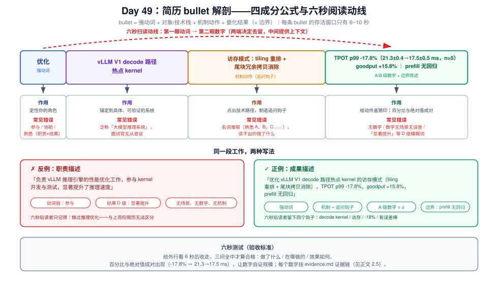
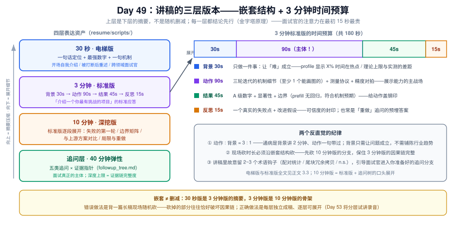
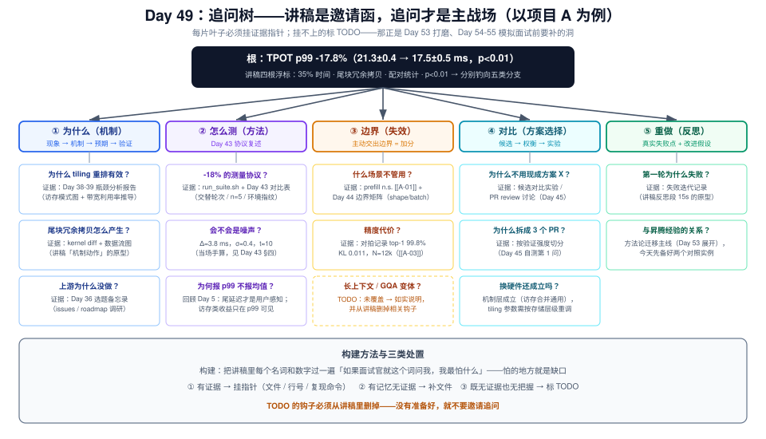

# Day 49：复盘日——把项目 A/B/C 整理成简历 bullet 与面试讲稿

> **系列进度**：第 7 周 · Day 49 / 56 · 第 7 周复盘日（项目 A/B/C 收官整合）
> **前置**：项目 A = Day 45 的 upstream PR + Day 43 前后对比表 + Day 44 边界与精度验证；项目 B = Day 20-21 / 27 的 mini 引擎（代码 + README + benchmark）；项目 C = Day 46-48 的《vLLM 性能消融实验报告》（含决策表与异常现场）
> **今日定位**：三个项目的工程产出已经冻结——代码提交的提交、报告写完的写完。今天不写一行引擎代码，做的是**翻译**：把工程语言编译成面试语言，产出两件套——**简历 bullet**（写给只有 6 秒的读者）与**面试讲稿**（讲给只有 3 分钟耐心的听众）。第 8 周的白板四件套（Day 50-51）、问题清单过堂（Day 52）、模拟面试（Day 54-55），弹药全部来自今天。

工程能力和工程能力的**表达能力**是两个独立的技能，而面试只考后者对前者的采样。六周里你建立了 Day 43 的统计协议、Day 47 的盯防纪律、Day 48 的单一事实源——面试官统统不知道。他知道你的方式只有两条路径：先扫一眼简历（每条 bullet 停留 6~10 秒），再听你讲三分钟。同样的工作，两种命运：

- 「我参与优化了 vLLM 的一个 kernel，性能有明显提升」——面试官心里归档为"普通贡献者"。
- 「我把 vLLM V1 decode 路径某热点 kernel 的访存模式重排后，TPOT p99 从 21.3±0.4 降到 17.5±0.5 ms（-17.8%，n=5，p<0.01），混合负载 goodput +15.8%；prefill 场景无显著变化——符合改动只作用于 decode 访存的机制预期」——面试官立刻知道：这个人有数字、有误差口径、有边界意识，追问可以放开打。

第二个版本里没有一个字是"吹"出来的：数字出自 Day 43 的对比表，"无显著变化"出自三场景测量（Day 43 §2.4），"机制预期"出自 Day 38-39 的瓶颈分析。**今天要做的事，就是把六周积累的这些来历，组织成可复用的表达资产**。

但先泼一盆冷水：今天不是"包装课"。Day 48 用"单一事实源"保证了报告的文、图、数一致；今天把同一条纪律延伸到简历——**简历上每一个数字，你都要能在 30 秒内指出它的出处文件**。做不到这一点的数字是负债：面试官两层追问就能让它当场崩塌，连带你其他真实的工作一起失信。所以今天的完整定义是：**压缩与取证**——把三个项目压缩到 6 秒 / 30 秒 / 3 分钟 / 10 分钟四个尺度，同时为压缩后幸存的每一句话建立证据链。

---

## 一、今日学习目标

1. **掌握简历 bullet 的解剖学**：强动词 + 对象/技术栈 + 机制动作 + 量化结果（+ 边界）的四成分公式，能对任意一条 bullet 做成分分解与质量打分
2. **掌握讲稿的三层版本结构**：30 秒电梯版 / 3 分钟标准版 / 10 分钟深挖版的嵌套关系与各自时间预算，理解"结论先行"的金字塔原则为什么适合面试
3. **建立证据链登记表**：每条量化陈述（claim）→ 数字 → 来源文件 → 复现命令的映射，把 Day 48 的单一事实源延伸到简历层
4. **构建追问树**：预测五类标准追问路径（为什么 / 怎么测 / 边界 / 对比 / 重做），每片叶子挂证据指针，识别证据缺口
5. **掌握诚实性纪律**：PR 未合入怎么写、n.s. 结果怎么表述、措辞夸大的代价模型——把"可信"本身变成差异化优势
6. **产出**：`resume/` 目录四件套（`bullets.md` + `scripts/` + `evidence.md` + `followup_tree.md`）+ 一遍项目 A 讲稿录音自评

---

## 二、核心概念

### 2.1 复盘日的产出经济学：表达层复利

先回答"为什么复盘日不许跳过"（打卡规则第 2 条）。三个项目的工程产出有一个残酷的性质：**它们的价值只有被表达出来才存在**。PR 躺在 GitHub 上不会自己开口；报告的决策表再精彩，面试官也不会去读你的附录。用一张表把面试的三个时刻与对应素材对齐：

| 时刻 | 时长预算 | 消费的素材 | 质量决定因素 |
|---|---|---|---|
| **简历筛选** | 每条 bullet 6~10 秒 | bullet（≤2 行） | 动词具体度 + 数字密度 |
| **自我介绍 / 项目讲述** | 每项目 3 分钟 | 讲稿（约 450 字） | 结构 + 因果链完整度 |
| **追问**（面试主体） | 40 分钟里的弹性部分 | 追问树 + 证据链 | 深度 + 一致性 + 诚实 |

三个项目在这三个时刻扮演不同角色，**互不重复**：

| 项目 | 一句话定位 | 面试中证明什么 |
|---|---|---|
| **A：vllm-ascend PR** | 上游性能优化贡献 | **深度**：kernel 级优化 + 严谨测量 + 开源协作 |
| **B：mini 引擎** | 从零复现 V1 核心机制 | **系统理解**：不是只会调参，而是懂调度/KV/抢占的机理 |
| **C：消融实验报告** | 四机制收益边界的受控实验 | **判断力**：懂权衡、见过负结果、能给配置建议 |

> **定位纪律**：三个项目讲的是同一个系统（vLLM V1）的三个不同切面。面试官最想招的是"三个都有"，最怕的是"三个其实是一个"——比如把项目 C 讲成又一个调参记录。区分它们的钥匙是每项目的**一句话定位**先写死，再展开。

### 2.2 简历 bullet 的解剖：四成分公式



一条合格的 bullet 是四个成分的串联，缺任何一个都会掉档：

$$\text{bullet} = \underbrace{\text{强动词}}_{\text{你做了什么}} + \underbrace{\text{对象 + 技术栈}}_{\text{在哪做的}} + \underbrace{\text{机制动作}}_{\text{怎么做的}} + \underbrace{\text{量化结果}}_{\text{效果如何}}\;(+\;\text{边界})$$

| 成分 | 作用 | 常见错误 |
|---|---|---|
| **强动词** | 定性你的角色：优化 / 设计 / 实现 / 构建 / 定位 | "参与""协助""负责"——职责描述而非成果描述；面试官无法从中读出你的贡献边界 |
| **对象 + 技术栈** | 把工作锚定在具体系统上：vLLM V1 / vllm-ascend / NPU / Triton | 只写"大模型推理系统"这种泛称，失去可验证性 |
| **机制动作** | 一两个词点出技术路径：tiling 重排 / 尾块冗余拷贝消除 / block table + 引用计数 | 堆砌名词（"熟悉 PagedAttention、CUDA Graph、调度器……"）——**熟悉是简历里最弱的动词** |
| **量化结果** | 数字 + 误差口径 + 场景 | 无数字；或数字无场景（-18% 是什么的 18%？哪个负载？） |

**六秒测试**：把 bullet 拿给一个外行看 6 秒后收走，问三个问题——做了什么、在哪做的、效果如何。三问全中才合格。扫读动线上最先被捕捉的是**句首动词**和**数字**，所以数字尽量不藏在句尾从句里。反例改写：

> ❌ `负责 vLLM 推理引擎的性能优化工作，参与 kernel 开发与测试，显著提升了推理速度`
> ✅ `优化 vLLM V1 decode 路径热点 kernel 的访存模式（tiling 重排 + 尾块冗余拷贝消除），TPOT p99 -17.8%（21.3±0.4 → 17.5±0.5 ms，n=5），混合负载 goodput +15.8%，prefill 无回归`

第二条比第一条长，但**信息密度高一个量级**：前者 6 秒读完只留下"做过推理优化"，后者 6 秒读完能留下"decode kernel、访存、-18%、有误差棒"四个钩子——每个钩子都是一根鱼线，钓出你准备好的追问分支（见 2.6）。

### 2.3 讲稿的三层版本：嵌套，不是删减



面试里你的项目会被要求以不同时长讲述，错误做法是背一篇 10 分钟讲稿然后现场随机砍——砍掉的部分往往恰好破坏因果链。正确的心智模型是**嵌套**：30 秒版是 3 分钟版的摘要，3 分钟版是 10 分钟版的骨架，10 分钟版是追问树的展开层。每一层都**结论先行**（金字塔原理）：面试官的注意力在最初 15 秒最贵，第一句话必须是结论而不是铺垫。

| 版本 | 时长 | 结构 | 使用场景 |
|---|---|---|---|
| **电梯版** | 30 秒 | 一句话定位 + 最强数字 + 一句机制 | 开场自我介绍、被打断后的重述、跨领域面试官 |
| **标准版** | 3 分钟 | 背景 30s → 动作 90s → 结果 45s → 反思 15s | "介绍一个你最有挑战的项目" |
| **深挖版** | 10 分钟 | 标准版每段展开：失败的第一轮、边界 case、与上游方案对比、局限 | 资深面试官的单项目深聊 |

一个需要刻在脑子里的比例：**3 分钟讲稿里 90 秒给"动作"**。候选人的通病是背景讲 2 分钟（面试官早已失去耐心）、动作一句带过（"然后我就优化了"）、结果报一个数结束。背景的任务只有一个——**让"难"成立**：一句话说清为什么这个问题不容易（profiler 显示 X% 时间耗在该 kernel / 理论上限与实测差距 / 上游为什么没做）。动作才是展示工程能力的主体，结果只是给动作盖上钢印。

### 2.4 量化结果的可信度分级

不是所有数字生来平等。按 Day 43 的统计协议给数字分级，**简历和讲稿只允许出现 A/B 级**：

| 级别 | 形态 | 示例 | 允许出现的位置 |
|---|---|---|---|
| **A** | mean ± σ + 显著性 + 场景 | TPOT p99 -17.8%（21.3±0.4 → 17.5±0.5 ms，n=5，p<0.01，decode 密集负载） | bullet、讲稿结果段 |
| **B** | mean ± σ（+ 场景） | goodput +15.8% ± 2 | bullet、讲稿 |
| **C** | 单点数字、无误差 | 并发上限 189 → 379 | 仅限讲稿中的佐证（需能口头说明测量方式） |
| **D** | 模糊形容 | "显著提升""大幅优化""性能翻倍（无基准）" | **任何位置都禁止** |

两个纪律：① **n.s. 不许写成提升**——Day 43 里 prefill 场景 -0.3%（n.s.）在简历上的正确写法是"prefill 无回归"，它同样是有信息量的结果（说明优化没有副作用）；② **百分比与绝对值成对出现**——-17.8% 单独出现时面试官无法判断起点（从 100 ms 降到 82 ms 和从 21 ms 降到 17.5 ms 是完全不同的故事），`21.3 → 17.5 ms` 让数字自证规模。

### 2.5 证据链登记表：单一事实源延伸到简历

Day 48 的纪律是"所有数字出自 `agg.csv`，图从 CSV 生成"；今天的翻译动作可能破坏这条链——从报告抄数字进 bullet 时手滑一位小数，或讲稿口头四舍五入后与简历不一致。**面试官对数字不一致的敏感度远超你的想象**：简历 -18%、讲稿 -17%、报告 -17.8%，三个版本一对比，前六周建立的严谨人设瞬间清零。

对策是**证据链登记表**（`evidence.md`）：每个进入表达层的量化陈述登记为一个 claim，挂上来源与复现方式：

| Claim ID | 陈述 | 数字 | 来源 | 复现 |
|---|---|---|---|---|
| A-01 | TPOT p99 降幅 | -17.8%（21.3±0.4→17.5±0.5，n=5，p<0.01） | 项目 A `bench/agg.csv` 行 12 / PR 描述 BENCHMARKS 表 | `run_suite.sh decode_dense` |
| A-02 | goodput 提升 | +15.8%（38±1→44±2，p<0.05） | 同上行 15 | `run_suite.sh mixed` |
| A-03 | 精度对拍 | top-1 一致率 99.8%（N=12k）、KL 0.011 | Day 44 对拍记录 | `pytest -q tests/` |
| C-01 | 投机解码负收益 | 0.94±0.05（对话负载，k=4，并发 64） | 项目 C `results/g3/spec_k4_chat/` | `run_matrix.sh g3` |
| C-02 | FP8 KV 收益结构 | TPOT -7%、并发上限 189→379 | 项目 C 报告 §3.3 | `run_matrix.sh g4` |

登记表建好后做一次**三方对账**（Day 48 方法的移植）：`bullets.md` ↔ `scripts/*.md` ↔ `evidence.md` 里同一 claim 的数字必须逐位一致。第 4 节给出用脚本自动对账的做法。

### 2.6 追问树：讲稿只是邀请函

讲稿讲完的那一刻，面试才真正开始。有经验的面试官的标准动作是从你的讲稿里**挑一个词往下钻**，连续钻 2~4 层。你能承受多深的钻探，就是"项目是不是你做的"的终极判据。

好消息是：追问的方向高度可预测。任何性能优化类项目，追问都落在五类里：

| 追问类型 | 典型问法 | 应对结构 | 证据类型 |
|---|---|---|---|
| **为什么（机制）** | 为什么这么改？为什么有效？ | 现象 → 机制 → 预期 → 验证四环 | profiler 截图 / 源码调用链 |
| **怎么测（方法）** | 这个数字怎么测的？怎么排除噪声？ | Day 43 协议复述：轮次 / 交替 / 误差 / 显著性 | `run_suite.sh` + agg.csv |
| **边界（失效）** | 什么时候不管用？什么场景会变差？ | 主动交出边界（Day 44 边界矩阵） | 边界 case 表 + n.s. 结果 |
| **对比（方案选择）** | 为什么不用现成方案 X？ | 候选 → 权衡 → 实验/引用 → 结论 | 对比实验 / PR review 讨论 |
| **重做（反思）** | 再做一遍你会改什么？ | 真实的失败点 + 改进假设 | 第一轮迭代的失败记录 |

第 3.4 节会给项目 A 的完整追问树。先记住构建原则：**每片叶子必须挂证据指针**（文件路径 / 行号 / 复现命令）。挂不上证据的叶子标记为 `TODO`——它就是你在 Day 53 打磨、Day 54-55 模拟面试前必须补的洞，而不是面试现场现编的素材。

> **钩子策略**：讲稿是你可以主动设计追问方向的唯一机会。在 3 分钟版里**故意**留下 2~3 个术语钩子（"配对统计""尾块冗余拷贝""n.s."），它们是钓鱼的浮标——面试官咬哪个，你就沿哪条准备好的分支往下讲。**面试的主动权不在于你说得多，而在于你决定他被什么吸引。**

---

## 三、原理深入讲解

### 3.1 从工程产出到表达素材：一条压缩流水线

三个项目的原始素材规模大致是：项目 A 的 PR 描述 + 对比表 ≈ 800 词；项目 B 的 README + 代码 ≈ 更大；项目 C 的报告 ≈ 5000 词。而它们最终要被压缩到的尺度：

| 尺度 | 字数 / 时长 | 压缩比（对项目 A 素材） | 保真的对象 |
|---|---|---|---|
| 电梯版 | ~60 字 / 30 秒 | ≈ 1 : 30 | 一句话定位 + 最强数字 |
| 标准讲稿 | ~450 字 / 3 分钟 | ≈ 1 : 4 | 因果链骨架（背景→动作→结果） |
| 简历 bullet | 25~40 字 | ≈ 1 : 60 | 问题规模 + 方法名 + 数字 + 边界 |
| 追问层 | 不限 | 展开方向 | 细节随时可现场重建 |

压缩必然丢信息，**丢什么**是关键决策。规则只有一条：**丢过程细节，保四要素——问题规模（多大/多难）、方法名（技术路径）、结果数字（A/B 级）、边界（什么时候无效）**。这与 Day 48 §2.1"为 3 分钟读者组织结构，为 30 分钟读者提供证据"完全同构——报告的分层结构本身就是讲稿的提词器：摘要句抄进电梯版，决策表抄进 bullet，机制解释段是追问层的标准答案，附录索引就是证据指针。

> **一个便宜的检验法**：把 Day 48 报告的"每图一句话结论"列出来，它们几乎可以直接拼成项目 C 的 3 分钟讲稿中段。报告写得好，今天的工作量就小——这就是复盘日产出的复利。

### 3.2 三个项目的 bullet 库：主打 + 支撑

每个项目写**一条主打 bullet**（简历上真正占位置的那条）加两条支撑 bullet（应对不同 JD 的变体与追问铺垫），每条数字挂 claim 标注（`[[A-01]]` 形式，供第 4 节的对账脚本消费）。

**项目 A（vllm-ascend / vLLM V1 kernel 优化）**

> **主打**：优化 vLLM V1 decode 路径热点 kernel 的访存模式（tiling 重排 + 尾块冗余拷贝消除），decode 密集负载 TPOT p99 -17.8%（21.3±0.4 → 17.5±0.5 ms，n=5，p<0.01）[[A-01]]，混合负载 goodput +15.8% [[A-02]]，prefill 场景无回归（符合 decode 访存 bound 的机制预期）
>
> **支撑 1**：构建可复现 benchmark 流水线（warmup / 交替轮次 / 环境指纹 / Welch 显著性口径，n=5），支撑三轮优化迭代的量化决策；输出对拍验证精度无损（top-1 一致率 99.8%，KL 0.011，N=12k tokens）[[A-03]]
>
> **支撑 2**：以 refactor → perf → test 三 PR 序列（1500 行按验证强度拆分）提交 upstream，完成 review 讨论与数据答辩 [[A-04]]

英文版主打（投外企 / 海外团队时数字结构不变，只换语言层）：

```
Optimized the memory access pattern of a hot decode-path kernel in vLLM V1
(vllm-ascend) via tiling re-layout and tail-block copy elimination, reducing
TPOT p99 by 17.8% (21.3±0.4 → 17.5±0.5 ms, n=5, p<0.01) on decode-intensive
workloads and improving goodput by 15.8% under mixed traffic, with no prefill
regression.
```

**项目 B（mini 推理引擎）**

> **主打**：从零实现教学级 mini 推理引擎——分页 KV 池 + block table + 引用计数/COW + continuous batching + chunked prefill + preemption + token budget 调度，复现 vLLM V1 核心机制；在 <N> 并发长输出负载下较 static batching 吞吐提升 <X>×、TPOT p99 下降 <Y>% [[B-01]]
>
> **支撑 1**：实现 prefix caching 的 block hash 与 COW 分裂语义，单测覆盖跨请求共享、抢占重算、非法 slot 等边界场景 [[B-02]]
>
> **支撑 2**：benchmark 脚本对比 static / continuous batching 的吞吐-时延曲线，验证并发收益来自逐 iteration 调度而非批大小差异 [[B-03]]

> **注意**：`<X>/<Y>` 必须替换为你 Day 27 实测的数字——**示例数字没有写进 evidence.md 的资格**。项目 B 的数字通常是三个项目里最"朴素"的（毕竟模型小、负载合成），没关系：它的价值在机制完整性，主打 bullet 里机制名词的密度就是它的战斗力。

**项目 C（vLLM 性能消融实验）**

> **主打**：设计并执行 vLLM V1 四组性能消融（chunked prefill / prefix caching / 投机解码 / 量化；28 配置 × 3 seeds ≈ 84 runs），产出负载-配置决策表与机制解释报告（每格 mean±σ、配对 ratio、显著性口径）[[C-00]]
>
> **支撑 1**：定位投机解码的负收益失效模式——开放对话负载 k=4 时加速比 0.94±0.05 [[C-01]]，机制归因于低接受率下验证 batch 的 KV 读放大；实测最优 k（≈2）低于理论值（≈3）
>
> **支撑 2**：量化 FP8 KV cache 的收益结构：TPOT 仅 -7% 但并发上限翻倍（189→379，后被 `max_num_seqs` 封顶）[[C-02]]，提出"量化后瓶颈搬家"的容量规划结论

读一遍三个主打 bullet，检查 2.1 节的定位是否成立：A 讲深度（kernel + 测量 + 上游协作），B 讲系统理解（机制名词密铺），C 讲判断力（负结果 + 收益结构 + 决策表）——**没有一条在重复另一条的工作**。

### 3.3 项目 A 的 3 分钟讲稿全文（带秒表标注）

这是今天的核心示例。约 470 字，语速 ≈ 160 字/分钟，四段结构与 2.3 的时间预算严格对应。**加粗处为故意埋设的追问钩子**。

> **【背景 30s】** 我在 vllm-ascend 上做 vLLM V1 的 decode 性能优化。入手先跑 profiler，发现 decode step 约有 **35% 时间集中在一个 kernel**；按 decode 访存 bound 的第一性原理分析它的访存模式，发现**尾块存在冗余拷贝**，理论上限分析给出约 25% 的优化空间，而上游当时没有覆盖这个点。
>
> **【动作 90s】** 优化分三轮：第一轮 tiling 重排，把分散的访存请求合并成大块传输；第二轮消除尾块冗余拷贝；第三轮把改动与 CUDA Graph capture 的尺寸 bucket 对齐，避免 capture 失效。过程中我给自己立了两条纪律：**每次改动都用固定的 benchmark 协议验证**——warmup、baseline 与优化版交替跑、n=5、记录环境指纹，用**配对统计**判断显著性；**精度红线**——每轮做输出对拍，top-1 一致率 99.8%、KL 0.011。最后把 1500 行拆成 refactor、perf、test 三个 PR 的序列提交 upstream。
>
> **【结果 45s】** 最终 decode 密集负载 TPOT p99 从 21.3±0.4 降到 17.5±0.5 毫秒，**降幅 17.8%，p<0.01**；混合负载 goodput 提升 15.8%。prefill 场景无显著变化——这符合预期，因为改动只作用于 decode 的访存路径。
>
> **【反思 15s】** 回看过程，动第一轮之前我试过一个方案，实测无效，回溯 profiler 才发现是瓶颈定位错了——这件事让我把"先建模、后动手"从口号变成了习惯。

30 秒电梯版（嵌套结构的顶层，供开场与被打断时使用）：

> 「我在 vllm-ascend 上优化了 vLLM V1 decode 路径的一个热点 kernel——通过 tiling 重排和尾块冗余拷贝消除，TPOT p99 降了 18%、goodput 升 16%，并验证了精度无损。这是我六周推理系统工作里挖得最深的一个项目。」

对照 2.6 的钩子清单：加粗的 "35% 时间""尾块冗余拷贝""配对统计""p<0.01" 就是四根浮标——分别钓向追问树的"为什么/怎么测"分支。**这不是巧合，是设计**。

### 3.4 追问树：项目 A 完整示例



讲稿的每个钩子都必须有一条准备好的追问分支。项目 A 的完整追问树（缩进即层级，叶子带证据指针）：

```text
根：TPOT p99 -17.8%（怎么来的？站得住吗？）
├── 为什么（机制）
│   ├── 为什么 tiling 重排有效？ ………… 证据：Day 38-39 瓶颈分析报告（访存模式图 + 带宽利用率推导）
│   ├── 尾块冗余拷贝是怎么产生的？ …… 证据：kernel 源码 diff + 数据流图
│   └── 为什么上游之前没做？ …………… 证据：Day 36 选题备忘录（issues/roadmap 调研）
├── 怎么测（方法）
│   ├── -18% 的测量协议？ ……………… 证据：run_suite.sh + Day 43 对比表（交替轮次 / n=5 / 环境指纹）
│   ├── 会不会是噪声？ ………………… Δ=3.8 ms，σ≈0.4，t≈10 → 显著性可手算（[[A-01]]）
│   └── 为什么报 p99 不报均值？ ……… 回顾 Day 5：尾延迟才是用户感知；Day 43：chunk 类收益只在 p99 可见
├── 边界（失效）
│   ├── 什么场景不管用？ ……………… 证据：prefill 密集 n.s.（[[A-01]]）+ Day 44 边界矩阵（shape/batch 扫描）
│   ├── 精度代价？ ……………………… 证据：对拍记录 top-1 99.8% / KL 0.011（[[A-03]]）
│   └── 长上下文 / GQA 变体？ ………… 证据：Day 44 类别②对拍 + TODO（若未覆盖，如实说明）
├── 对比（方案选择）
│   ├── 为什么不用现成方案 X？ ……… 证据：候选对比实验 / PR review 讨论（Day 45）
│   └── 为什么拆成 3 个 PR？ ………… 证据：Day 45 自测第 1 问（按验证强度切分）
└── 重做（反思）
    ├── 第一轮为什么失败？ …………… 证据：失败迭代记录（讲稿反思段的原型）
    └── 和你昇腾算子经验的关系？ …… 方法论迁移主线（Day 53 展开，今天先备好两个对照实例）
```

构建方法：把讲稿里每个**名词和数字**都过一遍"如果面试官就这个词问我最怕什么"，怕的地方就是缺口。三类处置：① 有证据 → 挂指针；② 有记忆无证据 → 补文件；③ 既无证据也无把握 → 写进 `TODO` 并在讲稿里**删掉这个钩子**——没有准备好就不要邀请追问。以项目 A 为例，若长上下文边界没有数据，讲稿中就不主动提"任意上下文长度通用"。

### 3.5 诚实性纪律：夸大的代价模型

夸大不是道德问题，是**期望管理问题**。设讲稿陈述的夸大度为 $k$（陈述强度 ÷ 事实强度），追问每深一层的"穿帮概率"随 $k$ 上升。$k \le 1$（如实或保守）时，追问只会让你显得更深；$k > 1$ 时，每一层追问都在消耗一个你没做过的细节。面试官的平均钻探深度是 2~3 层，资深面试官 4 层以上——**夸大的期望收益是负的**。具体到措辞：

| ✗ 不能写 / 不能说 | ✓ 应该写 / 应该说 | 机制 |
|---|---|---|
| "优化了 vLLM 的调度器" | "给 vLLM 提交了一个 decode kernel 优化 PR（review 中）" | 范围夸大：调度器是另一个模块，一句追问即穿帮 |
| "合入 vLLM 主干"（若实际未合） | "以 3-PR 序列提交 upstream，refactor PR 已合入" | 合入状态可在 30 秒内核实，造假是致命伤 |
| "自研推理引擎" | "教学级复现 vLLM V1 核心机制的 mini 引擎" | 定位夸大反而降低预期收益；"复现 + 实验平台"的定位经得起任何追问 |
| "性能提升 18%"（若 p=0.3） | "方向性改善，p99 从 X 到 Y，不显著" | Day 43 纪律：n.s. 不是可四舍五入成"提升"的数字 |
| "深入理解 PagedAttention" | "实现过 block table + 引用计数 + COW，测过 prefix caching 命中率梯度" | 用做过的事替代形容词——前者是声明，后者是证据 |

最后一条是今天最重要的元规则：**简历和讲稿里删掉所有"熟悉 / 深入理解 / 精通"类形容词，用"实现过 X、测过 Y、定位过 Z"替换**。形容词不可验证，动词 + 名词 + 数字可验证——而可验证性正是你与"背过八股的候选人"的护城河。

---

## 四、关键模板：`resume/` 目录与对账脚本

今天不写引擎代码，产出是四个模板文件加一个对账脚本。目录结构：

```text
resume/
├── bullets.md          # 简历 bullet 库（中/英 · 主打+支撑 · 带 [[claim]] 标注）
├── evidence.md         # 证据链登记表（数字唯一来源，见 2.5 示例）
├── followup_tree.md    # 三个项目 × 五分支的追问树 + TODO 清单
├── scripts/
│   ├── project_a.md    # 30s / 3min / 10min 三层（B/C 同构）
│   ├── project_b.md
│   └── project_c.md
└── audit_claims.py     # 文-证对账脚本
```

**`bullets.md` 的组织**：按项目分三节，每节"主打 → 支撑 → 变体"。变体指针对不同 JD 的重排——kernel 岗把主打放在最前并保留全部技术细节；平台岗把 benchmark 流水线支撑条上移。**同一 claim 在所有变体里的数字逐位一致**，这是对账脚本的检查目标。

**`scripts/project_a.md` 的组织**：三个小节（`## 30s` / `## 3min` / `## 10min`），3 分钟版即 3.3 的全文；10 分钟版不写成连续文稿，而是"3 分钟版 + 每段的展开要点 + 展开要点挂的追问树分支"——10 分钟是互动态，背全文反而僵化。

**对账脚本** `audit_claims.py`：检查 bullets 与 scripts 里所有 `[[X-dd]]` 标注的数字与 `evidence.md` 逐位一致（Day 48 "三方对账"的自动化版）：

```python
#!/usr/bin/env python3
# audit_claims.py —— 简历/讲稿数字 ↔ 证据登记表 对账（单一事实源的最后防线）
import re, sys
from pathlib import Path

EVIDENCE = Path("resume/evidence.md").read_text(encoding="utf-8")
# 登记行形如：| A-01 | 陈述 | -17.8%（21.3±0.4→17.5±0.5，n=5） | 来源 | 复现 |
rows = dict(re.findall(
    r"^\|\s*([ABC]-\d+)\s*\|[^|]+\|[^|]*?(-?\d+(?:\.\d+)?%)[^|]*\|",
    EVIDENCE, re.M))

TARGETS = ["resume/bullets.md", "resume/scripts/project_a.md",
           "resume/scripts/project_b.md", "resume/scripts/project_c.md"]

errors = 0
for t in TARGETS:
    p = Path(t)
    if not p.exists():
        continue
    for i, line in enumerate(p.read_text(encoding="utf-8").splitlines(), 1):
        for cid in re.findall(r"\[\[([ABC]-\d+)\]\]", line):
            if cid not in rows:
                print(f"[MISS] {t}:{i} 引用了未登记的 claim {cid}")
                errors += 1
            elif rows[cid] not in line:
                print(f"[DIFF] {t}:{i} 的数字与 evidence 中 {cid}（{rows[cid]}）不一致")
                errors += 1

print("PASS: 文-证一致" if not errors else f"FAIL: {errors} 处不一致")
sys.exit(1 if errors else 0)
```

集成进 `Makefile`（与 Day 43 的 harness、Day 48 的 `make_report.py` 同级维护）：

```makefile
audit:
	python3 resume/audit_claims.py
```

> **纪律含义**：从此简历改数字只有一条合法路径——先改 `evidence.md`（其本身必须溯源到 `agg.csv` / PR / 日志），再改 bullets / scripts，然后 `make audit`。任何跳过登记的"顺手改数字"都会在对账时暴露。这条链路 = Day 43 环境指纹 → Day 48 单一事实源 → 今日简历层的同一哲学：**可信度是流水线保证的，不是记性保证的**。

---

## 五、与 vLLM V1 的实际联系

### 5.1 术语正确性：源码阅读经历的"免费证明"

讲稿与追问里的 V1 术语是面试官**零成本采样的指纹**。术语说错比答不出更糟——答不出只是"没学到"，说错 V0 残留术语则直接暴露"没读过源码、看的是旧博客"。对照表（左列是高频翻车点，右列是 V1 正确口径，均已在前几周源码走读中确认）：

| ✗ V0 残留 / 错误说法 | ✓ V1 正确口径 | 出处 |
|---|---|---|
| "preemption 时 KV 被 swap 到 CPU" | V1 抢占默认 **recompute** 模式：请求回 waiting 队列、`num_computed_tokens` 清零、重算 | Day 12 |
| "vLLM 是一个进程里的引擎" | V1 把 **EngineCore 拆成独立进程**，AsyncLLM（前端）经消息队列提交 / 取回 | Day 8-9 |
| "decode 和 prefill 在两个队列轮流跑" | V1 默认 **chunked prefill 与 decode 混排**在同一 step，受 token budget 约束 | Day 10-11 |
| "attention 只有 FlashAttention 一种" | V1 的 attention **backend 抽象**可插拔（FlashAttention / FlashInfer / Triton…），新硬件实现统一接口 | Day 17 |
| "prefix caching 命中就全跳过" | 命中按 **block 粒度**（hash = 父前缀 + token ids），未命中尾部仍需 prefill；收益主要进 TTFT | Day 16、Day 48 消融二 |

**操作建议**：把追问树的每片"为什么"叶子都口头过一遍"我能不能给出模块 / 函数级锚点"（如 `vllm/v1/core/scheduler.py` 的 `schedule()` 里 budget 的扣减逻辑）。锚点不必背行号，但**目录 + 类 + 函数名**要能脱口而出——这是六周源码走读在面试里的直接变现。

### 5.2 三个项目对 V1 知识面的覆盖映射

三个项目合起来恰好铺满 V1 的主干链路，这正是它们作为作品集的价值结构（也是回答"为什么是这三个项目"的底气）：

| 项目 | 覆盖的 V1 层 | 源码锚点 | 对应白板件（Day 50-51） |
|---|---|---|---|
| A：kernel 优化 | 执行层：attention backend、CUDA Graph、NPU/GPU kernel | `vllm/v1/worker/`（model runner / attention 后端） | CUDA Graph 与 decode（为什么 decode 必须 CG） |
| B：mini 引擎 | 调度与 KV：scheduler、kv_cache_manager、block pool | `vllm/v1/core/scheduler.py`、`kv_cache_manager.py` | block table 手绘（含 COW 分裂）、调度推演 |
| C：消融报告 | 全链路指标与机制权衡 | `/metrics` 指标、benchmark 策略 | 性能诊断树（TTFT↑/ITL↑/preemption 的分诊） |

> **钩子与源码的对应自查**：讲稿里每个机制主张（"decode 访存 bound""命中按 block 粒度""budget 混排"）都必须能落进这张表的某一格。落不进去的主张，要么补证据，要么删掉——**讲稿不允许出现没有源码锚点的机制断言**，那是八股与实战的分界线。

---

## 六、动手实验步骤（约 2.5 小时）

**Step 1（30 min）：建证据登记表。** 打开本周所有产物，提取 10~12 个数字进 `resume/evidence.md`：

```bash
mkdir -p resume/scripts
# 数字来源清单（逐个核对，不凭记忆抄）：
#   项目 A：bench/agg.csv（Day 43）、对拍记录（Day 44）、PR 描述 BENCHMARKS 表（Day 45）
#   项目 B：mini 引擎 README 的对比表（Day 27）
#   项目 C：results/ 与报告 agg.csv（Day 47-48）
```

验收：每行 claim 都有"来源 + 复现命令"两列非空；`<X>` 类占位符清零（项目 B 的示例数字必须换成实测）。

**Step 2（45 min）：写 bullet 库。** 按 3.2 的结构写三项目 ×（主打 + 支撑），主打各配英文版。每条过六秒测试——隔 10 分钟后自测三问（做了什么 / 在哪做的 / 效果如何），或直接找人测。

验收：`make audit` 输出 `PASS: 文-证一致`。

**Step 3（60 min）：写讲稿 + 录音。** 项目 A 写足三层（30s / 3min / 10min 展开要点）；B / C 写 3 分钟版骨架（中段"动作"要点各 3 条）。然后录音：

```bash
# 录项目 A 的 3 分钟版，只许看 bullets.md 不许看讲稿全文——模拟真实面试的提词条件
# 回听三查：① 总时长 180s±15s ② 钩子是否都留下了 ③ 有没有超纲断言（无证据的机制主张）
```

**Step 4（30 min）：追问树 + TODO。** 按 3.4 完成 `followup_tree.md`：A 完整五分支，B/C 至少每类一条。TODO 单独成节，并排进 Day 53 之前的日程（明天 Day 50 起进入白板周，补洞只能见缝插针）。

**Step 5（15 min）：收尾。** `git add resume/ && git commit`——表达资产从此进版本控制，每次改动可追溯。

**总验收（一条命令心态）**：`make audit` 通过 + 录音三查通过 + TODO 清单非空（空 TODO 清单几乎必然意味着追问树没认真构建）。

---

## 七、面试高频问题

**Q1：「用三分钟介绍你最有挑战的项目。」**
> 考点即结构本身。按 3.3 的四段时间预算讲项目 A：结论先行（第一句给定位与最强数字），动作 90 秒占主体，结果带误差与显著性，反思 15 秒收尾。**大忌**：背景铺垫超过 1 分钟、讲成技术名词串烧、没有数字结尾。

**Q2：「这个 -18% 怎么测的？怎么排除噪声？」**
> Day 43 协议完整复述：每场景 n=5 轮、warmup 后 baseline 与优化版**交替**跑（消灭时间漂移偏差）、记录环境指纹（commit/锁频/启动命令）、报 mean±σ 与 Welch 显著性；然后当场手算——Δ=3.8 ms、σ≈0.4、SEM≈0.25、t≈15，远超 3。**追问预期**：为什么交替跑？（防冷热机偏差——Day 43 §2.1 的偏差/噪声二分）

**Q3：「你的 mini 引擎和 vLLM 比差在哪？」**
> 诚实 + 有深度地列差距：单进程无 EngineCore 分离、无 async scheduling、无 CUDA Graph、attention 是朴素实现而非分页 gather kernel、调度策略只有 FCFS+budget。然后给出对等部分：block table / 引用计数 / COW / chunked prefill / preemption 的**语义**与 V1 一致（Day 21、Day 27 的实现与测试）。最后一句升华：**复现的目的是把"读源码"变成"能重写"**——这句话同时回答了"为什么要造轮子"。

**Q4：「三个项目里你最喜欢哪个？为什么？」**
> 考察判断力，没有标准答案，但答案必须体现价值排序。示例：最喜欢项目 C——因为它是唯一让我看到"优化会转负"的地方（投机解码 k=4 时 0.94±0.05，[[C-01]]）；这个负结果比任何正提升都更深地塑造了我对系统的理解：收益函数不是单调的，边界比峰值更值得测量。

**Q5：「如果 PR 最终没被合入，这个项目的价值怎么体现？」**
> 三个层次：① 过程资产——瓶颈分析方法（profile → 理论上限 → 优化空间）可迁移到任何 kernel；② 工具资产——benchmark harness 与统计协议已在项目 C 复用；③ 认知资产——走完 upstream review 流程本身（拆 PR、数据答辩、DCO/CI 规范）是工程协作能力的证明。**合入是结果之一，不是价值的唯一载体**——但措辞上仍要如实说明当前状态（见 3.5）。

**Q6：「如果重做项目 C，你会改进什么？」**
> 给三个真实的：① 关键格子 seeds 不齐（Day 47 rerun 换过 seed 的格子退化为独立传播）——重做会在设计期就锁定配对完整性；② 只做了单开关消融，没有覆盖开关**交互项**（如 prefix caching × chunked prefill 的组合）——四开关全交互是 2⁴=16 格，可挑 4 个最有物理意义的组合；③ 负载用合成到达率，没有回放真实 trace——这是结论外推到生产时的最大限制。**这个问题答得好 = 你知道自己实验的边界在哪**。

---

## 八、今日总结

1. **表达是独立技能**：工程产出只有被表达才存在价值；三个项目在简历筛选（6 秒）、项目讲述（3 分钟）、追问（40 分钟）三个时刻扮演不同角色，互不重复。
2. **bullet 四成分公式**：强动词 + 对象/技术栈 + 机制动作 + 量化结果（+ 边界）；六秒测试三问是验收标准；百分比与绝对值成对出现。
3. **讲稿三层嵌套**：30s / 3min / 10min 不是删减关系；3 分钟版的时间预算 30/90/45/15，动作是主体，背景只负责让"难"成立。
4. **数字分级**：只允许 A/B 级进表达层；n.s. 写成"无回归"而不是提升；模糊词全面禁用，用"实现过/测过/定位过"替换"熟悉/精通"。
5. **证据链登记表**：Day 48 单一事实源的简历层延伸；`make audit` 用脚本保证文-证一致——可信度是流水线保证的，不是记性保证的。
6. **追问树五分支**：为什么 / 怎么测 / 边界 / 对比 / 重做；每片叶子挂证据指针，挂不上的标 TODO 并从讲稿删钩子。
7. **钩子策略**：讲稿故意留 2~3 个术语浮标，主动设计追问方向；术语必须是 V1 口径——术语错误是"没读过源码"的无声自白。
8. **诚实性是期望管理**：夸大度 k>1 时期望收益为负；PR 未合入如实写、mini 引擎定位为"复现 + 实验平台"，可信本身就是差异化优势。

---

## 九、今日自测题

1. 默写 bullet 四成分公式，并指出「负责 vLLM 推理引擎性能优化，参与 kernel 开发与测试，显著提升推理速度」缺失了哪些成分、各对应什么修复动作。
2. 3 分钟讲稿的时间预算是什么比例？为什么"动作 : 背景 ≈ 3 : 1"？
3. 不看任何文件，说出你 `evidence.md` 里 A-01 的三个核心数字（百分比、前后绝对值、显著性），并说出它的复现命令。
4. 追问树的五类分支是什么？你项目 A 的追问树里哪片叶子标了 TODO？为什么选择从讲稿里删掉对应钩子而不是硬讲？
5. p=0.3 的"提升 5%"在简历上应该怎么写？这种写法为什么反而更有信息量？

---

## 十、今日产出物

| 产出物 | 验收标准 |
|---|---|
| `resume/evidence.md` | ≥10 条 claim，来源与复现命令两列非空，无占位符 |
| `resume/bullets.md` | 三项目 ×（主打 + 支撑），主打含英文版；六秒测试三问全中 |
| `resume/scripts/project_{a,b,c}.md` | A 为三层全文；B/C 为 3 分钟骨架（动作段 ≥3 个要点） |
| `resume/followup_tree.md` | A 五分支完整、叶子挂证据指针；B/C 骨架；TODO 单列成节 |
| `audit_claims.py` + `make audit` | 输出 `PASS: 文-证一致` |
| 项目 A 三分钟版录音 | 时长 180s±15s；钩子完整；无超纲断言 |
| 简历正文三段（可直接粘贴） | 数字与 bullets.md 逐位一致（同一流水线渲染或对账通过） |

> **明日预告（Day 50）**：白板四件套第一件——3 分钟内手算任意模型/精度/上下文的 KV 显存与并发上限（Day 2 的公式将进入"默写 + 计时"模式），以及手绘 block table（含 prefix caching 命中与 COW 分裂）。今天 `evidence.md` 里登记的每一个数字，明天都会成为你手算结果的校对答案。


