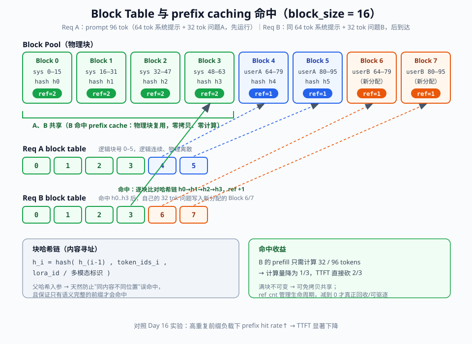
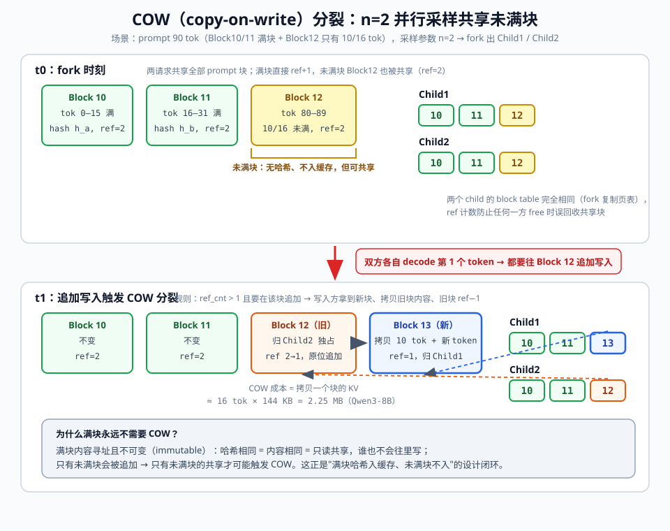

# Day 50：白板四件套（一）——显存估算默写 + Block Table 手绘

> **Week 8 · 面试冲刺 · Day 1**
> 前置知识：Day 2《显存与时延手算公式》、Day 4《PagedAttention 论文精读》、Day 15-16《KV Cache Manager 与 prefix caching》、Day 49（项目讲稿复盘）
> 今日用时：3~4 小时，其中 **≥2 小时在"限时动笔 / 动嘴"**，而不是看新材料

---

## 今日学习目标

| # | 目标 | 验收标准 |
|---|---|---|
| 1 | 默写显存估算 | 任意给定模型 / 精度 / 上下文长度，**3 分钟 / 题**算出 KV 显存与并发上限，数字误差 < 10% |
| 2 | 手绘 Block Table | 不看笔记，**5 分钟内**画完（含 prefix caching 命中、COW 分裂两个场景）并讲完 6 个机制点 |
| 3 | 形成卡壳点清单 | 所有卡壳、代错、讲不圆的点当场记录，当晚定点补漏（本周不发散） |

## 核心概念：白板四件套总览

"白板四件套"是推理系统专家岗面试中最常见的四类**现场演算题**，考察的不是知识面，而是"数字是否长在身体里"：

| 件 | 内容 | 训练日 |
|---|---|---|
| ① 显存估算 | 给定模型 / 精度 / 上下文长度 → 算 KV 显存与并发上限 | **今日** |
| ② Block Table | 画 block pool + 页表映射，含 prefix 命中与 COW 分裂 | **今日** |
| ③ 调度推演 | N 个请求 + 有限 KV，逐 step 推演 running batch / 抢占 / 恢复 | Day 51 |
| ④ 性能诊断树 | TTFT ↑ / ITL ↑ / 吞吐 ↓ 的定位路径与调参动作 | Day 51 |

今天只练前两件。它们分别对应你在 **Day 2**（手算公式）和 **Day 4 / Day 15-16**（PagedAttention 与 KV Cache Manager）建立的知识，今天是把这些知识压缩成**限时肌肉记忆**。

先回顾必须随口说出的术语：GQA 的 `kv_heads`、`block_size`、block table（逻辑块 → 物理块映射）、内容寻址（块哈希链）、引用计数（`ref_cnt`）、COW（copy-on-write）、**满块不可变**。

---

## 一、显存估算默写（3 分钟 / 题）

### 1.1 两个必须肌肉记忆的公式

```
KV cache 每 token 显存：
    k_v = 2 (K+V) × L (layers) × H_kv (kv_heads, GQA!) × D (head_dim) × b (dtype 字节数)

单 token decode 时延下界（memory-bound）：
    TPOT_min ≈ 模型参数字节数 / HBM 带宽
```

> ⚠️ **面试最常见坑**：GQA 模型要代 `kv_heads` 而不是 `q_heads`。Llama-3-70B 是 64 个 Q head / 8 个 KV head——代错直接**高估 8 倍并发**，这是面试官最爱埋的雷。

### 1.2 五步法（口述模板 + 流程图）

拿到任何"某模型 + 某卡 + 某上下文"的题目，按固定节奏走五步（边写边念，面试官看的就是你有没有这套稳定流程）：

```text
① 权重显存        W  = P × b_w
② 每 token KV     k_v = 2 × L × H_kv × D × b_kv     ← 先念 config 再代数
③ KV 池           F_kv = M × u − W − O              ← u = gpu_memory_utilization
④ token 容量      N  = F_kv / k_v
⑤ 并发上限        C  = N / L̄                        ← L̄ = 平均(prompt + 输出)
```

其中：

- `M`：单卡总显存；`u`：`gpu_memory_utilization`（默认 0.9）
- `O`：**预留开销**（激活峰值 + CUDA Graph + NCCL buffer + 框架 / 碎片），经验值 **4~10 GB**——V1 里它不是拍的，是启动时 profile run 实测出来的（见 1.6）
- `b_kv`：KV cache 的 dtype 字节数（BF16=2、FP8=1），**注意它和权重的 `b_w` 可以不同**（权重 FP8 + KV BF16 是常见配置）

```svg
<svg xmlns="http://www.w3.org/2000/svg" viewBox="0 0 960 740" font-family="'Segoe UI', 'PingFang SC', 'Microsoft YaHei', sans-serif">
  <defs>
    <marker id="arrow" markerWidth="10" markerHeight="8" refX="8" refY="4" orient="auto">
      <path d="M0,0 L10,4 L0,8 Z" fill="#475569"/>
    </marker>
  </defs>
  <rect width="960" height="740" fill="#fafbfc"/>
  <text x="480" y="38" text-anchor="middle" font-size="24" font-weight="700" fill="#0f172a">显存估算五步法（示例：Qwen3-8B BF16 · A100-80G · 4K 上下文）</text>

  <!-- Step 1 -->
  <rect x="70" y="66" width="820" height="78" rx="10" fill="#eff6ff" stroke="#2563eb" stroke-width="1.5"/>
  <circle cx="106" cy="105" r="17" fill="#2563eb"/>
  <text x="106" y="111" text-anchor="middle" font-size="16" font-weight="700" fill="#ffffff">1</text>
  <text x="138" y="98" font-size="16" font-weight="700" fill="#0f172a">预留显存总量</text>
  <text x="138" y="122" font-size="13" fill="#475569">M × gpu_memory_utilization（默认 u = 0.9）</text>
  <text x="866" y="112" text-anchor="end" font-size="18" font-weight="700" fill="#2563eb" font-family="Consolas, monospace">80 GB × 0.9 = 72 GB</text>

  <line x1="480" y1="144" x2="480" y2="170" stroke="#475569" stroke-width="2" marker-end="url(#arrow)"/>

  <!-- Step 2 -->
  <rect x="70" y="172" width="820" height="78" rx="10" fill="#fef2f2" stroke="#dc2626" stroke-width="1.5"/>
  <circle cx="106" cy="211" r="17" fill="#dc2626"/>
  <text x="106" y="217" text-anchor="middle" font-size="16" font-weight="700" fill="#ffffff">2</text>
  <text x="138" y="204" font-size="16" font-weight="700" fill="#0f172a">减：模型权重</text>
  <text x="138" y="228" font-size="13" fill="#475569">W = P × b_w（参数量 × 权重 dtype 字节；TP 下每卡 ÷ TP）</text>
  <text x="866" y="218" text-anchor="end" font-size="18" font-weight="700" fill="#dc2626" font-family="Consolas, monospace">− 8.2B × 2B = −16.4 GB</text>

  <line x1="480" y1="250" x2="480" y2="276" stroke="#475569" stroke-width="2" marker-end="url(#arrow)"/>

  <!-- Step 3 -->
  <rect x="70" y="278" width="820" height="78" rx="10" fill="#fef2f2" stroke="#dc2626" stroke-width="1.5"/>
  <circle cx="106" cy="317" r="17" fill="#dc2626"/>
  <text x="106" y="323" text-anchor="middle" font-size="16" font-weight="700" fill="#ffffff">3</text>
  <text x="138" y="310" font-size="16" font-weight="700" fill="#0f172a">减：预留开销 O（经验 4~10 GB）</text>
  <text x="138" y="334" font-size="13" fill="#475569">激活峰值（profile run 实测）+ CUDA Graph + NCCL buffer + 框架/碎片</text>
  <text x="866" y="324" text-anchor="end" font-size="18" font-weight="700" fill="#dc2626" font-family="Consolas, monospace">− 6 GB</text>

  <line x1="480" y1="356" x2="480" y2="382" stroke="#475569" stroke-width="2" marker-end="url(#arrow)"/>

  <!-- Step 4: KV pool -->
  <rect x="70" y="384" width="820" height="78" rx="10" fill="#f0fdf4" stroke="#16a34a" stroke-width="2"/>
  <circle cx="106" cy="423" r="17" fill="#16a34a"/>
  <text x="106" y="429" text-anchor="middle" font-size="16" font-weight="700" fill="#ffffff">4</text>
  <text x="138" y="416" font-size="16" font-weight="700" fill="#0f172a">KV 池 F_kv（对应启动日志 "GPU KV cache size"）</text>
  <text x="138" y="440" font-size="13" fill="#475569">F_kv = M × u − W − O</text>
  <text x="866" y="430" text-anchor="end" font-size="18" font-weight="700" fill="#16a34a" font-family="Consolas, monospace">= 49.6 GB</text>

  <line x1="480" y1="462" x2="480" y2="488" stroke="#475569" stroke-width="2" marker-end="url(#arrow)"/>

  <!-- Step 5 -->
  <rect x="70" y="490" width="820" height="78" rx="10" fill="#eff6ff" stroke="#2563eb" stroke-width="1.5"/>
  <circle cx="106" cy="529" r="17" fill="#2563eb"/>
  <text x="106" y="535" text-anchor="middle" font-size="16" font-weight="700" fill="#ffffff">5</text>
  <text x="138" y="522" font-size="16" font-weight="700" fill="#0f172a">token 容量 N</text>
  <text x="138" y="546" font-size="13" fill="#475569">N = F_kv ÷ k_v，其中 k_v = 2 × L × H_kv × D × b_kv（GQA 代 kv_heads！）</text>
  <text x="866" y="536" text-anchor="end" font-size="18" font-weight="700" fill="#2563eb" font-family="Consolas, monospace">÷ 144 KB ≈ 336K tokens</text>

  <line x1="480" y1="568" x2="480" y2="594" stroke="#475569" stroke-width="2" marker-end="url(#arrow)"/>

  <!-- Step 6: concurrency -->
  <rect x="70" y="596" width="820" height="88" rx="10" fill="#f0fdf4" stroke="#16a34a" stroke-width="2.5"/>
  <circle cx="106" cy="640" r="17" fill="#16a34a"/>
  <text x="106" y="646" text-anchor="middle" font-size="16" font-weight="700" fill="#ffffff">6</text>
  <text x="138" y="630" font-size="16" font-weight="700" fill="#0f172a">并发上限 C</text>
  <text x="138" y="654" font-size="13" fill="#475569">C = N ÷ L̄，L̄ = 平均(prompt + 输出)；块对齐损耗再乘 ~90%</text>
  <text x="866" y="648" text-anchor="end" font-size="18" font-weight="700" fill="#16a34a" font-family="Consolas, monospace">÷ 4096 ≈ 82 路</text>

  <text x="480" y="716" text-anchor="middle" font-size="13" fill="#64748b">答数量级与口径："A100-80G 单卡 Qwen3-8B BF16，4K 上下文，约 80 路并发"</text>
</svg>
```

### 1.3 数子弹药库（面试前夜只看这页）

**常见模型 config 速查**（面试时若记不清，主动说"我按 config 字段推导"然后念字段——比硬背数字更加分）：

| 模型 | 参数量 | L 层数 | Q heads | KV heads | head_dim | KV/token (BF16) |
|---|---|---|---|---|---|---|
| Llama-3-8B | 8.0B | 32 | 32 | 8 | 128 | **128 KB** |
| Qwen3-8B | 8.2B | 36 | 32 | 8 | 128 | **144 KB** |
| Qwen2.5-32B | 32.5B | 64 | 40 | 8 | 128 | **256 KB** |
| Llama-3-70B | 70.6B | 80 | 64 | 8 | 128 | **320 KB** |

**常见卡带宽速查**（decode 时延下界公式直接用）：

| GPU | HBM | 带宽 |
|---|---|---|
| A100 80G SXM | 80 GB | 2.0 TB/s |
| H100 SXM | 80 GB | 3.35 TB/s |
| H200 | 141 GB | 4.8 TB/s |
| B200 | 192 GB | 8 TB/s |
| RTX 4090 | 24 GB | 1.0 TB/s |

**dtype 字节数**：FP32=4 · BF16/FP16=2 · FP8/INT8=1 · INT4=0.5。

> 💡 **口径声明习惯**：报数字前先说口径（GB 还是 GiB、权重与 KV 的 dtype 是否一致、是否 TP 均分）。GB/GiB 差 7.4%，本来就在 10% 容差内，但**主动声明口径**本身就是加分项。

### 1.4 三道限时自测题（今日核心训练，先遮住答案计时做）

**题 1（3 分钟）**：Qwen3-8B BF16，单卡 A100-80G，`gpu_memory_utilization=0.9`，上下文 4K，能撑多少并发？

<details>
<summary>推导（做完再看）</summary>

```text
① config：36 层，32 Q / 8 KV heads（GQA），head_dim=128
② k_v = 2 × 36 × 8 × 128 × 2B = 147,456 B = 144 KB/token
③ W = 8.2B × 2B ≈ 16.4 GB；O 按 6 GB 计
④ F_kv = 80 × 0.9 − 16.4 − 6 ≈ 49.6 GB
⑤ N = 49.6 GB ÷ 144 KB ≈ 336K tokens（若按 GiB 口径约 361K，差异 7%）
⑥ C = 336K ÷ 4096 ≈ 82 路
```

**答**：约 **80 路上下**（考虑块对齐与 90% 利用率，报 "80 路左右" 完全合格）。

</details>

**题 2（3 分钟）**：Llama-3-70B，权重与 KV 均 FP8，双卡 H100-80G TP=2，上下文 4K，并发上限？

<details>
<summary>推导</summary>

```text
① W（每卡）= 70.6B × 1B ÷ 2 = 35.3 GB
② k_v（每卡，8 个 KV heads 被 TP=2 均分为 4 个）
   = 2 × 80 × 4 × 128 × 1B = 81,920 B = 80 KB/token
③ F_kv（每卡）= 80 × 0.9 − 35.3 − 4 ≈ 32.7 GB
④ N = 32.7 GB ÷ 80 KB ≈ 399K tokens/卡
⑤ C = 399K ÷ 4096 ≈ 97 路
```

**答**：约 **100 路**。关键得分点：TP 下 **KV heads 也要均分**（80 层 × 4 heads）——很多人只除了权重忘了除 KV。

</details>

**题 3（2 分钟，Day 2 原题回收）**：Llama-3-70B FP8 权重在 H100（3.35 TB/s）上，decode TPOT 下界是多少？

<details>
<summary>推导</summary>

```text
① 每 token 需读全部权重一次：70.6 GB ÷ 3.35 TB/s ≈ 21.1 ms
② → TPOT_min ≈ 21 ms，即单序列 decode 上限 ≈ 47 tok/s
```

**追问预备**：
- BF16 权重呢？→ 141.2 GB ÷ 3.35 TB/s ≈ 42 ms → 24 tok/s
- 为什么能忽略 KV 读？→ 4K 上下文 KV = 4096 × 320 KB ≈ 1.25 GB，不到权重读的 1%（GQA 功劳）
- TPOT 实际值为什么高于下界？→ attention kernel 开销 + 调度 + 通信 + batch 放大（batch 内并发序列的 KV 读会叠加）
- TP=2 会让下界减半吗？→ 每卡只读一半权重（10.5 ms），但要加上每层 all-reduce 通信开销，**通信占比是 TP 的核心代价**（Day 33 实验验证过）

</details>

### 1.5 高频坑清单（每次默写后对照打钩）

| # | 坑 | 后果 | 纠正 |
|---|---|---|---|
| 1 | GQA 代 `q_heads` | 70B 并发高估 8 倍 | 公式里写死 `H_kv`，念出 "GQA 用 kv heads" |
| 2 | TP 忘了均分 KV heads | 并发高估 TP 倍 | TP 下权重、KV heads 都 ÷ TP |
| 3 | 忘记 ×2（K 和 V 各一份） | 低估一半 | 先写 2 再写其它因子 |
| 4 | 权重 FP8 但 KV 仍 BF16，却统一按 1B 算 | 高估 KV 池 | `b_w` 与 `b_kv` 分开代 |
| 5 | 并发只除以 prompt 长度 | 高估并发——**decode 增长才是挤爆池的主力** | L̄ = prompt + 期望输出（衔接 Day 12 抢占的根源） |
| 6 | 忘减 O（激活/图/通信预留） | 高估 5~15% | 经验值 4~10 GB，声明这是 profile 实测项 |
| 7 | `kv_heads < TP` 时还硬上 TP | 无法均分，KV 冗余复制 | Qwen3-8B 只有 8 个 KV heads → TP ≤ 8 |

### 1.6 与 vLLM V1 的实际联系：启动日志交叉验证

上面第 ③ 步的 `O` 不是玄学。V1 启动时会**做一次 profile run**（空跑一个最大 batch 的 forward）实测激活峰值，然后自动完成与我们手算完全相同的减法：

```text
vllm/v1/worker/gpu_model_runner.py   →  initialize_memory() / profile_run()
                                            （实测峰值激活，决定可用显存）
vllm/v1/worker/gpu_worker.py         →  determine_num_available_blocks()
                                            （可用显存 ÷ 每块字节数 → 块数）
```

启动日志会直接打印两行"标准答案"（函数名随版本可能微调，日志本身稳定）：

```text
INFO ... GPU KV cache size: 336,000 tokens
INFO ... Maximum concurrency for 4096 tokens per sequence: 82.0x
```

**今日实验 B 就是用这两行日志给手算打分**（见第五节）。这也是 Day 37 "改之前先量化" 的同款方法论：估算 → 实测 → 对账 → 修正经验参数（`O` 的取值）。

---

## 二、Block Table 白板手绘（5 分钟版）

### 2.1 一分钟基础版：OS 分页类比

先画最简三层，台词只有三句：

```text
请求逻辑序列:  [tok0][tok1][tok2]...[tok95]        ← 逻辑上连续
                     │ block table（页表）
                     ▼
物理块:        Block4 ← Block0 → Block7 → Block2   ← 物理上离散
               （block pool 里任何空闲块都行）
```

1. "block table 就是逻辑块号到物理块的映射表，**等价 OS 分页**——逻辑连续、物理离散"
2. "固定 `block_size`（默认 16）切分，消灭外碎片；内碎片上界每序列 `block_size−1` 个 token"
3. "每个物理块带 `ref_cnt` 引用计数，为共享与 COW 打基础"

这个基础版 30 秒画完。下面两个场景各花 2 分钟展开——这才是区分度所在。

### 2.2 场景一：prefix caching 命中

**场景设定**（边写边念，让面试官跟上设定）：`block_size=16`；请求 A 的 prompt 96 tok（64 tok 系统提示 + 32 tok 问题A）先运行；请求 B（**相同 64 tok 系统提示** + 32 tok 问题B）后到达。

```text
Block Pool（block_size = 16）

  Block0      Block1      Block2      Block3      Block4      Block5
┌──────────┬──────────┬──────────┬──────────┬──────────┬──────────┐
│ sys 0-15 │ sys16-31 │ sys32-47 │ sys48-63 │ userA    │ userA    │
│ hash=h0  │ h1       │ h2       │ h3       │ h4       │ h5       │
│ ref=2    │ ref=2    │ ref=2    │ ref=2    │ ref=1    │ ref=1    │
└──────────┴──────────┴──────────┴──────────┴──────────┴──────────┘
     ↑ ref=2：A、B 共享（B 命中 prefix cache，零拷贝零计算）

Req A block table: [0, 1, 2, 3, 4, 5]   ← 逻辑连续、物理离散
Req B block table: [0, 1, 2, 3, 6, 7]   ← 命中 h0..h3；B 的 32 tok
                                            问题写入新分配的 Block6/7
```



**讲解要点**（对着图讲）：

1. **命中路径**：B 到达 → 沿哈希链逐块比对（h0 → h1 → h2 → h3）→ 4 块全中 → 每块 `ref_cnt +1` → `num_computed_tokens = 64`
2. **收益**：B 的 prefill 只需计算 32 / 96 tokens，计算量降为 1/3 → **TTFT 直接砍 2/3**；省下的 FLOPs 去服务别的请求 → goodput 提升（Day 16 实验、Day 47 消融第 ② 组验证过）
3. **哈希为什么带父哈希**：`h_i = hash(h_{i-1}, token_ids_i, lora/mm 标识)` —— 哈希链保证只有**语义完整的前缀**才可能命中，天然防止"同内容出现在不同位置"的误命中

### 2.3 场景二：COW 分裂

**场景设定**：prompt 90 tok（5 个满块 + 1 个只有 10/16 tok 的**未满块**），采样参数 `n=2` → V1 在 prefill 后 fork 出两个 child，共享全部 prompt 块。双方各自 decode 第一个 token 时，都要往那个未满块**追加写入**——冲突出现。



**讲解要点**：

1. **触发条件**（一句话）：`ref_cnt > 1` 且要在这个块上追加写入（只可能是未满块）
2. **动作**：写入方新分配一块 → 拷贝旧块内容 → 页表改指新块 → 旧块 `ref_cnt −1`
3. **成本**：一次块拷贝 ≈ `block_size × k_v` = 16 × 144 KB ≈ **2.25 MB**（Qwen3-8B），μs~ms 级，**从来不是性能瓶颈，是正确性机制**
4. **为什么 fork 时不直接复制**：惰性复制——大部分共享块是满块、只读、永远不触发写；真正付拷贝的只有那个未满尾块一次（OS `fork()` 同款思想）
5. **满块为什么永远不 COW**：满块内容寻址且**不可变**（哈希相同 = 内容相同 = 只读共享）；"满块哈希入缓存、未满块不入"是同一套设计闭环

### 2.4 60~90 秒讲解脚本（背下来，录像用）

| # | 台词（骨架） | 对应知识 |
|---|---|---|
| 1 | block table = 逻辑块 → 物理块映射，等价 OS 分页，逻辑连续物理离散 | Day 4 / Day 15 |
| 2 | 块哈希 = hash(**父块哈希** + 本块 token ids + LoRA/多模态标识)，哈希链保证前缀语义正确 | Day 16 |
| 3 | 命中路径：B 到达 → 逐块比对哈希链 → h0..h3 命中 → ref+1 → prefill 只算 32 tok，TTFT 砍 2/3 | Day 16 |
| 4 | COW：共享**未满块**要追加写入时——新块拷贝、旧块 ref−1（典型：n>1 / beam search 分叉） | 今日 2.3 |
| 5 | 满块不可变、可免拷贝共享；未满块可共享但追加时 COW | 今日 2.3 |
| 6 | 内碎片上界 = 每 seq `(block_size−1)` 个 padding token，均值 `block_size/2` —— 这就是论文里"浪费 60-80% → 接近 0"的来源 | Day 4 / 今日 3.1 |

### 2.5 两个加分细节（面试官追问时才展开）

- **命中粒度是满块**：未满块不入哈希表 → 共享前缀长度不是 16 的倍数时，尾部零头命中不了（今日自测题 3 专门考这个）
- **释放 ≠ 删除**：请求结束时 `ref_cnt` 减到 0 的带哈希满块**不立即清哈希**，成为 evictable 块挂在 free 队列里，下次同前缀请求仍可命中；物理块不够时按队列序（近似 LRU）驱逐。这也解释了 Day 12 的一个现象：**被抢占的请求重算时，之前算好的满块可能又被自己命中**，实际重算量小于 `num_computed_tokens`

---

## 三、原理深入：这些数字为什么是对的

### 3.1 碎片率：从 60-80% 到 ~0 的完整推导

**PagedAttention 之前（连续分配）**：

```text
每请求预留 max_model_len 的连续 KV 空间
  内碎片 = (L_max − L_act) × k_v        （L_act = 实际 prompt + 生成长度）
  利用率 = L_act / L_max
例：max_model_len = 2048，实际平均用 200 tok → 利用率 ≈ 10%
外碎片：变长请求反复 malloc/free 后，空闲总量够但没有连续大块
论文实测（SOSP'23）：总浪费 60-80%，即有效利用率仅 20-40%
```

**PagedAttention 之后（block_size = b）**：

```text
内碎片：每 seq 至多 (b−1) 个 padding token，期望 b/2
        相对浪费 = (b/2) / L̄          ← L̄=1000, b=16 → 0.8%；L̄=200 → 4%
外碎片：0（所有块同尺寸）
新开销①页表：每 seq ⌈L/b⌉ × 4B ≈ 1KB（4K 上下文）vs 该 seq KV 576MB → 可忽略
新开销②间接寻址：attention kernel 经 block table 取物理块号，每块一次额外读
```

> 一句话收口："分页用每 seq 期望半个块的 padding + 页表开销，换掉了 60-80% 的浪费——**这就是 PagedAttention 的全部显存收益**。"

### 3.2 prefix 命中的 TTFT 收益公式

```text
设命中比例 h = 命中 token 数 / prompt token 数

TTFT_hit ≈ (1 − h) × T_compute + T_attn(未命中对全前缀) + ε

简化口径（面试够用）：TTFT_hit ≈ (1 − h) × TTFT_full + ε
本例：h = 64/96 → TTFT ≈ 1/3 × TTFT_full
```

为什么**不是精确按比例**（Q6 会追问）：

- ε：tokenize、排队、调度、首 token 采样、网络等固定开销不缩
- 未命中 token 的 attention 仍要**读**全部命中 KV（读不省，只省写与 GEMM 主体）
- 命中以满块对齐，h 只能取 `⌊共享长度/b⌋ × b / L_prompt` 的离散值

### 3.3 COW 成本的数量级

```text
一次 COW = 拷贝一个物理块
        ≈ b × k_v = 16 × 144 KB = 2.25 MB（Qwen3-8B）
        @ A100 2TB/s 纯带宽 ≈ 1.1 μs，实际以 kernel launch / 拷贝调用开销为主（μs~ms）

触发频率：每个 fork 出的 child 只在"第一次追加共享未满块"时付一次
结论：COW 是正确性机制，不是性能话题（面试这样说就是加分）
```

### 3.4 并发上限公式的修正项（把 1.2 的五步法说圆）

```text
C = η_block × N / L̄
    η_block ≈ 1 − b/(2L̄)          ← 块对齐损耗（90%~99%）
    prefix 命中：共享块只占一份物理空间 → 有效并发进一步上浮
    注意：准入只校验 prompt 块需求，decode 增长是渐进的
         → L̄ 估计偏小时会触发抢占（Day 12 / Day 51 的主题）
```

---

## 四、关键代码与调用链（vLLM V1）

> 以 V1 主线（约 v0.8~v0.10）为准；类与函数名偶有重命名（如 `_schedule_prefills` 的拆分调整），**读代码时以调用关系为准**。

**链路 1：新请求调度 + 前缀命中**

```text
vllm/v1/core/scheduler.py
  Scheduler.schedule() / _schedule_prefills()
    → KVCacheManager.get_computed_blocks(request)            # 前缀命中
        → kv_cache_utils.hash_request_tokens()                # 逐块构建哈希链
            → hash_block_tokens(parent_hash, token_ids, extra_keys)
        → BlockPool.cached_block[hash] 查表                   # Dict[BlockHash, KVCacheBlock]
        # 命中块 ref_cnt +1；结果写回 request.num_computed_tokens
    → KVCacheManager.allocate_slots(...)                      # 为未命中 token 分配块
```

`hash_block_tokens` 的本质就是元组哈希（父哈希入参是关键）：

```python
# vllm/v1/core/kv_cache_utils.py（简化示意）
def hash_block_tokens(parent_block_hash, curr_block_token_ids, extra_keys=None):
    if parent_block_hash is None:
        parent_block_hash = 0
    if extra_keys is None:          # extra_keys: (lora_id, 多模态 item 哈希)
        return hash((parent_block_hash, tuple(curr_block_token_ids)))
    return hash((parent_block_hash, tuple(curr_block_token_ids), extra_keys))
```

**链路 2：decode 追加 + COW**

```text
每 step decode（running 队列，每请求 num_new_tokens 个新 token）
  → KVCacheManager.allocate_slots(...)
    → 尾块未满且有空槽：BlockPool.append_slot(block)
        ref_cnt == 1 → 原位追加，返回 None（零成本）
        ref_cnt >  1 → COW：分配新块 → 拷贝 → 旧块 ref−1 → 返回新块
    → 需要新块：BlockPool.allocate_block()（空闲队列取；不够则驱逐队首 evictable 块）
```

**链路 3：n>1 fork**

```text
采样参数 n > 1 → Scheduler 在 prefill 完成后 fork 出 n 个 child
  → KVCacheManager.fork(parent_id, child_id)
      页表复制；共享块 ref_cnt +1
      未满尾块在各方首次追加时走链路 2 的 COW 分裂
```

**链路 4：释放与驱逐**

```text
请求 finish / 被抢占
  → KVCacheManager.free(request_id) → BlockPool 逐块 ref_cnt −1
      减到 0 且带哈希的满块 → 挂回 free 队列但保留哈希（evictable，可再命中）
      分配时物理块不足 → 按队列序驱逐最旧 evictable 块（近似 LRU）
```

这四条链路把 Day 15（分配）、Day 16（哈希与 COW）、Day 12（抢占释放）串成了一张图——面试画 block table 时**顺手报出链路 1 和链路 2 的函数名**，就是源码熟练度的直接证据。

---

## 五、动手实验（今日训练流程）

### 实验 A：三题限时默写（约 30 分钟，必做）

1. 遮住 1.4 的答案，手机计时，逐题在白纸/白板上做（**必须动笔，不能只用眼睛过**）
2. 填写计分表：

| 题 | 限时 | 实际用时 | 关键数字 | 误差 | 卡壳点 |
|---|---|---|---|---|---|
| 1 Qwen3-8B @ A100 | 3 min | | C ≈ 82 路 | | |
| 2 70B FP8 TP=2 @ H100 | 3 min | | C ≈ 97 路 | | |
| 3 70B FP8 TPOT 下界 | 2 min | | ≈ 21 ms | | |

3. 验收：总时长 ≤ 10 min 且误差 < 10% 为通过；不通过则看卡壳点回 1.5 坑清单，明早重做一遍

### 实验 B：启动日志对账（约 30 分钟，有 GPU 则必做）

```bash
vllm serve Qwen/Qwen3-8B \
  --gpu-memory-utilization 0.9 \
  --max-model-len 4096
```

观察日志两行"标准答案"，与手算对账：

```text
INFO ... GPU KV cache size: XXX,XXX tokens            ← 对账 N ≈ 336K
INFO ... Maximum concurrency for 4096 tokens per sequence: XX.Xx   ← 对账 C ≈ 82
```

变体（每个 2 分钟，强化公式直觉）：

- `--max-model-len 8192` → 观察 C **减半**（C ∝ 1/L̄）
- `--kv-cache-dtype fp8` → 观察 N **翻倍**（k_v 减半，Day 23 联动）
- 误差 > 10% → 回查 `O` 的取值或 config 记忆（误差主要来自激活实测值 vs 经验值）

### 实验 C：白板画图 ×2 + 录像（约 60~90 分钟，必做）

1. 第 1 遍：可看笔记，把 2.2 / 2.3 两个场景画全（建立动作记忆）
2. 第 2 遍：擦掉，**不看笔记**，5 分钟内画完两个场景，并按 2.4 的 6 点脚本讲 60~90 秒，手机录像
3. 回放打分：结构完整 / 6 点齐全 / 有数字（block_size、ref、token 数）/ 无长时间卡壳
4. 卡壳点写入清单，今晚补，Day 51 开练前先过一遍

---

## 六、面试高频问题（先自答，再看要点）

**Q1：A100-80G 单卡跑 Qwen3-8B BF16，`max_model_len=8K`，能撑多少并发？TPOT 什么水平？**
> 并发：N ≈ 336K 不变，C = 336K ÷ 8192 ≈ **41 路**；TPOT 下界 = 16.4 GB ÷ 2 TB/s ≈ **8 ms**（单序列 ~120 tok/s），实际 10~15 ms。加分：TPOT 随并发近似不变（权重读按 batch 摊平），但 KV 读随 batch 线性增长 → batch 很大时 TPOT 缓慢上升。

**Q2：KV 显存公式里为什么是 kv_heads？代 q_heads 会怎样？**
> KV cache 只存 K/V head，与 Q head 数无关；Llama-3-70B 是 64Q/8KV，代错**高估并发 8 倍**。反手补一句：MLA（DeepSeek-V3）连 kv_heads 都没有，公式退化为 `L × (kv_lora_rank + rope_dim) × b`（见自测题 1）。

**Q3：FP8 KV cache 什么时候值得开？**
> 容量 ×2 → 并发 ×2（或同并发下省一半 KV 显存）；代价是精度（长上下文检索类任务更敏感，Day 23 实验过）。生产建议灰度 + 回归评测，配合 KV 量化感知较强的模型（官方 FP8 checkpoint）。

**Q4：TP 为什么能"解锁"大模型，却可能伤 TPOT？**
> 大模型（70B FP8 单卡 70.6GB）单卡放不下 → TP 均分权重与 KV heads 后放得下（今日题 2）；但对单卡能放下的模型，TP 每层引入 all-reduce，decode 小 batch 下通信占比极高 → TPOT 恶化（Day 33 用 nsys 看过 NCCL 占比）。口径："**能单卡放下就别上 TP**"。

**Q5：block_size 为什么是 16？设成 1 或 256 会怎样？**
> 大 b：内碎片 ↑（期望 b/2 per seq）、prefix 共享粒度变粗；小 b：页表项多、gather 间接寻址次数多、哈希链变长。16 是权衡量，不同 attention 后端支持 8/32 等。

**Q6：prefix caching 命中时 TTFT 为什么不是精确按命中比例下降？**
> ① 固定开销不缩（ε）；② 未命中 token 的 attention 仍要读全部命中 KV；③ 命中以满块对齐，h 是离散值（见 3.2）。

**Q7：COW 什么时候触发？为什么设计成写时复制而不是 fork 时直接复制？**
> `ref_cnt > 1` 且在未满块上追加写入。fork 时复制是浪费——绝大多数共享块是只读满块、永远不会写；惰性复制只在真正写的那一方付一次 2.25 MB 级块拷贝。OS `fork()` 同款思想。

**Q8：碎片率 60-80% 怎么算出来的？**
> 连续预留 `max_model_len` → 内碎片 = (L_max − L_act)/L_max；变长负载反复分配释放 → 外碎片；两者叠加论文实测 60-80%。分页后内碎片期望 b/2 per seq（相对 ~1%）、外碎片 0。

**Q9：你的手算和 vLLM 实际给的并发差在哪？**
> `O` 项：vLLM 是 profile run 实测峰值激活 + CUDA Graph 池 + NCCL buffer，我用经验值 4-10 GB；另有块对齐、capture sizes 预留。对账方法：启动日志 "GPU KV cache size" 与 "Maximum concurrency" 两行（今日实验 B）。

---

## 今日总结

| 主题 | 一句话带走 |
|---|---|
| 显存估算 | 两个公式 + 五步法（M×u → −W → −O → ÷k_v → ÷L̄），3 分钟出数，误差 <10% |
| 最大坑 | GQA 代 `kv_heads`；TP 下 KV heads 均分；`b_w` 与 `b_kv` 分开代 |
| Block Table | OS 分页 + 内容寻址（父哈希链）+ 引用计数/COW；满块不可变是设计闭环 |
| 命中与 COW | 命中粒度 = 满块；COW 触发 = 共享未满块追加；成本 MB 级非瓶颈 |
| 验证方法 | 启动日志两行"标准答案"给手算对账（O 是 profile 实测项） |

明天 Day 51 练白板四件套后两件：**调度推演**（10 个请求逐步演算 running/preempt/恢复）与**性能诊断树**——今天的并发公式与 block 生命周期正是推演的"棋子"。

---

## 今日自测题

1. **MLA 变体**：DeepSeek-V3（61 层，`kv_lora_rank=512`，`qk_rope_head_dim=64`）的 KV/token 公式怎么写？BF16 下是多少？与 Llama-3-70B（320 KB/token）差几倍？
2. **手算**：Qwen2.5-32B BF16，2×A100-80G TP=2，4K 上下文，并发上限？（答约 64 路）
3. **画图**：`block_size=8`，A 的 prompt=20 tok；B 与 A 共享前 12 tok。画出两者 block table，B 命中几块？实际 prefill 计算几个 token？
4. **口述**：不看笔记，60~90 秒讲完 2.4 的 6 个机制点并录像。

<details>
<summary>自测题参考答案</summary>

1. `k_v = L × (kv_lora_rank + qk_rope_head_dim) × b = 61 × 576 × 2B = 70,272 B ≈ 68.7 KB/token`（无 ×2、无 kv_heads——latent 单份存储）；比 Llama-3-70B 小约 **4.7×**，这是 DeepSeek 做超长上下文的关键之一。
2. W/卡 = 65 GB ÷ 2 = 32.5 GB；k_v/卡 = 2 × 64 × 4 × 128 × 2B = 128 KB；F_kv = 72 − 32.5 − 5 = 34.5 GB；N = 34.5 GB ÷ 128 KB ≈ 263K；C = 263K ÷ 4096 ≈ **64 路**。
3. A：Block0[0–7 满，h0]、Block1[8–15 满，h1]、Block2[16–19，4/8 未满]；B 只命中 **Block0 一块**（B 的 token 8–19 与 A 不同，Block1 哈希不同；Block2 未满不入缓存）→ B prefill 计算 20 − 8 = **12 个 token**。讲点：命中粒度 = 满块。
4. 对照 2.4 表格自评。

</details>

---

## 今日产出物

- [ ] 限时训练计分表（3 题 × 用时 / 误差 / 卡壳点）
- [ ] 两张白板照片（prefix 命中、COW 分裂）
- [ ] 一段 60~90 秒讲解录音 / 录像
- [ ] 卡壳点清单（当晚定点补，Day 51 开练前先过一遍）
- [ ] （有 GPU）启动日志对账截图（手算 vs `GPU KV cache size` / `Maximum concurrency`）

> **打卡句**：`Day 50：三题 __ 分 / 白板 __ 分钟，卡壳点：______`
