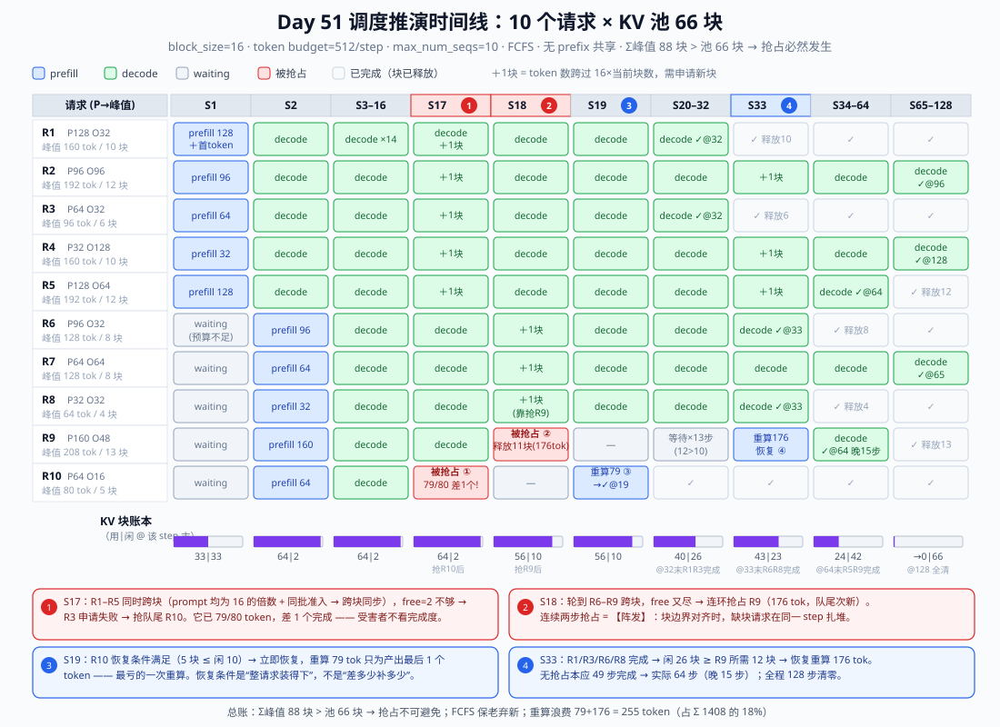
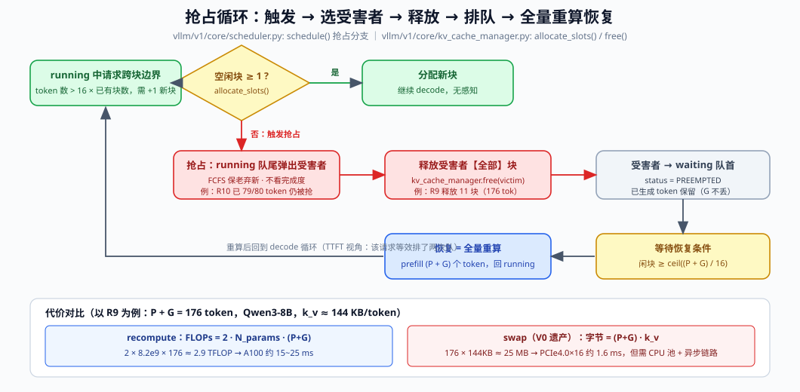
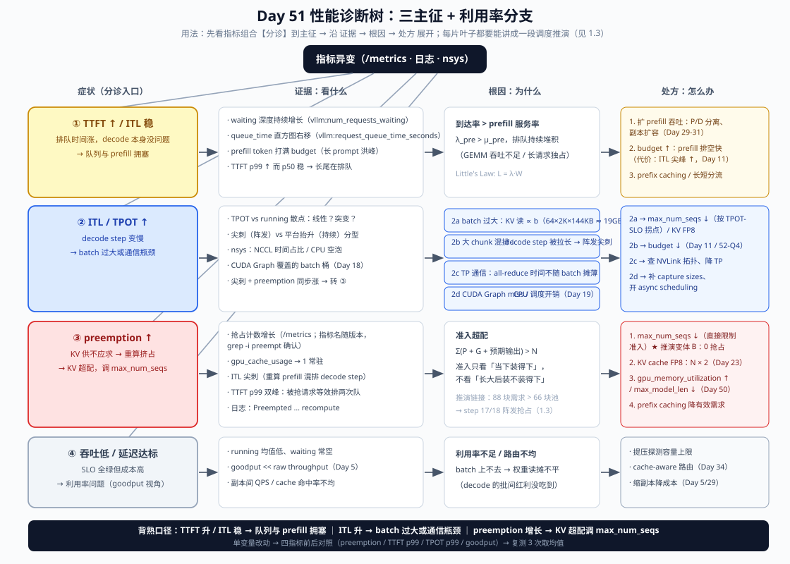

# Day 51：白板四件套（二）——调度推演 + 性能诊断树

> **Week 8 · 面试冲刺 · Day 2**
> 前置知识：Day 10-13（Scheduler 三连与调度行为验证）、Day 11（chunked prefill）、Day 12（preemption）、Day 15-16（KV Cache Manager）、Day 19（async scheduling）、Day 50（显存估算与 Block Table——今天的"棋子"就是昨天算的"账本"）
> 今日用时：3~4 小时，其中 **≥2.5 小时在白板/纸上推演与口述**，新材料阅读 ≤30 分钟

---

## 今日学习目标

| # | 目标 | 验收标准 |
|---|---|---|
| 1 | 调度推演 | 给定 10 个请求 + KV 容量，**10 分钟内**逐 step 推演出 running batch、抢占与恢复，事件因果无漏洞 |
| 2 | 性能诊断树 | **5 分钟内**默画三主征分诊树；每个叶子能报出：看什么指标 → 什么根因 → 什么处方 → 什么副作用 |
| 3 | 推演 ↔ 诊断互证 | 诊断树的每片叶子都能讲成一段推演（"为什么 preemption 增长要调 `max_num_seqs`"能用棋局推出来） |
| 4 | 卡壳点清单 | 延续 Day 50 的清单，今天新增卡壳点当晚定点补漏 |

## 核心概念：从"静态账本"到"动态棋局"

Day 50 练的是**账本**：给定静态约束（模型 / 显存 / 上下文），算出容量上限——数字是对的就行。今天练的是**棋局**：约束随时间演化（请求进出、KV 增长、块耗尽），要推演出系统的**行为序列**。

| 件 | 内容 | 性质 | 训练日 |
|---|---|---|---|
| ① 显存估算 | 约束 → 容量 | 静态账本 | Day 50 ✅ |
| ② Block Table | 映射与共享机制 | 静态账本 | Day 50 ✅ |
| ③ 调度推演 | 请求集 + 容量 → 每 step 行为 | **动态棋局（正向模拟）** | **今日** |
| ④ 性能诊断树 | 线上症状 → 根因 + 处方 | **动态棋局（反向推理）** | **今日** |

两者是一体两面：**推演是正向模拟器**（输入请求流和容量，输出会发生什么），**诊断是反向推理机**（输出了异常症状，反推哪个约束被违反了）。面试官考推演，是验证你是否真的理解 scheduler 的因果链而不是背名词；考诊断树，是验证你在生产事故里能否 3 分钟给出正确动作。

---

## 一、调度推演：10 个请求、KV 只够一部分

### 1.1 先立规矩：推演规则书（5 条）

推演翻车的第一原因不是算力不够，而是**规则没对齐**——面试官脑子里有一套规则，你脑子里有另一套。所以白板第一件事：先把规则写出来（这本身是加分项，说明你知道哪些行为是算法决定的、哪些是简化）。

```text
规则 1（双队列 + 准入三闸门）
  waiting (FCFS) / running。每个 step 先尝试从 waiting 准入，三条全过才放行：
  ① running + 新准入 ≤ max_num_seqs        （条数闸门）
  ② 本 step prefill token + decode token ≤ max_num_batched_tokens（预算闸门）
  ③ 空闲 KV 块 ≥ ceil(prompt / block_size)  （容量闸门）
  然后为 running 中每条请求排 1 个 decode token。

规则 2（KV 按需增长）
  token 落在当前未满块里；当 token 数超过 16 × 已有块数时，申请 1 个新块。
  申请失败 → 触发抢占。

规则 3（抢占：FCFS 保老弃新）
  从 running 队尾弹出受害者（= 最新进来的那条），释放其【全部】块，
  状态 → PREEMPTED，放入 waiting 队首；已生成 token 不丢。

规则 4（恢复 = 全量重算）
  恢复条件：空闲块 ≥ ceil((prompt + 已生成) / 16)。
  恢复方式：重新 prefill 全部 (prompt + 已生成) 个 token —— 无增量恢复。

规则 5（完成）
  token 数达到 prompt + max_output → FINISHED，释放全部块、出队。
  注：prefill 所在的 step 同时产出该请求的第 1 个 output token。
```

这套规则对应的 V1 源码锚点（Day 10-15 走读过，今天只引用不重读）：

| 规则 | V1 源码锚点 | 走读日 |
|---|---|---|
| 每 step 准入 + 抢占决策 | `vllm/v1/core/scheduler.py: Scheduler.schedule()` | Day 10-12 |
| waiting / running 双队列 | 同上 `self.waiting` / `self.running` | Day 10 |
| 两个闸门 | `SchedulerConfig.max_num_seqs` / `max_num_batched_tokens` | Day 10-11 |
| 块按需分配 / 整请求回收 | `vllm/v1/core/kv_cache_manager.py: allocate_slots() / free()` | Day 15 |
| PREEMPTED → waiting → 重算 | `RequestStatus.PREEMPTED`（V1 仅 recompute 模式，swap 为 V0 遗产，见 1.4） | Day 12 |
| 调度结果交给执行层 | `SchedulerOutput` → `gpu_model_runner`（async scheduling 下提前一拍，Day 19） | Day 8-9, 19 |

> ⚠️ **简化声明（面试时要主动说出口的口径）**：真实 V1 有三处与本规则书不同——① chunked prefill 默认开启，预算不够时新请求会**切块进入**而不是整条等待（1.6 变体 A 展开）；② 抢占受害者的具体挑选、被抢请求在 waiting 中的位置、预算的预留在版本间有微调；③ KV 分配有块对齐 / watermark 等细节。白板推演用简化规则，结论（什么时候抢占、抢谁、代价多大）不变。

### 1.2 题目卡与"总账"（先算总量，再落第一子）

**容量与闸门**（toy 数字，方法直接迁移到真实规模——真实规模就是 Day 50 的公式）：

- KV 池：**66 块 × block_size 16 = 1056 token**（对比真实：Qwen3-8B / A100-80G 约 336K token，见 Day 50 实验 B）
- `max_num_batched_tokens = 512`，`max_num_seqs = 10`
- 10 个请求 t=0 同时到达，FCFS 顺序 R1..R10，无 prefix 共享：

| 请求 | prompt | 输出上限 | 峰值 token | 峰值块数 |
|---|---|---|---|---|
| R1 | 128 | 32 | 160 | 10 |
| R2 | 96 | 96 | 192 | 12 |
| R3 | 64 | 32 | 96 | 6 |
| R4 | 32 | 128 | 160 | 10 |
| R5 | 128 | 64 | 192 | 12 |
| R6 | 96 | 32 | 128 | 8 |
| R7 | 64 | 64 | 128 | 8 |
| R8 | 32 | 32 | 64 | 4 |
| R9 | 160 | 48 | 208 | 13 |
| R10 | 64 | 16 | 80 | 5 |
| **Σ** | **864** | **544** | **1408** | **88** |

**总账三行（推演的"定调"，必须先说）**：

1. Σ prompt = 864 token（54 块）≤ 66 块 → **全部进得了门**（容量闸门当时过得去）；
2. Σ 峰值 = 88 块 > 66 块 → **注定有人被抢占**——问题只是落在谁头上、什么时候落；
3. 预算检查：step 1 最多准入 R1–R5（448 ≤ 512），R6 的 96 token 放不下 → 排队（chunked 变体见 1.6）。

> 💡 面试官最想听的就是第 2 行。它证明你看的是全局约束而不是逐步碰运气——这正是 Day 12 "抢占的触发条件"和 Day 14 复盘"10 个请求 KV 只够 6 个"的正式打法。

### 1.3 逐 step 推演（主表）



对应的关键 step 台账（白板上就画这两行的压缩版）：

| Step | 准入 / 事件 | running | 块（用/闲） | 关键因果 |
|---|---|---|---|---|
| 1 | 准入 R1–R5（448 ≤ 512；R6 的 96 放不下 → 排队） | 5 | 33/33 | 预算闸门先于容量闸门生效 |
| 2 | 准入 R6–R10（416 prefill + 5 decode = 421 ≤ 512） | 10 | 64/2 | 10 条全 running；**闲块只剩 2 → 危险信号** |
| 3–16 | 全 decode | 10 | 64/2 | 新 token 都落在各请求的未满块里，不申请新块 |
| **17** | R1–R5 同跨块界（各 +1 块），free=2 → R3 申请失败 → **抢占队尾 R10** | 9 | 64/2 | R10 已 79/80 token，**差 1 个完成仍被抢**（+5−5 块数不变） |
| **18** | R6–R9 跨块（+4 需求，free=2）→ **连环抢占 R9**（176 tok） | 8 | 56/10 | 连续两步抢占 = **阵发** |
| **19** | R10 恢复（5 块 ≤ 闲 10）→ 重算 79 tok → **完成** | 8 | 56/10 | 重算 79 token 只为净产出 1 个 token——最亏的重算 |
| 20–32 | R9 无法恢复（需 12 > 闲 10），等待 13 步 | 8 | 56→40/26 | 恢复条件是"整请求装得下"；32 步末 R1/R3 完成腾块 |
| **33** | **R9 恢复**：重算 prefill 176 tok（+12 块）；同 step R6/R8 完成 | 5 | 43/23 | 重算 prefill 与 decode 混排同一个 step（预算 182 ≤ 512） |
| 34–64 | 稳态 decode | 5→3 | →24/42 | R5/R7/R9 完成；R9 比无抢占晚 **15 步**（64 vs 49） |
| 65–128 | 收尾 | 3→0 | →0/66 | R2@96、R4@128 完成，全部清零 |

**推演中必须讲出来的四个非平凡现象**（这就是"理解源码"和"背名词"的区别）：

1. **为什么抢占发生在 step 17/18 而不是更早？** 前 16 步所有新生成的 token 都落在 admission 时就分配的未满块里（每条请求 prefill +1 token 后都有 15 个空位），**块需求在 16 步内是平的**；到第 17 步才第一次集中越界。本题 prompt 都是 16 的倍数 + 同批准入 → 跨块**同步**；真实负载 prompt 长度随机会错开，但"洪峰式准入"造成的相关性依然存在。
2. **为什么 R10 比 R9 先被抢？** 受害者 = running 队尾 = **最新进来**的那条（FCFS 保老弃新）。R10 在 step 17 是队尾，被抢后 R9 顶上队尾，step 18 轮到它——这就是"阵发抢占"的微观机制。
3. **为什么 R10 一步就恢复、R9 等了 13 步？** 恢复门槛是 `ceil((P+已生成)/16) ≤ 闲块数`：R10 只要 5 块（当时闲 10），R9 要 12 块（闲 10）。**恢复是全量重算、无增量恢复**——差 1 块也进不来。
4. **重算浪费了多少？** 79 + 176 = 255 token，占 Σ 1408 的 **18%**。这个 toy 池超配 33%（88/66），真实系统超配 10% 时浪费约同量级——所以 Day 12 的结论是"频繁抢占 = 配置错误"，而不是"抢占机制不好"。

### 1.4 抢占的内部机制与代价公式

把 step 17–18 发生的事情放大到源码视角（Day 12 走读过 `Scheduler.schedule()` 内的抢占分支）：



```text
触发：running 中请求 i 跨块边界，allocate_slots() 返回 None（无空闲块）
选受害者：running 队尾弹出（FCFS 下 = 最新准入的请求；不看完成度）
动作：kv_cache_manager.free(victim)   → 释放其【全部】块
      victim.status = PREEMPTED       → 进入 waiting 队首（优先恢复）
      已生成 token 保留在 victim 里
恢复：闲块 ≥ ceil((P + G) / 16) 时重新准入，prefill 全量重算 (P + G) 个 token
```

**重算代价的两个公式**（面试要能现场写）：

$$
\text{重算 FLOPs} = 2 \cdot N_{params} \cdot (P + G) \qquad
\text{swap 搬运字节} = (P + G) \cdot k_v
$$

代入本题数字（按 Qwen3-8B，$N \approx 8.2\text{B}$，$k_v \approx 144\text{KB/token}$）算 R9（P+G = 176）：

| 路线 | 代价 | A100 上的时间量级 |
|---|---|---|
| recompute | 2 × 8.2e9 × 176 ≈ **2.9 TFLOP** | 纯算 9ms；prefill MFU 40-60% → **15~25 ms** |
| swap（V0 遗产） | 176 × 144KB ≈ **25 MB** 双向 | PCIe 4.0 ×16 ≈ 32GB/s → **~1.6 ms** |

swap 看起来便宜一个量级，为什么 V1 只实现了 recompute？（Day 12 讨论过，面试标准答案三段式）

1. **实现复杂度**：swap 需要 CPU 内存池管理、异步 H2D/D2H 拷贝链路、swap 队列调度，V0 的这套代码是出了名的难维护；
2. **资源竞争**：swap 占 PCIe——P/D 分离、权重加载、多实例混部时 PCIe 往往比 prefill 算力更稀缺（联系 Day 30）；
3. **递归触发**：换入时若 GPU 又满，可能再次抢占，产生抖动放大；recompute 的资源（prefill 算力）在 decode 密集阶段通常是富余的。

> ⚠️ **版本相关**：V1 的 `preemption_mode` 目前以 recompute 为准（swap 是 V0 遗产/部分版本未实现）。面试口径："V1 默认且主流版本只有 recompute，swap 的权衡我能讲"。

**最好的抢占是不抢占**：本推演的根因是准入超配（Σ峰值 88 > 66），抢占只是止损。正确解法是把 `max_num_seqs` 设为 KV 能承载的水平——这正是诊断树第③支的处方（见 2.3），也是变体 B 要验证的。

### 1.5 口述脚本（7 步，3~4 分钟，录音用）

| 步 | 说的话（要点） | 时间 |
|---|---|---|
| 1 报约束 | "池 66 块 × 16 = 1056 token；预算 512；max_num_seqs 10；FCFS、无 prefix 共享" | 15s |
| 2 算总账 | "Σprompt 864（54 块）进得了门；但 Σ峰值 88 块 > 66 → 必然抢占。先定调再落子" | 20s |
| 3 准入 | "Step 1 预算装下 R1–R5（448），R6 排队；Step 2 装 R6–R10（421），10 条全 running，闲块只剩 2" | 30s |
| 4 平稳期 | "Step 3–16 全 decode，新 token 落在未满块里不申请新块——这是分页的隐性红利：块需求有 15 步的缓冲" | 20s |
| 5 阵发抢占 | "Step 17：同批准入 + prompt 对齐 → R1–R5 同时越界，free=2 → 抢队尾 R10——它 79/80，差 1 个完成；Step 18 又抢 R9。连续抢占 = 阵发" | 45s |
| 6 恢复 | "R10 只要 5 块 ≤ 闲 10 → 下一步就恢复，重算 79 tok 出最后 1 个 token；R9 要 12 块 → 从 20 等到 32 步，33 步重算 176 tok 恢复" | 30s |
| 7 收尾+反思 | "R9 晚 15 步完成，128 步全清，重算浪费 18%。根因是超配 33%——把 max_num_seqs 降到 8 就一次抢占都不会有（变体 B）" | 25s |

### 1.6 三个变体（面试官的追问预判）

**变体 A：chunked prefill 开启（V1 默认）——Step 1 会怎样？**

R6 不再整条等待，而是**切 64 token 先进来**（预算 448+64 = 512 正好装满）：

- R6 的首 token 在 step 1 就产出（TTFT 提前一个 step），step 2 续算剩余 32 token + R7–R10 准入（32+320+6 decode = 358 ≤ 512）；
- 块轨迹与基准几乎同构（R6 step 2 末同样是 97 token / 7 块），**后续推演不变**；
- 结论：切块的本质是**预算满时新请求不必整条等待**——排队更公平、TTFT 更平滑，代价是调度状态复杂 + 每 step 混合 batch 的 kernel 形态（Day 11 / Day 52-Q4 的推演版）。

**变体 B：`max_num_seqs` 10 → 8（诊断树第③支的处方！）**

Step 2 只准入 R6–R8（running=8，条数闸门生效），R9/R10 排队：

- 全程块峰值 56 ≤ 66 → **0 次抢占**；
- R9/R10 在 step 33 才准入（R1/R3/R6/R8 退出腾出条数）——它们的 TTFT 从 1~2 步涨到 33 步；
- R9 完成于 step 80（比基准还晚 16 步），但全程 ITL 更低（decode batch ≤ 8）、没有任何重算浪费。
- 权衡一句话：**用排队换稳定**。SLO 视角（Day 5）下这是正确的交换：抢占请求的 TTFT 是双倍的，比晚开始更伤 p99。

**变体 C：prefix caching（假设 R2–R10 都带 R1 的 128-token 系统提示词）**

8 个满块被 9 条请求共享（Day 16 的块哈希命中）：

- 有效块需求 88 − 8×9 ≈ **16 块** << 66 → 抢占彻底消失；
- R2–R10 的 prefill 计算量也大减（命中部分不重算；注意全命中也要至少重算最后 1 个 token 才能出 logits）；
- 这就是 Day 34 cache-aware routing 的微观基础：**共享前缀 = 同时省 KV 空间和 prefill 算力**。

---

## 二、性能诊断树：从症状到处方

### 2.1 为什么长成"树"：三主征互斥可分诊

线上推理事故的观测面就是三组曲线（Day 5 指标体系 + Day 13 的 `/metrics` 实验）：**TTFT、ITL/TPOT、preemption 计数**。它们的组合天然把问题分到互斥的子系统：

| 主征 | 指标组合 | 一句话根因 | 第一动作 |
|---|---|---|---|
| ① | TTFT ↑ / ITL 稳 | 队列与 prefill 拥塞（λ > μ） | 看 waiting 深度 → 扩 prefill 吞吐 |
| ② | ITL / TPOT ↑ | batch 过大 / 通信瓶颈 / 重算挤占 | 看 TPOT–running 关系 → 降 batch 或治通信 |
| ③ | preemption ↑ | KV 超配（准入只看当下） | **调 `max_num_seqs`** / 扩 KV 容量 |
| ④ | 吞吐低 / 延迟达标 | 利用率不足（goodput 视角） | 提压 / 路由均衡 |

### 2.2 诊断树全图



### 2.3 每片叶子的量化判据

**支① TTFT ↑ / ITL 稳（队列与 prefill 拥塞）**

- 确诊证据：`vllm:num_requests_waiting` 持续增长且不排空；`vllm:request_queue_time_seconds` 右移；日志里每 step 的 prefill token 打满 `max_num_batched_tokens`。
- 量化判据（排队空容时间）：

$$
T_{drain} \approx \frac{\text{waiting 深度} \times \overline{L}_{prompt}}{\mu_{prefill}\ (\text{token/s})}
$$

  例：waiting = 20 条、平均 prompt 2K、prefill 吞吐 20K tok/s → 至少 2 秒才能排空——TTFT p99 直接到秒级。
- 处方优先级：扩 prefill（P/D 分离或副本）> budget ↑（排空快，代价 ITL 尖峰，Day 11）> prefix caching > 长短分流。注意 p50 稳而 p99 涨 → 多半是**长 prompt 洪峰**，分流比扩容便宜。

**支② ITL / TPOT ↑（decode step 变慢）**

- 先分型：**平台状抬升**（持续高）vs **阵发尖刺**（周期性毛刺）。
- 2a batch 过大（平台抬升）——用 Day 2 的公式扩展出 TPOT 随 batch 的表达式：

$$
\text{TPOT}(b) \approx \frac{W + b \cdot \overline{L} \cdot k_v}{BW_{dram}} + T_{comm} + T_{launch}
$$

  代入 Qwen3-8B、b=64、L̄=2K：KV 读 = 64 × 2048 × 144KB ≈ **19.3 GB > 权重 16.4 GB**——KV 读成为主导项，TPOT 从 8ms 涨到 ~18ms。**这不是故障，是物理**；确诊方法是画 TPOT–running 散点，处方是按 SLO 拐点设 `max_num_seqs`，或 KV FP8 把第二项砍半。
- 2b 阵发尖刺 + 大 chunk：尖刺步的 prefill token 多 → step 时间被拉长（Day 11）；处方 budget ↓。
- 2c 平台抬升 + nsys 里 NCCL kernel 占比高（>15-20% 量级，经验值）：TP 通信瓶颈 → 查拓扑（是否跨 PCIe）、降 TP 或单卡（Day 33 的"能单卡别 TP"）。
- 2d 抬升 + timeline 有 CPU 空泡：CUDA Graph 未覆盖当前 batch（capture sizes 没含它）或调度开销未隐藏 → 补 capture sizes、确认 async scheduling 生效（Day 18-19）。

**支③ preemption ↑（KV 超配）——今天推演的"线上版"**

- 确诊三件套：抢占计数增长 + `gpu_cache_usage` 常驻 ~1 + ITL 尖刺与 TTFT p99 双峰（被抢请求等效排两次队——推演里 R9 的遭遇）。
- 根因公式（直接来自 1.2 总账）：

$$
\sum_{i \in running} (P_i + G_i + \mathbb{E}[\text{output}_i]) > N \quad \Rightarrow \quad \text{必然抢占}
$$

- 处方优先级（README 口径：**preemption 增长 → KV 超配调 `max_num_seqs`**）：
  1. `max_num_seqs` ↓ —— 最直接：准入闸门收紧，推演变体 B 已验证（抢占 2 → 0）；
  2. KV cache FP8 —— `k_v` 减半 → N ×2（Day 23）；
  3. `gpu_memory_utilization` ↑ / `max_model_len` ↓ —— 扩池或降单请求上限（Day 50 公式）；
  4. `enable_prefix_caching` —— 降有效需求（变体 C）。
- 副作用必须会说：`max_num_seqs` ↓ 意味着排队变长（TTFT ↑）——**这是用排队换稳定**，SLO 视角下通常正确（Day 5）。

**支④ 吞吐低 / 延迟达标**：running 低 + waiting 空 → 负载或路由问题，不是引擎问题。处方：提压探测上限、cache-aware 路由（Day 34）、缩副本降成本。

### 2.4 调参对照表（诊断树的"药柜"）

| 旋钮 | 管什么 | 往哪调 | 见效于 | 主要副作用 |
|---|---|---|---|---|
| `max_num_seqs` | running 条数上限 | ↓ 治抢占 | 支③ | TTFT 排队 ↑、吞吐 ↓ |
| `max_num_batched_tokens` | 每 step token 预算（chunk 大小） | ↑ 治 TTFT / ↓ 治 ITL 尖刺 | 支①② | 互为代价（Day 11/52-Q4） |
| `gpu_memory_utilization` | KV 池大小 | ↑ 扩 N | 支③ | OOM 风险（激活峰值） |
| `--kv-cache-dtype fp8` | k_v 减半 | — | 支②③ | 精度（Day 23） |
| `max_model_len` | 单请求上限 | ↓ 提并发 | 支③ | 截断长请求 |
| `enable_prefix_caching` | 共享块 | 开 | 支①③ | 低命中白付哈希/计数开销 |
| TP 并行度 | 权重切分 | ↓ 治 TPOT | 支②c | 模型放不下时不可用（Day 33） |
| （只读）`preemption_mode` | recompute | — | — | V1 主流版本仅 recompute（版本相关） |

### 2.5 综合情景题（面试实战版）

> **题目**：线上 Qwen3-8B 单卡，Grafana 显示：TTFT p99 从 900ms 涨到 3.8s（p50 750ms 稳定）；TPOT p50 24ms 稳定，但 p99 从 30ms 涨到 180ms 且是阵发尖刺；preemption 计数每小时 +8 万；`gpu_cache_usage` 常驻 0.97；running 均值 240。请诊断并给出处置。

**3 分钟标准答案**：

1. **分诊**（20s）：preemption 计数暴涨 + cache usage 贴 1 → 主征③ KV 超配，其余症状都是它的下游。
2. **因果闭环**（50s）：准入只看"当下装得下"→ 240 条 running 长大后 Σ 需求 > N → 队尾请求被抢（推演 step 17/18 的线上版）→ 每次抢占引入一次大 prefill 重算，与 decode 混排 → **TPOT p99 阵发尖刺**（p50 稳定不矛盾——没被抢的 step 一切正常）；被抢请求等效排两次队 → **TTFT p99 双峰**。
3. **处方**（50s）：①止血：`max_num_seqs` 240 → 180（按 Day 50 公式重算：C = N ÷ L̄，留 10% 余量）；②根治：KV FP8 让 N ×2；③若负载是多轮对话：开 prefix caching。
4. **验证**（30s）：单变量改动，四指标前后对照——preemption 归零、cache 峰值 < 0.9、TPOT p99 回 30ms、TTFT p99 回落；代价是吞吐损失（实测，预期 < 15%），若超预期改用 ②③ 组合少降 `max_num_seqs`。
5. **反陷阱**（20s）：不要只看 TPOT p50 稳就断言"decode 没问题"；不要用降 budget 来治——那是支②的药，治标不治本。

---

## 三、推演与诊断：一体两面

| 诊断树叶子 | 对应推演中的事件 |
|---|---|
| 支① waiting 深度增长 | Step 1：R6 预算不够排队（预算闸门先于容量闸门） |
| 支③ 抢占阵发 | Step 17/18：同批准入 + 块边界对齐 → 连环抢占 |
| 支②b 重算挤占 ITL 尖刺 | Step 19/33：79/176-token 重算 prefill 混进 decode step |
| 支③ 处方 `max_num_seqs` ↓ | 变体 B：闸门 10 → 8，全程 0 抢占 |
| 支①③ prefix caching | 变体 C：共享块让有效需求 88 → 16 |

**自检标准**：诊断树的每片叶子都能讲成一段推演，推演里的每个事件都能反推出一个线上症状——达到这个水平，Day 52 的七问过堂和 Day 54-55 的模拟面试里，"调度类"问题就不会再有卡壳。

---

## 四、动手实验

### 实验 A：纸面推演 ×3 遍（约 60~90 分钟，必做）

1. 第 1 遍（可看笔记）：完整推 1.2 题卡，对照 1.3 台账核数；
2. 第 2 遍（不看笔记）：10 分钟限时，只允许写：总账 3 行 + 关键 step 表 + 块账本；口述 1.5 脚本并录音；
3. 第 3 遍（换题卡）：自己出一张变体卡（例：12 个请求、池 80 块、budget 1024、prompt 长度**不对齐** 16 的倍数）——验证跨块错开后抢占还阵不阵发。
4. 计分：事件全对 / 用时 / 口述因果完整度，三个维度各 1~5 分。

### 实验 B（有 GPU）：复现抢占并用 `max_num_seqs` 消除（约 60 分钟）

```bash
vllm serve Qwen/Qwen3-8B \
  --gpu-memory-utilization 0.35 \    # 故意压小 KV 池（制造超配）
  --max-model-len 8192 \
  --max-num-seqs 128                 # 故意放开准入（制造受害者）

vllm bench serve --model Qwen/Qwen3-8B \
  --dataset-name random \
  --random-input-len 2048 --random-output-len 1024 \
  --num-prompts 128 --request-rate 8  # 参数名随版本，先 --help 确认

# 另一终端观察四组读数
watch -n2 'curl -s localhost:8000/metrics | grep -E "num_requests_(running|waiting)|cache_usage|preempt"'
```

预期现象 → 机制 → 指标三段对照（延续 Day 13 的格式）：

| 现象 | 机制（推演对应） | 指标表现 |
|---|---|---|
| cache_usage 冲到 ~1 | Σ需求 > N（总账第 2 行） | `gpu_cache_usage` 贴顶 |
| 抢占开始 | 跨块申请失败 → 抢队尾 | 抢占计数持续增长 |
| TTFT 出现双峰 | 被抢请求重排 + 全量重算 | TTFT p99 远大于 p50 |
| TPOT 阵发尖刺 | 重算 prefill 混排 decode step | TPOT p99 尖刺、p50 稳 |

然后 `--max-num-seqs 64` 重启复测（单变量！），产出前后对照表：抢占计数、TTFT p99、TPOT p99、吞吐。预期：抢占归零、p99 回落、吞吐有一定损失——**这个损失数字就是你面试时"用排队换稳定"的量化弹药**。

> 无 GPU 降级方案：用 Day 21 的 mini 引擎加打印复现同样的事件序列（你自己的 scheduler，同样的棋局）。

### 实验 C：诊断树默画 + 情景题（约 30 分钟）

1. 5 分钟默画 2.2 全树（四列结构 + 三主征口径），对照补漏；
2. 情景题 2 道，各口述 3 分钟录音：本文 2.5 + 自出 1 道（提示：ITL 线性涨、preemption=0、cache_usage 0.55、running 稳定 256）。

---

## 五、面试高频问题（先自答，再看要点）

**Q1：完整描述一次 preemption 事件。**
> 触发：running 请求跨块边界且无空闲块（`allocate_slots()` 失败）；选择：running 队尾弹出（FCFS 保老弃新、不看完成度——我的推演里 79/80 token 的请求也被抢过）；动作：释放全部块、状态 PREEMPTED、进 waiting 队首、已生成 token 保留；恢复：闲块够装下 (P+G) 时全量重算。加分项：V1 仅 recompute（swap 是 V0 遗产），重算代价 2·N·(P+G)。

**Q2：为什么 V1 用 recompute 而不是 swap？**
> 三段式：①实现复杂度（CPU 池 + 异步拷贝链路难维护）；②资源竞争（PCIe 在 P/D 分离等场景更稀缺）；③recompute 用的 prefill 算力在 decode 密集期通常富余。数字：176-token 重算 ≈ 2.9 TFLOP ≈ 15-25ms，swap 同量 KV 仅 25MB ≈ 1.6ms——便宜但要还复杂度的债。

**Q3：抢占为什么常常"阵发"？**
> 同批洪峰准入的请求会同步增长；若 prompt 长度还对齐块边界，跨块申请集中在同一 step → 连环抢占。真实负载 prompt 随机会错开，但洪峰相关性仍在。缓解：准入控制（`max_num_seqs`）而非更聪明的受害者选择。

**Q4：`max_num_seqs` 和 `max_num_batched_tokens` 分别治什么病？**
> 一句话：**条数闸门管 KV（超配/抢占），token 预算管时间（chunk 大小 → ITL 尖峰与 TTFT 排空的权衡）**。前者调错 → preemption（支③）；后者调错 → ITL 尖刺或 TTFT 排队（支①②b）。

**Q5：TTFT p99 涨但 p50 稳，列三个候选并分诊。**
> ①长 prompt 洪峰（waiting 深度瞬时堆积）；②抢占重排（preemption 计数同步涨、TTFT 双峰）；③队列瞬时尖峰（到达突增）。分诊靠 waiting 曲线形状 + 抢占计数 + prompt 长度分布。

**Q6：ITL 随并发增长，正常与不正常的分界？**
> 正常：TPOT(b) ≈ (W + b·L̄·k_v)/BW，KV 读主导的缓慢线性增长（64 并发 2K 上下文时 KV 读 19GB 已超权重 16GB）；不正常：斜率突变（通信/重算/CG miss）。方法：TPOT–running 散点 + nsys 拆时间。

**Q7：怎么证明你的调参真的有效？**
> 单变量对照 + 四指标（抢占计数 / TTFT p99 / TPOT p99 / goodput）前后表 + 复测 3 次取均值；主动报告吞吐损失——只报好处不报代价会被追问穿。

**Q8（Day 14 复盘重现）：10 个请求、KV 只够 6 个，60 秒口头推演。**
> 用 1.5 脚本的压缩版：总账定调 → 准入 → 增长 → 抢队尾 → 重算恢复 → 收尾反思（根因是超配，处方是 `max_num_seqs`）。

---

## 今日总结

| 主题 | 一句话带走 |
|---|---|
| 调度推演 | 先算总账（Σ峰值 vs 池）定调，再逐步落子；三个非平凡现象：块需求 15 步平峰、阵发抢占、全量重算恢复 |
| 抢占机制 | 队尾受害者 + 全部释放 + waiting 队首 + 全量重算；代价 2·N·(P+G)；V1 仅 recompute |
| 最好的抢占 | 不抢占——准入超配才是根因，`max_num_seqs` 是第一处方（变体 B：2 → 0） |
| 诊断树 | 三主征口径背死：TTFT↑/ITL 稳 → 队列拥塞；ITL↑ → batch/通信；preemption↑ → KV 超配调 `max_num_seqs` |
| 互证 | 诊断树的每片叶子 = 推演里的一个事件；反向也成立 |

明天 Day 52 把本周前两天 + 前七周的知识压进"七问过堂"：每题录音 3 分钟，四段式结构（结论 → 机制 → 数字 → 权衡）——今天的推演和诊断树分别是 Q2/Q4 和全部七问的"机制弹药库"。

---

## 今日自测题

1. **变体推演**：题卡同 1.2，但 `max_num_seqs=8`。R9/R10 何时准入？全程几次抢占？R9 第几步完成？
2. **数字题**：R9 被抢时已生成 176 token，按 Qwen3-8B / A100 算 recompute 的 FLOPs 与时间量级；若用 swap 需要搬多少字节、多少时间？
3. **诊断题**：ITL 线性上涨、preemption=0、`gpu_cache_usage` 稳定 0.55、running 稳定 256、TPOT 从 10ms 涨到 22ms。属于哪一支？处方是什么？为什么不是支③？
4. **默画**：5 分钟画全诊断树（四列 + 三主征 + 每支第一动作），录像口述 2 分钟。

<details>
<summary>自测题参考答案</summary>

1. Step 2 只准入 R6–R8（条数闸门）；R9/R10 等到 step 33（R1/R3/R6/R8 退出腾出条数与预算）才准入；**全程 0 次抢占**（块峰值 56 ≤ 66）；R9 于 step 80 完成（33 + 48 − 1）。代价：R9/R10 的 TTFT 从 1~2 步涨到 33 步——用排队换稳定。
2. FLOPs = 2 × 8.2e9 × 176 ≈ **2.9 TFLOP**；A100 BF16 312 TFLOPS，纯算 ~9ms，prefill MFU 40-60% → **15~25ms**。swap：176 × 144KB ≈ **25MB**，PCIe 4.0 ×16（~32GB/s 双向）→ **~1.6ms**，但要 CPU 池与异步链路（V1 未采用，版本相关）。
3. 支②a（batch 过大）：TPOT(b) ≈ (W + b·L̄·k_v)/BW，b=256、L̄≈2K 时 KV 读 ≈ 256×2048×144KB ≈ 77GB → TPOT 涨是物理必然；cache 0.55、抢占 0 说明 KV 不超配（排除支③）。处方：按 TPOT–SLO 拐点降 `max_num_seqs`，或 KV FP8 把 KV 读项砍半。
4. 对照 2.2 自评：四列齐全 / 三主征口径一字不差 / ③支第一动作是 `max_num_seqs`。

</details>

---

## 今日产出物

- [ ] 推演计分表 ×3（第 3 遍用自出变体题卡）
- [ ] 一段 3~4 分钟推演口述录音（1.5 脚本）
- [ ] 诊断树默画照片 + 2 道情景题录音（含 2.5）
- [ ] （有 GPU）抢占复现前后对照表：`max_num_seqs` 128 vs 64 的 抢占 / TTFT p99 / TPOT p99 / 吞吐 四指标
- [ ] 卡壳点清单更新（今晚补漏，明天 Day 52 过堂前先过一遍）

> **打卡句**：`Day 51：推演 __ 分钟/遍 × __ 遍，情景题 __/2 过，卡壳点：______`


