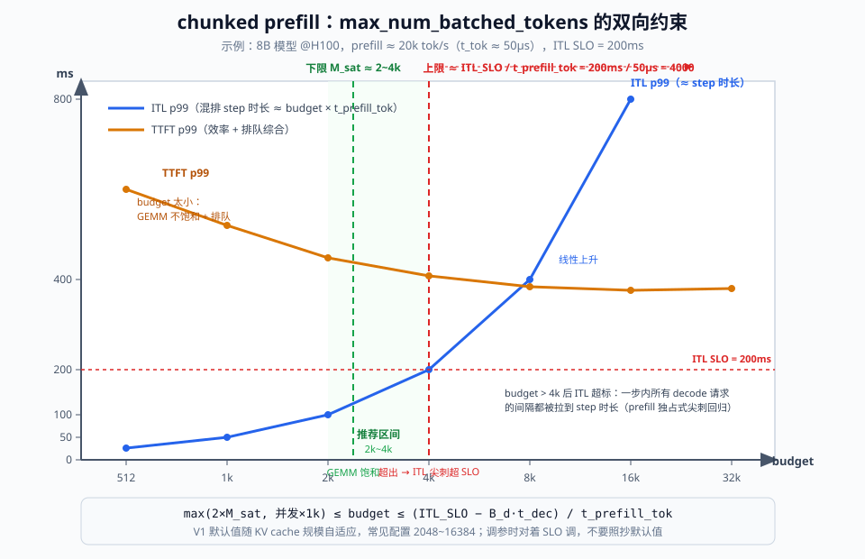
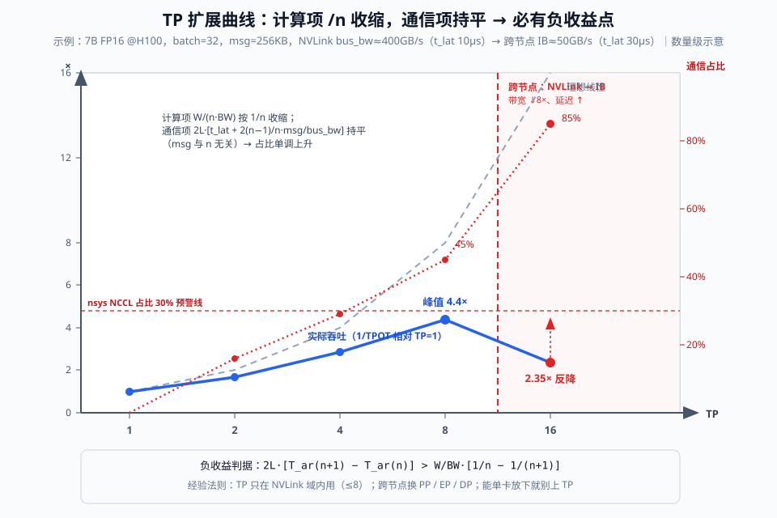

# Day 52：高频问题清单过堂——七问 × 3 分钟录音自答

> **Week 8 · 面试冲刺 · Day 3**
> 前置知识：Day 50-51（白板四件套：显存估算 / Block Table / 调度推演 / 诊断树）、Day 4 & 15-16（PagedAttention 与 KV 管理）、Day 10-13（调度链路）、Day 18-19（CUDA Graph 与 async scheduling）、Day 11（chunked prefill）、Day 22-24（量化）、Day 29-31（P/D 分离）、Day 32-33（分布式并行）
> 今日用时：3~4 小时，其中 **≥2 小时在"录音 + 回听 + 补漏"**——今天是输出日，不是输入日

---

## 今日学习目标

| # | 目标 | 验收标准 |
|---|---|---|
| 1 | 七问全部过堂 | 每题**录音自答 3 分钟**，四段式结构完整（结论 → 机制 → 数字 → 权衡） |
| 2 | 数字敏感度 | 每题至少给出 **1 个可手算验证的数字或公式**，量级正确 |
| 3 | 抗追问 | 每题预判 2~3 个追问方向并有一句话答案 |
| 4 | 卡壳点清单 | 回听打分，所有卡壳 / 遗漏 / 超时当场记录，形成今晚补漏清单 |

## 核心概念：从"演算能力"到"讲述能力"

Day 50-51 练的是**白板演算**（数字长在手上），今天练的是**口头讲述**（逻辑长在嘴上）。两者的失败模式不同：

- 演算失败 = 数字算错（Day 50 已解决）
- **讲述失败 = 答题没有结构**：先绕进细节、忘记结论、3 分钟讲不完、被追问打断后回不来

面试官在 3 分钟里实际评估的是三件事：**结论是否先行、机制是否因果清晰、是否主动给出数字与边界条件**。所以今天的方法是"录音自答"而不是"默背"——录音会暴露所有沉默、绕路和超时，这是自我复盘最诚实的镜子。

### 七问总览

这 7 个问题覆盖了 vLLM V1 的全部 5 个系统层次，每一问都对应前面 7 周的某几天。过堂 = 把 56 天的知识压缩成 7 段可口述的"因果链 + 数字"。

| # | 问题 | 一句话锚点 | 主要源码锚点 | 深入学习日 |
|---|---|---|---|---|
| Q1 | PagedAttention 解决了什么问题？碎片率怎么算？ | 显存浪费 60-80% → <4% | `vllm/v1/core/kv_cache_manager.py` | Day 4 / 15-16 |
| Q2 | continuous vs static batching？in-flight 的调度粒度？ | iteration 级重组 batch | `vllm/v1/core/scheduler.py: schedule()` | Day 10-13 |
| Q3 | 为什么 decode 用 CUDA Graph 而 prefill 不用？ | CPU launch 开销 vs kernel 体量 | `vllm/v1/worker/gpu_model_runner.py: capture_model()` | Day 18-19 |
| Q4 | chunked prefill 的 trade-off？token budget 怎么设？ | budget 夹在 GEMM 饱和与 ITL SLO 之间 | `SchedulerConfig.max_num_batched_tokens` | Day 11 / 13 |
| Q5 | 量化对 TTFT 和 TPOT 的影响分别是什么？ | compute-bound 几乎无收益 / memory-bound 近线性 | `vllm/model_executor/layers/quantization/` | Day 22-24 |
| Q6 | P/D 分离什么时候不值得做？ | 干扰消除收益 < KV 传输 + 复杂度成本 | `vllm/distributed/kv_transfer/`（版本相关） | Day 29-31 |
| Q7 | TP 开到什么时候是负收益？ | all-reduce 时间不随 TP 数下降 | `vllm/distributed/parallel_state.py` | Day 32-33 |

```svg
<svg xmlns="http://www.w3.org/2000/svg" viewBox="0 0 980 700" font-family="'Segoe UI', 'PingFang SC', 'Microsoft YaHei', sans-serif">
  <defs>
    <marker id="d52a" markerWidth="10" markerHeight="8" refX="8" refY="4" orient="auto">
      <path d="M0,0 L10,4 L0,8 Z" fill="#94a3b8"/>
    </marker>
  </defs>
  <rect width="980" height="700" fill="#fafbfc"/>
  <text x="490" y="34" text-anchor="middle" font-size="22" font-weight="700" fill="#0f172a">Day 52 七问知识地图：问题 → vLLM V1 系统层次 → 学习日</text>
  <text x="490" y="58" text-anchor="middle" font-size="13" fill="#64748b">左：V1 系统分层（自上而下越来越靠近硬件）｜右：七个高频面试问题及其知识来源</text>

  <!-- Left: system layers -->
  <text x="60" y="94" font-size="15" font-weight="700" fill="#0f172a">vLLM V1 系统层次</text>
  <g>
    <rect x="46" y="106" width="300" height="92" rx="8" fill="#eef2ff" stroke="#4f46e5" stroke-width="2"/>
    <text x="196" y="130" text-anchor="middle" font-size="14" font-weight="700" fill="#312e81">集群 / 分布式层</text>
    <text x="196" y="152" text-anchor="middle" font-size="12" fill="#334155">TP / PP / EP、P/D 分离、路由</text>
    <text x="196" y="172" text-anchor="middle" font-size="12" fill="#64748b">多实例协同、KV 跨节点传输</text>
  </g>
  <g>
    <rect x="46" y="216" width="300" height="92" rx="8" fill="#f0f9ff" stroke="#0284c7" stroke-width="2"/>
    <text x="196" y="240" text-anchor="middle" font-size="14" font-weight="700" fill="#0c4a6e">调度层（每 step 决策）</text>
    <text x="196" y="262" text-anchor="middle" font-size="12" fill="#334155">continuous batching、chunked prefill</text>
    <text x="196" y="282" text-anchor="middle" font-size="12" fill="#64748b">token budget、preemption</text>
  </g>
  <g>
    <rect x="46" y="326" width="300" height="92" rx="8" fill="#f0fdf4" stroke="#16a34a" stroke-width="2"/>
    <text x="196" y="350" text-anchor="middle" font-size="14" font-weight="700" fill="#14532d">KV 管理层</text>
    <text x="196" y="372" text-anchor="middle" font-size="12" fill="#334155">block pool、block table、引用计数</text>
    <text x="196" y="392" text-anchor="middle" font-size="12" fill="#64748b">prefix caching（哈希链 + COW）</text>
  </g>
  <g>
    <rect x="46" y="436" width="300" height="92" rx="8" fill="#fefce8" stroke="#ca8a04" stroke-width="2"/>
    <text x="196" y="460" text-anchor="middle" font-size="14" font-weight="700" fill="#713f12">执行层</text>
    <text x="196" y="482" text-anchor="middle" font-size="12" fill="#334155">CUDA Graph capture / replay</text>
    <text x="196" y="502" text-anchor="middle" font-size="12" fill="#64748b">piecewise 编译、async scheduling</text>
  </g>
  <g>
    <rect x="46" y="546" width="300" height="92" rx="8" fill="#fdf2f8" stroke="#db2777" stroke-width="2"/>
    <text x="196" y="570" text-anchor="middle" font-size="14" font-weight="700" fill="#831843">模型 / 算子层</text>
    <text x="196" y="592" text-anchor="middle" font-size="12" fill="#334155">量化 GEMM（W8A8/W4A16/FP8）</text>
    <text x="196" y="612" text-anchor="middle" font-size="12" fill="#64748b">KV cache 量化、attention kernel</text>
  </g>

  <!-- Right: 7 questions -->
  <text x="420" y="94" font-size="15" font-weight="700" fill="#0f172a">七个高频问题（今日过堂顺序）</text>
  <g>
    <rect x="408" y="106" width="526" height="64" rx="8" fill="#f0fdf4" stroke="#16a34a" stroke-width="1.5"/>
    <text x="426" y="132" font-size="13" font-weight="700" fill="#14532d">Q1 PagedAttention 解决了什么？碎片率怎么算？</text>
    <text x="426" y="154" font-size="12" fill="#64748b">Day 4 / 15-16 · 碎片 60-80% → &lt;4% · block/table/引用计数</text>
    <line x1="408" y1="138" x2="352" y2="372" stroke="#94a3b8" stroke-width="1.5" marker-end="url(#d52a)"/>
  </g>
  <g>
    <rect x="408" y="182" width="526" height="64" rx="8" fill="#f0f9ff" stroke="#0284c7" stroke-width="1.5"/>
    <text x="426" y="208" font-size="13" font-weight="700" fill="#0c4a6e">Q2 continuous vs static batching？in-flight 调度粒度？</text>
    <text x="426" y="230" font-size="12" fill="#64748b">Day 10-13 · iteration 级调度 · Orca 数倍~一个数量级</text>
    <line x1="408" y1="214" x2="352" y2="262" stroke="#94a3b8" stroke-width="1.5" marker-end="url(#d52a)"/>
  </g>
  <g>
    <rect x="408" y="258" width="526" height="64" rx="8" fill="#fefce8" stroke="#ca8a04" stroke-width="1.5"/>
    <text x="426" y="284" font-size="13" font-weight="700" fill="#713f12">Q3 为什么 decode 用 CUDA Graph 而 prefill 不用？</text>
    <text x="426" y="306" font-size="12" fill="#64748b">Day 18-19 · 数百小 kernel × launch 开销 → CPU-bound</text>
    <line x1="408" y1="290" x2="352" y2="482" stroke="#94a3b8" stroke-width="1.5" marker-end="url(#d52a)"/>
  </g>
  <g>
    <rect x="408" y="334" width="526" height="64" rx="8" fill="#f0f9ff" stroke="#0284c7" stroke-width="1.5"/>
    <text x="426" y="360" font-size="13" font-weight="700" fill="#0c4a6e">Q4 chunked prefill 的 trade-off？budget 怎么设？</text>
    <text x="426" y="382" font-size="12" fill="#64748b">Day 11 / 13 · GEMM 饱和 ≤ budget ≤ ITL SLO</text>
    <line x1="408" y1="366" x2="352" y2="284" stroke="#94a3b8" stroke-width="1.5" marker-end="url(#d52a)"/>
  </g>
  <g>
    <rect x="408" y="410" width="526" height="64" rx="8" fill="#fdf2f8" stroke="#db2777" stroke-width="1.5"/>
    <text x="426" y="436" font-size="13" font-weight="700" fill="#831843">Q5 量化对 TTFT 和 TPOT 的影响分别是什么？</text>
    <text x="426" y="458" font-size="12" fill="#64748b">Day 22-24 · prefill ≈ 无收益，decode 近线性于字节数下降</text>
    <line x1="408" y1="442" x2="352" y2="592" stroke="#94a3b8" stroke-width="1.5" marker-end="url(#d52a)"/>
  </g>
  <g>
    <rect x="408" y="486" width="526" height="64" rx="8" fill="#eef2ff" stroke="#4f46e5" stroke-width="1.5"/>
    <text x="426" y="512" font-size="13" font-weight="700" fill="#312e81">Q6 P/D 分离什么时候不值得做？</text>
    <text x="426" y="534" font-size="12" fill="#64748b">Day 29-31 · KV 传输 vs 重算 · 规模与网络判据</text>
    <line x1="408" y1="518" x2="352" y2="160" stroke="#94a3b8" stroke-width="1.5" marker-end="url(#d52a)"/>
  </g>
  <g>
    <rect x="408" y="562" width="526" height="64" rx="8" fill="#eef2ff" stroke="#4f46e5" stroke-width="1.5"/>
    <text x="426" y="588" font-size="13" font-weight="700" fill="#312e81">Q7 TP 开到什么时候是负收益？</text>
    <text x="426" y="610" font-size="12" fill="#64748b">Day 32-33 · all-reduce 时延不随 TP↓ · 跨节点陡变</text>
    <line x1="408" y1="594" x2="352" y2="184" stroke="#94a3b8" stroke-width="1.5" marker-end="url(#d52a)"/>
  </g>
  <text x="490" y="666" text-anchor="middle" font-size="12" fill="#94a3b8">面试考点分布：调度层 ×2、KV 层 ×1、执行层 ×1、算子层 ×1、集群层 ×2 —— 与八周学习路线一一对应</text>
</svg>
```

---

## 一、过堂方法：四段式答题骨架

每道题都用同一个节奏回答（练到第 3 题就会形成肌肉记忆）：

```text
① 结论先行（~15s）  直接回答问题本身，不铺垫
② 机制展开（~75s）  为什么？给数据流 / 调用链 / 公式，讲因果不讲形容词
③ 数字支撑（~45s）  1~2 个手算数字或量级（这是区分度所在）
④ 权衡与失效（~45s）什么时候不成立、怎么调参、怎么测量验证
```

**回听评分表**（每题 5 维度，各 1~5 分，<20 分重录）：

| 维度 | 检查点 |
|---|---|
| 结构 | 四段齐全？30 秒内听到结论了吗？ |
| 机制 | 有没有说"因为 A 所以 B"，还是只堆名词？ |
| 数字 | 至少 1 个数字 / 公式？量级对吗？ |
| 时间 | 3 分钟 ±30 秒内讲完？ |
| 抗打断 | （脑内模拟）被追问"为什么"两次后还能接回来吗？ |

---

## 二、Q1：PagedAttention 解决了什么问题？碎片率怎么算？

### 2.1 录音骨架

```text
[0:00] 结论：把 KV cache 从"按 max_len 连续预留"改成"按块分页 + 页表映射"，
       显存浪费从 60-80% 压到 <4%，同样显存并发数翻数倍；这是 vLLM 的一切前提。
[0:15] 机制：预留制的两种碎片（内部 + 外部）→ block / block table / 按需分配 →
       外碎片归零，内碎片只剩每序列最后半个块。
[1:30] 数字：手算两种方案的碎片率对比（2.2）。
[2:30] 权衡：block_size 的取舍；与 prefix caching 的联动（块粒度 = 共享粒度）。
```

### 2.2 机制与碎片率公式

**预留制（pre-PagedAttention）的浪费**：每个请求到达时按 `max_model_len` 连续预留 KV 显存。

```text
内碎片率（预留制）= 1 − L_act / max_model_len
```

例：`max_model_len = 2048`，实际平均输出 500 token → 浪费 **75.6%**。负载越偏斜越惨——论文实测 60-80%。此外变长序列反复分配 / 释放不同大小的连续段，还产生**外碎片**（空闲总量够但无连续大段）。

**分页制的浪费**：块大小 `b`（V1 GPU 上通常 16），每序列只有最后一个块可能未满：

```text
内碎片（分页制）≈ 每 seq 浪费 b/2 个 token 槽位
碎片率 ≈ b / (2·L̄)          例：16 / (2×500) = 1.6%
外碎片 = 0                    （所有块等大，可任意复用）
```

系统级对账（面试可写）：

```text
有效 token 容量利用率 = Σ L_i / (num_blocks × b)     ← 目标 >96%
每序列 KV 占用 = ceil(L_i / b) × b                   ← 与 L_i 差 ≤ b−1
```

### 2.3 源码锚点（V1）

```text
vllm/v1/core/kv_cache_manager.py   KVCacheManager.allocate()/append_slot()
vllm/v1/core/kv_cache_utils.py      Block 底层数结构与哈希链（Day 16）
vllm/v1/worker/gpu_model_runner.py initialize_memory() → profile_run() 后
                                    用剩余显存换算 num_gpu_blocks（Day 50 已对账）
```

调用链一句话：`Scheduler.schedule()` 决定本 step 每个请求新增多少 token → `KVCacheManager.append_slot()` 找空闲块 / 命中哈希 → 不足则触发 preemption（Day 12）。

### 2.4 追问预判

| 追问 | 一句话答案 |
|---|---|
| block_size 为什么是 16？ | 内碎片 vs 页表规模 / gather 间接寻址的折中；也是 prefix 共享粒度（Day 50 白板题） |
| 分页后 attention 怎么读非连续 KV？ | paged attention kernel 按 block table 间接寻址 gather（Day 17 后端抽象） |
| 碎片率怎么在线观测？ | `vllm:gpu_cache_usage` 与 `num_blocks×b/理论token数` 对账；prefix caching 开启后还要看 hit rate（Day 16 实验） |

---

## 三、Q2：continuous batching vs static batching？in-flight batching 的调度粒度？

### 3.1 录音骨架

```text
[0:00] 结论：static batching 整队跑完才能换人，短序列被长序列拖死；
       continuous batching 把调度粒度降到 iteration（每步 forward），
       完成的立即退出、新到的立即插入。in-flight batching 是同一思想的
       Triton/工程叫法，粒度 = per-step（decode 一步 = 一次 forward）。
[0:20] 机制：static 的"队头阻塞"图 → iteration 级调度的三件事
       （取 waiting / 保留 running / 剔除 finished）。
[1:30] 数字：完成时间偏斜的例子 + Orca 量级。
[2:15] 权衡：每 step 调度开销 → V1 用 async scheduling 把它藏进上一步 GPU 执行。
```

### 3.2 机制：为什么 static 会"空转"

static batching 中，batch 内最长的序列决定整队时间：

```text
T_static ≈ max_i(L_i) × t_tok          ← 由最长序列决定
T_cont   ≈ Σ L_i / B_max × t_tok       ← GPU 始终满 batch 运转
```

两个量化视角：

1. **有效 batch 衰减**：序列陆续完成，但 slot 不能释放给新请求 → 后半程 GPU 算力空转。极端例子：batch=32，1 条 1024 token、31 条 64 token → 前 64 步满载，后 960 步**平均只跑 1 条**。
2. **队头阻塞（TTFT）**：新请求必须等整队跑完 → TTFT 由 `max(L_i)` 决定而不是排队长度。

continuous batching（Orca 提出，也称 iteration-level / in-flight batching）在**每个 step 边界**做三件事：

```text
每个 step（≈ 一次 forward / 一个 decode token）:
  ① running 中 finished 的请求移出、释放 KV
  ② waiting 中按 FCFS + budget 补入新请求（首 chunk 即可插入）
  ③ 重新组 batch 交给 ModelRunner 执行
```

收益量级：Orca 论文相对 static 系统 4.5×~36.9×（负载强相关）；工程口径**数倍到一个数量级**。保守表述："吞吐差 2-10× 是常态，负载越偏斜差距越大"。

### 3.3 源码锚点（V1）

```text
vllm/v1/core/scheduler.py   Scheduler.schedule()      ← 每 step 产出 SchedulerOutput
  ├─ waiting → 被 budget/max_num_seqs 约束补入（Q4 展开）
  ├─ running → KV 不足时 preemption（Day 12 / Day 51 推演）
  └─ finished → 释放 block，输出 token 回传
vllm/v1/engine/dp.py / llm_engine.py  EngineCore.step() → schedule() → execute_model()
（注：较新版本 scheduler 位于 vllm/v1/core/sched/，随版本变化，面试说 v1/core 即可）
```

调度开销与对策（衔接 Day 19）：iteration 级调度意味着**每步都有 Python 级 CPU 工作**（组 batch、算 block table、拼输入张量）。V1 的 async scheduling 让 step N+1 的调度与 step N 的 GPU 执行重叠，配合 CUDA Graph（Q3）把每步 CPU 开销从毫秒级压到可忽略。

### 3.4 追问预判

| 追问 | 一句话答案 |
|---|---|
| in-flight 和 continuous 有区别吗？ | 术语差异为主（NVIDIA Triton vs 学术界）；都指 iteration 级重组，追问粒度就答"per forward pass" |
| 调度粒度还能更细吗？ | step 内拆分没有意义（forward 是原子单位）；更细的是请求内 token 级 —— 即 chunked prefill（Q4） |
| continuous batching 的代价？ | 每步调度 CPU 开销 + batch 形状动态变化 → 需要 CUDA Graph bucket / padding 策略（Q3） |

---

## 四、Q3：为什么 decode 用 CUDA Graph 而 prefill 不用？

### 4.1 录音骨架

```text
[0:00] 结论：decode 每步数百个小 kernel，GPU 执行时间 ≈ CPU launch 时间，
       不用 Graph 就是 CPU-bound（GPU 等 CPU 发号施令）；
       prefill 是大 kernel 的 compute-bound，launch 开销占比 <1%，且
       prompt 长度任意无法枚举 shape，用了也没收益。
[0:25] 机制：launch 开销数字 → CUDA Graph 一次 capture / 一次 replay →
       bucket 化解决动态 batch。
[1:30] 数字：手算一次 decode step 的 CPU/GPU 时间。
[2:20] 权衡：显存代价、bucket 策略、piecewise CUDA Graph（V1 现状）。
```

### 4.2 机制与数字

**decode 侧的账**（7B 级模型，batch=8）：

```text
每 layer 约 8~12 个 kernel（QKV GEMM / RoPE / attention / O-proj / MLP×3 / norm / add）
全模型 ≈ 32 layer × 10 ≈ 300~400 个 kernel
单个 kernel GPU 时间 ≈ 2~6 μs（batch 小，GEMM 极小）
单个 kernel CPU launch ≈ 3~7 μs（不含 Python 框架开销）

不用 Graph：step 时间 ≈ Σ launch ≈ 400 × 5μs ≈ 2 ms（CPU-bound，GPU 空转）
用 Graph：  一次 replay，step 时间 ≈ Σ GPU 执行 ≈ 1 ms 出头 + ~50μs 提交开销
```

**prefill 侧的账**：一个 4k prompt 的 prefill step 中，GEMM 的 M 维 = 4096，单个 GEMM 数百 μs~ms 级。300 个 kernel 的 launch 开销 ~2 ms，占比 **<3%**——省了也看不见；而 shape（prompt 长度）是任意值，按 bucket capture 要么浪费显存要么 miss 率高。

**CUDA Graph 生效的前提是"计算图结构 + shape 可枚举"**。decode 满足：shape 只随 batch size 变化 → V1 按 bucket 捕获（如 1, 2, 4, 8, ..., `max_num_seqs` 内的采样集，`cudagraph_capture_sizes` 可配），实际执行向上取最近 bucket，多出的位置 **padding**（算力浪费 ≤ bucket 间隔）。

### 4.3 源码锚点（V1）与 piecewise 现状

```text
vllm/v1/worker/gpu_model_runner.py
  ├─ capture_model()      ← 启动时按 capture sizes 逐 bucket capture（warmup + 录制）
  ├─ execute_model()      ← decode 路径查 bucket → CUDAGraphRunner.run() replay
  └─ 中间张量显存池复用（capture 的显存代价主要在这里）
vllm/compilation/          ← piecewise CUDA Graph（版本相关，V1 默认方向）
```

**piecewise CUDA Graph**（衔接 Day 18）：把模型按 attention 边界切成段——attention 因 KV 长度动态变化留 eager，其余部分（norm / MLP / RoPE 等 shape 稳定的段）用 Graph 包起来。这样 prefill 也能吃到部分收益，是"为什么 prefill 完全不用 Graph"这一绝对说法的**现代修正**。面试建议表述："经典结论是 decode-only；V1 已经用 piecewise 把 Graph 边界推进到 prefill 路径，但动机仍然是消除 launch 开销，而非加速 kernel 本身。"

### 4.4 追问预判

| 追问 | 一句话答案 |
|---|---|
| capture 的显存代价？ | 每 bucket 一份图结构 + 中间激活池；bucket 数 × 模型规模，典型几百 MB~GB 级，`cudagraph_capture_sizes` 可裁剪 |
| 为什么不只 capture max batch 一个？ | padding 到 256 会把小 batch 的计算放大几十倍，decode 时延爆炸 |
| CUDA Graph 和 async scheduling 的分工？ | Graph 消 kernel launch 开销，async scheduling 消每步调度 / 组 batch 的 Python 开销，两者叠加（Day 19） |
| 投机解码 batch 变化更剧烈，Graph 怎么办？ | 验证 step 的 batch = num_seqs × (1+k) 结构已知，同样 bucket 化；`num_speculative_tokens` 改变 shape 需重新 capture（Day 25-26） |

---

## 五、Q4：chunked prefill 的 trade-off？token budget 怎么设？

### 5.1 录音骨架

```text
[0:00] 结论：把长 prompt 切成 ≤budget 的 chunk，与 decode 混排在同一 step，
       收益是消除长 prefill 对 ITL 的"独占式尖刺"、平滑 KV 分配；
       代价是 prefill 效率略降 + TTFT 略升 + 调度复杂度。
[0:25] 机制：一步之内 budget 如何在 prefill chunk 与 decode token 间分配。
[1:20] 数字：budget 上下限公式 + 一个手算例子。
[2:20] 权衡：budget 太小 / 太大各恶化什么指标；默认值怎么来的。
```

### 5.2 机制：一个 step 里发生什么

`max_num_batched_tokens`（token budget）限定**单个 step 的总 token 数**（chunked prefill 开启时，prefill token 与 decode token 共享）：

```text
step 预算：  n_prefill_tok + n_decode_tok ≤ budget
chunk 截断： 新请求 prompt 长 L > 剩余预算 → 本 step 只 prefill 前 chunk，
             剩余部分下个 step 继续（KV 已写部分直接复用）
```

收益的因果链：

1. **ITL 平滑**：没有 chunking 时，一个 32k prompt 的 prefill 独占一个 step 数百 ms~秒级，期间所有 decode 请求的 ITL 出现同尺度尖刺；chunking 后每个 step 都有界。
2. **TTFT p99 下降**：新请求的首 chunk 可以插进任意 step，不必等长 prefill 跑完。
3. **KV 分配平滑**：避免一次申请 32k/b 个块 → preemption 概率下降（Day 12-13 实验观察过）。

代价的因果链：

1. prefill 的 attention 拆成多次小 kernel，GEMM 的 M 维变小 → **prefill 吞吐效率下降**（典型个位数百分比）；
2. 每个 chunk 都要过一次完整 step 流水（调度 / 组 batch），**TTFT 均值略升**；
3. 调度器复杂度（切块状态机 + 与 preemption 的交互）。

### 5.3 budget 怎么设：上下限公式



```text
下限（prefill 效率）：budget ≥ M_sat
       M_sat = 让 GEMM 达到饱和算力的 token 数（8B 级 @H100 约 2k~4k，经验值）
       小于它，prefill 的 compute-bound 优势开始折损，TTFT 恶化

上限（ITL SLO）：budget ≤ (ITL_SLO − B_d·t_dec_tok) / t_prefill_tok
       混排 step 的时长 ≈ budget × t_prefill_tok + decode 开销，
       该 step 内所有 decode 请求的 ITL 都被拉到 step 时长

推荐：max(2×M_sat, 并发峰值×1k) ≤ budget ≤ ITL_SLO 上限，典型 2048~16384
```

**手算例子**（衔接 Day 2 的方法）：8B 模型 @H100，prefill 吞吐 ≈ 20k tok/s → `t_prefill_tok ≈ 50μs`；若 ITL SLO = 200 ms：

```text
budget_upper ≈ 200ms / 50μs = 4000 token
→ 设 2048~4096：一步 100~200ms，GEMM 已饱和，ITL 尖刺可控
→ 若照抄 8192：一步 ~410ms，ITL p99 直接超 SLO —— 这就是"调参要对着 SLO 调"的含义
```

### 5.4 源码锚点（V1）

```text
vllm/v1/core/scheduler.py    schedule() 内 budget 检查与 chunk 截断逻辑
SchedulerConfig:
  ├─ max_num_batched_tokens    ← budget 本体（V1 默认随 KV cache 规模自适应，版本相关）
  ├─ long_prefill_token_threshold ← 超过它的 prompt 强制走 chunk 路径（版本相关）
  └─ chunked_prefill_enabled   ← V1 默认开启（与 V0 不同，V0 默认关）
```

### 5.5 追问预判

| 追问 | 一句话答案 |
|---|---|
| chunked prefill 下为什么 preemption 变少？ | KV 按 chunk 渐进申请，峰值需求被平滑；但仍可能在 decode 增长时触发（Day 12） |
| budget 和 max_num_seqs 什么关系？ | budget 管 token 数（prefill 侧约束），max_num_seqs 管序列数（decode 侧约束），两者共同决定 batch 形状 |
| 关掉 chunked prefill 什么时候更好？ | 纯离线吞吐场景（无 ITL SLO）、prompt 短且均匀时，关闭可省调度开销、prefill 效率最高 |
| chunk 边界处 attention 要重复计算吗？ | 不需要——causal attention 下每个 chunk 只算自己的 query 对全部已有 KV，FLOPs 无重复，代价只在 kernel 变小 |

---

## 六、Q5：量化对 TTFT 和 TPOT 的影响分别是什么？

### 6.1 录音骨架

```text
[0:00] 结论：这是同一个"bound 类型决定量化收益"问题的两面——
       TTFT 代表 prefill（compute-bound）：只有 FP8/INT 这类能吃到
       低精度 tensor core 峰值算力的方案有收益，weight-only 量化几乎为零甚至变慢；
       TPOT 代表 decode（memory-bound）：收益近似等于"权重字节数的下降比例"，
       但被 KV cache 读出摊薄。
[0:30] 机制：decode 的 roofline 账 + KV 摊薄公式。
[1:30] 数字：8B 模型 W8 前后的 TPOT 手算。
[2:15] 权衡：KV 量化 / 显存副产物（并发上限）/ 失效模式。
```

### 6.2 机制与公式

**TPOT（decode，memory-bound）**——衔接 Day 2 的时延下界公式：

```text
TPOT ≈ (W_bytes + KV_read) / BW          ← W 权重读出 + KV 读出，每步一次

权重量化到 b_w 字节：  W_bytes ∝ b_w（FP16→W8 减半）
加速比 = (W + KV) / (W/2 + KV)           ← KV 不变，收益被摊薄
```

**手算例子**（8B 模型，FP16 权重 16 GB，`k_v = 128 KB/token`）：

| 场景 | W（读出） | KV（读出） | TPOT 相对值 | 加速比 |
|---|---|---|---|---|
| 基线 FP16，ctx=1k | 16 GB | 0.125 GB | 1.00 | — |
| W8，ctx=1k | 8 GB | 0.125 GB | 0.50 | **1.98×** |
| W8，ctx=32k | 8 GB | 4 GB | 0.67 | **1.67×** |
| W8 + KV FP8，ctx=32k | 8 GB | 2 GB | 0.50 | **2.00×** |

三个面试要点藏在表里：① 短上下文时权重主导，W8 收益接近 2×；② 长上下文时 KV 摊薄收益；③ **KV 量化对长上下文 decode 的价值随 ctx 增长**。实测会再打 ~10-20% 折扣（激活、norm、通信、非量化 kernel）。

**TTFT（prefill，compute-bound）**：

```text
prefill 时间 ≈ FLOPs / 算力_eff
W4A16（weight-only）：FLOPs 不变、仍在 FP16 tensor core 上算
  → dequant 开销若 kernel 不优，收益 <1×（变慢是真实存在的失效模式）
FP8（H100 原生 FP8 GEMM）：峰值算力 ×2 → 理想 1.5~1.6×，实测 1.2~1.4×
```

**显存副产物（常被漏讲，主动讲是加分项）**：权重量化省下的显存全部进 KV 池 → `F_kv` 增大 → 并发上限 `C = F_kv/(k_v·L̄)` 提高 → **吞吐收益常常大于时延收益**（W4 的 8B 模型显存省 8 GB ≈ 6 万 token KV ≈ 60 路 1k 并发）。Day 23-24 的实验正是这个结构。

### 6.3 源码锚点（V1）

```text
vllm/model_executor/layers/quantization/   ← 各 quant method 的 apply 实现
  fp8.py / awq.py / gptq.py / ...           （W8A8 走 fused kernel；W4A16 走 Marlin 类）
vllm/config/quantization.py + 启动参数：
  --quantization fp8 / awq / gptq
  --kv-cache-dtype fp8                     ← KV 量化开关（Day 23 实验用过）
```

### 6.4 追问预判

| 追问 | 一句话答案 |
|---|---|
| 为什么 W4A16 prefill 可能变慢？ | dequant 展开 + kernel 未对 M 维优化；prefill 不缺带宽，省下的字节数不值钱 |
| KV 量化精度代价？ | K 更敏感（异常值），FP8 通常 <1% 端到端指标波动；INT4 需 per-block scale，长 ctx 累积误差（Day 23） |
| 量化对投机解码有影响吗？ | draft/verify 的接受率依赖 logit 一致性，量化误差会拉低接受率 → 加速比打折（Day 25-26 的交叉点） |
| 什么负载最该重量化？ | 高并发 decode 密集（吃并发上限收益）+ 长上下文（吃 KV 量化收益）；离线 prefill 批处理最不该为 TTFT 上 W4 |

---

## 七、Q6：P/D 分离什么时候不值得做？

### 7.1 录音骨架

```text
[0:00] 结论：P/D 分离的收益 = 干扰消除 + 独立扩容，成本 = KV 传输 + 复杂度 +
       资源利用率风险。当负载规模小、网络弱而上下文长、或 prefix 命中率高时，
       收益覆盖不了成本——就不值得。
[0:25] 机制：先讲清收益从哪来（Day 29 的 goodput 视角），再讲三个成本项。
[1:20] 数字：KV 传输 vs 重算的手算对比。
[2:20] 权衡：五条"不做"判据 + 决策顺序。
```

### 7.2 机制：收益与成本的两边

**收益侧**（Day 29 已建立）：

```text
goodput 提升 1.5~3× 的来源：
  ① 干扰消除：prefill 洪峰不再打断 decode → ITL 稳定 → SLO 内吞吐 ↑
  ② 独立扩容：P 实例选算力强的卡/比例，D 实例选带宽强的卡/比例
  ③ 独立调参：两侧各自的最优 batch/budget/量化方案不同（见追问）
```

**成本侧**：

```text
T_kv(传输) = k_v × L / BW_net            ← D 实例必须拿到完整 KV 才能续写
复杂度：两套实例 + 路由层 + KV 传输层 + 故障域 ×2
利用率：QPS 低时两侧都在"半空转"，比混跑单集群更贵
```

**手算例子**（Llama-3-70B FP16，`k_v = 0.32 MB/token`，8k prompt → KV ≈ 2.6 GB）：

| 传输通道 | 有效带宽 | T_kv（8k ctx） | 对比：重算 8k（单 H100 ≈ 2k tok/s）|
|---|---|---|---|
| 同节点 NVLink | ~450 GB/s | ≈ 6 ms | vs ≈ 4 s → 传输完胜 |
| 400Gbps RDMA | ~50 GB/s | ≈ 54 ms | vs 4 s → 传输仍大幅占优 |
| 100Gbps 以太 | ~12.5 GB/s | ≈ 215 ms | vs 4 s → 占优但已伤 TTFT |

这张表说明：**传输 vs 重算几乎总是传输赢**——所以"不值得做"的判据通常不在这一项，而在下面五条。面试把这层讲透，比背"分离很好"高一个层级。

### 7.3 五条"不值得做"判据

| # | 场景 | 原因 |
|---|---|---|
| 1 | **QPS 低 / 规模小** | 分离的收益是高负载下的干扰消除；低负载时两侧利用率都低，固定复杂度成本占主导 |
| 2 | **短 prompt 负载** | prompt 32 token 的 prefill 只占几十 μs，混跑干扰本就可忽略（干扰 ∝ prompt 长度 × 频率） |
| 3 | **网络弱 + 上下文长** | `T_kv = k_v·L/BW`：100Gbps 下 32k ctx 的 70B 模型要传 ~10.5 GB ≈ 840ms，TTFT 收益被吃光 |
| 4 | **prefix caching 命中率高的负载** | cache-aware 路由要求相同前缀落到同实例复用 KV；P/D 分离把 KV 搬到 D 后，D 侧前缀池局部性被稀释，重复传输反而变贵（衔接 Day 34） |
| 5 | **没有 SLO 分层需求** | 离线批处理没有 ITL SLO，干扰消除的收益无从变现 |

**决策顺序**（口述模板）：先问"混跑的 ITL 尖刺是否真的在打爆 SLO"（看 Day 51 诊断树：`/metrics` 里 prefill 占比与 ITL p99 的相关性）→ 再问"网络与上下文是否撑得起 KV 传输" → 最后才轮到"运维预算"。

### 7.4 源码锚点（V1，版本相关）

```text
vllm/distributed/kv_transfer/     ← KVTransferConfig：kv_role = kv_producer / kv_consumer
  ├─ kv_connector（如 SharedStorageConnector、NixlConnector，生态演进快）
  └─ producer 侧 prefill 完成后按 block 推送；consumer 侧加载后从末尾续写
Day 31 用 disaggregated serving 示例搭过最小部署（P 实例 1 张 + D 实例 1 张）
```

### 7.5 追问预判

| 追问 | 一句话答案 |
|---|---|
| KV 传完之前 D 侧在干什么？ | 干等或跑其他请求；工程上用分层流水 / 多路并发传输把 T_kv 藏进其他 decode step（Day 30 的 Mooncake 思路） |
| 为什么不直接在 D 侧重算 KV？ | 重算成本 = prefill 时间（秒级）≫ 传输（几十 ms），除非网络极弱且 prompt 短 |
| MLA 模型对 P/D 分离友好吗？ | 友好——DeepSeek 系 KV 仅 ~69 KB/token（Day 50 自测题算过），传输量比 Llama-70B 小近 5× |
| P/D 两侧量化方案可以不同吗？ | 可以且应该：P 侧 FP8 GEMM 吃算力收益，D 侧 W8+KV FP8 吃带宽收益（Q5 的两面性） |

---

## 八、Q7：TP 开到什么时候是负收益？

### 8.1 录音骨架

```text
[0:00] 结论：TP 切的是"每步计算量"，但每层 2 次 all-reduce 的通信时间基本
       不随 TP 数下降（消息大小不变、环算法渐近 2×msg/bandwidth），
       所以通信占比随 TP 单调上升，必然存在交叉点；跨出 NVLink 域
       （跨节点）的那一刻通常就是负收益点。
[0:25] 机制：TPOT 分解公式 + all-reduce 时间公式。
[1:20] 数字：7B 模型 TP=1→16 的手算表。
[2:20] 权衡：什么时候必须 TP / 实测方法 / 替代方案（PP、EP、DP）。
```

### 8.2 机制与公式

**decode 一步的时间分解**（TP = n，NVLink 内）：

```text
TPOT(n) ≈ W / (n · BW)  +  2L × T_ar(n)
          └─ 计算项 /n ↓     └─ 通信项 ≈ 持平甚至 ↑

T_ar(n) ≈ t_lat + 2(n−1)/n × msg / bus_bw        ← ring all-reduce
msg = n_seqs × hidden × b_act（与 n 无关！）
2L = 每 layer 2 次 all-reduce（attention 后 + MLP 后）× L 层
```

**负收益判据**：当 n 增大时 `Δ通信 > Δ计算节省`，即

```text
2L × [T_ar(n+1) − T_ar(n)]  >  W / BW × [1/n − 1/(n+1)]
```

两个结构性原因决定这个交叉点**必然存在**：

1. 计算项按 `1/n` 收缩，通信项里 `2(n−1)/n → 2` 反而渐增、`t_lat` 完全不变（小 batch 下 `t_lat` 占主导，msg 只有几百 KB 时带宽项是零头）；
2. 跨节点后 `bus_bw` 从 NVLink 的 ~400 GB/s 掉到 IB 的 ~50 GB/s（降 ~8×）、`t_lat` 翻倍——通信项直接跳变。

**手算表**（7B FP16：W = 14 GB，L = 32，hidden = 4096；batch = 32 seqs → msg = 256 KB；NVLink bus_bw ≈ 400 GB/s、t_lat ≈ 10 μs；跨节点 IB ≈ 50 GB/s、t_lat ≈ 30 μs。数量级示意）：

| TP | 计算项 W/(n·BW) | 通信项 2L×T_ar | step 时延 | 加速比 | 通信占比 |
|---|---|---|---|---|---|
| 1 | 7.00 ms | 0 | 7.00 ms | 1.00× | 0% |
| 2 | 3.50 ms | 0.68 ms | 4.18 ms | 1.67× | 16% |
| 4 | 1.75 ms | 0.70 ms | 2.45 ms | 2.86× | 29% |
| 8 | 0.88 ms | 0.71 ms | 1.59 ms | 4.40× | 45% |
| 16（跨节点 IB） | 0.44 ms | 2.53 ms | 2.97 ms | **2.35× ↓** | 85% |

结论从表里自己长出来：**TP=16 比 TP=8 更慢**——这就是"负收益点"。且注意 TP=8 时通信占比已达 45%，继续加卡没有空间。



### 8.3 什么时候必须 TP / 怎么实测

**必须 TP 的两个正当理由**（衔接 Day 32 的"能单卡放下就别上 TP"）：

1. 单卡放不下 `W + F_kv`（权重 + 目标并发所需 KV 池）——显存刚需；
2. 单卡带宽撑不起目标吞吐（TPOT 高于 SLO 且已排除其它瓶颈）——带宽刚需，且只在 NVLink 域内有效。

**实测方法**（Day 33 做过）：

```text
nsys profile vllm serve ... --tensor-parallel-size 2
→ 看 NCCL kernel 时间占总 step 的比例：
   <10%   健康
   10~30% 观察（是否 batch 太小导致 msg 小、t_lat 占比大）
   >30%   预警：减 TP / 换 PP / 加大 batch 摊薄 t_lat
```

**替代方案口诀**：模型放不下 → **PP**（通信量 ≈ 激活值 × 流水段数， bubble 用多 micro-batch 填）；MoE → **EP**（all-to-all 只搬 expert 输入输出）；多副本 → **DP**（零推理通信，靠路由层做负载均衡）。

### 8.4 源码锚点（V1）

```text
vllm/distributed/parallel_state.py   ← TP group 初始化（版本相关：较新版本在
                                        vllm/config/parallel.py 配置、parallel_state 建组）
vllm/model_executor/layers/linear.py RowParallelLinear.forward() →
                                        tensor_model_parallel_all_reduce()（每 layer 2 次的出处）
通信实现：torch.distributed / 自定义 allreduce（小 msg 优化路径）
```

### 8.5 追问预判

| 追问 | 一句话答案 |
|---|---|
| 为什么 prefill 对 TP 更宽容？ | prefill kernel 大（compute-bound），同量通信占比小；TP 的痛主要在 decode（本问主角） |
| batch 很大时 TP 收益会变好吗？ | 会——msg 变大后带宽项主导、摊薄 t_lat，通信占比下降；所以"TP 负收益"是 batch 的函数，不是常数 |
| TP 与投机解码叠加？ | 验证 step 一次算 k+1 token，等效加大 batch → 通信摊薄，两者是互补不是冲突 |
| 为什么不用更大的 msg 合并通信？ | 已在做（reduce-scatter + all-gather 的 sequence parallel、融合 residual）；结构性下限是每 layer 2 次同步点 |

---

## 九、动手实验：录音过堂流程（今日主实验）

> 今日不是读代码日，是输出日。以下流程走完约 2.5 小时。

**准备（10 分钟）**：

```text
① 题目卡：把"七问总览"表打印或放第二块屏（只看问题列，遮住锚点列）
② 录音工具：手机语音备忘录 / arecord / OBS 任一
③ 计时器：3 分钟硬停（超时也算失败，练节奏感）
④ 打分表：抄一张"回听评分表"（第一章），每题一行
```

**单题循环（每题 ~15 分钟 × 7 题）**：

```text
Step 1  闭卷默写：1 分钟写出该题四段提纲（只写关键词，不写句子）
Step 2  录音自答：3 分钟硬停，中途不许回看任何材料
Step 3  回听打分：5 维度各 1~5 分，同时记下三件事——
          卡壳点（哪里停顿超过 3 秒）
          遗漏点（对照本文骨架，漏了哪段）
          数字点（数字说错或没给出）
Step 4  定点补：只补卡壳/遗漏对应的本文小节，不通读
Step 5  在打分表登记分数
```

**下午加练（可选，40 分钟）**：

- 上午 <20 分的题重录一遍，直到 ≥20 分；
- 有 GPU 的话补一个数字验证：`nsys` 抓 TP=1 vs TP=2 的 NCCL 占比（Day 33 流程），给 Q7 的手算表配实测对照——面试讲"我实测过 16%"比"书上说 10-30%"有力十倍。

**组合变形题（最后 30 分钟，每题口述 2 分钟）**：

1. P/D 分离后，P 侧还需要 chunked prefill 吗？（提示：ITL 权衡消失了，但显存峰值与 batch 组合仍在 → budget 可以放大但不必取消）
2. chunked prefill 与 prefix caching 怎么互相影响？（提示：chunk 边界的未满块不可入缓存，见 Day 16）
3. 如果让你给 P 侧和 D 侧分别选量化方案，怎么选？（Q5 × Q6 组合）
4. TP=8 时通信占比 45%，先试减 TP 还是先试加大 batch？为什么？

---

## 十、面试高频问题：七问的常见变形

面试官很少原样问这七问，常见变形与应对：

| 变形题 | 映射到 | 应对锚点 |
|---|---|---|
| "你的服务 TTFT p99 突然涨了 3 倍，怎么查？" | Q2 + Q4 + Day 51 诊断树 | 队列长度 → prefill 占比 → budget/抢占 → 路由 |
| "为什么你们不用更大的 batch 提吞吐？" | Q2 + Q4 + Q5 | ITL SLO 约束 batch；budget 约束 step；两者共同封顶 |
| "显存还有富余，加并发还是加上下文？" | Day 50 + Q1 | 都消耗同一 KV 池：`C × L̄ ≤ N`，看哪个是业务瓶颈 |
| "量化完精度掉了怎么办？" | Q5 | 分层定位：perplexity → 下游任务 → 接受率（若开投机）；W8 与 KV 分开归因 |
| "多卡部署方案怎么选？" | Q7 + Q6 | 单卡→TP(NVLink 内)→PP/EP→P/D，按显存/带宽/SLO 逐级上 |
| "vLLM 为什么快？"（开放题） | 七问全部 | 30 秒版：PagedAttention（显存）+ continuous batching（调度）+ CUDA Graph/piecewise（执行）——正好七问的三条主线 |

---

## 今日总结（七问一句话背诵卡）

| # | 问题 | 一句话答案 |
|---|---|---|
| Q1 | PagedAttention | 预留制碎片 60-80% → 分页制 `b/(2L̄)` ≈ 2%，外碎片归零，同等显存并发翻数倍 |
| Q2 | continuous batching | 调度粒度 = iteration（每步 forward），完成即走、到达即插；static 被最长序列拖死 |
| Q3 | CUDA Graph | decode 数百小 kernel 被 launch 开销卡成 CPU-bound → Graph 一次 replay；prefill 大 kernel 无感且 shape 不可枚举（piecewise 是修正） |
| Q4 | chunked prefill | budget 夹在"GEMM 饱和 M_sat"与"ITL SLO / t_tok"之间；收益是 ITL 平滑，代价是 prefill 效率与 TTFT 均值 |
| Q5 | 量化 | TTFT（compute-bound）几乎无收益除非吃到低精度 tensor core；TPOT 近线性于字节数下降，被 KV 摊薄；显存→并发是隐藏收益 |
| Q6 | P/D 分离 | 不值得：QPS 低、短 prompt、网络弱+长上下文、prefix 命中率高、无 SLO 分层——先证明干扰在打爆 SLO 再分离 |
| Q7 | TP 负收益 | 计算项 /n、通信项持平 → 占比单调上升；跨出 NVLink 域即跳变；nsys NCCL >30% 预警 |

明天 Day 53 转入**项目讲述打磨**：STAR + 量化结果的 3 分钟 / 10 分钟双版本。今天的"四段式骨架"就是明天项目讲稿的骨架——结论（成果数字）先行、机制（你的动作）、数字（前后对比）、权衡（踩过的坑）。

---

## 今日自测题

1. **手算**：Qwen3-8B（36 层，kv_heads=8，head_dim=128）BF16，ctx=16k。权重 W8（FP16→INT8）后 TPOT 理论加速比？（`k_v = 144 KB/token`）
2. **手算**：Llama-3-70B FP16（`k_v = 0.32 MB/token`），16k prompt 走 200Gbps RDMA（有效 25 GB/s）传 KV 要多久？单 H100 重算（≈2k tok/s）要多久？既然传输完胜，为什么还可能"不值得 P/D 分离"？
3. **口述**：static batching 中 batch=16、1 条 512 tok、15 条 64 tok，后半程平均 batch 是多少？吞吐损失大概几倍？
4. **默写**：chunked prefill budget 的上下限公式，并说明每个变量怎么测。
5. **概念**：为什么 piecewise CUDA Graph 让"prefill 不用 CUDA Graph"的说法过时了？它没改变哪个本质？
6. **推导**：写出 TP 负收益判据（通信增量 > 计算减量），并解释为什么 msg 与 TP 数无关。

<details>
<summary>自测题参考答案</summary>

1. `k_v = 2×36×8×128×2B = 147,456 B ≈ 144 KB`；KV(16k) ≈ 2.25 GB；加速比 = (16+2.25)/(8+2.25) = 18.25/10.25 ≈ **1.78×**（实测再打 ~15% 折扣）。
2. KV = 0.32 MB × 16,384 ≈ 5.12 GB → 传输 ≈ 5.12/25 ≈ **205 ms**；重算 ≈ 16,384/2,000 ≈ **8.2 s**。传输完胜，但"不值得"的判据在别处：QPS 低时两侧利用率、路由/传输层复杂度、prefix caching 命中率高的负载里 D 侧前缀局部性被稀释（Q6 五条判据）。
3. 前 64 步满载（batch=16），第 65 步起只剩 1 条 → 后 448 步平均 batch = 1；总时间 ≈ 512 步 vs 理想 16 条并行做完（64 步 + 15×64 步错峰）——吞吐损失约 **4~8×**（取决于理想并组方式），核心图景是"GPU 后半程空转"。
4. 下限 `budget ≥ M_sat`（GEMM 饱和 token 数，跑 prefill 吞吐-vs-长度曲线测拐点）；上限 `budget ≤ (ITL_SLO − B_d·t_dec_tok)/t_prefill_tok`（t_prefill_tok 用 `vllm bench serve` 的 TTFT/长度估，ITL_SLO 来自业务）。
5. piecewise 把 attention（shape 动态）留 eager、其余段包 Graph，使 prefill 也能消除 launch 开销；没改变的本质是 **Graph 无法吃掉 shape 依赖的 attention 段**，且动机始终是 CPU 开销而非 kernel 提速。
6. `2L·[T_ar(n+1)−T_ar(n)] > W/BW·[1/n − 1/(n+1)]`。msg = `n_seqs × hidden × b_act` 是**整层激活的完整大小**——TP 切的是权重与计算，但 row-parallel 后 all-reduce 的是拼接回完整的 hidden 维向量，每张卡都要拿到全量 → 与 n 无关；而 `2(n−1)/n` 随 n 渐增、`t_lat` 恒定，故通信项不降反稳。

</details>

---

## 今日产出物

- [ ] 7 段录音（每段 ≤3 分钟，命名 `day52_Q1.mp3` ~ `day52_Q7.mp3`）
- [ ] 过堂打分表（7 行 × 5 维度，<20 分的题已重录）
- [ ] 卡壳点与补漏清单（今晚定点补，Day 53 开讲前再过一遍）
- [ ] 七问一句话背诵卡（今日总结表打印版，Day 56 收官只看这个）
- [ ] （有 GPU）TP=1 vs TP=2 的 nsys NCCL 占比截图（给 Q7 配实测数字）

> **打卡句**：`Day 52：七问过堂 __ 分（均分），卡壳最多的一问是 Q__，原因是 ______`
