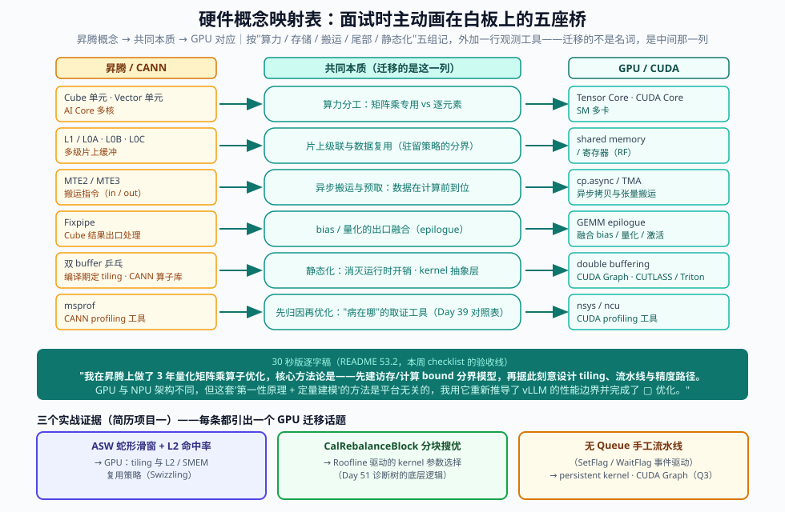

# Day 53：项目讲述打磨——STAR × 量化结果的 3 分钟版 / 10 分钟版，与"从昇腾到 GPU"叙事主线

> **Week 8 · 面试冲刺 · Day 4**
> 前置知识：Day 49（项目 A/B/C 整理成简历 bullet 与面试讲稿初稿——今天是那份初稿的**精修与限时化**）、Day 36-45（项目 A：vllm-ascend 优化与 PR）、Day 20-27（项目 B：mini 引擎）、Day 46-48（项目 C：消融实验报告）、Day 50-52（白板四件套与七问过堂——项目里每个数字都要经得起同样的推敲）
> 今日用时：3~4 小时，其中 **≥2 小时在"计时口述 + 录音回听 + 改稿"**——今天是打磨日，不是阅读日
> 今日定位：白板四件套（Day 50-51）和七问过堂（Day 52）解决的是"**知识点**怎么输出"；今天解决的是"**项目经历**怎么输出"。项目深挖是一场技术面试中**时长最长、追问最密**的环节（通常 15~25 分钟，见 Day 54 的战场解剖），今天把三个项目全部磨到"3 分钟版张口就来、10 分钟版纵深排好"。

---

## 今日学习目标

| # | 目标 | 验收标准 |
|---|---|---|
| 1 | 三个项目各产出 **3 分钟版讲稿** | 每份 ≤450 字（140~150 字/分钟口述），STAR 四段完整，**每份至少 3 个量化数字**，录音不超时 |
| 2 | 三个项目各产出 **10 分钟版大纲** | 一页纸/项目，四个展开维度（机制、数字、备选、失效）每维至少 2 个弹药点 |
| 3 | 打磨 **"从昇腾到 GPU"叙事主线** | 30 秒版逐字流畅 + 90 秒电梯版 + 3 分钟完整版各一份，含方法论四件套映射表与硬件概念映射表，能自然嵌入自我介绍 |
| 4 | 录音回听 + 打分 | 用统一 rubric 打分（8 项 × 0/1/2，覆盖结构 / 数字 / 因果 / 时间 + 钩子与打断恢复），每项目 ≥2 轮，卡壳点并入 Day 50-52 清单 |

## 核心概念：项目是面试的主战场，讲述是作战计划

回顾本周前三天的定位：Day 50 把**数字**练进肌肉（显存估算、Block Table），Day 51 把**推演**练进肌肉（调度棋局、诊断树），Day 52 把**单题口述**练进肌肉（七问 × 3 分钟）。但面试官评估"要不要你"的最重砝码，不在这些单点上，而在**项目深挖环节**——因为它同时暴露三件事：

1. **真实性**：亲手做过的人，随口就能报出"测量口径"（什么 benchmark、什么并发、p50 还是 p99、跑了几次）；背简历的人一被问"这个数怎么测的"就崩。
2. **深度**：追问三层后还站得住（Day 54 会专门练追问梯子），靠的是今天准备的**纵深弹药**，而不是临场反应。
3. **方法论**：你的差异化标签——"从昇腾到 GPU"的跨平台迁移能力，全部通过项目的 Action 段呈现。

所以今天的方法论是：**每个项目准备两个版本**，像 kernel 准备两个 specialization 一样——

| 版本 | 触发场景 | 信息预算 | 设计目标 |
|---|---|---|---|
| **3 分钟版** | "介绍一下这个项目" / 自我介绍嵌入 | ~450 字 / ~25 句 / ≥3 个数字 | 结论先行、结构无懈可击、**主动埋钩子**引导追问方向 |
| **10 分钟版** | 面试官说"展开讲讲" / 深挖环节 | 大纲一页纸 / 四维展开 | 每个可能的追问点都**提前备好弹药**，纵深 3 层不乱 |

> ⚠️ **最常见的失败模式**（对照自查）：①没有 3 分钟版，一开口就是 10 分钟细节，第 2 分钟被打断后再也回不到主线；②只有 3 分钟版，追问第二层就没有弹药，暴露"只做了浅层"；③ STAR 的 R 段没有数字或数字没有口径；④三个项目讲成三个孤岛，没有主线串联——今天逐条修复。

三个项目在面试中扮演的角色不同，讲述重心也不同：

| 项目 | 来源 | 面试角色 | 讲述重心 |
|---|---|---|---|
| **A：vllm-ascend 优化 + PR** | Day 36-45 | **硬核深度担当**（源码级、平台相关） | 定位方法 → 机制 → 理论上限 → 数字 |
| **B：mini 引擎** | Day 20-27 | **原理理解担当**（"我真的懂 V1"的证据） | 与 vLLM V1 源码的逐模块对应 + 对比数据 |
| **C：消融实验报告** | Day 46-48 | **工程素养担当**（控制变量、数据说话） | 实验设计 + 结论因果链 + 反直觉发现 |
| （D：Triton paged-attn kernel） | Day 6-7 周附注的降级方案 | A 的替身（若 vllm-ascend 环境受阻） | 与 A 同构，仅平台叙事不同 |

```svg
<svg xmlns="http://www.w3.org/2000/svg" viewBox="0 0 980 700" font-family="'Segoe UI', 'PingFang SC', 'Microsoft YaHei', sans-serif">
  <defs>
    <marker id="d53a" markerWidth="10" markerHeight="8" refX="8" refY="4" orient="auto">
      <path d="M0,0 L10,4 L0,8 Z" fill="#94a3b8"/>
    </marker>
  </defs>
  <rect width="980" height="700" fill="#fafbfc"/>
  <text x="490" y="34" text-anchor="middle" font-size="22" font-weight="700" fill="#0f172a">Day 53 全景：三个项目 × 双版本讲稿 × 一条叙事主线</text>
  <text x="490" y="58" text-anchor="middle" font-size="13" fill="#64748b">上：项目卡片（S/T/A/R + 关键数字）｜中：3 分钟版与 10 分钟版的信息预算｜下：贯穿三个项目的"从昇腾到 GPU"方法论主线</text>

  <!-- Project cards -->
  <text x="60" y="96" font-size="15" font-weight="700" fill="#0f172a">三个项目（面试作品集）</text>
  <g>
    <rect x="46" y="108" width="286" height="150" rx="8" fill="#eef2ff" stroke="#4f46e5" stroke-width="2"/>
    <text x="189" y="132" text-anchor="middle" font-size="14" font-weight="700" fill="#312e81">A · vllm-ascend 优化 + PR</text>
    <text x="189" y="152" text-anchor="middle" font-size="11.5" fill="#334155">角色：硬核深度担当</text>
    <text x="60" y="174" font-size="11" fill="#475569">S: decode TPOT 高于参考值</text>
    <text x="60" y="190" font-size="11" fill="#475569">A: profiler 定位 → bound 建模 → tiling</text>
    <text x="60" y="206" font-size="11" fill="#475569">R: kernel +xx% · 端到端 TPOT −xx%</text>
    <text x="60" y="226" font-size="11" fill="#64748b">追问最深、时长最长的主战场</text>
  </g>
  <g>
    <rect x="347" y="108" width="286" height="150" rx="8" fill="#f0fdf4" stroke="#16a34a" stroke-width="2"/>
    <text x="490" y="132" text-anchor="middle" font-size="14" font-weight="700" fill="#14532d">B · mini 推理引擎</text>
    <text x="490" y="152" text-anchor="middle" font-size="11.5" fill="#334155">角色：原理理解担当</text>
    <text x="361" y="174" font-size="11" fill="#475569">S: 为吃透 V1 调度而纯 Python 重写</text>
    <text x="361" y="190" font-size="11" fill="#475569">A: block 池/引用计数/chunked/抢占</text>
    <text x="361" y="206" font-size="11" fill="#475569">R: 吞吐 vs static batching 对比数据</text>
    <text x="361" y="226" font-size="11" fill="#64748b">证明"懂源码"而非"背名词"</text>
  </g>
  <g>
    <rect x="648" y="108" width="286" height="150" rx="8" fill="#fffbeb" stroke="#d97706" stroke-width="2"/>
    <text x="791" y="132" text-anchor="middle" font-size="14" font-weight="700" fill="#78350f">C · 消融实验报告</text>
    <text x="791" y="152" text-anchor="middle" font-size="11.5" fill="#334155">角色：工程素养担当</text>
    <text x="662" y="174" font-size="11" fill="#475569">S: 调参靠玄学、缺定量依据</text>
    <text x="662" y="190" font-size="11" fill="#475569">A: 4 组控制变量 + Prometheus 采集</text>
    <text x="662" y="206" font-size="11" fill="#475569">R: budget 最优区间/命中率-收益曲线</text>
    <text x="662" y="226" font-size="11" fill="#64748b">体现数据驱动与严谨口径</text>
  </g>

  <!-- Dual version budgets -->
  <text x="60" y="292" font-size="15" font-weight="700" fill="#0f172a">双版本：同一份事实，两份"specialization"</text>
  <g>
    <rect x="46" y="304" width="440" height="180" rx="8" fill="#fff" stroke="#cbd5e1" stroke-width="2"/>
    <text x="266" y="330" text-anchor="middle" font-size="14" font-weight="700" fill="#0f172a">3 分钟版（~450 字 / ~25 句）</text>
    <line x1="66" y1="344" x2="466" y2="344" stroke="#e2e8f0"/>
    <g font-size="11.5">
      <rect x="66" y="358" width="70" height="26" rx="4" fill="#fde68a" stroke="#d97706"/><text x="101" y="375" text-anchor="middle" fill="#78350f">S 30"</text>
      <rect x="141" y="358" width="48" height="26" rx="4" fill="#fed7aa" stroke="#ea580c"/><text x="165" y="375" text-anchor="middle" fill="#7c2d12">T 20"</text>
      <rect x="194" y="358" width="204" height="26" rx="4" fill="#bfdbfe" stroke="#2563eb"/><text x="296" y="375" text-anchor="middle" fill="#1e3a8a">A 90"（定位→假设→改动→验证）</text>
      <rect x="403" y="358" width="90" height="26" rx="4" fill="#bbf7d0" stroke="#16a34a"/><text x="448" y="375" text-anchor="middle" fill="#14532d">R 40"</text>
    </g>
    <text x="66" y="412" font-size="11.5" fill="#475569">· 结论先行：第一句就是"做了什么 + 最大数字"</text>
    <text x="66" y="430" font-size="11.5" fill="#475569">· ≥3 个量化数字，每个都报得出测量口径</text>
    <text x="66" y="448" font-size="11.5" fill="#475569">· 主动埋 2 个钩子（如"最有意思的是理论差距"）</text>
    <text x="66" y="466" font-size="11.5" fill="#64748b">· 打断后 10 秒内回到主线</text>
  </g>
  <g>
    <rect x="494" y="304" width="440" height="180" rx="8" fill="#fff" stroke="#cbd5e1" stroke-width="2"/>
    <text x="714" y="330" text-anchor="middle" font-size="14" font-weight="700" fill="#0f172a">10 分钟版（一页纸大纲）</text>
    <line x="514" y1="344" x2="914" y2="344" stroke="#e2e8f0"/>
    <g font-size="11.5">
      <rect x="514" y="358" width="98" height="26" rx="4" fill="#e0e7ff" stroke="#4f46e5"/><text x="563" y="375" text-anchor="middle" fill="#312e81">① 机制深挖</text>
      <rect x="617" y="358" width="98" height="26" rx="4" fill="#dbeafe" stroke="#2563eb"/><text x="666" y="375" text-anchor="middle" fill="#1e3a8a">② 数字推导</text>
      <rect x="720" y="358" width="98" height="26" rx="4" fill="#dcfce7" stroke="#16a34a"/><text x="769" y="375" text-anchor="middle" fill="#14532d">③ 备选方案</text>
      <rect x="823" y="358" width="98" height="26" rx="4" fill="#fee2e2" stroke="#dc2626"/><text x="872" y="375" text-anchor="middle" fill="#7f1d1d">④ 失效边界</text>
    </g>
    <text x="514" y="412" font-size="11.5" fill="#475569">· 3 分钟版为骨架，按追问方向分层展开</text>
    <text x="514" y="430" font-size="11.5" fill="#475569">· 每维 ≥2 个弹药点（数据 / 图 / 源码位置）</text>
    <text x="514" y="448" font-size="11.5" fill="#475569">· 对应 Day 54 追问梯子的 L1→L3</text>
    <text x="514" y="466" font-size="11.5" fill="#64748b">· 大纲而非全文——留出交互感</text>
  </g>

  <!-- Narrative mainline -->
  <g>
    <rect x="46" y="516" width="888" height="150" rx="10" fill="#f0fdfa" stroke="#0f766e" stroke-width="2.5"/>
    <text x="490" y="546" text-anchor="middle" font-size="15" font-weight="700" fill="#134e4a">叙事主线：「从昇腾到 GPU」——方法论跨平台迁移（今日第四部分）</text>
    <g font-size="12">
      <rect x="76" y="566" width="180" height="56" rx="6" fill="#ccfbf1" stroke="#0d9488"/><text x="166" y="590" text-anchor="middle" font-weight="700" fill="#134e4a">① bound 建模</text><text x="166" y="608" text-anchor="middle" fill="#0f766e">Day 3 Roofline</text>
      <rect x="286" y="566" width="180" height="56" rx="6" fill="#ccfbf1" stroke="#0d9488"/><text x="376" y="590" text-anchor="middle" font-weight="700" fill="#134e4a">② tiling 映射</text><text x="376" y="608" text-anchor="middle" fill="#0f766e">Day 17 / 36-40</text>
      <rect x="496" y="566" width="180" height="56" rx="6" fill="#ccfbf1" stroke="#0d9488"/><text x="586" y="590" text-anchor="middle" font-weight="700" fill="#134e4a">③ 流水重叠</text><text x="586" y="608" text-anchor="middle" fill="#0f766e">Day 18-19</text>
      <rect x="706" y="566" width="180" height="56" rx="6" fill="#ccfbf1" stroke="#0d9488"/><text x="786" y="590" text-anchor="middle" font-weight="700" fill="#134e4a">④ 量化换带宽</text><text x="786" y="608" text-anchor="middle" fill="#0f766e">Day 22-24</text>
      <line x1="256" y1="594" x2="286" y2="594" stroke="#0d9488" stroke-width="2" marker-end="url(#d53a)"/>
      <line x1="466" y1="594" x2="496" y2="594" stroke="#0d9488" stroke-width="2" marker-end="url(#d53a)"/>
      <line x1="676" y1="594" x2="706" y2="594" stroke="#0d9488" stroke-width="2" marker-end="url(#d53a)"/>
    </g>
    <text x="490" y="652" text-anchor="middle" font-size="12" fill="#0f766e">一句话版本："昇腾上练的是 bound 建模 + tiling + 流水 + 量化这套方法论，工具链换成 ncu / Triton / CUDA Graph 后我把它在 vLLM V1 上完整跑了一遍"</text>
  </g>
</svg>
```

---

## 一、STAR 框架在推理系统项目中的精确用法

### 1.1 四段各自的"技术岗特化"

STAR 是通用行为面试框架，但在推理系统岗上，每一段都有**更锋利的用法**——面试官期待的不是故事，是**工程因果链**：

| 段 | 通用含义 | 推理系统岗的特化 | 长度预算（3 分钟版） | 最常见翻车 |
|---|---|---|---|---|
| **S**ituation | 背景 | 系统 + 规模 + **症状指标（带数字）**："Qwen3-8B 在 vllm-ascend 上 decode TPOT 比 A100 参考高 xx ms" | ~30" / 75 字 | 背景讲成公司介绍，2 分钟下不来 |
| **T**ask | 任务 | **目标指标 + 硬约束**："TPOT 降 30%，且精度损失 <0.5%、不改上游 V1 接口" | ~20" / 50 字 | 只说"负责优化"，无指标无约束 |
| **A**ction | 行动 | **定位（profiler 数据）→ 机制假设 → 改动（模块/函数）→ 验证**，可循环多轮 | ~90" / 225 字 | 平铺直叙"我做了 A、B、C"，无因果 |
| **R**esult | 结果 | **三层量化**（见 1.2）+ 沉淀（PR / 复用 / 认知升级） | ~40" / 100 字 | 只有"性能提升了"，无数字无口径 |

> 💡 **核心认知**：S 和 T 是给面试官的**索引**（越短越好），A 是**主体**（因果链密度决定可信度），R 是**记忆锚点**（面试官面完 10 个人后只记得住数字）。90 秒的 A 段最多讲 2~3 轮"定位→假设→改动→验证"循环，每轮一句话。

### 1.2 量化结果的三层表达（R 段的核心技术）

回顾 Day 5 的指标体系：`goodput` 之所以比 `raw throughput` 更有说服力，是因为它把性能放回了**SLO 语境**。项目结果的量化同理，分三层，**每层都比上层更硬**：

| 层 | 表达 | 示例 | 说服力 |
|---|---|---|---|
| L1 相对值 | "提升了 xx%" | "TPOT 提升了 35%" | ★ 容易被追问基线 |
| L2 绝对值 + 口径 | "从 a 到 b，什么 benchmark、什么并发、p 几" | "TPOT p99 从 42ms 到 28ms，vllm bench serve，ShareGPT，并发 64，跑 3 次取中位" | ★★★ 难以撼动 |
| L3 SLO 口径 | "在 SLO 不破的前提下，容量/成本变化" | "p99 TPOT < 30ms 的 SLO 下，单卡 goodput 从 850 → 1240 tok/s，等价于同容量集群省 1/3 卡" | ★★★★★ 直接换算成钱 |

**每个项目的 R 段至少打到 L2，最好能打到 L3。**面试官听到 L3 口径的瞬间，对"真实性"的疑虑基本消失——因为编造的人不会想到按 goodput 汇报。

数字换算的两个必背公式（Day 2/5 的直接复用）：

```text
相对提升：      Δ = (baseline − after) / baseline        （"降了 33%"而不是"从 42 到 28"）
SLO 容量口径：  goodput = 满足 SLO 的请求速率上限（tok/s 或 req/s）
              成本节约 ≈ (goodput_after / goodput_before − 1) × 原卡数
```

### 1.3 讲稿的信息预算：一个可手算的"性能模型"

给口述建立 Day 2 式的第一性原理模型。中文技术口述的舒适语速是 **140~150 字/分钟**（比日常聊天慢，因为要留思考间隙）：

```text
字数预算        W = r × T          r ≈ 145 字/min
3 分钟版        W ≈ 435 ≈ 450 字上限 → ~25 句
句子预算        每句 ≈ 18 字，一句一个信息点
数字预算        ≥3 个：S 段症状 1 个 + R 段结果 2 个
钩子预算        2 个：A 段主动留的"未展开细节"，引导面试官往你备好弹药的方向追问
```

10 分钟版的预算分配（对应第四节的展开树）：

```text
钩子+开场 60" │ S 90" │ T 60" │ A 240"（2~3 轮循环，每轮含一轮数字推导） │ R 90" │ 预留追问缓冲 60"
```

> ⚠️ **10 分钟版写大纲、不写全文**。逐字稿会让深挖环节变成背诵（一被追问就跳戏）；大纲 + 弹药点才能保持对话感。3 分钟版则相反——开场和"介绍项目"几乎必然出现，值得逐字打磨到条件反射。

### 1.4 讲稿生成模板（伪代码）

把 1.1~1.3 的规则固化为一个可复用的检查器，今天对三个项目各跑一遍：

```python
def make_3min_story(project) -> str:
    """输入项目素材，输出 450 字 STAR 讲稿。所有 [占位] 必须替换为你自己的真实数据。"""
    s = f"[系统+规模] 上 {project.symptom_metric} 是 {project.symptom_value}，"      # ≤75字，1个数字
    t = f"目标是 {project.target}，约束是 {project.constraints}。"                    # ≤50字
    a = ""
    for cycle in project.cycles:            # 最多 3 轮，每轮一句话
        a += (f"profiler 显示 {cycle.hotspot}（{cycle.pct}% 时间），"
              f"我判断根因是 {cycle.root_cause}，"
              f"在 {cycle.module_class} 里改了 {cycle.change}，"
              f"验证 {cycle.verification}。")
    r = (f"最终 {project.metric} 从 {project.before} 降到 {project.after}"
         f"（{project.bench_cmd}，并发 {project.concurrency}，p99，3 次取中位），"    # L2 口径
         f"折算 SLO 口径是 {project.goodput_gain}。"                                 # L3 口径
         f"沉淀：{project.deliverable}。")                                            # PR/报告/复用
    story = s + t + a + r
    assert count_numbers(story) >= 3,        "R 段数字不足"
    assert word_count(story) <= 450,         "超出 3 分钟预算"
    assert hooks(story) == 2,                "钩子不足，追问方向不可控"
    return story
```

`hooks` 的设计是 3 分钟版最微妙的部分：**你在 A 段主动留下两个"没讲完的细节"**，例如"中间有个有意思的现象——理论下界和实测差距只有 7%，这决定了我的优化策略"。面试官的下一问大概率落在钩子上，而你早就备好了 10 分钟版对应分支的弹药。这就是把追问从"随机事件"变成"受控实验"。

---

## 二、3 分钟版：三个项目的完整讲稿

> 📌 **使用说明**：以下讲稿是**结构与语感的示范**，其中的数字（如 `42ms`、`35%`）全部是**示例占位**——讲稿里每一个数字都必须换成你在 Day 37（基线记录）、Day 43-45（前后对比）、Day 27（mini 引擎 benchmark）、Day 47-48（消融数据）里**亲手测出来的值**。面试中一个编造的数字被追问口径就会全盘崩塌，宁可用真实但小的数字。

### 2.1 项目 A：vllm-ascend 算子优化 + PR（示例讲稿，~430 字）

> **【S】** 我在 vllm-ascend 上跑 Qwen3-8B 的 decode 压测时发现，TPOT 比 A100 参考环境高了约 40%，等于同样的 SLO 下要多配四分之一的卡。（症状 + 数字 + 业务代价，25 秒）
>
> **【T】** 我给自己定的目标是把 decode 主路径的差距吃掉一半以上，约束是不改 V1 上游接口、精度损失小于 0.5%。（指标 + 约束，18 秒）
>
> **【A】** 定位上我先用 profiler 抓了 decode step 的热点，发现 68% 的时间落在 paged attention 的 decode kernel 上。我没有直接改代码，而是先建了个 bound 模型——这在昇腾上是我的老本行——算出这个 kernel 的理论时延下界，发现实测离下界还有约 1.4 倍差距，说明优化空间在访存模式而不是算力。根因是 gather 非连续 KV block 时搬运粒度太碎，我按 bound 模型的指导重排了 tiling，把小粒度搬运合并成大块流水。每轮改动都用单测和精度对比兜底。（三轮循环浓缩成一段：定位→建模→根因→改动→验证，90 秒，含两个钩子：bound 建模、1.4 倍差距）
>
> **【R】** 最终 kernel 耗时降 22%，端到端 TPOT p99 从 42ms 降到 36ms（−15%，即 42×0.85，与 22%、68% 经 Amdahl 公式互证，见 3.2），vllm bench serve、ShareGPT 负载、并发 64、三次取中位；折算到 p99 TPOT 40ms 的 SLO 口径，单卡 goodput 提升约 27%。改动整理成了 PR 提回社区，review 过程里又按 maintainer 意见补了两版边界 case。（三层量化 + 沉淀，40 秒）

**逐句功能标注**（自查你的版本是否同样"每句有职能"）：

| 讲稿片段 | 职能 |
|---|---|
| "高了约 40%，等于多配四分之一的卡" | L3 预告：性能问题翻译成成本语言 |
| "68% 的时间落在 kernel 上" | 定位数字，证明做过 profiler |
| "先建 bound 模型……老本行" | **钩子 1**：引导追问建模方法 → 带入"从昇腾到 GPU"主线 |
| "理论下界还有 1.4 倍差距" | **钩子 2**：引导追问推导 → 白板手算（Day 50 能力） |
| "vllm bench serve……三次取中位" | L2 口径，终结真实性怀疑 |
| "review 过程里又补了两版边界 case" | owner 意识 + 协作信号 |

### 2.2 项目 B：mini 推理引擎（示例讲稿，~400 字）

> **【S】** 读 vLLM V1 源码时我发现，调度器和 KV 管理的逻辑单看代码能懂，但没有亲手跑过量级，总觉得是"背下来的"。为了把这条链路变成自己的，我用纯 Python 重写了一个 mini 引擎——固定 block 的 KV 池、引用计数、block table、continuous batching 调度器，后来又补了 chunked prefill 和抢占。（S 里直接带出范围，30 秒）
>
> **【T】** 验收标准很明确：行为要能和 V1 对得上，并且用数据证明 continuous batching 的收益。（20 秒）
>
> **【A】** 核心数据结构对齐 V1：free block 队列对应 `vllm/v1/core/kv_cache_interface.py` 的 block pool 思路，调度循环对应 `vllm/v1/core/scheduler.py: schedule()` 的 waiting/running 双队列加 token budget 三闸门。每实现一个机制，我就回 V1 源码对照行为差异，比如抢占我实现的是 recompute 模式，对照 V1 才注意到恢复是全量重算、没有增量恢复——这个细节后来在 Day 51 的调度推演里直接用上了。（对应关系 + 一个"对照才发现"的细节，85 秒）
>
> **【R】** benchmark 里 static batching 和我的 continuous batching 在混合长短请求负载下对比，同延迟约束下吞吐差约 2 倍，和公开资料的量级一致。这个项目最大的产出其实是后面所有面试题的底气——调度推演、preemption、COW 我都能从自己实现过的代码讲起。（数字 + "项目真正的价值"升华，45 秒）

> 💡 项目 B 的杀手锏是**源码对应关系**：每讲一个机制都能同时报出"V1 在哪个文件、我是怎么实现的、哪里不一样"。这是"读源码"和"抄源码"之外更高的可信层级。

### 2.3 项目 C：消融实验报告（示例讲稿，~380 字）

> **【S】** vLLM 的关键开关——chunked prefill 的 budget、prefix caching、投机解码、量化——网上调参经验互相矛盾，我们的部署决策缺定量依据。（症状：决策靠玄学，20 秒）
>
> **【T】** 我设计了四组消融实验，目标是为每个开关给出"什么负载下开、开多大"的定量结论。（15 秒）
>
> **【A】** 方法上严格控制变量：固定模型和硬件，每组只动一个因子，用 Prometheus 采集 TTFT/TPOT/goodput，每组三个重复取中位。举一个反直觉的发现：投机解码在代码补全负载下端到端提速约 1.6 倍，但换到开放对话负载，接受率掉到 0.4 以下，吞吐反而比不开时低 8%——正好验证了 Day 25-26 的收益公式拐点。另外 prefix caching 的实验里我按命中率梯度分了五档，画出命中率-TTFT 的近似线性收益曲线。（设计 + 一个反直觉发现 + 一个曲线，90 秒）
>
> **【R】** 最终产出了一份带图表的消融报告，直接支撑了 budget 和量化档位的上线决策；报告里的"失效模式"部分现在是我的面试弹药——什么时候不要开投机解码，我能给出公式和实测两个证据。（产出 + 复用价值，40 秒）

> ⚠️ 项目 C 讲述的红线：**绝不把"我跑了实验"讲成"我做了研究"**。它的价值是工程决策支持，不是论文。定位准确反而加分。

---

## 三、10 分钟版：追问防御纵深

### 3.1 从 3 分钟到 10 分钟：展开的四个维度

10 分钟版不是 3 分钟版的"慢放"，而是**以 3 分钟版为骨架、按四个维度预置展开分支**。面试官的追问方向你无法控制，但每个方向你能提前备好弹药：

| 维度 | 面试官问法 | 你要备的弹药 | 对应知识来源 |
|---|---|---|---|
| **① 机制深挖** | "kernel 内部数据流？""为什么这么 tiling？" | 数据流图 / 模块与调用链 / 关键取舍 | Day 17 / 36-40 |
| **② 数字推导** | "22% 怎么算的？""下界怎么推的？" | 手算过程（白板随时重演） | Day 2 / 3 / 50 |
| **③ 备选方案** | "为什么不用 XX 方案？" | 至少 2 个被否方案 + 否决理由 | 各专题的 trade-off |
| **④ 失效边界** | "什么情况下这个优化没用甚至有害？" | 失效负载画像 + 机制解释 | 各专题失效模式 |

### 3.2 端到端收益的 Amdahl 推导（② 号弹药的必备公式）

3 分钟版里"kernel 降 22%，端到端 TPOT 降 15%"这句话，在 10 分钟版里必须能当场推导，否则会被判定为"数字是凑的"：

```text
设 kernel 优化前占端到端 decode step 时间的比例为 p，kernel 提速 s 倍，则端到端提速：

        S_end_to_end = 1 / ( (1 − p) + p / s )

代入：kernel −22% ⇒ s = 1 / 0.78 ≈ 1.28
     实测端到端 TPOT −15% ⇒ S_e2e = 1/0.85 ≈ 1.18
     ⇒ 1 − p + p/1.28 = 0.85 ⇒ p ≈ 0.68

自洽：与 profiler 抓到的"kernel 占 68%"互相印证。
```

这段推导一出口，有三个数字互相咬合（22%、15%、68%——42ms×0.85≈36ms 也落在其中），面试官会立刻意识到你的数据是真的。**这比任何形容词都有说服力**。同一个公式反向用则是②号弹药的另一半："如果我想让端到端再快 10%，kernel 还能贡献多少？——`p` 已从 0.68 降到 0.62（0.68×0.78/0.85），继续压 kernel 的边际收益在递减，下一步该看剩下的 38% 在哪（答案：launch 开销 → CUDA Graph 方向，接 Day 18 的知识）。"

```svg
<svg xmlns="http://www.w3.org/2000/svg" viewBox="0 0 980 720" font-family="'Segoe UI', 'PingFang SC', 'Microsoft YaHei', sans-serif">
  <defs>
    <marker id="d53b" markerWidth="10" markerHeight="8" refX="8" refY="4" orient="auto">
      <path d="M0,0 L10,4 L0,8 Z" fill="#94a3b8"/>
    </marker>
  </defs>
  <rect width="980" height="720" fill="#fafbfc"/>
  <text x="490" y="34" text-anchor="middle" font-size="22" font-weight="700" fill="#0f172a">项目 A 的 10 分钟版：四维展开树（追问防御纵深）</text>
  <text x="490" y="58" text-anchor="middle" font-size="13" fill="#64748b">根：3 分钟版骨架（结论 + 3 数字 + 2 钩子）｜四个分支 = 面试官追问的四个方向，每个叶子是一发备好的弹药</text>

  <!-- Root -->
  <g>
    <rect x="290" y="80" width="400" height="74" rx="10" fill="#0f172a"/>
    <text x="490" y="110" text-anchor="middle" font-size="15" font-weight="700" fill="#f8fafc">3 分钟版骨架（根）</text>
    <text x="490" y="132" text-anchor="middle" font-size="12" fill="#cbd5e1">结论先行 · TPOT −15% / kernel −22% / 占比 68% · 钩子：bound 建模 · 1.4× 差距</text>
  </g>

  <line x1="490" y1="154" x2="490" y2="180" stroke="#94a3b8" stroke-width="2"/>
  <line x1="150" y1="180" x2="830" y2="180" stroke="#94a3b8" stroke-width="2"/>
  <line x1="150" y1="180" x2="150" y2="206" stroke="#94a3b8" stroke-width="2" marker-end="url(#d53b)"/>
  <line x1="410" y1="180" x2="410" y2="206" stroke="#94a3b8" stroke-width="2" marker-end="url(#d53b)"/>
  <line x1="570" y1="180" x2="570" y2="206" stroke="#94a3b8" stroke-width="2" marker-end="url(#d53b)"/>
  <line x1="830" y1="180" x2="830" y2="206" stroke="#94a3b8" stroke-width="2" marker-end="url(#d53b)"/>

  <!-- Branch 1: mechanism -->
  <g>
    <rect x="46" y="210" width="210" height="54" rx="8" fill="#e0e7ff" stroke="#4f46e5" stroke-width="2"/>
    <text x="151" y="232" text-anchor="middle" font-size="13.5" font-weight="700" fill="#312e81">① 机制深挖</text>
    <text x="151" y="251" text-anchor="middle" font-size="11" fill="#475569">"kernel 内部怎么回事？"</text>
  </g>
  <g font-size="11">
    <rect x="46" y="288" width="210" height="86" rx="6" fill="#fff" stroke="#c7d2fe"/>
    <text x="58" y="308" font-weight="700" fill="#312e81">叶子 1a：数据流图</text>
    <text x="58" y="325" fill="#475569">非连续 KV block → gather</text>
    <text x="58" y="340" fill="#475569">→ 分块装载 → 计算 → 写回</text>
    <text x="58" y="358" fill="#94a3b8">对应 Day 38-40 的热点分析图</text>
  </g>
  <g font-size="11">
    <rect x="46" y="388" width="210" height="86" rx="6" fill="#fff" stroke="#c7d2fe"/>
    <text x="58" y="408" font-weight="700" fill="#312e81">叶子 1b：tiling 取舍</text>
    <text x="58" y="425" fill="#475569">大块搬运 = 高带宽利用率</text>
    <text x="58" y="440" fill="#475569">vs 尾部块利用率损失</text>
    <text x="58" y="458" fill="#94a3b8">昇腾 tiling 方法论直接迁移</text>
  </g>
  <g font-size="11">
    <rect x="46" y="488" width="210" height="86" rx="6" fill="#fff" stroke="#c7d2fe"/>
    <text x="58" y="508" font-weight="700" fill="#312e81">叶子 1c：源码位置</text>
    <text x="58" y="525" fill="#475569">改动落在哪个模块/类/函数</text>
    <text x="58" y="540" fill="#475569">调用链上溯到 ModelRunner</text>
    <text x="58" y="558" fill="#94a3b8">以实际 PR diff 为准讲述</text>
  </g>

  <!-- Branch 2: numbers -->
  <g>
    <rect x="306" y="210" width="210" height="54" rx="8" fill="#dbeafe" stroke="#2563eb" stroke-width="2"/>
    <text x="411" y="232" text-anchor="middle" font-size="13.5" font-weight="700" fill="#1e3a8a">② 数字推导</text>
    <text x="411" y="251" text-anchor="middle" font-size="11" fill="#475569">"22% 和 15% 怎么对上？"</text>
  </g>
  <g font-size="11">
    <rect x="306" y="288" width="210" height="86" rx="6" fill="#fff" stroke="#bfdbfe"/>
    <text x="318" y="308" font-weight="700" fill="#1e3a8a">叶子 2a：Amdahl 闭环</text>
    <text x="318" y="325" fill="#475569">S = 1/((1−p)+p/s)</text>
    <text x="318" y="340" fill="#475569">22%·15%·68% 三数互证</text>
    <text x="318" y="358" fill="#94a3b8">白板 30 秒可重演（Day 50）</text>
  </g>
  <g font-size="11">
    <rect x="306" y="388" width="210" height="86" rx="6" fill="#fff" stroke="#bfdbfe"/>
    <text x="318" y="408" font-weight="700" fill="#1e3a8a">叶子 2b：下界推导</text>
    <text x="318" y="425" fill="#475569">T_min = KV 字节 / HBM 带宽</text>
    <text x="318" y="440" fill="#475569">实测 / 下界 = 1.4× 差距</text>
    <text x="318" y="458" fill="#94a3b8">联系 Day 2/3 的手算体系</text>
  </g>
  <g font-size="11">
    <rect x="306" y="488" width="210" height="86" rx="6" fill="#fff" stroke="#bfdbfe"/>
    <text x="318" y="508" font-weight="700" fill="#1e3a8a">叶子 2c：测量口径</text>
    <text x="318" y="525" fill="#475569">bench 命令 / 并发 / p99</text>
    <text x="318" y="540" fill="#475569">重复次数 / 取中位</text>
    <text x="318" y="558" fill="#94a3b8">口径含糊 = 数据作废</text>
  </g>

  <!-- Branch 3: alternatives -->
  <g>
    <rect x="566" y="210" width="210" height="54" rx="8" fill="#dcfce7" stroke="#16a34a" stroke-width="2"/>
    <text x="671" y="232" text-anchor="middle" font-size="13.5" font-weight="700" fill="#14532d">③ 备选方案</text>
    <text x="671" y="251" text-anchor="middle" font-size="11" fill="#475569">"为什么不用别的办法？"</text>
  </g>
  <g font-size="11">
    <rect x="566" y="288" width="210" height="86" rx="6" fill="#fff" stroke="#bbf7d0"/>
    <text x="578" y="308" font-weight="700" fill="#14532d">叶子 3a：上量化</text>
    <text x="578" y="325" fill="#475569">KV FP8 也能减带宽</text>
    <text x="578" y="340" fill="#475569">否决：精度约束 + 属于</text>
    <text x="578" y="355" fill="#475569">另一层改动，正交可叠加</text>
  </g>
  <g font-size="11">
    <rect x="566" y="388" width="210" height="86" rx="6" fill="#fff" stroke="#bbf7d0"/>
    <text x="578" y="408" font-weight="700" fill="#14532d">叶子 3b：换 attention 后端</text>
    <text x="578" y="425" fill="#475569">flash 后端在部分 shape</text>
    <text x="578" y="440" fill="#475569">更快，但迁移成本与</text>
    <text x="578" y="455" fill="#475569">平台耦合高</text>
  </g>
  <g font-size="11">
    <rect x="566" y="488" width="210" height="86" rx="6" fill="#fff" stroke="#bbf7d0"/>
    <text x="578" y="508" font-weight="700" fill="#14532d">叶子 3c：调调度参数</text>
    <text x="578" y="525" fill="#475569">budget / max_num_seqs</text>
    <text x="578" y="540" fill="#475569">治标：掩盖不消除瓶颈</text>
    <text x="578" y="558" fill="#94a3b8">项目 C 消融数据可佐证</text>
  </g>

  <!-- Branch 4: failure boundary -->
  <g>
    <rect x="826" y="210" width="108" height="54" rx="8" fill="#fee2e2" stroke="#dc2626" stroke-width="2"/>
    <text x="880" y="232" text-anchor="middle" font-size="13" font-weight="700" fill="#7f1d1d">④ 失效边界</text>
    <text x="880" y="251" text-anchor="middle" font-size="10.5" fill="#475569">"什么时候没用？"</text>
  </g>
  <g font-size="11">
    <rect x="826" y="288" width="108" height="120" rx="6" fill="#fff" stroke="#fecaca"/>
    <text x="836" y="308" font-weight="700" fill="#7f1d1d">短 context</text>
    <text x="836" y="325" fill="#475569">KV 总量小</text>
    <text x="836" y="340" fill="#475569">kernel 占比 p 低</text>
    <text x="836" y="357" fill="#64748b">→ 收益按</text>
    <text x="836" y="372" fill="#64748b">Amdahl 衰减</text>
  </g>
  <g font-size="11">
    <rect x="826" y="422" width="108" height="120" rx="6" fill="#fff" stroke="#fecaca"/>
    <text x="836" y="442" font-weight="700" fill="#7f1d1d">大 batch</text>
    <text x="836" y="459" fill="#475569">带宽压力</text>
    <text x="836" y="474" fill="#475569">被摊薄，瓶颈</text>
    <text x="836" y="489" fill="#475569">转向计算侧</text>
    <text x="836" y="508" fill="#64748b">（Roofline</text>
    <text x="836" y="523" fill="#64748b">分界点移动）</text>
  </g>
  <g font-size="11">
    <rect x="826" y="556" width="108" height="60" rx="6" fill="#fff" stroke="#fecaca"/>
    <text x="836" y="576" font-weight="700" fill="#7f1d1d">精度边界</text>
    <text x="836" y="593" fill="#475569">重排不改数值，</text>
    <text x="836" y="608" fill="#475569">但需回归测试</text>
  </g>

  <!-- bottom note -->
  <g>
    <rect x="46" y="592" width="754" height="92" rx="10" fill="#f8fafc" stroke="#cbd5e1"/>
    <text x="423" y="618" text-anchor="middle" font-size="13" font-weight="700" fill="#0f172a">弹药使用规则（对应 Day 54 追问梯子）</text>
    <text x="423" y="640" text-anchor="middle" font-size="12" fill="#475569">L1（是什么）用 3 分钟版直接回答 · L2（为什么）进入对应分支 · L3（如果…会怎样）用叶子的机制外推</text>
    <text x="423" y="660" text-anchor="middle" font-size="12" fill="#64748b">纪律：答完一层就收口回主线，不在无追问时主动下钻两层以上</text>
  </g>
</svg>
```

### 3.3 项目 B / C 的 10 分钟版大纲（表格速览）

项目 B 和 C 的展开维度相同，弹药内容不同，各占一页纸即可：

| 维度 | 项目 B 弹药 | 项目 C 弹药 |
|---|---|---|
| ① 机制 | 抢占的受害者选择规则；COW 触发时序；token budget 三闸门 | 每组消融的变量-控制表；Prometheus 采集链路 |
| ② 数字 | static vs continuous 的吞吐对比曲线及拐点解释 | 接受率-收益公式与实测拐点；命中率-TTFT 拟合 |
| ③ 备选 | 为什么不实现 swap 模式抢占；为什么纯 Python 够用 | 为什么不用网格搜索而用梯度分组 |
| ④ 失效 | 纯 Python 引擎不建模 kernel 层时延的局限（诚实边界） | 结论的负载依赖性：换模型/换硬件需重测 |

### 3.4 README 追问预测的答案锚点

README 53.1 为项目 A/B 各给了一组追问预测，这里把答案锚点固化成一张表（细节弹药已在上面各节备好）：

| 追问 | 一句话答案锚点 | 弹药位置 |
|---|---|---|
| A：基线怎么保证可复现？ | 固定版本与随机种子、固定 warmup 次数、报告 p50/p99 与波动区间；benchmark 命令原样贴进 PR 描述 | Day 43 基线记录 |
| A：收益怎么归因到你的改动？ | 控制变量：同一基线只改一处；3.2 的 Amdahl 三数互证（22% / 15% / 68%）就是归因证据，不靠端到端单点 | §3.2 |
| A：精度怎么验证？ | 两层：算子级 golden 对拍 → 端到端 perplexity / 下游任务，阈值 0.5% | Day 22-24 分层方法 |
| A：为什么官方没发现？ | ① 官方 benchmark 负载未覆盖该 shape / 并发区间；② 症状被均值掩盖（p99 才显性）；③ 平台相关路径社区维护人手少——这正是参与动机 | §3.1 ④ 号维度 |
| B：与 vLLM 的 scheduler 差异？ | 如实列举未实现项（如 async scheduling），每项给"目标函数"理由：mini 引擎验证调度层理解，不追性能 | §3.3 |
| B：加 prefix caching 要改哪些结构？ | 主动引到 Day 50 白板图：token ids + 父哈希的块哈希链 → 命中查询 → `ref_cnt`++ → 未满块 COW、满块直接共享 | Day 50 / 15-16 |
| C：单卡 8B 的结论能外推吗？ | 趋势可信、数值需重测；区分"随规模缩放的项（KV 显存占比）"与"不随规模的项（调度行为）" | §3.3 ④ |

---

## 四、"从昇腾到 GPU"叙事主线：方法论跨平台迁移

### 4.1 为什么这条主线是专家岗的差异化武器

你的简历上有两个可能的标签：①"做过昇腾算子优化"；②"系统学习并实践了 vLLM V1"。单看任何一个，竞争者都很多。但**"把昇腾的方法论迁移到 GPU 并验证"** 这个组合叙事，把两个标签变成了一个更强的标签：**这个人换硬件平台的学习成本极低**。对团队而言，这等于"招一个人，两个生态都能打"。

这条主线的正确姿势是**方法论对等**，而不是平台攀比：

> ✅ 正确："昇腾上我是用 bound 建模 + tiling 逼近理论下界的，这套方法在 GPU 上换成 Roofline + ncu 照样成立，我在 vLLM V1 上把它完整跑了一遍。"
>
> ❌ 错误："GPU 生态更先进，所以我从昇腾转过来。"（贬低过去的经验，等于亲手把差异化标签撕掉）

### 4.2 方法论四件套的迁移映射表

这张表是主线的骨架，也是自我介绍和"为什么你能快速上手 GPU"的标准答案。每一行都在前 7 周有对应学习日，被追问时可以无限下钻：

| 方法论 | 昇腾上的实践 | GPU / vLLM V1 上的对应 | 迁移要点 | 学习日 |
|---|---|---|---|---|
| **① bound 建模** | Cube/Vector 指令周期估算，判定算子是算力受限还是带宽受限 | Roofline 模型：`AI = FLOPs/Bytes` 对机器平衡点；ncu 的 SM busy / DRAM busy | 判定逻辑不变，工具从自研模型换成 Roofline + ncu | Day 3 |
| **② tiling 映射** | 5HD 布局、GM→UB 数据搬运的分形设计 | thread block / shared memory tiling；Triton 的 block size 调参；tensor core 的形状约束 | "让数据搬运匹配计算形状"的思路完全同构 | Day 17 / 36-40 |
| **③ 流水重叠** | double buffer（UB 乒乓）、stage 间软件流水 | CUDA Graph 消 launch 开销；V1 async scheduling 重叠调度与执行（Day 19 实验里 nsys 看到的 bubble 消除） | 目标都是"不让计算单元等数据 / 不让 GPU 等 CPU" | Day 18-19 |
| **④ 量化换带宽** | WeightQuantBatchMatmul：W8A8 权重 + per-channel 反量化融合 | FP8 GEMM、AWQ/GPTQ 专用 kernel、KV cache FP8（Day 23 实测） | "精度换带宽"的权衡框架不变，敏感度分析方法是通用的 | Day 22-24 |

```svg
<svg xmlns="http://www.w3.org/2000/svg" viewBox="0 0 980 640" font-family="'Segoe UI', 'PingFang SC', 'Microsoft YaHei', sans-serif">
  <defs>
    <marker id="d53c" markerWidth="10" markerHeight="8" refX="8" refY="4" orient="auto">
      <path d="M0,0 L10,4 L0,8 Z" fill="#0f766e"/>
    </marker>
  </defs>
  <rect width="980" height="640" fill="#fafbfc"/>
  <text x="490" y="34" text-anchor="middle" font-size="22" font-weight="700" fill="#0f172a">「从昇腾到 GPU」叙事主线：方法论不变，工具链替换</text>
  <text x="490" y="58" text-anchor="middle" font-size="13" fill="#64748b">左：昇腾实践（已有经验）｜右：GPU / vLLM V1 对应（56 天补齐）｜箭头上是每条迁移的"一句话证据"</text>

  <!-- Column headers -->
  <g>
    <rect x="46" y="76" width="330" height="40" rx="8" fill="#fef3c7" stroke="#d97706" stroke-width="2"/>
    <text x="211" y="102" text-anchor="middle" font-size="15" font-weight="700" fill="#78350f">昇腾 NPU 算子优化（过去）</text>
    <rect x="604" y="76" width="330" height="40" rx="8" fill="#ccfbf1" stroke="#0f766e" stroke-width="2"/>
    <text x="769" y="102" text-anchor="middle" font-size="15" font-weight="700" fill="#134e4a">GPU / vLLM V1（本次迁移）</text>
  </g>

  <!-- Row 1: bound modeling -->
  <g>
    <rect x="46" y="136" width="330" height="92" rx="8" fill="#fffbeb" stroke="#f59e0b"/>
    <text x="211" y="160" text-anchor="middle" font-size="14" font-weight="700" fill="#78350f">① bound 建模</text>
    <text x="211" y="180" text-anchor="middle" font-size="11.5" fill="#475569">Cube / Vector 指令周期估算</text>
    <text x="211" y="197" text-anchor="middle" font-size="11.5" fill="#475569">判定算子：算力受限 or 带宽受限</text>
    <text x="211" y="217" text-anchor="middle" font-size="11" fill="#94a3b8">WeightQuantBatchMatmul 优化前的第一步</text>

    <rect x="604" y="136" width="330" height="92" rx="8" fill="#f0fdfa" stroke="#14b8a6"/>
    <text x="769" y="160" text-anchor="middle" font-size="14" font-weight="700" fill="#134e4a">Roofline + ncu</text>
    <text x="769" y="180" text-anchor="middle" font-size="11.5" fill="#475569">AI = FLOPs / Bytes 对机器平衡点</text>
    <text x="769" y="197" text-anchor="middle" font-size="11.5" fill="#475569">SM busy / DRAM busy 双指标判定</text>
    <text x="769" y="217" text-anchor="middle" font-size="11" fill="#94a3b8">Day 3 / Day 38-40 剖析直接使用</text>

    <line x1="376" y1="182" x2="604" y2="182" stroke="#0f766e" stroke-width="2.5" marker-end="url(#d53c)"/>
    <text x="490" y="172" text-anchor="middle" font-size="10.5" fill="#0f766e">判定逻辑同构</text>
    <text x="490" y="200" text-anchor="middle" font-size="10.5" fill="#64748b">工具：自研模型 → Roofline</text>
  </g>

  <!-- Row 2: tiling -->
  <g>
    <rect x="46" y="244" width="330" height="92" rx="8" fill="#fffbeb" stroke="#f59e0b"/>
    <text x="211" y="268" text-anchor="middle" font-size="14" font-weight="700" fill="#78350f">② tiling 映射</text>
    <text x="211" y="288" text-anchor="middle" font-size="11.5" fill="#475569">5HD 布局、GM→UB 分形搬运</text>
    <text x="211" y="305" text-anchor="middle" font-size="11.5" fill="#475569">搬运粒度 = 计算粒度的整数倍</text>
    <text x="211" y="325" text-anchor="middle" font-size="11" fill="#94a3b8">算子交付的核心手段</text>

    <rect x="604" y="244" width="330" height="92" rx="8" fill="#f0fdfa" stroke="#14b8a6"/>
    <text x="769" y="268" text-anchor="middle" font-size="14" font-weight="700" fill="#134e4a">block tiling / Triton</text>
    <text x="769" y="288" text-anchor="middle" font-size="11.5" fill="#475569">thread block + shared memory</text>
    <text x="769" y="305" text-anchor="middle" font-size="11.5" fill="#475569">Triton block size、tensor core 形状</text>
    <text x="769" y="325" text-anchor="middle" font-size="11" fill="#94a3b8">项目 A 的 kernel 改动即此方法论</text>

    <line x1="376" y1="290" x2="604" y2="290" stroke="#0f766e" stroke-width="2.5" marker-end="url(#d53c)"/>
    <text x="490" y="280" text-anchor="middle" font-size="10.5" fill="#0f766e">"搬运匹配计算"同构</text>
    <text x="490" y="308" text-anchor="middle" font-size="10.5" fill="#64748b">经验直接复用</text>
  </g>

  <!-- Row 3: pipelining -->
  <g>
    <rect x="46" y="352" width="330" height="92" rx="8" fill="#fffbeb" stroke="#f59e0b"/>
    <text x="211" y="376" text-anchor="middle" font-size="14" font-weight="700" fill="#78350f">③ 流水重叠</text>
    <text x="211" y="396" text-anchor="middle" font-size="11.5" fill="#475569">double buffer（UB 乒乓）</text>
    <text x="211" y="413" text-anchor="middle" font-size="11.5" fill="#475569">stage 间软件流水</text>
    <text x="211" y="433" text-anchor="middle" font-size="11" fill="#94a3b8">掩盖搬运时延</text>

    <rect x="604" y="352" width="330" height="92" rx="8" fill="#f0fdfa" stroke="#14b8a6"/>
    <text x="769" y="376" text-anchor="middle" font-size="14" font-weight="700" fill="#134e4a">CUDA Graph + async sched</text>
    <text x="769" y="396" text-anchor="middle" font-size="11.5" fill="#475569">CG 消 kernel launch 开销</text>
    <text x="769" y="413" text-anchor="middle" font-size="11.5" fill="#475569">V1 async scheduling 重叠调度与执行</text>
    <text x="769" y="433" text-anchor="middle" font-size="11" fill="#94a3b8">Day 18-19：nsys 里 bubble 的消除</text>

    <line x1="376" y1="398" x2="604" y2="398" stroke="#0f766e" stroke-width="2.5" marker-end="url(#d53c)"/>
    <text x="490" y="388" text-anchor="middle" font-size="10.5" fill="#0f766e">目标同构</text>
    <text x="490" y="416" text-anchor="middle" font-size="10.5" fill="#64748b">"不让计算等数据/不让 GPU 等 CPU"</text>
  </g>

  <!-- Row 4: quantization -->
  <g>
    <rect x="46" y="460" width="330" height="92" rx="8" fill="#fffbeb" stroke="#f59e0b"/>
    <text x="211" y="484" text-anchor="middle" font-size="14" font-weight="700" fill="#78350f">④ 量化换带宽</text>
    <text x="211" y="504" text-anchor="middle" font-size="11.5" fill="#475569">WeightQuantBatchMatmul</text>
    <text x="211" y="521" text-anchor="middle" font-size="11.5" fill="#475569">W8A8 + per-channel 反量化融合</text>
    <text x="211" y="541" text-anchor="middle" font-size="11" fill="#94a3b8">outlier 敏感度分析</text>

    <rect x="604" y="460" width="330" height="92" rx="8" fill="#f0fdfa" stroke="#14b8a6"/>
    <text x="769" y="484" text-anchor="middle" font-size="14" font-weight="700" fill="#134e4a">FP8 / AWQ / KV 量化</text>
    <text x="769" y="504" text-anchor="middle" font-size="11.5" fill="#475569">FP8 GEMM、AWQ/GPTQ kernel</text>
    <text x="769" y="521" text-anchor="middle" font-size="11.5" fill="#475569">KV cache FP8（Day 23 实测）</text>
    <text x="769" y="541" text-anchor="middle" font-size="11" fill="#94a3b8">Day 22-24 四段式专题</text>

    <line x1="376" y1="506" x2="604" y2="506" stroke="#0f766e" stroke-width="2.5" marker-end="url(#d53c)"/>
    <text x="490" y="496" text-anchor="middle" font-size="10.5" fill="#0f766e">权衡框架同构</text>
    <text x="490" y="524" text-anchor="middle" font-size="10.5" fill="#64748b">"精度换带宽"的敏感度方法通用</text>
  </g>

  <!-- Bottom narrative -->
  <g>
    <rect x="46" y="568" width="888" height="52" rx="8" fill="#0f766e"/>
    <text x="490" y="590" text-anchor="middle" font-size="13.5" font-weight="700" fill="#f0fdfa">90 秒电梯版："我优化推理算子的方法论是四步——bound 建模定上限、tiling 逼近、流水掩盖、量化换带宽。"</text>
    <text x="490" y="609" text-anchor="middle" font-size="12.5" fill="#ccfbf1">"这套方法在昇腾上验证过，这次我用 Roofline / Triton / CUDA Graph / FP8 在 vLLM V1 上把它完整跑了一遍，三个项目都是这么打的。"</text>
  </g>
</svg>
```

### 4.3 白板标配：30 秒版、硬件概念映射表与三个实战证据

**30 秒版（README 53.2 原文，逐字背——本周 checklist 的验收线是它，不是 90 秒版）**：

> "我在昇腾上做了 3 年量化矩阵乘算子优化，核心方法论是——先建访存/计算 bound 分界模型，再据此刻意设计 tiling、流水线与精度路径。GPU 与 NPU 架构不同，但这套'第一性原理 + 定量建模'的方法是平台无关的，我用它重新推导了 vLLM 的性能边界并完成了 ▢ 优化。"

讲完 30 秒版，如果面试官露出兴趣，顺势递上**硬件概念映射表**——README 53.2 的原表有九行，不要逐行背，按**五组 + 一行工具**记，白板上画五座桥（面试官最想看的动作就是这张图）：

| 组 | 昇腾概念 | GPU 对应 | 共同本质 |
|---|---|---|---|
| 算力分工 | Cube 单元 / Vector 单元 / AI Core 多核 | Tensor Core / CUDA Core / SM 多卡 | 矩阵乘专用 vs 逐元素；多核负载均衡与长尾消除 |
| 片上存储 | L1 / L0A·L0B·L0C | shared memory / 寄存器 | 片上级联与数据复用 |
| 异步搬运 | MTE2 / MTE3 | cp.async / TMA | 异步搬运与预取 |
| 尾部融合 | Fixpipe | GEMM epilogue | bias / 量化的出口融合 |
| 静态化 | 双 buffer 乒乓 / 编译期定 tiling / CANN 算子库 | double buffering / CUDA Graph·模板特化 / CUTLASS·Triton | 访存重叠 / 消灭运行时开销 / kernel 抽象层 |
| （观测） | msprof | nsys / ncu | 先归因再优化（Day 39 对照表） |



最后是 README 53.2 点名的**三个实战证据**——每条都是简历项目一里的真实工作，讲法固定为"昇腾上做了什么 → GPU 上对应什么话题"：

| 证据 | 一句话 | 引出的 GPU 迁移话题 |
|---|---|---|
| ASW 蛇形滑窗 + L2 命中率优化 | 蛇形访问让相邻迭代命中同一 L2 分区 | GPU 的 tiling 与 L2 / 共享内存复用策略（Swizzling） |
| CalRebalanceBlock 分块搜优 | 基于 bound 分界模型搜 baseM / baseN | roofline 驱动的 kernel 参数选择——正是 Day 51 诊断树的底层逻辑 |
| 无 Queue 手工流水线 | SetFlag / WaitFlag 事件驱动，零队列开销 | persistent kernel、software pipeline、CUDA Graph 消除调度开销——与 Day 52 Q3 直接互援 |

### 4.4 3 分钟完整版主线叙事（嵌入自我介绍）

时长阶梯现在是三级：30 秒版用于自我介绍开头，90 秒电梯版（见 4.2 节图底部）用于"讲讲你的技术方向"，面试官再追问"展开讲讲你的技术路线"，用 3 分钟版：

> 我的背景是昇腾 NPU 上的推理算子优化，最有代表性的工作是量化 GEMM 一类访存受限算子。我的方法论是固定的四步：**先建 bound 模型**，确定算子的理论时延下界和受限类型——算力还是带宽；**再用 profiler 对齐理论和实测的差距**，差距在哪，优化空间就在哪；**然后用 tiling 和流水去逼近下界**——数据搬运的粒度和形状要匹配计算单元；**最后用量化把下界本身降下来**，因为带宽受限算子的下界就是"字节数除以带宽"，减字节就是减时延。
>
> 这套方法论是平台无关的。过去 [X] 周我把它整体迁移到 GPU 和 vLLM V1 上：bound 建模换成 Roofline 和 ncu，我在 vllm-ascend 的优化项目里就是先算出 kernel 的下界、发现 1.4 倍差距才动的手；tiling 换成 Triton 和 tensor core 的形状约束；流水换成 CUDA Graph 和 V1 的 async scheduling，我用 nsys 验证过 bubble 的消除；量化这块我系统做了 FP8 权重和 KV cache 的实验，吞吐、显存、精度三个维度都测了。三个项目——源码优化、mini 引擎、消融实验——本质上都是这套方法在不同层次的应用。所以对我来说，换平台的成本主要是工具链，方法论层面是连续的。

---

## 五、动手实验：今天的录音与打分流程

今天的实验全部是**输出训练**，不写新代码、不读新源码。总时长约 2.5 小时。

### 实验 1：3 分钟版 × 3 个项目（约 90 分钟）

1. **写稿（已完成后跳过）**：按第二节模板各写一稿，替换全部占位数字为 Day 37 / 43-45 / 27 / 47-48 的实测值。
2. **计时口述**：每稿连录 2 遍，第一遍找卡壳，第二遍验证修改。**录音是必须的**——默读时的流畅是幻觉，Day 52 已经验证过。
3. **回听打分**：用下面的 rubric，每项 0/1/2 分（满分 16），**<12 分的稿子重写再录**。

| # | 评分项 | 2 分标准 | 0 分典型 |
|---|---|---|---|
| 1 | 结论先行 | 第一句话含"做了什么 + 最大数字" | 从背景聊起 |
| 2 | STAR 完整 | 四段可辨识，比例接近 30/20/90/40 | A 段吞掉一切 |
| 3 | 数字 ≥3 | 每个数字有口径 | "提升了挺多" |
| 4 | 因果链 | A 段是"定位→假设→改动→验证"循环 | 行为流水账 |
| 5 | 钩子 ≥2 | 有明显"没讲完"的引导点 | 平铺到底无钩子 |
| 6 | 时长 | 2'40"~3'10" | 超 3'30" 或不足 2 分钟 |
| 7 | 打断恢复 | （找人模拟打断一次）10 秒内回主线 | 回不来或忘词 |
| 8 | 主线串联 | 至少一句连接到昇腾方法论或其他项目 | 三个项目互相孤立 |

### 实验 2：10 分钟版大纲白板默写（约 45 分钟）

1. 每个项目在白板/纸上默写**四维展开树**（只到叶子标题，不写内容），限时 5 分钟/项目。
2. 对照第三节自查：每个维度 ≥2 个弹药点？每个叶子能报出数据或源码位置？
3. 对项目 A 做一次**完整 10 分钟口述**（可看着大纲），录音。重点听：是否出现"背稿感"——如有，说明写太细了，删到只剩标题和数字。

### 实验 3：主线 30 秒 / 90 秒 + 追问预演（约 30 分钟）

1. 30 秒版先录 2 遍直到脱稿流畅（本周 checklist 的验收线）；90 秒电梯版再录 2 遍（对照 4.2 节图底部的两句话检查完整度）。
2. 自我问答三个高频追问（口头）：
   - "昇腾和 GPU 最大的技术差异是什么？"（答：内存层级和编程模型——UB/流水 vs shared memory/warp；但判定 bound 的第一性原理相同）
   - "你迁移过程中踩过什么坑？"（准备 1 个真实的，如昇腾的 tiling 经验在 decode gather 场景不能照搬，因为访问模式是非连续的）
   - "如果明天出现新硬件，你多久能上手？"（答：方法论四步不变，学的是工具链和内存层级，给出量级估计）
3. **卡壳点并入总清单**：延续 Day 50/51/52 的卡壳点记录格式，今天的卡壳点多半是"数字口径想不起来"——今晚打开 Day 37 / 43-45 的实验记录核对补漏。

---

## 六、面试高频问题（项目讲述环节）

| # | 问题 | 回答要点 | 常见坑 |
|---|---|---|---|
| Q1 | "用 3 分钟介绍你最有技术含量的项目" | 直接上 3 分钟版，钩子留好 | 没有准备版本，讲到 5 分钟被打断 |
| Q2 | "这个 22% / 15% 是怎么测出来的？" | 口径四件套：benchmark 命令、负载、并发、p 几 + 重复次数；kernel 级与端到端分开报 | 只答"用工具测的"——真实性瞬间归零 |
| Q3 | "为什么选这个方案，而不是 XX？" | ③ 号弹药：被否方案 + 否决理由 + 是否可叠加 | 把备选方案说得一无是处——显得评估片面 |
| Q4 | "如果重做一次，你会改什么？" | 诚实给出 1~2 条（如"先做 nsys 全链路剖析再动手，少走一轮弯路"） | 答"没什么可改的"——暴露复盘能力为零 |
| Q5 | "项目里最难的点？" | 选一个**机制级**难点（如非连续 KV 访问对 tiling 的破坏），讲到能画图 | 选"环境配置难"——直接降级 |
| Q6 | "你的 PR 还没 merge，review 意见是什么？" | 如实转述 maintainer 意见 + 你的响应——这恰是协作能力证据 | 回避或抱怨 review——红线 |
| Q7 | "昇腾经验对这份 GPU 工作有什么帮助？" | 4.1/4.3 主线：方法论四件套 + 三个项目验证 | 平台攀比叙事，或谦虚到"没什么帮助" |
| Q8 | "这个优化为什么能提速？底层机制是什么？" | 白板画数据流：改动前后的搬运模式对比 | 只会复述"减少了访存"，画不出机制图 |

> 💡 Q2 和 Q4 是**真实性试金石**：Q2 考"数字是不是你的"，Q4 考"复盘是不是真的做过"。这两问答好，项目可信度就立住了。

---

## 七、与 vLLM V1 的实际联系（今日知识落点）

今天虽是表达训练日，但所有讲述内容的**技术锚点**都在 V1 源码里，被追问时的下钻路径：

| 讲述中出现的内容 | V1 源码锚点 | 对应学习日 |
|---|---|---|
| 项目 B 的双队列与三闸门 | `vllm/v1/core/scheduler.py: schedule()` | Day 10-12 |
| 项目 B 的 block 池 / 引用计数 | `vllm/v1/core/kv_cache_manager.py` | Day 15-16 |
| 项目 A 的 kernel 数据流（decode 侧） | `vllm/v1/worker/gpu_model_runner.py`（输入组装 → attention backend 调用） | Day 17 / 18 |
| 主线③的 launch 开销消除 | `gpu_model_runner.py: capture_model()` 的 CUDA Graph 捕获 | Day 18 |
| 主线④的 KV FP8 | `vllm/config.py: CacheConfig` 的 kv cache dtype 与 `vllm/model_executor/layers/quantization/` | Day 23 |

> ⚠️ vllm-ascend 侧的模块路径（项目 A 的具体改动位置）以你实际提交 PR 的仓库版本为准，讲述时直接引用 diff 所在文件，不要凭记忆报路径。

---

## 今日总结

1. **项目讲述 = STAR × 双版本 × 量化口径 × 主线**：3 分钟版（450 字、3 个数字、2 个钩子）管"结构不倒"，10 分钟版（四维展开树）管"追问不穿"，量化三层（相对值 → 绝对值+口径 → SLO/goodput）管"真实性立住"。
2. **Amdahl 闭环是最硬的弹药**：22% / 15% / 68% 三个数字互相咬合且能白板重演，这比任何形容词都有说服力——数字之间能推导 = 数据是真的。
3. **"从昇腾到 GPU"是差异化标签**：bound 建模、tiling、流水、量化四件套的平台无关性，把两段经历合成一个"低迁移成本"的专家叙事；正确姿势是方法论对等，不是平台攀比。
4. **钩子设计把追问变成受控实验**：主动留的"未展开细节"引导面试官进入你备好弹药的分支——这是 3 分钟版与 10 分钟版之间的接口协议。
5. 今天的产出（讲稿 + 大纲 + 录音 + 卡壳清单）直接进入 Day 54 的模拟面试弹药库和 Day 56 的面试工具包。

## 今日自测题

1. 3 分钟版讲稿的数字预算和钩子预算各是多少？分别放在 STAR 的哪些段？
2. 量化结果三层表达是什么？哪一层最能终结面试官对真实性的怀疑，为什么？
3. kernel 提速 1.5 倍、占端到端时间 60%，端到端提速多少？（用 Amdahl 公式口算：1/(0.4+0.6/1.5)=1/0.8=1.25 倍）
4. 10 分钟版的四个展开维度是什么？分别防御哪类追问？
5. "从昇腾到 GPU"方法论四件套是什么？每件在 GPU 侧的对应工具/机制是什么？
6. 为什么 10 分钟版写大纲而 3 分钟版写逐字稿？
7. 面试官问"如果重做一次会改什么"，最差的回答是什么？

## 今日产出物

- [ ] **三份 3 分钟版讲稿**（每份 ≤450 字、≥3 个真实数字、2 个钩子；占位数字全部替换为实测值）
- [ ] **三份 10 分钟版大纲**（一页纸/项目：四维展开树，叶子带数据或源码位置）
- [ ] **"从昇腾到 GPU"叙事**：30 秒版逐字稿（脱稿流畅）+ 90 秒电梯版 + 3 分钟完整版（可嵌入自我介绍）+ 概念映射表白板默写通过
- [ ] **录音与打分表**：3 分钟版 ×3 项目各 2 遍 + 10 分钟版 ×1 + 30 秒 / 90 秒版各 ×2，rubric ≥12/16
- [ ] **卡壳点清单更新**：并入 Day 50-52 总清单，数字口径类今晚核对实验记录补漏

> 📎 明日（Day 54）预告：这些讲稿将第一次进入**连续对抗**环境——45 分钟全真模拟面试，追问梯子练到 L3 不乱。今天备好的每一发弹药，明天都会被打一发。

---

*Day 53 · Week 8 · 项目讲述打磨 —— "数字之间能互相推导，是数据为真的最强证明。"*

