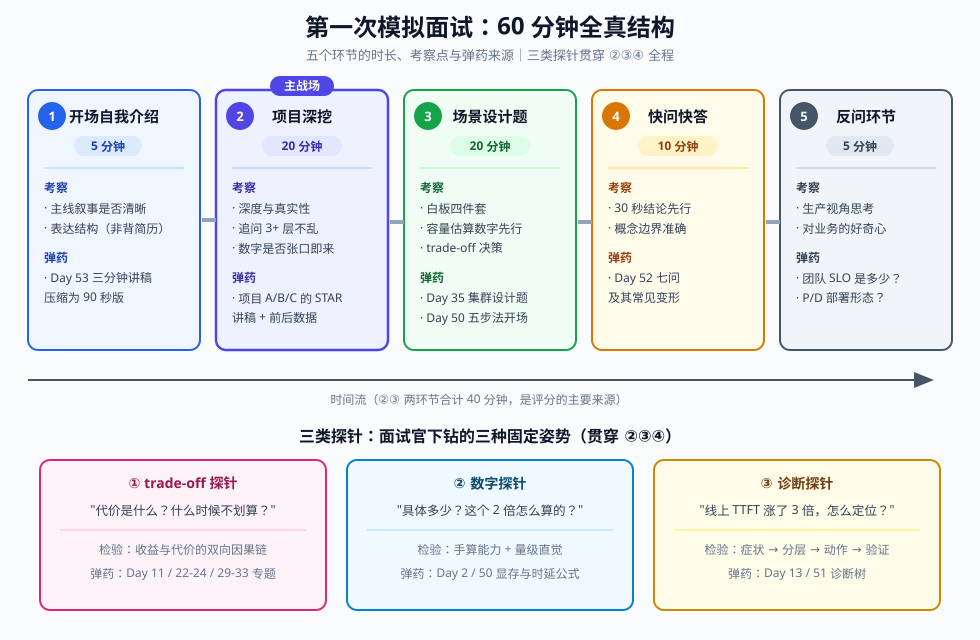
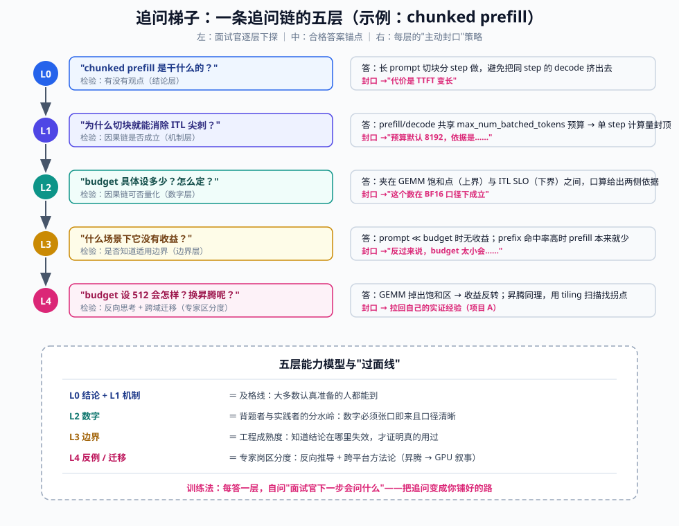
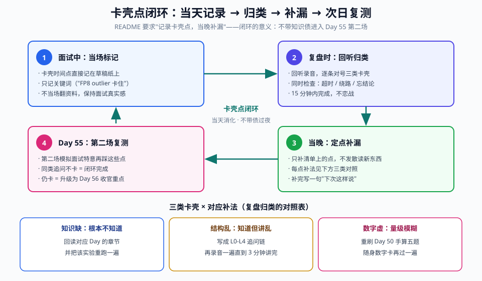

# Day 54：模拟面试（一）——追问梯子、数字敏感度与诊断思路

> **Week 8 · 面试冲刺 · Day 5**
> 前置知识：Day 50-51（白板四件套：显存估算 / Block Table / 调度推演 / 诊断树）、Day 52（七问过堂 + 录音自答）、Day 53（项目 STAR 讲稿 + "从昇腾到 GPU"叙事主线）
> 今日用时：3~4 小时，其中 **≥1.5 小时是"真刀真枪的模拟面试 + 复盘回听"**——今天是实战日，不是阅读日
> 今日定位：八周计划的倒数第三天。前 53 天积累的所有知识，今天第一次在**连续对抗**的环境下接受检验

---

## 今日学习目标

| # | 目标 | 验收标准 |
|---|---|---|
| 1 | 完成第一次全真模拟面试 | **≥45 分钟连续面试**（项目深挖 + 场景设计 + 快问快答），全程录音 |
| 2 | 追问下守住结构 | 任意追问链 **≥3 层不乱**：每层都能按"结论 → 机制 → 数字"接住，不被带偏后回不来 |
| 3 | 数字敏感度 | 被问"多少 / 多快 / 多大"时，**30 秒内**给出量级正确的数 + 推导口径 |
| 4 | 卡壳点闭环 | 当场标记、复盘归类、**当晚补漏**，形成清单供 Day 55 第二场复测 |

## 核心概念：为什么"会答"不等于"过面"

Day 50-51 把知识压缩成了**单点输出**（3 分钟默写一道显存题），Day 52 把知识压缩成了**单人口述**（3 分钟录音答一问）。但真实面试不是七个独立问题的串联，而是**连续对抗**：

- 你说出的每一个名词，都会成为面试官下一问的素材；
- 面试官在你回答进行到第 20 秒时，就已经在构造下一个探针；
- 追问的方向由**你上一句的薄弱处**决定——答得越泛，被追得越深。

所以今天要练的不是新知识，而是**压力下知识的调用顺序是否稳定**。面试官的探针可以归为三类，恰好对应 README 为今天指定的三个重点：

| 探针类型 | 典型问法 | 检验的能力 | 对应训练日 |
|---|---|---|---|
| **trade-off 探针** | "代价是什么？""什么时候不划算？" | 收益与代价的**双向**因果链 | Day 11 / 22-24 / 29-33 |
| **数字探针** | "具体多少？""这个 2 倍怎么算出来的？" | 手算能力 + 量级直觉 | Day 2 / 50 |
| **诊断探针** | "线上 TTFT 涨了 3 倍，你怎么定位？" | 从症状到动作的**分层排查** | Day 13 / 51 |

> 💡 **今天的核心认知**：单点题答对只能拿到"及格分"；专家岗的区分度来自——被追问三层后逻辑不散、每个结论带得出数字、给得出失效条件。模拟面试就是把这个能力练成条件反射。

---

## 一、解剖一场 60 分钟技术面试

先明确"战场地形"。一场推理系统专家岗的技术面通常是下面这个结构（45~75 分钟弹性，取 60 分钟标准形态）：

| 环节 | 时长 | 考察点 | 对应你的弹药 |
|---|---|---|---|
| ① 开场 + 自我介绍 | 5' | 表达结构、主线叙事是否清晰 | Day 53 的 3 分钟版压到 **90 秒版** |
| ② 项目深挖 | 20' | 深度与真实性：追问链最密集的环节 | 项目 A/B/C 的 STAR 讲稿 + 量化数据 |
| ③ 场景 / 系统设计题 | 20' | 白板四件套 + 容量估算 + trade-off 决策 | Day 35 设计题、Day 50-51 四件套 |
| ④ 快问快答 | 10' | 基础概念的 30 秒准确输出 | Day 52 七问及其变形 |
| ⑤ 反问环节 | 5' | 对团队业务的理解深度 | 预备 2~3 个"内行问题" |



三个实践要点：

1. **② 是主战场**：项目深挖占时长 1/3，却贡献了面试官印象的一半以上。Day 53 准备的 STAR 讲稿只是"第一层答案"，面试官一定会往下钻——今天第二节"追问梯子"就是为它准备的。
2. **③ 主动上白板**：拿到设计题（如"为日活千万的客服机器人设计推理集群"——Day 35 原题）不要坐着空谈，主动说"我画一下"，然后把 Day 50 的显存五步法当开场：先把并发上限和卡数算出来，再谈架构。**数字先行是专家岗最强信号**。
3. **⑤ 不是客套**：反问"团队目前的 TTFT/TPOT SLO 是多少？prefill 和 decode 是混合部署还是分离？"——这类问题展示你用生产视角思考，而不是背题。

---

## 二、追问梯子：一条追问链的五层解剖

### 2.1 面试官的追问是有固定模式的

资深面试官的追问不是随机的，而是沿一条**梯子**逐层下探，每一层检验一种能力：

| 层 | 名称 | 面试官在检验 | 典型问法 |
|---|---|---|---|
| **L0** | 结论 | 你有没有观点 | "chunked prefill 是干什么的？" |
| **L1** | 机制 | 结论背后的因果链是否成立 | "为什么它能降低 ITL 抖动？" |
| **L2** | 数字 | 因果链是否可以量化 | "budget 具体设多少？依据是什么？" |
| **L3** | 边界 | 你是否知道结论的适用范围 | "什么场景下它没有收益？" |
| **L4** | 反例 / 迁移 | 你能否反向思考和跨域类比 | "budget 设太小会怎样？换成昇腾呢？" |

大多数人栽在 L2 和 L3：**答得出结论、讲得出机制，但给不出数字、说不清边界**——这正是"背题者"与"实践者"的分水岭。



### 2.2 示范：chunked prefill 完整追问链（音频跟练材料）

下面这条链来自 Day 52 的 Q4，今天把它升级为**对话形态**。左列是面试官，右列是合格答案的锚点（⏱ 为建议用时）：

| 层 | 面试官 | 你的答（锚点） | ⏱ |
|---|---|---|---|
| L0 | "chunked prefill 解决什么问题？" | 长 prompt 一次性 prefill 会把同 step 的 decode 挤出去，造成 ITL 尖刺；切块后 prefill 分多个 step 摊着做 | 30s |
| L1 | "为什么切块就能消除尖刺？" | V1 中 prefill 与 decode token 共享 `max_num_batched_tokens` 预算（`vllm/v1/core/scheduler.py: schedule()`）；预算封顶 → 单 step prefill 计算量封顶 → decode 等待时间封顶 | 60s |
| L2 | "budget 设多少？怎么定？" | 起步 8192（V1 常用默认量级，随版本自适应）；上界受 GEMM 饱和点约束（太小 → prefill GEMM 效率低，TTFT 上升），下界受 ITL SLO 约束：单 step 时延 ≈ budget ÷ 每 token 吞吐，若 ITL SLO 是 50ms、每 ms 处理 ~200 token，budget 不能超 10000 | 60s |
| L3 | "什么情况下它没用甚至有害？" | ① prompt 全部远小于 budget 时无收益；② prefix caching 命中率高时 prefill 本来就少；③ budget 过小 → 长 prompt 的 TTFT 显著劣化，且调度开销（Python 层切块循环）占比上升 | 60s |
| L4 | "budget 设 512 会发生什么？换到昇腾呢？" | GEMM 规模掉出饱和区，prefill 吞吐可能掉数倍，TTFT 大幅上升——收益与代价反转。昇腾上同理，只是饱和点位置不同：Cube 单位吞吐高，需要用实测的 "batch-M 的 MOPS vs M" 曲线找拐点（对应我做 WeightQuantBatchMatmul 时扫 tiling 规模的方法） | 90s |

注意 L4 的答法：**先给出反例的失效机制，再把问题拉回自己有实证经验的领域**（昇腾 tiling 扫描）。这是 Day 53 叙事主线的落地："跨平台方法论迁移"不是一句口号，而是在追问末梢自然带出。

### 2.3 应答策略：主动封口

追问梯子最好的应对不是"接住每一层"，而是**在每一层主动封掉下一层**：

```text
给结论时，预告代价      → "它能降 ITL 抖动，代价是 TTFT 变长"
给机制时，带上数字      → "budget 默认 8192，因为……"
给数字时，说明口径      → "这是 BF16 口径，FP8 KV 会减半"
给收益时，给出边界      → "这个结论在 decode 侧成立，prefill 侧相反"
```

封口的本质：**你在替面试官问问题**。当他发现你要说的正是他想问的，追问会变成顺水推舟，而不是步步紧逼——整场面试的节奏就到你手里了。

### 2.4 练习：自己搭一条追问链（今晚补漏时用）

从 Day 52 七问中任选一问（建议 Q5 量化或 Q7 TP），自己把 L0~L4 五层的问题和答案锚点写出来，然后**遮住答案自问自答一遍、录音一遍**。第二场模拟面试（Day 55）前，至少完成两条链。

---

## 三、trade-off 讨论：四段式应答框架

### 3.1 框架

被问"X 和 Y 怎么选"，用固定四段作答，**顺序不能乱**：

```text
① 收益机制：为什么 X 有收益（因果链，一句话）
② 代价机制：为什么 X 有代价（因果链，一句话）
③ 决策变量：哪个量决定天平倒向哪边（参数 / 负载特征）
④ 分界点：给出"满足什么条件选 X，否则选 Y"的判据（最好带数字）
```

> ⚠️ **最常见的两个失败模式**：
> ① 只讲收益不讲代价——面试官会用一个追问让你当场补代价，显得没有预判；
> ② 罗列优劣却不给决策条件——像背Wiki，不像工程师。**面试官要的不是对照表，是"在什么条件下你会怎么选"的决断力。**

### 3.2 五个高频 trade-off 的四段式速查卡

| 主题 | ① 收益机制 | ② 代价机制 | ③ 决策变量 | ④ 分界点 |
|---|---|---|---|---|
| **chunked prefill budget 大 vs 小** | 大 → GEMM 饱和、TTFT 短 | 大 → 单 step 时延高、ITL 尖刺 | budget 与 SLO 的比值 | ITL SLO 松（离线批处理）→ 调大；SLO 紧（交互式）→ 压小 |
| **FP8 权重/KV 量化** | 权重字节减半 → decode 访存量近线性下降 | 激活 outlier → 精度损失；需校准 | 模型 outlier 分布、负载容差 | 离线可校准 + 容忍 ~1% 指标波动 → 开；小样本高价值 → 慎开（Day 22-24） |
| **TP=2 vs 单卡** | 显存 ×2、可跑更大模型 | 每层 2 次 all-reduce，decode 小 batch 时通信占比高 | 参数量 vs 单卡显存、batch 大小 | 单卡放得下 → 不上 TP；必须 TP 时优先吃满 NVLink 域内（Day 32-33） |
| **P/D 分离 vs 混合部署** | 消除 prefill/decode 互相干扰，goodput ↑ | KV 传输链路 + 部署/路由复杂度 | 干扰损失 vs 传输+复杂度成本 | 混跑干扰小（低并发）或 KV 跨节点成本高 → 不分离（Day 29-31） |
| **投机解码（草稿数 k）** | 接受率高时一次验证多 token，摊薄访存 | 草稿模型本身有开销；拒绝浪费算力 | 接受率 α、k 的边缘收益 | α 高（代码补全类）→ k 可到 3~4；α 低（开放对话）→ k=1 甚至关闭（Day 25-26） |

### 3.3 数字敏感度：随身数字卡

数字探针的前提是**关键数字常驻内存**。下面三张卡是今天模拟面试前最后过一遍的内容（全部来自前 53 天）：

**卡 1 · 硬件（量级 + 出处）**

| 硬件 | HBM 带宽 | 备注 |
|---|---|---|
| A100 80G SXM | 2.0 TB/s | Day 6 压测环境 |
| H100 SXM | 3.35 TB/s | Day 2 手算题标准值 |
| RTX 4090 | ≈1.0 TB/s | 本地替代环境 |

**卡 2 · 模型（口径：BF16）**

| 模型 | 参数量 | KV/token | 推导口径 |
|---|---|---|---|
| Qwen3-8B | 8B | **144 KiB** | `2×36×8×128×2B`（36 层 / 8 KV head / head_dim 128） |
| Llama-3-70B | 70B | **320 KiB** | `2×80×8×128×2B`（80 层 / 8 KV head） |

由此可 30 秒口算两个高频数：Llama-3-70B FP8 在 H100 的 decode 时延下界 ≈ 70GB ÷ 3.35TB/s ≈ **21 ms/token**（Day 2 原题）；Qwen3-8B 4K 上下文单请求 KV ≈ 144KiB × 4096 ≈ **576 MiB**。

**卡 3 · vLLM V1 关键默认值**（⚠️ 随版本演进，面试时说"以我读的版本为准"即可加分）

| 参数 | 常见默认 | 作用 |
|---|---|---|
| `gpu_memory_utilization` | 0.9 | 显存池上限 |
| `max_num_seqs` | 1024（V1） | 并发序列数上限 |
| `max_num_batched_tokens` | 8192 量级（自适应，版本相关） | 单 step token 预算 |
| `block_size` | 16（GPU） | KV 页大小 / prefix 共享粒度 |

### 3.4 报数三件套：量级 + 口径 + 条件

数字探针的合格答案不是只报一个数，而是三件套：

```text
"约 21 毫秒每 token。        ← 量级（先给数）
 算法是 70GB 参数 ÷ 3.35TB/s。 ← 口径（怎么算的）
 前提是 FP8 权重 + H100 SXM，   ← 条件（什么情况下成立）
 而且这是纯带宽下界，实际还有 20~40% 的 kernel/调度开销。"
```

三个致命错误，回听录音时专项检查：

1. **报数不给算法** → 面试官立刻追问"怎么算的"，答不出等于没分；
2. **报数不给精度口径** → BF16/FP8 差 2 倍，KV 显存与权重显存口径不同；
3. **量级错误** → 把 2TB/s 记成 2GB/s（差 1000 倍）直接暴露没做过手算。

---

## 四、诊断思路：诊断探针的五步应答节奏

诊断探针（"线上 X 变差怎么办"类问题）的合格答案有固定节奏，**五步缺一不可**：

```text
① 分类症状   先把症状拆成可二分的判断（TTFT 变 or ITL 变？突发 or 持续？）
② 分层定位   沿诊断树收敛：入口 → 队列/调度 → 执行 → 硬件（Day 51 的树）
③ 给出动作   调哪个参数 / 扩容 / 改架构，动作必须对应定位结论
④ 验证指标   改完看什么指标确认（要说出具体指标名）
⑤ 预防复发   告警、压测准入、容量规划
```

### 4.1 完整对话示范：TTFT p99 ×3

> **面试官**：线上服务 TTFT p99 从 200ms 涨到 600ms，TPOT 基本没变，你怎么排查？
>
> **你（示范）**：
> **① 分类**：TTFT 变差而 ITL 稳定——按 Day 51 的诊断树，这指向 **prefill 侧或排队问题**，decode 侧（batch 过大 / 通信 / 抢占）可以先排除。
> **② 定位**：先看 `/metrics` 的 `vllm:num_requests_waiting`——如果队列深度同步暴涨，是**入口拥塞**；再分两种情况：入口 QPS 没变但队列涨了 → 每个 token 变贵了（查 prompt 长度分布，`vllm:request_prompt_tokens` 直方图，大概率是长 prompt 变多，chunked prefill 让它们排队）；QPS 涨了 → 容量不足，是容量规划问题不是 bug。
> **③ 动作**：长 prompt 洪峰 → 优先扩容或按前缀路由（cache-aware routing，Day 34）；同时可适当上调 `max_num_batched_tokens` 加快 prefill 消化速度，但要复核 ITL SLO 是否还能守住（这就是 Q4 的 trade-off）。
> **④ 验证**：改完盯 TTFT p99 与队列深度的相关性，以及 ITL p99 是否被预算上调波及。
> **⑤ 预防**：给队列深度/QPS 比值设告警；上线前用真实 prompt 长度分布做压测准入（Day 6 / Day 46 的方法）。

（⚠️ 指标名以你部署版本的 `/metrics` 实际输出为准，V1 的指标集合随版本有小幅演进；面试时说明"以版本为准"反而显示严谨。）

### 4.2 三大症状速查表（回听录音时对照自己是否说全了五步）

| 症状 | 第一落点指标 | 最常见根因 | 对应动作 |
|---|---|---|---|
| TTFT ↑ / ITL 稳 | `num_requests_waiting` | 队列拥塞（长 prompt 洪峰 / QPS 涨） | 扩容、前缀路由、复核 budget |
| ITL ↑ | `num_requests_running` + cache 占用 | batch 过大、抢占频发、通信瓶颈 | 调 `max_num_seqs`、KV 量化、TP 通信占比 |
| 抢占计数 ↑ | preemption 相关计数 | KV 超配，running batch 放得太大 | 降 `max_num_seqs` 或提 KV 容量/量化（Day 12-13） |

---

## 五、动手实验：跑你的第一场全真模拟面试

今天的主实验只有一件事：**完成一场 ≥45 分钟的连续模拟面试并闭环复盘**。两条路线任选（推荐 A，B 是兜底）。

### 5.1 路线 A：找同行互面（60 分钟对等互换）

- **分工**：你先当候选人 45 分钟，再互换当面试官 15 分钟给反馈；面试官**只追问、不提示、不救场**——救场会掩盖卡壳点，让模拟失去意义。
- **题本**：面试官从 Day 52 七问、Day 35 设计题、你简历上的项目细节三处取材，自由组合。
- **硬规则**：全程录音；候选人不查任何资料；卡壳时说"这里我不确定"然后继续（这本身就是练习——**面试里诚实认输比硬编好得多**）。

### 5.2 路线 B：用 LLM 当面试官（无同行时的兜底）

把下面的 system prompt 直接粘给任意强模型，开一个新会话，语音输入尽量模拟口述：

```text
你是一名资深 LLM 推理系统面试官，面试岗位是"推理系统优化专家"（vLLM 方向），
候选人有昇腾 NPU 算子优化（Tiling / 流水线 / 量化）与高并发分布式背景。

面试规则（严格执行）：
1. 一次只问一个问题；每次必须从我上一个回答里挑最薄弱的名词往下追问，
   追问梯子：结论 → 机制 → 数字 → 边界 → 反例/迁移。
2. 三类探针轮换：trade-off（"代价是什么"）、数字（"具体多少"）、
   诊断（"线上指标劣化怎么定位"）。
3. 我的回答含糊时，不允许放过，必须继续追问；我答对时也不夸奖，直接下一问。
4. 面试中绝不给我答案或提示；过程不做任何评价。
5. 流程：先让我做 90 秒自我介绍 → 项目深挖 15 分钟 → 一道场景设计题
   （让我白板化文字作答）→ 快问快答 5 分钟。
6. 全部结束后，输出：① 五维评分（结构 / 深度 / 数字 / trade-off / 诊断，
   各 1~5 分）；② 我所有的卡壳点和含糊点清单（按时间顺序）；
   ③ 每个卡壳点的标准答案锚点和"下次这样说"建议。

现在开始面试，先让我自我介绍。
```

> 💡 **技巧**：把 Day 52 的七问表、你的项目 STAR 讲稿一并粘在首条消息里，让"面试官"有素材可追问；对话式追问的质量取决于它对你答案的抓取，**你的回答越具体，追问越真实**。

### 5.3 评分表（两路线通用，面试官/模型填，自己也填一份做对照）

| 维度 | 1 分 | 3 分 | 5 分 |
|---|---|---|---|
| **结构** | 先绕细节，忘结论 | 结论先行但被打断后回不来 | 全程金字塔，被打断能一句拉回 |
| **深度** | L0 结论层反复 | 能到 L2 数字 | 能到 L4 反例/迁移并拉回实证 |
| **数字** | 报不出或量级错 | 能报数但口径不清 | 三件套齐：量级+口径+条件 |
| **trade-off** | 只讲收益 | 罗列优缺点无决策 | 四段式收口到分界点 |
| **诊断** | 直接跳到调参数 | 有定位但无验证 | 五步全：分类→定位→动作→验证→预防 |

### 5.4 复盘流程（面试结束后的 75 分钟）

```text
① 00-10'  面试官即时反馈（口头，录下来）
② 10-40'  回听录音：对照评分表逐项打分，草稿纸上记卡壳点
③ 40-70'  归类 + 定点补漏（只补清单，不发散）
④ 70-75'  每个卡壳点写一张"下次这样说"一句话卡
```



三类卡壳的归类是补漏效率的关键——**不同病因用不同药**：知识缺去回读，结构乱去写链重录，数字虚去重刷手算。归类错了（比如把"结构乱"当"知识缺"去读论文）会浪费今晚最宝贵的一小时。

---

## 六、面试高频问题：追问链题库（今日模拟面试抽题用）

Day 52 已把七问的主体答过，今天补充的是**追问视角**的六条高频链。模拟面试时让面试官/模型从中抽两条深钻：

| # | 主题 | L1 机制追问 | L2 数字追问 | L3 边界追问 | 合格锚点 |
|---|---|---|---|---|---|
| C1 | prefix caching | 块哈希链怎么构造？父子关系？ | 命中 1K 前缀省多少 TTFT？（省 1K token 的 prefill 计算） | 多租户怎么防泄漏？ | hash = 父块 hash + token ids + 附加标识；`cache_salt` 隔离；COW 分裂保共享（Day 16 / 34） |
| C2 | CUDA Graph | capture 时 batch 维怎么处理？ | bucket 间隔造成多少浪费？ | 为什么 prefill 不用？piecewise 解决什么？ | bucket 取整 + padding；浪费 ≤ 相邻 bucket 差；prefill shape 不可枚举（Day 18） |
| C3 | preemption | 抢占时请求去哪了？recompute 怎么恢复？ | 什么指标说明抢占过频？ | 为什么 V1 主推 recompute？ | 被移回 waiting，靠 prefix/已算 KV 复用降低重算成本；对照 preemption 计数调 `max_num_seqs`（Day 12-13） |
| C4 | KV 量化 | FP8 KV 省的是什么资源？ | 容量与带宽各提升多少？（均约 2×） | 和 prefix caching 交互？ | decode 访存近半在 KV → TPOT 降；块哈希需含 KV dtype 标识，混合精度部署防串味（Day 23） |
| C5 | TP 通信 | 每层几次 all-reduce？在哪两个位置？ | 单次通信量多大？（≈ 2×hidden×dtype） | 什么时候 TP 是负收益？ | attention 后 + MLP 后各一次；小 batch decode 时通信占比 > 计算占比即负收益（Day 32-33） |
| C6 | Roofline | 怎么判一个 kernel 是 compute 还是 memory bound？ | 机器平衡点是多少？H100 上？（≈ 3350/990 ≈ 3.4 FLOP/B，FP16 口径） | 量化怎么移动它在 Roofline 上的位置？ | arithmetic intensity 对比平衡点；ncu 看 SM/DRAM busy；权重 FP8 把访存减半 → AI 翻倍（Day 3 / 22） |

> ⚠️ C5/C6 的数字按具体卡与精度口径复核后再说出口——**报数三件套**在这里同样适用。

---

## 今日总结

- 模拟面试检验的不是知识量，而是**压力下知识的调用顺序**：追问 ≥3 层不乱、结论必带数字、trade-off 必收口到分界点。
- 面试官的追问有固定模式（**追问梯子 L0~L4**），应答最优策略是**主动封口**：每层回答自带下一层的答案钩子。
- 数字敏感度 = **随身数字卡 + 报数三件套**（量级 + 口径 + 条件）；诊断思路 = **五步节奏**（分类 → 定位 → 动作 → 验证 → 预防），缺步即失分。
- 卡壳点必须**当天闭环**：记录 → 归类（知识缺 / 结构乱 / 数字虚）→ 定点补漏 → Day 55 复测验证。

## 今日自测题（复盘时口头回答，录音）

1. 不看笔记：说出追问梯子五层的名称，并说明哪两层是"背题者与实践者的分水岭"。
2. 30 秒内：Qwen3-8B、4K 上下文、BF16，单请求 KV 显存多少？并发 100 路需要多大 KV 池？
3. 口述：被问"P/D 分离什么时候不值得做"，用四段式完整作答一遍，录音计时 ≤2 分钟。
4. 口述：TTFT 涨、ITL 稳，你的五步诊断各是什么？每步说一个具体指标或动作。
5. 自评：今天模拟面试五维评分，哪一维最低？明天第二场前你只补这一维的什么？

## 今日产出物

| # | 产出物 | 用途 |
|---|---|---|
| 1 | **第一次模拟面试录音**（≥45 分钟） | Day 55 对比素材 + 面试前热身材料 |
| 2 | **五维评分表**（面试官版 + 自评版各一份） | 量化 Day 55 的进步 |
| 3 | **卡壳点清单**（按三类归因） | 今晚补漏的作业清单 |
| 4 | **"下次这样说"一句话卡**（每个卡壳点一张） | Day 55 / Day 56 收官日直接复用 |
| 5 | 两条自建追问链（L0~L4，2.4 节练习） | Day 55 第二场前热身 |

> 📌 **明天预告（Day 55）**：第二场模拟面试，换面试官 / 换题本，重点验证今天卡壳点是否清零，并刻意制造"追到底"的压力场景（连续 5 层追问）。今晚务必睡好——面试状态也是训练项。
