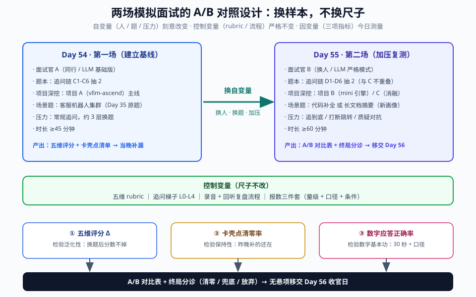
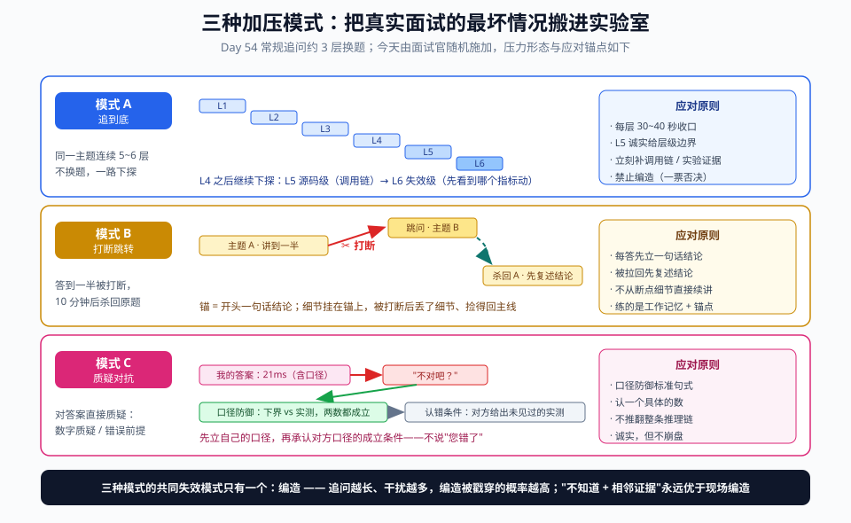
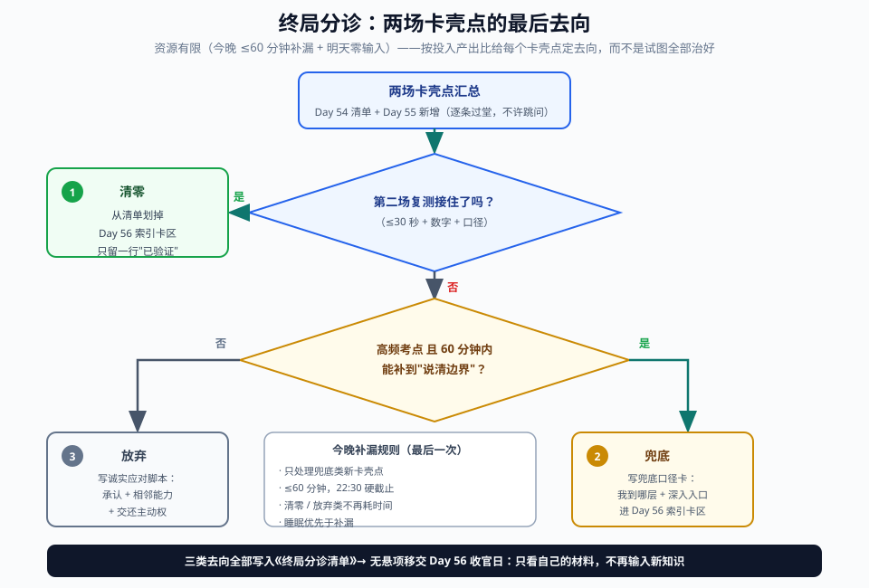

# Day 55：模拟面试（二）——加压复测、A/B 对照与终局分诊

> **Week 8 · 面试冲刺 · Day 5**
> 前置知识：Day 50-51（白板四件套）、Day 52（七问 × 3 分钟录音过堂）、Day 53（项目 STAR 讲稿）、**Day 54（第一场模拟面试：追问梯子 L0-L4、五维评分、卡壳点三归类与当晚补漏——今天的弹药全部来自昨天的清单）**
> 今日用时：3~4 小时，其中 **≥2.5 小时在"加压面试 + A/B 复盘 + 终局分诊"**——今天是八周里最后一次高强度实战日
> 今日定位：倒数第二天。Day 54 证明"能打"，今天要证明"**稳定地能打**"；今晚补漏结束后，56 天的知识输入正式收官，明天进入"只看自己材料"的收官模式

---

## 今日学习目标

| # | 目标 | 验收标准 |
|---|---|---|
| 1 | 完成第二场全真模拟面试（**加压版**） | **≥60 分钟连续面试**，题本与 Day 54 重叠 <20%，三种加压模式至少各真实触发一次 |
| 2 | 验证 Day 54 卡壳点**清零** | 复测清单上每个点，同类追问 **30 秒内**接住且带数字与口径 |
| 3 | 量化两场进步（A/B 对照） | 五维评分逐维对比成表；**Δ<0 的维度当场定位原因**（题变难 or 真退步） |
| 4 | 终局分诊 | 两场**全部**卡壳点归入三个去向（清零 / 兜底 / 放弃），**无悬项**移交 Day 56 |
| 5 | 最后一次补漏 | 只补分诊产物，**≤60 分钟、22:30 硬截止**——睡眠优先于补漏（面试状态也是训练项） |

## 核心概念：一场好是运气，两场稳才是能力

先建立一个面试官视角的判断标准：**单场表现的可信度很低**。状态、题序、面试官风格、甚至当天的网速，都会让同一个候选人的两场面试差出一个档位。所以资深面试官真正看的不是"你最好能打成什么样"，而是"**你的下限在哪**"。对候选人来说，这翻译成一句话：

> **一场好是运气，两场稳才是能力。**

回顾 Day 54：第一场模拟面试建立了基线（五维评分 + 卡壳点清单），当晚做了定点补漏。今天的关键认知是——**第二场不是"再来一遍"，而是一次对照实验**。用实验设计的语言描述：

| 实验要素 | 内容 |
|---|---|
| **自变量**（刻意改变） | 面试官人设、题本、项目深挖路线、压力模式（三种加压） |
| **控制变量**（保持不变） | 五维 rubric、追问梯子 L0-L4、录音复盘流程、报数三件套 |
| **因变量**（测量） | 五维评分、卡壳点清零率、数字应答正确率 |

只有第二场才能测出三件事，它们恰好是"稳定"的三个组成部分：

1. **保持性（retention）**：昨晚补的东西，今天还在吗？——靠**卡壳点复测**验证；
2. **泛化性（generalization）**：换一套不重叠的题，结构还稳吗？——靠**题本 <20% 重叠**验证；
3. **抗压性（robustness）**：压力升级（追到底 / 打断 / 质疑）后，逻辑散不散？——靠**三种加压模式**验证。

> 💡 **今天的核心认知**：Day 54 练的是"在追问下不乱"，今天练的是"在**更狠的追问、更强的干扰、直接的质疑**下依然不乱"。真实面试的最坏情况一定比第一场难——今天主动把它搬进实验室。

---

## 一、实验设计：换什么、控什么、测什么

### 1.1 两场对照表

| 维度 | Day 54（第一场） | Day 55（第二场） | 为什么换 |
|---|---|---|---|
| 面试官 | 同行 / LLM 基础版 | **换一位同行** / LLM 加压版（严格模式） | 消除"适应了同一个面试官"的假象 |
| 题本 | 追问链 C1-C6 抽 2 | **追问链 D1-D6 抽 2**（见第六节，与 C1-C6 不重叠） | 测泛化，不是测记忆 |
| 项目深挖 | 项目 A（vllm-ascend 优化）主线 | **项目 B（mini 引擎）或 C（消融实验）**主线 | 三个项目都要经得起深挖，不能只有一件武器 |
| 场景设计题 | 客服机器人集群（Day 35 原题） | 换一题：**代码补全服务**（高前缀重复 + 流式）或**长文档摘要**（长 prefill + 短输出） | 不同负载画像逼你重推容量估算，而不是背上一题的答案 |
| 压力模式 | 常规追问（约 3 层换题） | **三种加压模式**（见第二节），随机施加 | 把压力峰值提前搬到桌面 |
| 时长 | ≥45 分钟 | **≥60 分钟** | 真实技术面常见时长；注意力也是被测项 |
| 复盘产物 | 五维评分 + 卡壳点清单 | **A/B 对比表 + 终局分诊清单** | 量化进步 + 收敛悬项 |

### 1.2 为什么题本必须不重叠：一个抽样直觉

把八周知识域想象成一个考纲，每条追问链是一次**抽样**。两场共 12 条链（C1-C6 + D1-D6）：若互相不重叠，覆盖 12 个知识域，任何一条链上暴露的卡壳都指向独立的知识缺口；若第二场重复第一场的题，你测到的只是"对同一道题的第二次记忆"，会**系统性高估**自己的掌握度——就像单元测验和期末考不能用同一张卷子。

同理，"数字应答正确率"只有在**新数字题**上统计才有意义。今天所有统计口径都遵循一个原则：**换样本，不换尺子**（题本换，rubric 不换）。



---

## 二、三种加压模式：把真实面试的最坏情况搬进实验室

Day 54 的追问梯子止步于 L4（反例 / 迁移），且每条链大约 3 层就换题。真实面试的杀伤力主要来自三种"超纲"行为，今天的面试官（或 LLM 加压脚本）必须随机施加上来：

### 模式 A：追到底（连续 5~6 层不换主题）

梯子在 L4 之后不收手，继续下探两层：

| 层 | 问法示例（以 chunked prefill 为例） | 检验 |
|---|---|---|
| L5 源码级 | "这个混排在 V1 里具体是哪个函数组织的？token budget 在哪判？" | 调用链是否真读过 |
| L6 失效级 | "假设这个机制某天失效了，线上你会先看到哪个指标动？" | 机制 → 指标的映射 |

**应对原则**：
- 每层回答压在 **30~40 秒**，越深越要回到"机制 + 一个数字锚点"，不给发散空间；
- L5 是诚实的分水岭：掌握到函数级就说函数级（如 scheduler 的 `schedule()` 主循环组织 running 队列），**不确定行级细节时直接说**"这块我记到函数级，行级实现要翻代码"——然后立刻补一层你能拿出的证据（调用链上层、实验观察到的行为、对应 `/metrics` 指标）；
- **失效模式只有一个：编造**。追问链越长，编造被戳穿的概率越高，而"编造"在面试里是一票否决项，比"不知道"严重一个数量级。

### 模式 B：打断与跳转（context switch 抗干扰）

你答到一半，面试官打断："这个先放着，我问另一个。"10 分钟后再杀回来："刚才那个你说到哪了？"

**应对原则**：
- 每个回答**开头先立一句话结论**（金字塔尖），后面所有细节都挂在它上面——被打断时丢的只是细节，锚还在；
- 被拉回原话题时，先花 5 秒**复述自己的结论**再继续，不要从断点细节直接续讲（听众早已丢上下文）；
- 训练价值：真实面试里 multitasking 的面试官很常见，这一项练的是**工作记忆 + 结构锚点**，Day 52 的录音自答练不到它（没人打断录音笔）。

### 模式 C：质疑对抗（立场稳定性）

面试官对你的答案直接质疑，分两类：

1. **数字质疑**："你这个 21ms 不对吧？我记得 70B 至少要 60ms。"
2. **错误前提**（面试官故意说错）："chunked prefill 不就是为了降 TTFT 吗？你怎么说它可能升 TTFT？"

**应对原则——口径防御**：报数三件套（Day 54）的"条件"字段就是为这一刻准备的。标准句式：

```text
"我报的是 <口径> 下的数：70GB 权重 ÷ 3.35TB/s 峰值带宽 ≈ 21ms，
这是纯权重访存的理论下界，不含 KV 访存、激活和 CPU 开销；
如果您指的是实测 TPOT，那是另一个口径，会大 2~3 倍——
您说的 60ms 大概率是实测口径，两个数都成立，口径不同。"
```

- **不直接说"您错了"**。错误前提用"两个口径都存在"的框架接：先立自己的口径，再承认对方口径在什么条件下成立——这既保住了立场，又不显得对抗；
- **什么时候认错**：对方给出你未见过的实测数据或版本行为时——"这个口径我没测过，您说的可能是对的，我回去验证"。**诚实但不崩盘**：认一个具体的数，不推翻整条推理链。



### 2.1 加压模式的评分锚点（叠加在 Day 54 五维 rubric 上）

| 模式 | 1 分 | 3 分 | 5 分 |
|---|---|---|---|
| A 追到底 | L3 之后开始编造 | 到 L5 说"不知道"但不给替代证据 | 到 L5 给出层级边界 + 调用链/实验证据，L6 指标映射张口就来 |
| B 打断跳转 | 回不来，整段重讲 | 能回来但重讲细节 | 5 秒复述结论后从断点续讲 |
| C 质疑对抗 | 立刻改口顺从 | 坚持但说不清口径 | 口径防御完整，并承认对方口径的成立条件 |

---

## 三、数字敏感度：第二场的"数字关"

### 3.1 核心数字卡（第二场开考前过一遍，每条 30 秒内可报）

Day 54 建立了"报数三件套"（量级 + 口径 + 条件）。今天的标准更严：**被问即答，30 秒内三件套齐**。下面是第二场的高频数字清单（全部可由两三个基础常数手算推出，不要死记结果、要记推导）：

| # | 数字 | 值 | 推导 / 口径 |
|---|---|---|---|
| 1 | 70B 权重显存 | BF16 **140 GB** / FP8 **70 GB** | 70e9 × dtype 字节数 |
| 2 | 70B FP8 decode 时延下界 | **≈21 ms** | 70 GB ÷ 3.35 TB/s；纯权重、峰值带宽口径 |
| 3 | Llama-3-70B 每 token KV | **320 KiB**（BF16） | 2×80 层×8 KV 头×128 head_dim×2 B；4K ctx ≈ **1.25 GiB**/请求 |
| 4 | Qwen3-8B 每 token KV | **144 KiB**（BF16） | 2×36×8×128×2 B（层数/头数以实际 config 为准）；4K ctx ≈ 576 MiB，100 并发 ≈ 56 GiB |
| 5 | H100 SXM 基础参数 | 带宽 **3.35 TB/s**；FP16 ≈ 990 TFLOPS；FP8 ≈ 1979 TFLOPS | 官方峰值口径；实测带宽通常打 85~95 折 |
| 6 | 机器平衡点 | FP16 **≈295 FLOP/B**；FP8 ≈ 590 | 990 TFLOPS ÷ 3.35 TB/s —— **商的单位就是 FLOP/B** |
| 7 | decode 的 AI（batch=1） | **≈2 FLOP/B** | 2N FLOP ÷ N 字节（70B FP8 粗算） |
| 8 | decode 翻转 batch | **≈150** | 295 ÷ 2；**不含 KV 访存**，长上下文下大幅提前 |
| 9 | 投机解码期望产出 | α=0.7、k=3 → **≈2.53 token/步** | (1−α^(k+1))÷(1−α)；draft 成本按 0.25 步折算 → 加速 ≈ 2× |
| 10 | KV 跨节点传输 | 4K ctx × 320 KiB ≈ 1.25 GB → IB 400 Gb/s（50 GB/s）**≈25 ms** | NVLink 900 GB/s 口径 ≈ 1.4 ms——同节点与跨节点差一个数量级 |
| 11 | 4K prompt prefill 计算 | **≈0.6 s**（70B） | 2×70e9×4096 ≈ 573 TFLOP ÷ 990 TFLOPS（MFU=1 口径） |
| 12 | TTFT 组成 | tokenize + 排队 + prefill 计算 + 首 token 调度 | 压测归因时先拆这四段（Day 13 / 51 诊断树） |

> ⚠️ 第 6 条是最容易在"模式 C 质疑对抗"里翻车的一个数，见下节的口径防御示范。

### 3.2 口径防御示范：平衡点到底是"3 点几"还是"295"？

面试官（质疑）："机器平衡点我记得是 3 点几，你怎么说 295？"

错误应对 A（立刻改口）："啊对对对，是 3.4。"——立场崩塌，且这个数本身就是错的。
错误应对 B（硬顶）："就是 295，您记错了。"——即使你对了，也输了沟通。

**正确应对（现场带单位做除法）**：

```text
"我们一起除一下：990 TFLOPS 除以 3.35 TB/s。
 分子是 10^12 FLOP/s，分母是 10^12 byte/s，约掉之后单位就是 FLOP/byte，
 商是 990 ÷ 3.35 ≈ 295，所以 FP16 口径下平衡点约 295 FLOP/B。
 您说的 3 点几，我猜是 3.35 TB/s ÷ 990 TFLOPS 这个倒数口径，
 那是'每 FLOP 要喂多少字节'的千分位，两个数互为倒数、口径不同。
 如果按 FP8 算力口径，分子翻倍，平衡点约 590。"
```

这一段同时展示了三件事：**单位推 导 > 背数字**、**倒数口径的辨识**、**主动给出对方口径的成立条件**——正是模式 C 的满分形态。

### 3.3 数字应答正确率：今天的统计口径

| 项 | 定义 |
|---|---|
| 数字题 | 面试官要求"具体多少 / 多快 / 多大"的应答（含追问层 L2 的所有报数） |
| 正确 | **30 秒内**作答 + 量级正确（现场报数 ±30% 以内；白板手算题按 Day 50 标准 ±10%）+ **口径说出** |
| 正确率 | 正确数 ÷ 数字题总数；与 Day 54 第一场对比 |

> 💡 口径比量级更严：576 MiB 报成 0.6 GB 不扣分，但"没说 BF16、没说 4K 上下文"就扣——因为**口径缺失的数字在追问下必然翻车**（见 3.2）。

---

## 四、终局分诊：两场卡壳点的最后去向

### 4.1 为什么今晚必须"分诊"而不是"继续补"

回顾 Day 56 的铁律（README）：收官日**只看自己写的总结，不看新东西**。这意味着：**今晚 24 点起，不再有任何知识输入窗口**。于是两场模拟面试积累的全部卡壳点，今晚必须每一条都有归宿——这正是"分诊"（triage）的含义：资源有限（今晚 ≤60 分钟补漏 + 明天只有检索没有输入），按**投入产出比**给每个卡壳点定去向，而不是试图全部治好。

### 4.2 三个去向与判据

| 去向 | 判据 | 动作 | 明天（Day 56）怎么处理 |
|---|---|---|---|
| ✅ **清零** | 第二场同类追问 ≤30 秒接住，带数字与口径 | 从清单划掉 | 不再花时间；索引卡区只留一行"已验证" |
| 🟡 **兜底** | 没完全接住，但**高频考点**且 60 分钟能补到"能说清边界" | 写**兜底口径卡**（见 4.3） | 索引卡区全文收录，面试当天扫一眼 |
| ⚪ **放弃** | 低频 / 与目标岗位弱相关 / 补不动 | 写**诚实应对脚本**（见 4.4） | 不进索引卡；只记住"这个点我选择诚实" |

**判据的优先级是自上而下的**：先看是否清零（复测结果说了算）；没清零再看"高频 × 60 分钟可补"这两个与门的输出；都不满足才放弃。**不要跳过前两问直接放弃**——那是偷懒，不是分诊。



### 4.3 兜底口径卡的写法（一张卡 = 两句话）

兜底不是"少说点"，而是**把掌握边界变成可讲述的内容**。格式：

```text
【卡壳点】FlashInfer 的 paged KV gather kernel 内部实现
【兜底口径】"这个 kernel 我掌握到调度层：block table 查表 + 非连续
block 的 gather 语义，以及它对 attention backend 接口的实现位置；
kernel 内部的 tiling 与向量化我类比昇腾 FlashAttention 的经验理解到
'访存合并 + 分支消除'这一层，行级实现没有读过。"
【深入入口】vllm/attention/backends/ 对应 backend 的实现 + FlashInfer 文档
```

第一句说清"我到哪层"，第二句给出"继续深入的入口在哪"。一张合格的兜底卡让面试官得到的信号是**层级清晰**，而不是"不会"。

### 4.4 诚实应对脚本（"放弃"不是躺平）

对选择放弃的点，准备一段 20 秒脚本，结构是**承认 + 相邻能力 + 交还主动权**：

```text
"这块我没有深入过（承认）。我在昇腾上做过相邻的 X，方法论上是
……（相邻能力，一句话）。如果您感兴趣我可以展开那部分，
这个方向我也很想知道 GPU 侧是怎么做的（交还主动权）。"
```

例：被问 NCCL 拓扑探测的 ring 构造算法细节——"没深入过；我在昇腾侧做的是 HCCS 对链路带宽的手工建模与 all-reduce 分桶（Day 32 的经验），ring 构造算法本身没读过源码，如果您感兴趣我可以展开通信量建模那部分。"

> 💡 **面试考察的是深度上限，不是知识全集**。对边界外问题给出"诚实 + 相邻能力"的回答，得分高于现场编造——因为编造在追问下必然崩塌，而诚实不会。

---

## 五、动手实验：第二场全流程（今日主实验）

今日时间预算（合计 3~4 小时）：

| 步骤 | 时长 | 性质 |
|---|---|---|
| ① 晨间复测 | 30' | 输出（口述 + 录音） |
| ② 题本抽签与准备 | 15' | 组织 |
| ③ 正式面试（加压版） | 60' | **实战** |
| ④ 复盘：A/B 对比 | 45' | 输出（回听 + 填表） |
| ⑤ 终局分诊 | 30' | 决策 |
| ⑥ 当晚最后一次补漏 | ≤60'（22:30 硬截止） | 定点输入 |

### 5.1 步骤①：晨间复测（30 分钟）

拿着 Day 54 的卡壳点清单，**先不看任何笔记**，逐条口述（录音），再对答案：

```python
# test_day54_stuck_points.py —— 不是真跑，是照着执行
for point in day54_stuck_points:          # 昨晚补漏过的清单
    answer = speak_aloud(point, limit_s=30)   # 不看笔记，30 秒口述，录音
    ok = check(answer, need=["机制", "数字或公式", "口径"])
    record(point, "清零" if ok else "仍卡")
    # 面试后回来补第三列：
    #   面试中同类追问被再踩且接住 → "清零"（终审）
    #   面试中再踩且仍卡           → 进入 5.6 终局分诊
    #   面试中没被踩到             → 以今晨结果为准
```

> 💡 晨间复测是"保持性"的第一次测量（隔夜记忆），面试中的表现是第二次测量（压力下）——两次都过才算清零。

### 5.2 步骤②：题本抽签与准备（15 分钟）

- 从 D1-D6（见第六节）**随机抽 2 条**追问链，另外让面试官保留 1~2 条"暗链"不预告；
- 项目深挖换成 Day 54 没挖的那条线（第一场挖了项目 A，今天 B 或 C）；
- 场景设计题二选一：**代码补全服务**（高前缀重复 + 流式输出）或**长文档摘要服务**（长 prefill + 短输出）——拿到题先做 Day 50 显存五步法开场。

### 5.3 步骤③：加压版 LLM 面试官（无同行时的兜底）

在 Day 54 版 prompt 基础上叠加三种加压模式：

```text
你是一名资深推理系统面试官，对我做第二场模拟面试（我已做过一场，今天测稳定性）。

面试规则：
1. 沿用追问梯子：结论 → 机制 → 数字 → 边界 → 反例/迁移，
   但三种加压模式随机施加，且每种至少真实触发一次：
   A. 追到底：同一主题连续下探 5~6 层（L5 问调用链，L6 问"机制失效时
      线上先看到哪个指标动"），不换题。
   B. 打断跳转：我答到一半时打断，跳到另一主题；约 10 分钟后杀回：
      "刚才那个你说到哪了？"
   C. 质疑对抗：对我的数字直接质疑（"这个数不对吧"），或故意用错误
      前设质疑（"X 不就是为了 Y 吗"），检验我的口径防御与立场稳定性。
2. 数字题必须追口径："这个数什么精度/什么带宽/含不含 KV？"
3. 我含糊时不放过；我编造时立刻戳穿并记录；我答对时不夸奖。
4. 流程：90 秒自我介绍 → 项目深挖 20'（主用模式 A）→ 场景设计题 20'
   （主用模式 B）→ 快问快答 20'（模式 C 集中在此）。
5. 结束后输出：① 五维评分（结构/深度/数字/trade-off/诊断，各 1~5）；
   ② 三种加压模式各自的表现评级（对照我给你的评分锚点）；
   ③ 卡壳点与含糊点清单（按时间顺序，标注发生在哪种模式下）；
   ④ 每个卡壳点的"下次这样说"一句话建议。

现在开始，先让我做 90 秒自我介绍。
```

### 5.4 步骤④：正式面试（60 分钟）

| 环节 | 时长 | 主要施压模式 | 注意 |
|---|---|---|---|
| 开场 + 90 秒自我介绍 | 5' | — | Day 53 的 3 分钟版压到 90 秒，数字开场 |
| 项目深挖（换线） | 20' | A 追到底 | 深挖到 L5/L6 是正常情况，不是面试官针对你 |
| 场景设计题（新画像） | 20' | B 打断跳转 | 主动白板化：先显存五步法，再谈架构 |
| 快问快答 | 15' | C 质疑对抗 | 数字题集中地；每答带口径 |
| 反问环节 | 5' | — | 问 TTFT/TPOT SLO、P/D 部署形态等内行问题 |

**面试中唯一要做的记录**：卡壳/被戳穿的时刻，在草稿纸上记关键词（Day 54 已训练），其余全部交给录音。

### 5.5 步骤⑤：复盘——A/B 对比（45 分钟）

回听录音，与 Day 54 的评分表并排填表：

| 维度 | Day 54 | Day 55 | Δ | 归因（题更难 / 真退步 / 状态 / 压力模式） |
|---|---|---|---|---|
| 结构 | | | | |
| 深度 | | | | |
| 数字 | | | | |
| trade-off | | | | |
| 诊断 | | | | |
| 卡壳点清零率 | —（基线） | | | 晨间复测 + 面试双通过的比例 |
| 数字应答正确率 | | | | 按 3.3 口径统计 |
| 加压模式表现 | —（无） | A/B/C 三级 | | 对照 2.1 锚点 |

**过度解读警告**：这是样本量为 1 的对照实验，Δ 的**方向意义大于数值意义**。某维度降了，先做归因再下结论——题本不重叠的代价是两场难度不可控，"题更难"永远是一个合法解释；只有"同样难度下仍降"才指向真退步。归因不了的，直接进终局分诊，不在复盘环节恋战。

### 5.6 步骤⑥：终局分诊（30 分钟）

把两场**全部**卡壳点（Day 54 清单 + 晨间复测"仍卡"项 + Day 55 新增项）逐条过第四节的判据树，产出《终局分诊清单》：

```text
终局分诊清单（格式）
| 卡壳点 | 出处 | 复测结果 | 去向 | 兜底口径卡 / 应对脚本（≤3 行） |
|--------|------|----------|------|-------------------------------|
```

验收标准只有一条：**每条都有去向，没有悬项**。

### 5.7 步骤⑦：当晚最后一次补漏（≤60 分钟，22:30 硬截止）

- 只处理今天新产生的**兜底类**卡壳点（清零、放弃类不碰）；
- 每点补完立即写兜底口径卡（4.3 格式），不超过 3 行；
- 22:30 封笔。**睡眠优先于补漏**——明天收官日要做的是检索与表达，不是输入；熬夜换来的第 61 分钟知识，抵不过反应速度下降的代价。

---

## 六、面试高频问题：第二场题本（D1-D6 追问链）

与 Day 54 的 C1-C6 不重叠，覆盖另外六个知识域。数字均可用第 3.1 节数字卡手算复核：

| # | 主题 | L1 机制追问 | L2 数字追问 | L3 边界追问 | 合格锚点 |
|---|---|---|---|---|---|
| D1 | async scheduling | V1 为什么把调度与执行重叠？CPU 在一个 decode step 里做什么？ | 不重叠时 GPU bubble 占多大？（nsys 上 CPU 每步毫秒级 vs GPU step 十毫秒级，看 gap） | 重叠的代价？（用上一步信息决策，preemption / 异常路径复杂化） | Day 19 nsys 时间线：调度在下 step 执行期间完成，GPU back-to-back |
| D2 | 投机解码 | 为什么是"用计算换访存"？ | α=0.7、k=3：每步期望产出与加速比？（2.53 token；draft 成本 0.25 步 → ≈2×） | 什么时候负收益？（α 低 + draft 贵 + 大 batch 下 verify 开销） | E=(1−α^(k+1))/(1−α)（独立接受简化模型）；Day 25-26 实验 |
| D3 | MoE / EP | EP 的 all-to-all 两跳指什么？expert 负载倾斜怎么办？ | 每 token 计算量由什么决定？（激活参数数，如总参 671B / 激活 37B 量级） | 小 batch 为什么 EP 不划算？ | dispatch/combine 通信与稀疏计算的 overlap 是难点（Day 32） |
| D4 | goodput | goodput 与 raw throughput 区别？ | 为什么 goodput 曲线有峰值？（并发↑ → 排队 + batch 变大 → p99 超标） | SLO 松紧怎么移动峰值？ | 峰值在 raw throughput 峰值左侧（Day 5-6 / 47 曲线） |
| D5 | batch 与 TPOT | 为什么 decode 阶段 batch 增大、TPOT 几乎不变？ | 70B FP8 翻转 batch 粗算？（≈150，不含 KV） | `max_num_seqs` 与 KV 容量怎么耦合？bucket 浪费多大？ | 权重单次读取被 batch 摊薄；长上下文下翻转点提前（Day 2 / 18 / 50） |
| D6 | P/D 的 KV 传输 | 跨节点 P/D 传的是什么、多大？ | 4K ctx、70B 的 KV 传多久？（1.25 GB → IB 400Gb/s ≈25 ms；NVLink ≈1.4 ms） | 什么时候 P/D 不值得做？ | 对比同 prompt prefill 计算 ≈0.6 s：传输可被分层流水隐藏（Day 29-31） |

> ⚠️ D1 涉及的 bubble 占比、D3 的具体模型参数随版本与硬件变化，报数时带口径（"我按 H100、70B 粗算"）。

---

## 今日总结

- 第二场不是"再来一遍"，而是**对照实验**：换自变量（人 / 题 / 压力）、控住尺子（rubric / 流程），测**保持性、泛化性、抗压性**——一场好是运气，两场稳才是能力。
- 三种加压模式各有应对锚点：**追到底**靠"每层 30~40 秒 + L5 诚实给边界"；**打断跳转**靠"开头一句话结论 + 回拉先复述"；**质疑对抗**靠"口径防御 + 承认对方口径的成立条件"。三者的共同失效模式只有一个：**编造**。
- 数字关的标准是"被问即答，30 秒三件套齐"。**口径缺失的数字在追问下必然翻车**——平衡点 295 vs "3 点几"的攻防是最好的示范：单位推导 > 背数字。
- **终局分诊**给每个卡壳点定去向：清零（复测通过）/ 兜底（口径卡两句话）/ 放弃（诚实应对脚本），判据自上而下，今晚之后零输入、无悬项。
- A/B 复盘防过度解读：样本量为 1，Δ 的方向意义大于数值；维度下降先归因（题更难？压力模式？），再决定进不进补漏清单。
- 今晚 22:30 封笔、睡好——**面试状态也是训练项**，这是八周里最后一个可以"补"的夜晚。

## 今日自测题（复盘时口头回答，录音）

1. 两场 A/B 的自变量、控制变量、因变量各是什么？为什么题本必须不重叠？
2. 30 秒内：H100 FP16 口径的机器平衡点是多少？单位是怎么从除法里出来的？decode batch=1 的 AI 约多少、差几个数量级？
3. 口述演练：面试官质疑"平衡点是 3 点几吧"，用口径防御完整接一遍（≤60 秒），并说出什么时候应该认错、怎么认。
4. 三种加压模式各自的应对原则是什么？它们的共同失效模式是什么、为什么是一票否决？
5. 终局分诊的三个去向与判据顺序是什么？"兜底口径卡"必须包含哪两句话？"放弃"的应对脚本结构是什么？
6. 如果 A/B 对比中"数字"维度 Δ<0，列出至少两种"非退步"的解释，并说明怎么区分它们。

## 今日产出物

| # | 产出物 | 用途 |
|---|---|---|
| 1 | **第二次模拟面试录音**（≥60 分钟，加压版） | 与 Day 54 录音构成对照组；面试当天前的热身材料 |
| 2 | **A/B 对比表**（五维 + 清零率 + 数字正确率 + Δ 归因） | 量化两场进步；归因栏直接喂给终局分诊 |
| 3 | **终局分诊清单**（两场全部卡壳点 × 三去向，无悬项） | Day 56 收官日的核心输入：索引卡区只收"兜底"类 |
| 4 | **兜底口径卡 + 诚实应对脚本**（每条 ≤3 行） | 面试当天的边界武器，30 秒可扫完 |
| 5 | **晨间复测记录**（Day 54 卡壳点 × 清零/仍卡） | "保持性"的书面证据；仍卡项的分诊依据 |
| 6 | **今晚最后一次补漏记录**（≤60 分钟） | 56 天知识输入的最后一笔，之后封笔 |

> 📌 **明天预告（Day 56 · 收官日）**：把八周全部产出物归档成**面试工具包**——架构图、诊断树、四份 A4 专题总结、项目讲稿、今天的终局分诊清单；用 30 秒索引卡把兜底类压缩到"扫一眼"的粒度；然后做一次**只看自己材料**的 60 分钟收官过堂，检验检索强度而非知识量；最后产出《面试当天执行手册》。从今晚 24 点起铁律生效：**不看任何新东西，只看自己写的总结**。今晚照常睡好——八周训练的最后一项，是把状态调到峰值。
