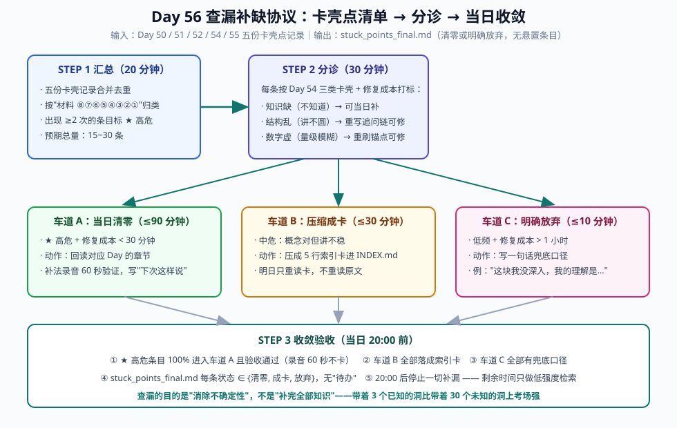
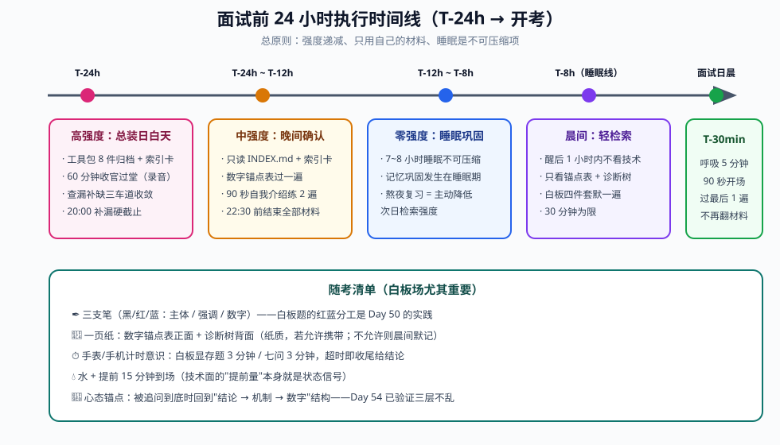

# Day 56（收官）：最终材料整理与查漏补缺——把 56 天装进一个面试工具包

> **Week 8 · 面试冲刺 · Day 7 · 收官日**
> 前置知识：Day 50-51（白板四件套）、Day 52（七问过堂 + 录音自答）、Day 53（STAR 讲稿 + "从昇腾到 GPU"叙事主线）、Day 54-55（两场模拟面试 + 卡壳点闭环）
> 今日用时：3~4 小时，**其中 0 小时用于学新东西**——今天只做三件事：**整理、检索、打包**
> 今日铁律（README 原文）：**面试前最后一天只看自己写的总结，不看新东西**

---

## 今日学习目标

| # | 目标 | 验收标准 |
|---|---|---|
| 1 | 面试工具包总装 | README 附表要求的 **8 件产出物**全部归档进 `kit/` 目录，每件配一张 30 秒索引卡，任意材料 **30 秒内定位** |
| 2 | 查漏补缺收敛 | 汇总 Day 50-55 的**全部卡壳点清单**，逐条分诊：清零、或明确"放弃 + 一句话兜底口径"，不留悬而未决的条目 |
| 3 | 最终检索演练 | **只用自己写的材料**完成 60 分钟收官过堂（四件套默写 + 七问口述 + 项目 3 分钟版），全程录音 |
| 4 | 交付执行手册 | 产出《面试当天执行手册》：从 T-24h 到开考前的每一步**只看什么、几点睡觉、带什么进考场** |

## 核心概念：收官日不是"再学一天"，而是"把知识变成一个可检索的系统"

56 天前的起点是"会做昇腾算子优化"；今天的终点不是"知道更多"，而是**在面试压力下 30 秒内调出任一知识点、数字和项目细节**。这两者的差别，正是认知科学里 **存储强度（storage strength）与检索强度（retrieval strength）** 的差别：

- **存储强度**：知识在长期记忆里的巩固程度——靠重复与睡眠巩固，55 天的积累已经足够；
- **检索强度**：当下能不能把它调出来——靠**线索（cue）**，而最好的线索就是**你自己写下的笔记结构**。

这就是 README 把最后一天限定为"只看自己写的总结"的深层原因，有三条可论证的依据：

1. **新知识没有经过巩固周期**。考前一天输入的内容没有经历"睡眠巩固 + 间隔检索"两个环节，提取可靠性极低，用它回答追问反而是在最不稳的地基上盖楼。
2. **新输入挤占检索练习**。最后 24 小时里，每花 30 分钟读新文章，就少 30 分钟"从自己笔记里主动提取"的时间——而后者才是面试时实际发生的行为。
3. **熟悉材料降低焦虑**。考前的生理状态（心率、皮质醇）显著影响发挥；只看自己写过的东西，每一页都在给大脑"我已经准备好了"的信号。

> 💡 **今天的核心认知**：面试工具包（interview kit）不是笔记的堆砌，而是一个**为"面试环节"优化的检索系统**。整理的标准不是"全"，而是：任何材料，你能说出**它在哪场面试环节、被什么问题触发、你翻到第几页**。

### 8 件材料总览（README 附表 → 今日总装对象）

```svg
<svg xmlns="http://www.w3.org/2000/svg" viewBox="0 0 980 740" font-family="'Segoe UI', 'PingFang SC', 'Microsoft YaHei', sans-serif">
  <defs>
    <marker id="d56a" markerWidth="10" markerHeight="8" refX="8" refY="4" orient="auto">
      <path d="M0,0 L10,4 L0,8 Z" fill="#94a3b8"/>
    </marker>
    <marker id="d56b" markerWidth="10" markerHeight="8" refX="8" refY="4" orient="auto">
      <path d="M0,0 L10,4 L0,8 Z" fill="#0f766e"/>
    </marker>
  </defs>
  <rect width="980" height="740" fill="#fafbfc"/>
  <text x="490" y="34" text-anchor="middle" font-size="22" font-weight="700" fill="#0f172a">Day 56 收官全景：8 周学习 → 8 件工具包材料 → 面试环节</text>
  <text x="490" y="58" text-anchor="middle" font-size="13" fill="#64748b">左：56 天的时间线｜中：README 附表要求的 8 件产出物（今日总装对象）｜右：一场 60 分钟技术面试的 5 个环节</text>

  <!-- Column titles -->
  <text x="140" y="92" text-anchor="middle" font-size="15" font-weight="700" fill="#0f172a">8 周时间线</text>
  <text x="480" y="92" text-anchor="middle" font-size="15" font-weight="700" fill="#0f172a">面试工具包（kit/）8 件材料</text>
  <text x="840" y="92" text-anchor="middle" font-size="15" font-weight="700" fill="#0f172a">面试环节（Day 54 结构）</text>

  <!-- Left: 8 weeks -->
  <g font-size="12">
    <rect x="42" y="106" width="196" height="58" rx="8" fill="#eff6ff" stroke="#2563eb" stroke-width="1.5"/>
    <text x="60" y="130" font-size="13" font-weight="700" fill="#1e3a8a">W1 推理基础与性能建模</text>
    <text x="60" y="150" fill="#475569">手算公式 · Roofline · 指标体系</text>

    <rect x="42" y="172" width="196" height="58" rx="8" fill="#eef2ff" stroke="#4f46e5" stroke-width="1.5"/>
    <text x="60" y="196" font-size="13" font-weight="700" fill="#312e81">W2 V1 源码（调度链路）</text>
    <text x="60" y="216" fill="#475569">Processor · Scheduler · 抢占</text>

    <rect x="42" y="238" width="196" height="58" rx="8" fill="#eef2ff" stroke="#4f46e5" stroke-width="1.5"/>
    <text x="60" y="262" font-size="13" font-weight="700" fill="#312e81">W3 V1 源码（KV 与执行）</text>
    <text x="60" y="282" fill="#475569">KV Manager · CG · mini 引擎开工</text>

    <rect x="42" y="304" width="196" height="58" rx="8" fill="#f5f3ff" stroke="#7c3aed" stroke-width="1.5"/>
    <text x="60" y="328" font-size="13" font-weight="700" fill="#4c1d95">W4 量化与投机解码</text>
    <text x="60" y="348" fill="#475569">FP8/W4A16 · MTP/EAGLE · 项目B 收尾</text>

    <rect x="42" y="370" width="196" height="58" rx="8" fill="#f0fdf4" stroke="#16a34a" stroke-width="1.5"/>
    <text x="60" y="394" font-size="13" font-weight="700" fill="#14532d">W5 P/D 分离与分布式</text>
    <text x="60" y="414" fill="#475569">P/D · TP/PP/EP · cache 路由</text>

    <rect x="42" y="436" width="196" height="58" rx="8" fill="#fffbeb" stroke="#d97706" stroke-width="1.5"/>
    <text x="60" y="460" font-size="13" font-weight="700" fill="#78350f">W6 项目A（上）</text>
    <text x="60" y="480" fill="#475569">vllm-ascend 选题 · 基线 · 剖析</text>

    <rect x="42" y="502" width="196" height="58" rx="8" fill="#fffbeb" stroke="#d97706" stroke-width="1.5"/>
    <text x="60" y="526" font-size="13" font-weight="700" fill="#78350f">W7 项目A（下）+ 项目C</text>
    <text x="60" y="546" fill="#475569">PR + 数据对比 · 消融实验报告</text>

    <rect x="42" y="568" width="196" height="58" rx="8" fill="#fdf2f8" stroke="#db2777" stroke-width="1.5"/>
    <text x="60" y="592" font-size="13" font-weight="700" fill="#831843">W8 面试冲刺</text>
    <text x="60" y="612" fill="#475569">四件套 · 七问 · 讲稿 · 模拟面试 ×2</text>
  </g>

  <!-- Middle: 8 kit materials -->
  <g font-size="12">
    <rect x="330" y="106" width="300" height="58" rx="8" fill="#ffffff" stroke="#2563eb" stroke-width="2"/>
    <text x="348" y="130" font-size="13.5" font-weight="700" fill="#1e3a8a">① 第一性原理笔记（数字锚点）</text>
    <text x="348" y="150" fill="#475569">KV 显存 / TPOT 下界 / Roofline 判定</text>

    <rect x="330" y="172" width="300" height="58" rx="8" fill="#ffffff" stroke="#4f46e5" stroke-width="2"/>
    <text x="348" y="196" font-size="13.5" font-weight="700" fill="#312e81">② V1 架构图 + 源码走读笔记</text>
    <text x="348" y="216" fill="#475569">进程结构 · 调用链 · KV 数据结构</text>

    <rect x="330" y="238" width="300" height="58" rx="8" fill="#ffffff" stroke="#0f766e" stroke-width="2"/>
    <text x="348" y="262" font-size="13.5" font-weight="700" fill="#134e4a">③ mini 引擎（项目 B）+ README</text>
    <text x="348" y="282" fill="#475569">block 池 · continuous batching · 对比数据</text>

    <rect x="330" y="304" width="300" height="58" rx="8" fill="#ffffff" stroke="#7c3aed" stroke-width="2"/>
    <text x="348" y="328" font-size="13.5" font-weight="700" fill="#4c1d95">④ 四份 A4：量化 / 投机 / P-D / 分布式</text>
    <text x="348" y="348" fill="#475569">原理 · 场景 · 权衡 · 失效模式 四段式</text>

    <rect x="330" y="370" width="300" height="58" rx="8" fill="#ffffff" stroke="#16a34a" stroke-width="2"/>
    <text x="348" y="394" font-size="13.5" font-weight="700" fill="#14532d">⑤ vllm-ascend PR + 前后数据（项目 A）</text>
    <text x="348" y="414" fill="#475569">瓶颈报告 · 优化实现 · benchmark 对比表</text>

    <rect x="330" y="436" width="300" height="58" rx="8" fill="#ffffff" stroke="#d97706" stroke-width="2"/>
    <text x="348" y="460" font-size="13.5" font-weight="700" fill="#78350f">⑥ 消融实验报告（项目 C）</text>
    <text x="348" y="480" fill="#475569">4 组消融 · 图表 · 机制解释</text>

    <rect x="330" y="502" width="300" height="58" rx="8" fill="#ffffff" stroke="#db2777" stroke-width="2"/>
    <text x="348" y="526" font-size="13.5" font-weight="700" fill="#831843">⑦ 白板四件套（Day 50-51）</text>
    <text x="348" y="546" fill="#475569">显存五步法 · block table · 调度推演 · 诊断树</text>

    <rect x="330" y="568" width="300" height="58" rx="8" fill="#ffffff" stroke="#334155" stroke-width="2"/>
    <text x="348" y="592" font-size="13.5" font-weight="700" fill="#0f172a">⑧ 项目讲稿 + 七问录音（Day 52-53）</text>
    <text x="348" y="612" fill="#475569">STAR 3'/10' 版 · 昇腾→GPU 叙事主线</text>
  </g>

  <!-- Right: 5 interview stages -->
  <g font-size="12">
    <rect x="742" y="106" width="212" height="84" rx="8" fill="#eff6ff" stroke="#2563eb" stroke-width="1.5"/>
    <text x="758" y="132" font-size="13.5" font-weight="700" fill="#1e3a8a">① 开场 + 自我介绍 5'</text>
    <text x="758" y="154" fill="#475569">90 秒主线叙事</text>
    <text x="758" y="172" fill="#475569">（Day 53 → Day 54 压缩版）</text>

    <rect x="742" y="220" width="212" height="84" rx="8" fill="#eef2ff" stroke="#4f46e5" stroke-width="1.5"/>
    <text x="758" y="246" font-size="13.5" font-weight="700" fill="#312e81">② 项目深挖 20'</text>
    <text x="758" y="268" fill="#475569">追问梯子最密集</text>
    <text x="758" y="286" fill="#475569">项目 A/B/C 主战场</text>

    <rect x="742" y="334" width="212" height="84" rx="8" fill="#f0fdf4" stroke="#16a34a" stroke-width="1.5"/>
    <text x="758" y="360" font-size="13.5" font-weight="700" fill="#14532d">③ 场景 / 设计题 20'</text>
    <text x="758" y="382" fill="#475569">主动上白板</text>
    <text x="758" y="400" fill="#475569">数字先行 + 架构图</text>

    <rect x="742" y="448" width="212" height="84" rx="8" fill="#fffbeb" stroke="#d97706" stroke-width="1.5"/>
    <text x="758" y="474" font-size="13.5" font-weight="700" fill="#78350f">④ 快问快答 10'</text>
    <text x="758" y="496" fill="#475569">30 秒准确输出</text>
    <text x="758" y="514" fill="#475569">七问及其变形</text>

    <rect x="742" y="562" width="212" height="84" rx="8" fill="#fdf2f8" stroke="#db2777" stroke-width="1.5"/>
    <text x="758" y="588" font-size="13.5" font-weight="700" fill="#831843">⑤ 反问环节 5'</text>
    <text x="758" y="610" fill="#475569">2~3 个内行问题</text>
    <text x="758" y="628" fill="#475569">（SLO / 部署形态 / 团队方向）</text>
  </g>

  <!-- Arrows: week -> material -->
  <g stroke="#94a3b8" stroke-width="1.6">
    <line x1="238" y1="135" x2="326" y2="135" marker-end="url(#d56a)"/>
    <line x1="238" y1="201" x2="326" y2="201" marker-end="url(#d56a)"/>
    <line x1="238" y1="267" x2="326" y2="267" marker-end="url(#d56a)"/>
    <line x1="238" y1="333" x2="326" y2="333" marker-end="url(#d56a)"/>
    <line x1="238" y1="399" x2="326" y2="399" marker-end="url(#d56a)"/>
    <line x1="238" y1="465" x2="326" y2="465" marker-end="url(#d56a)"/>
    <line x1="238" y1="531" x2="326" y2="531" marker-end="url(#d56a)"/>
    <line x1="238" y1="597" x2="326" y2="597" marker-end="url(#d56a)"/>
  </g>

  <!-- Arrows: material -> stage (curved) -->
  <g fill="none" stroke="#0f766e" stroke-width="2">
    <path d="M630,135 C688,135 684,148 738,148" marker-end="url(#d56b)"/>
    <path d="M630,201 C700,208 672,258 738,262" marker-end="url(#d56b)"/>
    <path d="M630,267 C700,267 672,264 738,264" marker-end="url(#d56b)"/>
    <path d="M630,333 C700,330 680,345 738,360" marker-end="url(#d56b)"/>
    <path d="M630,399 C710,399 668,470 738,486" marker-end="url(#d56b)"/>
    <path d="M630,465 C710,468 672,484 738,492" marker-end="url(#d56b)"/>
    <path d="M630,531 C710,531 668,380 738,372" marker-end="url(#d56b)"/>
    <path d="M630,597 C710,597 672,600 738,600" marker-end="url(#d56b)"/>
  </g>

  <!-- Bottom note -->
  <rect x="42" y="660" width="912" height="58" rx="10" fill="#f0fdf4" stroke="#16a34a" stroke-width="1.5"/>
  <text x="490" y="684" text-anchor="middle" font-size="13.5" font-weight="700" fill="#14532d">收官日铁律（README Day 56 原文）</text>
  <text x="490" y="706" text-anchor="middle" font-size="12.5" fill="#166534">面试前最后一天只看自己写的总结，不看新东西 —— 今日所有动作只在这张图的"中列"8 件材料上进行</text>
</svg>
```

读图要点（也是今天整理动作的验收口径）：

1. **左列 → 中列是"生产关系"**：8 件材料各有明确的来源周，说明没有一件是临时拼凑的——这正是"55 天输入建构 + 1 天输出收敛"的结构红利；
2. **中列 → 右列是"使用关系"**：每件材料必须能说出它服务的面试环节。说不出来的材料要么继续压缩，要么果断放弃；
3. **右列是 Day 54 解剖的 60 分钟结构**：② 项目深挖和 ③ 场景设计接收的箭头最多——今天整理时间的分配（⑤⑥⑧② 占大头）应与箭头密度成正比。

---

## 一、面试工具包总装：目录结构 + 索引卡

### 1.1 目标目录结构

把 8 周散落的产出物收敛成下面这棵树（实际路径以你的工作区为准）：

```text
kit/
├── INDEX.md                     # 总索引：8 件材料 × 面试环节 × 30 秒定位路径
├── 01_first_principles/         # ① W1：第一性原理笔记
│   ├── notes.md                 #   prefill/decode 推导、手算题 3 道
│   └── number_anchors.md        #   数字锚点表（见本文第二节）
├── 02_v1_architecture/          # ② W2-3：V1 架构图 + 源码走读
│   ├── arch_diagram.svg         #   进程架构图（Day 8 产出）
│   ├── dataflow.svg             #   请求数据流大图（Day 21 复盘产出）
│   └── call_chain.md            #   源码调用链卡片（见本文第三节）
├── 03_mini_engine/              # ③ 项目 B：mini 引擎
│   ├── README.md                #   架构图 + 性能对比（Day 27 产出）
│   └── star_3min.md             #   3 分钟版讲稿
├── 04_a4_topics/                # ④ 四份 A4 专题
│   ├── quantization.md          #   量化（Day 24 产出）
│   ├── speculative.md           #   投机解码（Day 28 产出）
│   ├── pd_disaggregation.md     #   P/D 分离（Day 31 产出）
│   └── distributed.md           #   分布式推理（Day 33 产出）
├── 05_ascend_pr/                # ⑤ 项目 A：vllm-ascend PR
│   ├── pr_link.md               #   PR 链接 + review 记录
│   ├── bottleneck_report.md     #   瓶颈分析（Day 38-40 产出）
│   └── before_after.csv         #   前后性能数据对比表
├── 06_ablation_report/          # ⑥ 项目 C：消融实验报告（Day 47-48 产出）
├── 07_whiteboard/               # ⑦ 白板四件套（Day 50-51）
│   ├── memory_estimation.md     #   显存五步法 + 5 道题
│   ├── block_table.md           #   手绘图拍照 + 6 个机制点
│   ├── scheduling.md            #   10 请求推演
│   └── diagnosis_tree.md        #   性能诊断树
├── 08_pitch_and_qa/             # ⑧ 讲稿与问答（Day 52-53）
│   ├── self_intro_90s.md        #   90 秒自我介绍
│   ├── star_stories.md          #   项目 A/B/C 的 STAR 3'/10' 版
│   ├── ascend_to_gpu.md         #   "从昇腾到 GPU"叙事主线
│   └── seven_qa_recordings/     #   七问录音存档
└── stuck_points_final.md        # 卡壳点最终清单（今日查漏补缺的输出）
```

### 1.2 每件材料的 30 秒索引卡模板

索引卡是工具包的"页表"——面试官问到任何点，你按卡定位而不是翻目录。模板如下：

```markdown
## [④-a4/quantization] 量化专题
- 一句话定位：W8A8 / W4A16 / FP8 的原理-场景-权衡-失效模式四段式
- 触发问题：「量化对 TTFT 和 TPOT 的影响分别是什么？」（Day 52 Q5）
- 最常引用数字：70B FP8 权重读 21ms/token（vs BF16 42ms）；W4A16 权重体积 /4
- 高频追问：outlier 怎么处理？→ SmoothQuant 激活缩放 / AWQ 逐通道缩放
- 页码/章节：A4 正面第 2 栏 + 背面失效模式栏
```

> ⚠️ **注意**：索引卡写在 `INDEX.md` 里，一张卡 ≤ 5 行。写不进 5 行说明材料本身还没压缩到位——先压缩材料再写卡，而不是把索引写成小作文。

---

## 二、一页纸数字锚点表：全 56 天的数字收敛

面试中"数字敏感度"（Day 54 的三类探针之一）不靠记忆靠**锚点**：每个关键数字挂在一个可 30 秒重推的公式上。下面这张表是 Day 2 / 50 手算体系的最终收敛版，抄录进 `01_first_principles/number_anchors.md`：

### 2.1 三个母公式（一切数字的源头）

```text
(1) KV cache 每 token 显存
    k_v = 2 × L × H_kv × D × b          ← GQA 用 kv_heads（Day 50 第一坑）

(2) decode 单 token 时延下界（memory-bound）
    TPOT_min ≈ 权重字节数 / HBM 带宽     ← prefill 不适用（compute-bound）

(3) Roofline 判定
    AI = FLOPs / Bytes；若 AI < 峰值算力/带宽 → memory-bound
```

### 2.2 锚点数字总表

| 锚点 | 数字 | 30 秒重推口径 | 首次推导 |
|---|---|---|---|
| Qwen3-8B BF16 KV/token | **144 KB** | 2×36×8×128×2B = 147,456B | Day 50 自测 1 |
| Llama-3-70B FP8 KV/token（TP=2 每卡） | **80 KB** | 2×80×4×128×1B（8 KV head 均分） | Day 50 自测 2 |
| 70B 权重 BF16 / FP8 体积 | **141 GB / 70.6 GB** | 参数量 × 2B / 1B | Day 2 |
| 70B FP8 decode TPOT 下界（H100） | **≈21 ms**（≈47 tok/s） | 70.6GB / 3.35TB/s | Day 2 练习题 |
| 70B BF16 decode TPOT 下界 | **≈42 ms** | 上行 ×2 | Day 50 追问 |
| Qwen3-8B 单卡 A100-80G 并发（4K ctx） | **≈80 路** | 五步法：49.6GB / 144KB / 4096 | Day 50 自测 1 |
| PagedAttention 显存浪费 | **60-80% → <4%** | 预留整段连续 → block_size=16 平均浪费 8/2=半块 | Day 4 |
| 块碎片率上界 | **1/block_size ≈ 6.25%**（16） | 尾块平均浪费 block_size/2 | Day 15 |
| chunked prefill 经验 budget | **8K~16K tokens** | GEMM 饱和点 与 ITL SLO 的折中 | Day 11/13 |
| 投机解码加速比 | **≈ α/(1+c_d)**（α=接受长度） | 每 step 产 α token 花 1+c_d 步 | Day 25 |
| P/D 分离 goodput 收益 | **1.5~3×** | 干扰消除（TTFT/ITL SLO 同时可满足） | Day 29 |
| NVLink vs PCIe 单向带宽 | **≈450 vs ≈32 GB/s**（H100 NVLink 总） | 同/跨节点 KV 传输方案分界 | Day 30 |
| all-reduce 2卡通信量 | **2×(P/TP) 字节/step**（ring） | decode 每 step 权重分片各传一次 | Day 32 |
| 睡眠巩固后的留存提升 | 间隔检索 ≈ 单次重复的 **2~3×** | 检索练习 vs 重读（今日行为的依据） | 今日 |

### 2.3 用锚点反推未知题（考场上没有见过的数）

锚点表的真正价值是**比例外推**。例：面试官问"Qwen3-8B 在 4090（24G、1TB/s）上单序列 decode 多快？"

```text
① 权重 8.2B × 2B = 16.4GB → TPOT_min = 16.4GB / 1TB/s ≈ 16.4ms → ≈60 tok/s
② 与锚点对照：H100 3.35TB/s 是 4090 的 3.35 倍带宽 → 但 8B 模型小，
   两者都 memory-bound，结论直接按带宽比例缩放
③ 给出边界：batch>1 后每 token 还要读 KV，144KB × ctx 会逐渐不可忽略（4K ctx 时 +0.6ms）
```

30 秒内完成 ①②，10 秒补 ③——这就是"数字长在身上"的验收标准。

---

## 三、最终版源码调用链卡片：架构图与诊断树的"母图"

README 要求今天整理的**架构图**，最终形态是一张"从 HTTP 请求到 GPU kernel"的调用链卡片。它是 Day 8（进程架构）、Day 21（数据流大图）、Day 51（诊断树）三张图的公共骨架——诊断树上任何一层异常，都能在这条链上找到对应模块。抄录进 `02_v1_architecture/call_chain.md`：

```text
API Server (FastAPI, vllm/entrypoints/openai/)
  └─ AsyncLLM                     vllm/v1/engine/async_llm.py
       │  generate() → output_handler 协程
       ▼
     Processor                    vllm/v1/engine/processor.py
       │  tokenize → 构造 Request（含 sampling params）
       │  → AsyncLLM.output_queue → EngineCore 输入队列（跨进程）
       ▼
     EngineCore (独立进程)         vllm/v1/engine/core.py
       │  event loop：每 step 调一次 scheduler
       ▼
     Scheduler                    vllm/v1/core/scheduler.py: schedule()
       │  waiting/running 队列 + token budget（max_num_batched_tokens）
       │  chunked prefill 切块 / preemption 抢占决策
       ▼
     KVCacheManager               vllm/v1/core/kv_cache_manager.py
       │ allocate/append_slot → BlockPool（vllm/v1/core/block_pool.py）
       │  prefix caching：块哈希链（父哈希+token ids）→ 命中则共享物理块
       ▼
     GPUModelRunner               vllm/v1/worker/gpu_model_runner.py
       │  组装 batch → 对齐 capture 的 CUDA Graph batch bucket
       │  decode 走 replay；prefill 走 eager/compile
       ▼
     Attention Backend            vllm/attention/backends/（FlashAttention / FlashInfer / Triton）
       │  paged KV：按 block table gather 非连续 KV 块
       ▼
     GPU kernels  →  samples → detokenize → AsyncLLM 返回 token 流
```

三张图与这条链的对应关系（面试画图时按需展开哪一段）：

| 面试触发 | 展开的图 | 从母图截取的段 |
|---|---|---|
| "讲讲 vLLM V1 架构" | 进程架构图（Day 8） | Processor 之上 + 跨进程队列 |
| "一个请求的生命周期" | 数据流大图（Day 21） | 全链 |
| "线上 TTFT 涨了怎么查" | 诊断树（Day 51） | Scheduler/KVCacheManager 段 + `/metrics` |
| "decode 为什么快" | Day 18-19 笔记 | ModelRunner → backend 段 |

> ⚠️ **版本标注义务**：源码路径以你实际精读的 vLLM 版本为准（V1 目录结构在 2025 年仍在演进，如 `vllm/v1/engine/` 下文件有过合并调整）。卡片末尾写明"基于 vX.Y.Z 走读"——面试时主动报版本号本身就是加分项。

---

## 四、查漏补缺协议：卡壳点清单的最终收敛

Day 54 建立了"当天记录 → 归类 → 补漏 → 次日复测"的单日闭环。今天做的是**跨日总收敛**：把 Day 50 / 51 / 52 / 54 / 55 五份卡壳记录全部摊开，逐条给出终态。



### 4.1 三条车道的判断依据

分诊的本质是**修复成本 × 出现频次 × 面试触发概率**的三维权衡：

| 车道 | 判断式 | 今日时间上限 | 典型例子 |
|---|---|---|---|
| A 当日清零 | `★高危 且 修复 <30min` | 90 分钟 | "GQA 代错 heads"、"TPOT 下界忘了除带宽"、"COW 触发条件讲反" |
| B 压缩成卡 | `中危：概念对但讲不稳` | 30 分钟 | "EP 的 all-to-all 与 TP all-reduce 混着说" |
| C 明确放弃 | `低频 且 修复 >1h` | 10 分钟 | "Triton 的某中级语法细节"、"某论文第二作者方案" |

**车道 C 不是失败，是工程决策**。面试是开卷的知识世界里的闭卷考试——你需要的不是全知，而是**每个洞都有一句诚实的兜底口径**：

```text
模板："这个点我没有深入实现过，我的理解是 <一句话原理>，
      如果要落地我会先看 <源码模块/文档> 验证这个判断。"
```

这句口径的价值：把"卡壳沉默 10 秒"（最伤印象的行为）替换成"诚实 + 有方法论"（专家岗最看重的行为）。Day 54 模拟面试的复盘里大概率已经验证过这一点。

### 4.2 收敛验收的五条标准

到今天 20:00，`stuck_points_final.md` 必须满足（对应 SVG 底部验收栏）：

1. ★ 高危条目 100% 走完车道 A，并以"60 秒录音不卡"为验收；
2. 车道 B 条目全部落成 `INDEX.md` 里的 5 行索引卡；
3. 车道 C 条目全部带兜底口径，无裸放弃；
4. 每条状态 ∈ {清零, 成卡, 放弃}——**不允许存在"待办"**；
5. 20:00 后停止一切补漏行为，切换到低强度检索（见第五节）。

> 💡 **为什么是 20:00 截止**：补漏行为本身会制造"我还有洞"的心理暗示，越晚越焦虑。把截止线画在睡前 2 小时，之后只剩熟悉材料的确认性阅读——这是把生理状态也当作面试资产来管理。

---

## 五、面试前 24 小时执行手册

今天本身的作息就是明天面试的"彩排"。强度曲线只有一条原则：**递减**——白天高强度检索，晚间确认性阅读，夜里睡眠，晨间轻检索。



三个容易做错的点：

1. **睡眠不是可选项**。记忆巩固的生理过程发生在睡眠（海马 → 皮层的系统整合）；熬夜换来的每一小时输入，都在折损已有 55 天积累的检索强度。22:30 收材料的截止线与 20:00 停补漏是同一逻辑。
2. **晨间不看新东西、不做难题**。起床后 1 小时大脑处于渐进唤醒期，只安排"必赢"的轻检索（锚点表、诊断树背一遍）——用成功检索建立"我准备好了"的心理基线。
3. **T-30min 之后材料全部收起**。最后翻材料的行为传递给大脑的信号是"我还没准备好"；此时唯一任务是生理调整：慢呼吸、过一遍 90 秒开场白、进考场。

---

## 六、动手实验：工具包自检 + 60 分钟收官过堂

### 实验 1：kit 自检脚本（30 分钟）

整理完成后，用脚本验证工具包完整性——这一步同时是"面试前 10 分钟快速体检"的工具（只跑 `check`，不跑 `drill`）：

```python
#!/usr/bin/env python3
# kit_check.py —— 面试工具包完整性自检（Day 56 产出）
import subprocess, sys
from pathlib import Path

KIT = {
    "① 第一性原理": ["01_first_principles/notes.md",
                    "01_first_principles/number_anchors.md"],
    "② V1 架构+源码": ["02_v1_architecture/arch_diagram.svg",
                       "02_v1_architecture/dataflow.svg",
                       "02_v1_architecture/call_chain.md"],
    "③ mini 引擎":   ["03_mini_engine/README.md",
                     "03_mini_engine/star_3min.md"],
    "④ 四份 A4":     ["04_a4_topics/quantization.md",
                     "04_a4_topics/speculative.md",
                     "04_a4_topics/pd_disaggregation.md",
                     "04_a4_topics/distributed.md"],
    "⑤ 项目 A PR":   ["05_ascend_pr/pr_link.md",
                     "05_ascend_pr/bottleneck_report.md",
                     "05_ascend_pr/before_after.csv"],
    "⑥ 项目 C 消融":  ["06_ablation_report/report.md"],
    "⑦ 白板四件套":   ["07_whiteboard/memory_estimation.md",
                     "07_whiteboard/block_table.md",
                     "07_whiteboard/scheduling.md",
                     "07_whiteboard/diagnosis_tree.md"],
    "⑧ 讲稿+七问":   ["08_pitch_and_qa/self_intro_90s.md",
                     "08_pitch_and_qa/star_stories.md",
                     "08_pitch_and_qa/ascend_to_gpu.md"],
    "卡壳点终版":     ["stuck_points_final.md"],
}

def check(kit_root: Path) -> int:
    missing = [(name, f) for name, files in KIT.items()
               for f in files if not (kit_root / f).exists()]
    for name, files in KIT.items():
        ok = sum((kit_root / f).exists() for f in files)
        print(f"[{'OK ' if ok == len(files) else 'MISS'}] {name}  {ok}/{len(files)}")
    if missing:
        print("\n缺失清单：")
        for name, f in missing:
            print(f"  - {name}: {f}")
    else:
        print("\n8 件材料 + 卡壳点终版全部就位，工具包可交付。")
    return 1 if missing else 0

if __name__ == "__main__":
    root = Path(sys.argv[1] if len(sys.argv) > 1 else "kit")
    sys.exit(check(root))
```

> ⚠️ 路径是**约定而非检测**——如果你的实际目录名不同，改 `KIT` 字典即可；脚本的价值在于把"我整理完了吗"从感觉变成可执行判定。

### 实验 2：60 分钟收官过堂（只用 kit/ 内材料）

这是今天唯一的大强度输出，**全程录音**，材料只允许从 `kit/` 里取：

| 时段 | 内容 | 材料来源 | 验收 |
|---|---|---|---|
| 0-10 min | 白板件①：任抽一道显存估算（自选题库外的一道，如"Qwen3-14B FP8 双卡 4K"） | ⑦ | 3 分钟内出数，误差 <10% |
| 10-20 min | 白板件②③④：block table + 调度推演 + 诊断树各讲一遍 | ⑦ | 每件 3 分钟讲完 |
| 20-45 min | 七问快问快答（Day 52 原题 + 自变形 2 问） | ⑧ + ④ | 每问 3 分钟，结构完整 |
| 45-57 min | 项目 A/B/C 各讲 3 分钟 STAR 版 | ③⑤⑥ + ⑧ | 每个含 ≥2 个量化数字 |
| 57-60 min | 90 秒自我介绍收尾 | ⑧ | 讲完正好 90 秒 |

回听只做一件事：**对照 Day 54-55 的卡壳点清单，确认已修复的没有回退**。发现新的卡壳当场记入 `stuck_points_final.md` 并按第四协议分诊。

### 与 vLLM V1 / GPU 推理系统的实际联系

今天的"系统"视角本身就是 vLLM 工程思维的镜像，两个可以在面试中主动使用的类比：

- **工具包 = KV cache 的分层检索**：索引卡是 page table（逻辑问题 → 物理材料），`INDEX.md` 是 block table 的目录页；"30 秒定位"就是 gather 路径的访存延迟预算；
- **查漏补缺 = 调度器补漏**：车道 A/B/C 的分诊等价于 scheduler 在 token budget 约束下对请求的取舍（可立即服务 / 可排队 / 需抢占重排）；"20:00 截止"就是 deadline-aware 调度的 SLO 线。

这不是修辞练习：面试官问"你如何管理自己的知识体系"时，这两个类比能把一个软问题答成系统设计题。

---

## 面试高频问题（收官特供：三类"最后一天才好答"的问题）

Day 52 已过堂七问技术题。今天补的是**只有材料齐了才答得好**的三类：

| # | 问题 | 答题要点 | 材料来源 |
|---|---|---|---|
| G1 | "你最近三个月在研究什么？为什么？" | 用 56 天成长弧线作答：昇腾算子优化 → 推理系统全局视角（vLLM V1）→ 亲手实现/优化验证（项目 A/B/C）；每段一个量化锚点 | 全部 |
| G2 | "你的方法论从昇腾迁移到 GPU，最核心的迁移是什么？" | 不是 API 而是 **bound 建模思维**：昇腾的 tiling/流水线分析 ↔ GPU 的 Roofline + ncu/nsys 度量；举一个两边都做过的对照（如 WeightQuantBatchMatmul vs FP8 GEMM） | ⑧ ascend_to_gpu |
| G3 | "你还有什么问题想问我们？" | 三个内行问题备选：① 团队目前 TTFT/TPOT 的 SLO 是多少？② prefill/decode 混合部署还是分离？③ 你们在 vLLM 上游还是内部 fork 上迭代，如何跟社区同步？ | Day 54 ⑤ |
| G4 | "这个项目里你最大的失败/走弯路是什么？" | 从 `stuck_points_final.md` 的车道 C 或项目 A 的瓶颈报告里挑真实案例：现象 → 误判 → 纠正机制（数据说话）→ 沉淀 | ⑤⑥ |
| G5 | "如果只能保留你作品集里一件事，是哪件？" | 选项目 A（vllm-ascend PR）：唯一同时覆盖"剖析 → 建模 → 实现 → 验证 → 社区协作"全链路的产出 | ⑤ |

> 💡 G1/G2 是收官日独有的考题：它们的答案**今天才第一次成型**——因为只有材料齐了，"成长弧线"才看得见。建议今天为 G1 写一页 300 字的定稿，晨间朗读一遍。

---

## 今日总结

- **收官 ≠ 再学一天**：今天是"输出与收敛"的终点——把 56 天的分散产出总装成一个**可检索的面试工具包**，验收标准从"知道"变成"30 秒定位、3 分钟讲完、追问三层不散"；
- **8 件材料各有归属**：架构图（母图调用链）、诊断树、四份 A4、项目讲稿全部归档 + 索引卡化；材料与面试环节的映射（SVG 全景图）决定整理时间的分配；
- **数字锚点表是硬通货**：三个母公式 + 一页锚点数字，支撑考场上一切比例外推——这是 Day 2 与 Day 50 的最终收敛形态；
- **查漏补缺是工程决策**：三车道分诊，20:00 硬截止；目标是"消除不确定性"，不是"补完全部知识"；每个保留的洞配一句诚实兜底口径；
- **最后 24 小时只做减法**：强度递减、睡眠不可压缩、晨间只做必赢的轻检索、T-30min 收起全部材料。

---

## 今日自测题

1. **（30 秒）** 不看笔记说出 8 件工具包材料，以及每件服务的面试环节。
2. **（3 分钟）** 白板默写：Qwen3-14B（48 层，40 Q / 8 KV heads，head_dim 128）FP8 单卡 H100-80G，4K 上下文并发上限？（口径：权重 14.2GB，KV/token = 2×48×8×128×1B = 98,304B ≈ 96KB；KV 池 ≈ 80×0.9 − 14.2 − 5 ≈ 52.8GB；≈550K tokens；并发 ≈ 134 路，答"130 上下"即可）
3. **（2 分钟）** 口述：你的工具包索引卡和 vLLM 的 block table 在"检索"意义上为什么是同构的？
4. **（1 分钟）** 车道 C 的兜底口径模板是什么？它解决的不是知识问题，是什么问题？
5. **（1 分钟）** 为什么 20:00 停止补漏、22:30 收材料？用两个机制解释（心理暗示 / 睡眠巩固）。

---

## 今日产出物

| 产出 | 位置 | 验收 |
|---|---|---|
| **面试工具包 kit/**（8 件材料 + INDEX.md 索引卡） | `kit/` | `python kit_check.py kit` 全绿 |
| **数字锚点表最终版** | `kit/01_first_principles/number_anchors.md` | 三个母公式 + ≥12 个锚点数字 + 外推示例 |
| **源码调用链母图卡片** | `kit/02_v1_architecture/call_chain.md` | 标注版本号 + 四图对应表 |
| **卡壳点终版清单** | `kit/stuck_points_final.md` | 无"待办"状态条目 |
| **面试当天执行手册** | `kit/day_of_playbook.md` | 时间线 + 随考清单（本文第五节整理成卡） |
| **60 分钟收官过堂录音** | `kit/08_pitch_and_qa/final_drill.m4a` | 四件套 + 七问 + 三项目 + 90 秒开场全过 |

> **56 天打卡完成**。从 Day 1 手画 decode 迭代张量流，到今天把一切装进一个能带进考场的工具包——面试只是这个系统的第一次线上压测。goodput 优于 raw throughput：祝你答得准，更祝你讲得稳。


